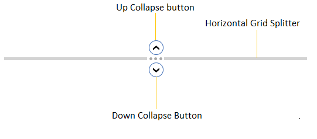
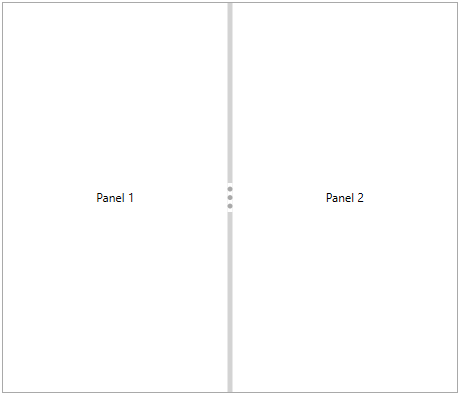
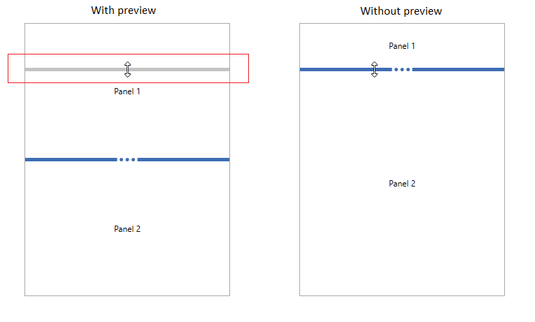

# Getting Started with WPF SfGridSplitter

This section explains how to create a WPF [SfGridSplitter](https://help.syncfusion.com/cr/wpf/Syncfusion.SfInput.Wpf~Syncfusion.Windows.Controls.Input.SfGridSplitter.html) and explains about its structure.

## Structure of SfGridSplitter

## Visual representation 

## Assembly deployment

Refer to the [control dependencies](https://help.syncfusion.com/wpf/control-dependencies#sfgridsplitter) section to get the list of assemblies or NuGet package that needs to be added as a reference to use the control in any application.

You can find more details about installing the NuGet package in a WPF application in the following link: 

[How to install nuget packages](https://help.syncfusion.com/wpf/nuget-packages)

## Adding control manually in XAML

To add the control manually in XAML, follow the given steps:

1.	Add the following required assembly references to the project:
    * Syncfusion.SfInput.WPF
    * Syncfusion.SfShared.WPF
2.	Import Syncfusion WPF schema **http://schemas.syncfusion.com/wpf** in the XAML page.
3.	Declare the `SfGridSplitter` control in the XAML page.




<Window xmlns="http://schemas.microsoft.com/winfx/2006/xaml/presentation"
        xmlns:x="http://schemas.microsoft.com/winfx/2006/xaml"
        xmlns:syncfusion="http://schemas.syncfusion.com/wpf" 
        x:Class="SfGridSplitterSample.MainWindow"
        Title="SfGridSplitter Sample" Height="350" Width="525">
    <Grid>
        <!-- Adding SfGridSplitter control -->
        <syncfusion:SfGridSplitter x:Name="sfGridSplitter"
                                   HorizontalAlignment="Stretch"/>
    </Grid>
</Window>




## Add control manually in C\#

To add the control manually in C#, follow the given steps:

1.	Add the following required assembly references to the project:
    * Syncfusion.SfInput.WPF
    * Syncfusion.SfShared.WPF
2.	Import the `SfGridSplitter` namespace **using Syncfusion.Windows.Controls.Input;**.
3.	Create an `SfGridSplitter` instance, and add it to the window.




using Syncfusion.Windows.Controls.Input;
namespace SfGridSplitterSample {    
    public partial class MainWindow : Window {
        public MainWindow() {
            InitializeComponent();

            //Creating an instance of SfGridSplitter control
            SfGridSplitter sfGridSplitter = new SfGridSplitter();
            sfGridSplitter.HorizontalAlignment = HorizontalAlignment.Stretch;

            //Adding SfGridSplitter as window content
            this.Content = sfGridSplitter;
        } 
    }
}




## Horizontal splitter

If we want to resize the elements which are horizontally arranged into the rows of container, place the `SfGridSplitter` on middle row of the container and use the `HorizontalAlignment` property as `Stretch` and `ResizeBehavior` property value as `PreviousAndNext`.




<Grid>
    <Grid.RowDefinitions>
        <RowDefinition />
        <RowDefinition Height="auto" />
        <RowDefinition />
    </Grid.RowDefinitions>
    <Border BorderThickness="1" BorderBrush="Black"  Grid.Row="0">
        <TextBlock TextWrapping="Wrap"                    
                   Background="Black"
                   Foreground="White"
                   Text="Capturing and extracting information is one of the most important tasks a developer can perform, and making this task more engaging without relying entirely on specialized tools is an efficient way to improve productivity. In Data Capture and Extraction with C# Succinctly, author Ed Freitas guides readers toward getting more out of C# in minimal time. Email has become a pillar of our modern and connected society, and it now serves as a primary means of communication. Because each email is filled with valuable information, data extraction has emerged as a worthwhile skill set for developers in today's business world."
                   />
    </Border>
    <syncfusion:SfGridSplitter Name="gridSplitter"
                               HorizontalAlignment="Stretch" 
                               ResizeBehavior="PreviousAndNext"
                               Width="auto"
                               Grid.Row="1">
    </syncfusion:SfGridSplitter>
    <syncfusion:SfCalculator Grid.Row="2">           
    </syncfusion:SfCalculator>
</Grid>




## Vertical splitter

If we want to resize the elements which are vertically arranged into the columns of container, place the `SfGridSplitter` on middle column of the container and use the `VerticalAlignment` property as `Stretch` and `ResizeBehavior` property value as `PreviousAndNext`.




<Grid>
    <Grid.ColumnDefinitions>
        <ColumnDefinition />
        <ColumnDefinition Width="auto" />
        <ColumnDefinition />
    </Grid.ColumnDefinitions>
    <Border BorderThickness="1" BorderBrush="Black"  Grid.Column="0">
        <TextBlock TextWrapping="Wrap"                    
               Background="Black"
               Foreground="White"
               Text="Capturing and extracting information is one of the most important tasks a developer can perform, and making this task more engaging without relying entirely on specialized tools is an efficient way to improve productivity. In Data Capture and Extraction with C# Succinctly, author Ed Freitas guides readers toward getting more out of C# in minimal time. Email has become a pillar of our modern and connected society, and it now serves as a primary means of communication. Because each email is filled with valuable information, data extraction has emerged as a worthwhile skill set for developers in today's business world."
               />
    </Border>
    <syncfusion:SfGridSplitter Name="gridSplitter"
                               VerticalAlignment="Stretch"
                               ResizeBehavior="PreviousAndNext"
                               Width="auto"
                               Grid.Column="1">
    </syncfusion:SfGridSplitter>
    <syncfusion:SfCalculator Grid.Column="2">
    </syncfusion:SfCalculator>
</Grid>




N> We can restrict the moving location of the grid splitter (Left or Right or Bottom or Top) by setting the value for `ResizeBehavior` property. The `ResizeBehavior` value must be assigned based on the row or column where the grid splitter placed.

## Move Splitter 

If we want to resize the elements in the container using the grid splitter with particular resize interval, we can set the value for `DragIncrement` and `KeyboardIncrement` properties. If we move the splitter using the mouse, `DragIncrement` property values is used as resize interval. If we move the splitter using the Up-Down buttons, `KeyboardIncrement` property values is used as resize interval. The default value of `DragIncrement` property is `1` and `KeyboardIncrement` property is `20`.




<Grid>
    <Grid.RowDefinitions>
        <RowDefinition />
        <RowDefinition Height="auto" />
        <RowDefinition />
    </Grid.RowDefinitions>
    <Border BorderThickness="1" BorderBrush="Black"  Grid.Row="0">
        <TextBlock Text="Capturing and extracting information is one of the most important tasks a developer can perform, and making this task more engaging without relying entirely on specialized tools is an efficient way to improve productivity. In Data Capture and Extraction with C# Succinctly, author Ed Freitas guides readers toward getting more out of C# in minimal time. Email has become a pillar of our modern and connected society, and it now serves as a primary means of communication. Because each email is filled with valuable information, data extraction has emerged as a worthwhile skill set for developers in today's business world."
                   TextWrapping="Wrap" />
    </Border>
    <syncfusion:SfGridSplitter DragIncrement="50"
                               KeyboardIncrement="50"
                               HorizontalAlignment="Stretch"
                               Width="auto"
                               Grid.Row="1">
    </syncfusion:SfGridSplitter>
    <syncfusion:SfCalculator Grid.Row="2">           
    </syncfusion:SfCalculator>
</Grid>



### Move splitter programmatically

We can move the splitter and resize the affected columns or rows programmatically with certain pixels by passing the pixel value in [MoveSplitter(Double)](https://help.syncfusion.com/cr/wpf/Syncfusion.SfInput.Wpf~Syncfusion.Windows.Controls.Input.SfGridSplitter~MoveSplitter(Double).html) method.




<Grid>
    <Grid.RowDefinitions>
        <RowDefinition />
        <RowDefinition Height="auto" />
        <RowDefinition />
    </Grid.RowDefinitions>
    <Border BorderThickness="1" BorderBrush="Black"  Grid.Row="0">
        <TextBlock Text="Capturing and extracting information is one of the most important tasks a developer can perform, and making this task more engaging without relying entirely on specialized tools is an efficient way to improve productivity. In Data Capture and Extraction with C# Succinctly, author Ed Freitas guides readers toward getting more out of C# in minimal time. Email has become a pillar of our modern and connected society, and it now serves as a primary means of communication. Because each email is filled with valuable information, data extraction has emerged as a worthwhile skill set for developers in today's business world."
                   TextWrapping="Wrap" />
    </Border>
    <syncfusion:SfGridSplitter Name="gridSplitter"
                               HorizontalAlignment="Stretch"
                               Width="auto"
                               Grid.Row="1">
    </syncfusion:SfGridSplitter>
    <syncfusion:SfCalculator Grid.Row="2">           
    </syncfusion:SfCalculator>
</Grid>







//GridSplitter moves 50 pixels.
gridSplitter.MoveSplitter(50);




## Expand or collapse the grid elements

We can collapse or expands the element in either side of the splitter by clicking the collapse buttons. We can show or hide the collapse button by using the [EnableCollapseButton](https://help.syncfusion.com/cr/wpf/Syncfusion.SfInput.Wpf~Syncfusion.Windows.Controls.Input.SfGridSplitter~EnableCollapseButton.html) property value as `true`. The default value of `EnableCollapseButton` is `false`.




<Grid>
    <Grid.RowDefinitions>
        <RowDefinition />
        <RowDefinition Height="auto" />
        <RowDefinition />
    </Grid.RowDefinitions>
    <Border BorderThickness="1" BorderBrush="Black"  Grid.Row="0">
        <TextBlock Text="Capturing and extracting information is one of the most important tasks a developer can perform, and making this task more engaging without relying entirely on specialized tools is an efficient way to improve productivity. In Data Capture and Extraction with C# Succinctly, author Ed Freitas guides readers toward getting more out of C# in minimal time. Email has become a pillar of our modern and connected society, and it now serves as a primary means of communication. Because each email is filled with valuable information, data extraction has emerged as a worthwhile skill set for developers in today's business world."
                   TextWrapping="Wrap" />
    </Border>
    <syncfusion:SfGridSplitter EnableCollapseButton="True"
                               HorizontalAlignment="Stretch"
                               Width="auto"
                               Grid.Row="1" >        
    </syncfusion:SfGridSplitter>
    <syncfusion:SfCalculator Grid.Row="2">            
    </syncfusion:SfCalculator>
</Grid>




## Enable preview

We can directly redistribute the row or columns by using `SfGridSplitter`. If we want to preview the location of redistributing row or columns before it changed, we can use the  [ShowsPreview](https://help.syncfusion.com/cr/wpf/Syncfusion.SfInput.Wpf~Syncfusion.Windows.Controls.Input.SfGridSplitter~ShowsPreview.html) property as `true`.




<Grid>
    <Grid.RowDefinitions>
        <RowDefinition />
        <RowDefinition Height="auto" />
        <RowDefinition />
    </Grid.RowDefinitions>
    <Border BorderThickness="1" BorderBrush="Black"  Grid.Row="0">
        <TextBlock Text="Capturing and extracting information is one of the most important tasks a developer can perform, and making this task more engaging without relying entirely on specialized tools is an efficient way to improve productivity. In Data Capture and Extraction with C# Succinctly, author Ed Freitas guides readers toward getting more out of C# in minimal time. Email has become a pillar of our modern and connected society, and it now serves as a primary means of communication. Because each email is filled with valuable information, data extraction has emerged as a worthwhile skill set for developers in today's business world."
                   TextWrapping="Wrap" />
    </Border>
    <syncfusion:SfGridSplitter ShowsPreview="True"
                               HorizontalAlignment="Stretch"
                               Width="auto"
                               Grid.Row="1" >        
    </syncfusion:SfGridSplitter>
    <syncfusion:SfCalculator Grid.Row="2">            
    </syncfusion:SfCalculator>
</Grid>




Click [here](https://github.com/SyncfusionExamples/syncfusion-gridsplitter-control-examples/tree/master/Samples/GridSplitter) to download the sample that showcase the `SfGridSplitter` features.
