# Columns

The GridTree control’s columns are divided into two types. They are:

* Bound Column
* Unbound Column

## Bound Column

A bound column displays information from a bound data source, which is specified by GridTreeControl.ItemSource, or by handling the RequestTreeItems event. You can typically add one bound column to the grid for every data column you want to display.

## Unbound Column

An unbound column does not obtain data from the ItemSource or from the RequestTreeItems event. Instead, you can provide data for unbound columns by creating expressions using the GridTreeUnboundColumn.Expression property, or by creating formatsusing the GridTreeUnboundColumn.Format property, or by handling the QueryUnboundColumnValue event.

N> In Unbound columns, you can have the features that are available in the bound columns such as cell type, sorting, and customization.

## Bound Columns

A bound column displays information from a data source which is specified by the GridTreeControl.ItemSource or by handling the RequestTreeItems event. You can typically add one bound column to the grid for every data column you want to display.

## Tables for Properties, Methods, and Events

## Properties

<table>
<tr>
<th>
Property</th><th>
Description}</th><th>
Type</th><th>
Data Type</th></tr>
<tr>
<td>
AutoPopulateColumns</td><td>
By setting this property to {{ '_true_' | markdownify }}, the GridTree control populates the properties that are present in the underlying collection without defining them in the XAML or in C#.</td><td>
Dependency Property</td><td>
Boolean</td></tr>
<tr>
<td>
AutoGenerateColumnsInfo</td><td>
Assigns the cell type based on the data bound to this column.</td><td>
Dependency Property</td><td>
Boolean</td></tr>
</table>

### AutoPopulateColumns

In the GridTree control, you can populate the columns automatically by setting the AutoPopulateColumns property to True.




<syncfusion:GridTreeControl Name="treeGrid" AutoPopulateColumns="True">





treeGrid.AutoPopulateColumns = true;




When we set this property to true, the properties that are available in underlying collection populates in the GridTree control as GridTreeColumn.

### AutoGenerateColumnsInfo

By setting the AutoGenerateColumnsInfo property to _true_, the GridTree control assigns the appropriate cell type for each column automatically. The following common cell types loadd for the corresponding data.

<table>
<tr>
<th>
Value Type</th><th>
Cell type</th></tr>
<tr>
<td>
String</td><td>
TextBox</td></tr>
<tr>
<td>
Boolean</td><td>
Check Box</td></tr>
<tr>
<td>
Double</td><td>
DoubleEdit</td></tr>
<tr>
<td>
DateTime</td><td>
DateTimeEdit</td></tr>
<tr>
<td>
Enums</td><td>
Combo Box</td></tr>
<tr>
<td>
TimeSpan</td><td>
TimeSpanEdit</td></tr>
<tr>
<td>
Uri</td><td>
Hyperlink</td></tr>
</table>




<syncfusion:GridTreeControl Name="treeGrid"

 AutoGenerateColumnsInfo="True">





treeGrid.AutoGenerateColumnsInfo = true;




### Events

<table>
<tr>
<th>
Event</th><th>
Arguments</th><th>
Description</th></tr>
<tr>
<td>
QueryVisibleColumnInfo</td><td>
(GridTreeColumn VisibleColumn)</td><td>
This event is used to customize a GridTree column when the column is created.This event argument contains the GridTreeColumn that is created. By handling this event, you can perform any operation on the column. </td></tr>
</table>

The following code shows a simple customization on the GridTreeColumn by handling this event.

In the below code snippet, VisibleColumn properties are customized based on the MappingName property.



treeGrid.QueryVisibleColumnInfo += (treeGrid_QueryVisibleColumnInfo);

void treeGrid_QueryVisibleColumnInfo(object sender, GridTreeQueryVisibleColumnInfoEventArgs Args

{

if (Args.VisibleColumn.MappingName == "EmpID")

{

    Args.VisibleColumn.AllowSort = false;

    Args.VisibleColumn.HeaderText = "Customer ID";

    Args.VisibleColumn.StyleInfo = new GridStyleInfo() { CellType = "IntegerEdit", 

    HorizontalAlignment = HorizontalAlignment.Right };

    Args.VisibleColumn.Width = 80;

}

}



### VisibleColumn Properties

The following are the list of properties that are available for all visible columns.

<table>
<tr>
<th>
Property</th><th>
Description</th></tr>
<tr>
<td>
AllowSort</td><td>
By applying true/false, you can enable/disable the Sorting operation for the particular column.</td></tr>
<tr>
<td>
StyleInfo</td><td>
Sets a new style for a particular column.</td></tr>
<tr>
<td>
Width</td><td>
Sets the width for a particular column.</td></tr>
<tr>
<td>
PercentWidth</td><td>
Fills the columns within the client area. The width of the columns is calculated with the client area.</td></tr>
</table>

The following are the list of common properties for all cell types and available in StyleInfo class.

<table>
<tr>
<th>
Property</th><th>
Description</th></tr>
<tr>
<td>
ReadOnly</td><td>
Applying true to this property makes the column as read only.</td></tr>
<tr>
<td>
ToolTip</td><td>
You can set tool tip for a particular column  by applying value to this property</td></tr>
<tr>
<td>
Background, Foreground, Font</td><td>
You can set the background, foreground and font for a particular column by this property.</td></tr>
<tr>
<td>
FlowDirection</td><td>
You can set the flow direction of the cell value by using this property either by LefttoRight or RighttoLeft.</td></tr>
<tr>
<td>
MaxLength</td><td>
By using this property you can set the Maximum length of the column.</td></tr>
<tr>
<td>
Padding</td><td>
You can apply padding to the column by using this property.</td></tr>
<tr>
<td>
ShowTooltip</td><td>
You can enable / disable the tooltip for a specific column by using this property.</td></tr>
<tr>
<td>
TextMargins</td><td>
You can apply margins for the text by using this property.</td></tr>
<tr>
<td>
ShowDataValidationTooltip</td><td>
Property enables/disables the data validation tooltip.</td></tr>
</table>

To know more about the GridStyleInfo and StyleInfo properties please refer the following link.
<http://docs.syncfusion.com/wpf/gridcontrol/appearance#cell-styles>

## Cell Types

In GridTree control you can define the cell type for each column by using the property “CellType”. When you leave a column without defining the cell type then that column’s cell type is considered as “Static” cell type. The list of cell types that are available in the GridTree control are as follows.

<table>
<tr>
<td>
* Static* TextBlock* TextBox* RichText* ExpanderCell* Data Template* ComboBox* DropDownList* CheckBox* Currency edit* Double edit* DateTime edit* Integer edit* Mask edit* Percent edit* Up Down edit* TimeSpan edit* Image* Hyperlink* Button</td></tr>
<tr>
<td>
>  It is not possible to change the cell type for the first column of the GridTree control.</td></tr>
</table>

## Static

The Static cell type allows you to only to display the values in the cells and not to edit the cells. When you want to display a read only content then you can choose the static cell types. 

The following is an example of how to define such a column.




<syncfusion:GridTreeColumn Width="150" MappingName="Address">

<syncfusion:GridTreeColumn.StyleInfo>

<syncfusion:GridStyleInfo CellType="Static"/>

</syncfusion:GridTreeColumn.StyleInfo>

 </syncfusion:GridTreeColumn>





treeGrid.Columns.Add(new GridTreeColumn("Address")

{

    StyleInfo = new GridStyleInfo() { CellType = "Static" },

});




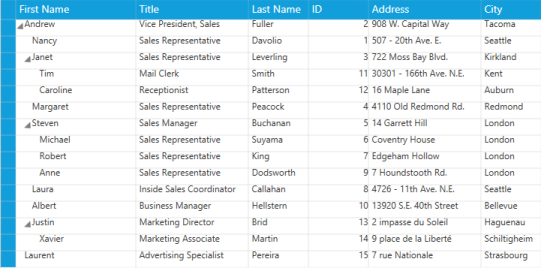

GridTree Static CellType
{:.caption}

### TextBlock

The TextBlock cell type allows you to display the values in the cells and also to edit the cells. When you need to display a read only content then you can choose TextBlock cell type.

N> The difference between the Static and TextBlock cell type is that the Static cell type draws the cell but the TextBlock cell type loads the cell with TextBlock.

The following is an example of how to define such a column.




<syncfusion:GridTreeColumn Width="130" MappingName="FirstName">

<syncfusion:GridTreeColumn.StyleInfo>

<syncfusion:GridDataStyleInfo CellType="TextBlock" />

</syncfusion:GridTreeColumn.StyleInfo>

</syncfusion:GridTreeColumn>





this.treeGrid.Columns.Add(new GridTreeColumn()

{

MappingName = "FirstName",

StyleInfo=new GridStyleInfo()

{

CellType="TextBlock",

}

});




The following screenshot shows a simple demo of this cell type.

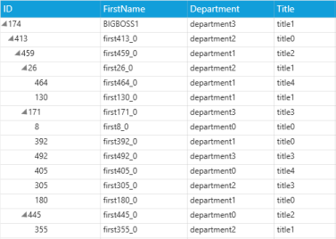

GridTree TextBlock Cell type
{:.caption}

### TextBox

The TextBox cell type allows you to display the cell values in text boxes. Each cell loads a text box and its Text property is bound with the cell value.

The following code snippet explains how to define such a column.




<syncfusion:GridTreeColumn Width="130" MappingName="FirstName">

<syncfusion:GridTreeColumn.StyleInfo>

<syncfusion:GridDataStyleInfo CellType="TextBox" />

</syncfusion:GridTreeColumn.StyleInfo>

</syncfusion:GridTreeColumn>





this.treeGrid.Columns.Add(new GridTreeColumn()

{

MappingName = "FirstName",

StyleInfo = new GridStyleInfo()

{

	CellType = "TextBox",

}

});




The following screenshot shows a simple demo of TextBox cell type.

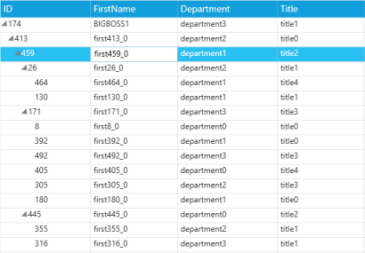

GridTree TextBox Cell Type
{:.caption}

## RichText

The RichText cell types provide more advanced formatting features than the TextBox and TextBlock cell types. You can apply character and paragraph formatting to the text in the RichText cell type. A RichText cell type allows you to display string in a paragraph or in other formats and also the cell value should be a FlowDocument object.

The following is an example of how to define such a column.




<syncfusion:GridDataVisibleColumn Width="32"

HeaderText=" "

MappingName="IsRead">

<syncfusion:GridDataVisibleColumn.ColumnStyle>

<syncfusion:GridDataColumnStyle HorizontalAlignment="Center" CellType="RichText" />

</syncfusion:GridDataVisibleColumn.ColumnStyle>

</syncfusion:GridDataVisibleColumn>





treeGrid.Columns.Add(new GridTreeColumn("Document")

{

StyleInfo = new GridStyleInfo()

{

CellType = "RichText",

}

}

);

Paragraph p = new Paragraph();

Run r1 = new Run(emp.ID.ToString());

r1.FontWeight = FontWeights.ExtraBold;

p.Inlines.Add(r1);

p.Inlines.Add(new LineBreak());

Run r2 = new Run(emp.FirstName);

p.Inlines.Add(r2);

p.Inlines.Add(new LineBreak());

Run r3 = new Run(emp.Salary.ToString());

p.Inlines.Add(r3);

p.Inlines.Add(new LineBreak());

Run r4 = new Run(emp.Department);

p.Inlines.Add(r4);                

p.Inlines.Add(new LineBreak());

FlowDocument doc = new FlowDocument(p);

emp.Document = doc;




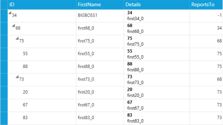

GridTree RichText Cell Type
{:.caption}

### ExpanderCell

In the GridTree control by default, the ExpanderCell type is present at the first column. This column helps you to expand the parent node and navigate into the child nodes. In general, ExpanderCell contains a glyph to expand/collapse the parent nodes.

The following are the list of glyphs in the GridTree control.

Glyph Types

The glyph present in the ExpanderCell can be changed and customized. By default, it is has the following types of glyph.

* PlusMinus
* PlusMinusLines
* Themed
* Triangle
* Custom

PlusMinus—contains a plus/minus symbol. The plus symbol appears when the node is collapsed and a minus symbol appears when the node is expanded.

PlusMinusLine—contains a plus/minus symbol with lines. When the plus symbol is visible then a line is drawn from the parent node to its child node and each child node has the line with its parent node.

Themed—loads the gylph based on the theme applied for the GridTree control. The patch applied in the theme for the glyph loads as a glyph for the all nodes.

Triangle—loads the triangle symbol for each node that contains the child nodes. The collapsed node’s triangle symbol appears horizontal and the expanded node’s triangle turns vertical.

Custom—a custom type glyph is user based and you can load any kind of path into it.

Node image support

In the GridTree control, you can display image in each ExpanderCell and it can be achieved by handling the RequestNodeImage event and applying _true_ to the SupportNodeImages property

The following code snippet shows how to load the image in ExpanderCell.



private void treeGrid_RequestNodeImage(object sender, GridTreeRequestNodeImageEventArgs args)

{

    args.NodeImage = GetItemBitmap(args.Item as EmployeeInfo);

}



GridTree ExpanderCell with Image
{:.caption}

### DataTemplate

In the GridTree control, DataTemplate cell type allows you to replace the visual appearance of a cell. You can load any controls into a cell and display the CellBoundValue or custom values. This provides an exensible way to display the cells. The DataContext of a DataTemplate is same as that of the GridTree control.

The following are the list of properties specific for this cell type.

### Properties

<table>
<tr>
<th>
Property</th><th>
Description</th></tr>
<tr>
<td>
CellItemTemplate</td><td>
This a DateTemplate type property, which is used to set the Item DataTemplate for the cell.</td></tr>
<tr>
<td>
CellEditTemplate</td><td>
This a DateTemplate type property, which is used to set the Edit DataTemplate for the cell.</td></tr>
<tr>
<td>
CellItemTemplateKey</td><td>
This is s String type property, which is to get the DataTemplate key form the user and it assign to the CellItemTemplate for the cell.</td></tr>
<tr>
<td>
CellEditTemplateKey</td><td>
This is s String type property, which is to get the DataTemplate key form the user and it assign to the CellEditTemplate for the cell.</td></tr>
<tr>
<td>
HasCellItemTemplate</td><td>
This is a Boolean property, which returns true when there is a CellItemTemplate.</td></tr>
<tr>
<td>
HasCellEditTemplate</td><td>
This is a Boolean property, which returns true when there is a CellEditTemplate.</td></tr>
<tr>
<td>
HasCellItemTemplateKey</td><td>
This is a Boolean property, which returns true when there is a CellItemTemplateKey.</td></tr>
<tr>
<td>
HasCellEditTemplateKey</td><td>
This is a Boolean property, which returns true when there is a CellEditTemplateKey.</td></tr>
</table>

You can load any property value from the current record by using the following format in the DataTemplate binding.

Record.Data (data will be the underlying object bound).

Example: Record.Data.Suppliers.CompanyName

You can get any property value of the current record by passing the appropriate propertyname.

The following example code shows a simple DataTemplate.




	<Window.Resources>

	<DataTemplate x:Key="sliderTemplate">

	<Slider Value="{Binding Path=CellBoundValue, Mode=TwoWay}" 

	Minimum="-10" Maximum="10000" 

	Height="30" Width="150" />

	</DataTemplate>

	</Window.Resources>

	<syncfusion:GridTreeColumn MappingName="Weight">

	<syncfusion:GridTreeColumn.StyleInfo>

	<syncfusion:GridDataStyleInfo 

	CellType="DataBoundTemplate" 

	CellEditTemplate="{StaticResource sliderTemplate}" 

	CellItemTemplate="{StaticResource sliderTemplate}"/>

	</syncfusion:GridTreeColumn.StyleInfo>

	</syncfusion:GridTreeColumn>





treeGrid.Columns.Add(new GridTreeColumn("Weight")

{

StyleInfo = new GridStyleInfo()

{

CellType = "DataBoundTemplate",

CellItemTemplateKey = "sliderTemplate",

CellEditTemplateKey = "sliderTemplate",

}

}

);




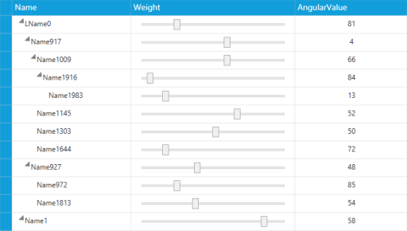

GridTree DataTemplate CellType
{:.caption}

### ComboBox

The ComboBox cell type allows you to select an item either by typing the text into the combo box, or by selecting it from the list. A ComboBox cell type is appropriate when there is a list of suggested choices, and a list box is appropriate when you want to limit the input to what is on the list. 

The table below lists the various properties that can affect the combo box cells. 

<table>
<tr>
<th>
GridStyleInfo</th><th>
Description</th></tr>
<tr>
<td>
CellType</td><td>
Sets to “ComboBox” for a ComboBox control.</td></tr>
<tr>
<td>
DropDownStyle</td><td>
Determines the drop-down cell behavior.Editable Autocomplete Exclusive </td></tr>
<tr>
<td>
ItemsSource</td><td>
Specifies the binding source for the combo box.</td></tr>
<tr>
<td>
Display Member</td><td>
String that names the public property from the data source object to be displayed in the cell.</td></tr>
<tr>
<td>
Value Member</td><td>
String that names the public property from the data source object to be used as the value for this cell.</td></tr>
<tr>
<td>
ShowButton</td><td>
Boolean value indicating whether the Dropdown button should appear or not.</td></tr>
</table>

The table below lists the events available in the ComboBox cell type.

### Events

<table>
<tr>
<th>
Events</th><th>
Description</th><th>
Arguments</th></tr>
<tr>
<td>
DropDownSelectionChanged</td><td>
This event is raised when the SelectedItem of the combo box is changed.</td><td>
CellRowColumnIndex—contains the RowColumn index of the cell where the combo box’s value gets changed.SelectedItem—this is thecombo box item which is currently selected.</td></tr>
</table>

The following is an example of how to define such a column.




<syncfusion:GridTreeColumn HeaderText="Department"

                            MappingName="Department">

    <syncfusion:GridTreeColumn.StyleInfo>

        <syncfusion:GridDataStyleInfo CellType="ComboBox"

                                        DisplayMember="Shipcountry"

                                        DropDownStyle="Editable"

                                        ItemsSource="{StaticResource ShipDetails}"

                                        ValueMember="Shipcity" />

    </syncfusion:GridTreeColumn.StyleInfo>

</syncfusion:GridTreeColumn>





GridTreeColumn coll = treeGrid.Columns[3];

coll.StyleInfo.CellType = "ComboBox";

coll.StyleInfo.ItemsSource = ships;

coll.StyleInfo.DisplayMember = "Shipcountry";

coll.StyleInfo.ValueMember = "Shipcity";

coll.StyleInfo.DropDownStyle = GridDropDownStyle.Editable;




We can change the combo box drop-down list style by using the GridDropDownStyle property. This property features the following options:

* Editable—combines an editable text field and provides users the option of typing an item that may or may not be in the drop-down list. The text entered in the combo box is not case-sensitive_._
* Autocomplete—predicts the word or phrase that the user types; so that the user need not type it completely.
* Exclusive_—_non-editable combo box where the user is allowed to select only the options that are available in the drop-down list.

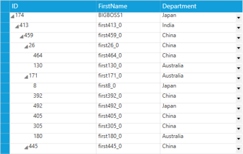

Combo Box Cell Type
{:.caption}

### DropDownList

This cell type serves the same purpose as the ComboBox control. The difference is that it associates a multicolumn drop-down to the owner cell. The other common features like DropDownStyle, ItemsSource, DisplayMember and ValueMember are applicable to this cell too.

The following are the list of properties that are applicable for this cell type.

#### Properties

<table>
<tr>
<th>
GridStyleInfo</th><th>
Description</th></tr>
<tr>
<td>
CellType</td><td>
Set to “ComboBox” for a Combo box control</td></tr>
<tr>
<td>
DropDownStyle</td><td>
Determines the drop-down cell behavior.Editable Autocomplete Exclusive </td></tr>
<tr>
<td>
ItemsSource</td><td>
Specifies the binding source for the combo box.</td></tr>
<tr>
<td>
Display Member</td><td>
String that names the public property from the data source object to be displayed in the cell.</td></tr>
<tr>
<td>
Value Member</td><td>
String that names the public property from the data source object to be used as the value for this cell.</td></tr>
<tr>
<td>
ShowButton</td><td>
Boolean value indicating whether the drop-down button should appear or not.</td></tr>
<tr>
<td>
StaysOpenOnEdit</td><td>
Allows the drop-down list to open while editing.</td></tr>
</table>

The following are the list of events that are available for the DropDownList cell type.

#### Events

<table>
<tr>
<th>
Events</th><th>
Description</th><th>
Arguments</th></tr>
<tr>
<td>
DropDownSelectionChanged</td><td>
This event will be raised when the SelectedItem of the combo box gets changed.</td><td>
CellRowColumnIndex- This contains the RowColumn index of the cell where the combo box’s value gets changed.SelectedItem- This is the Combo Box item which is currently selected.</td></tr>
</table>

We can change the drop-down list style by using the GridDropDownStyle property. This property features the following options:

* Editable—combines an editable text field and provides an option to type an item that may or may not be in the drop-down list. The text entered in the drop-down list is not case-sensitive_._
* Autocomplete—predicts the word or phrase the user types so that the user need not type it completely.
* Exclusive_—_non-editable combo box where the user is allowed to select only the options that are available in the drop-down list.

The following is an example of how to define such a column.




<syncfusion:GridTreeColumn Width="130"

HeaderText="Department"

MappingName="Department">

<syncfusion:GridTreeColumn.StyleInfo>

<syncfusion:GridDataStyleInfo CellType="DropDownList"

DisplayMember="Shipcity"

DropDownStyle="Editable"

ItemsSource="{StaticResource ShipDetails}"

ValueMember="Shipcity">

<syncfusion:GridDataStyleInfo.DropdownEdit>

<syncfusion:GridDropdownEditStyleInfo ShowButton="False"/>

</syncfusion:GridDataStyleInfo.DropdownEdit>

</syncfusion:GridDataStyleInfo>

</syncfusion:GridTreeColumn.StyleInfo>

</syncfusion:GridTreeColumn>





this.treeGrid.Columns.Add(new GridTreeColumn()

{

MappingName = "Department",

StyleInfo = new GridStyleInfo()

{

CellType = "DropDownList",

ValueMember = "shipcity",

DisplayMember = "shipcity",

ItemsSource = ShipDetails,

DropDownStyle = GridDropDownStyle.Editable,

DropdownEdit = new GridDropdownEditStyleInfo()

{

ShowButton = false,

}

}

});




The following screenshot shows a simple demo of the DropDownList cell type.

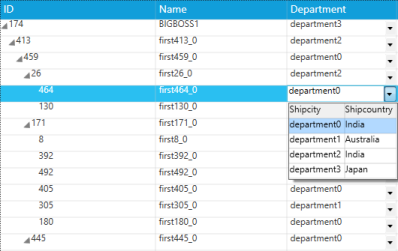

GridTree Control DropDownList Cell Type
{:.caption}

### CheckBox

The CheckBox cell type allows you to choose Boolean options. There are three options that the user can enter into the cell: true, false and null value. The cell value is bound with the IsChecked property of the CheckBox. 

The following are the list of properties that are applicable for this cell type.

#### Properties

<table>
<tr>
<th>
Property</th><th>
Description</th></tr>
<tr>
<td>
IsThreeState</td><td>
Applying true to this property allows you to enter null value.</td></tr>
</table>

The following code shows how to define such a column.




<syncfusion:GridTreeColumn MappingName="IsMajor">

<syncfusion:GridTreeColumn.StyleInfo>

<syncfusion:GridDataStyleInfo CellType="CheckBox" IsThreeState="False"/>

</syncfusion:GridTreeColumn.StyleInfo>

</syncfusion:GridTreeColumn>





this.treeGrid.Columns.Add(new GridTreeColumn("IsMajor")

{

    StyleInfo = new GridStyleInfo()

    {

        CellType = "CheckBox",

        IsThreeState = false,

    }

});




The following screenshot shows a simple demo of CheckBox cell type.

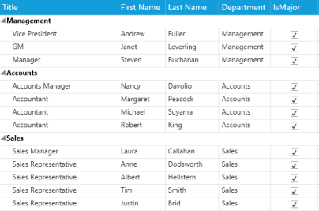

GridTree Control CheckBox Cell Type
{:.caption}

### CurrencyEdit

The CurrencyEdit cell type allows you to represent monetary values to maintain accuracy in calculations. It strips the currency sign in the cell and attempt to parse only the number from the input. Also, by using the GridCurrencyEditStyleInfo class we can customize the CurrencyEdit properties and appearance. Use the GridStyleInfo properties given below to customize these cells. 

#### Properties

<table>
<tr>
<th>
GridStyleInfo</th><th>
Description</th></tr>
<tr>
<td>
Cell Type</td><td>
Sets to “CurrencyEdit”.</td></tr>
<tr>
<td>
CurrencyDecimalDigits</td><td>
Number of decimal places in the currency value.</td></tr>
<tr>
<td>
CurrencyDecimalSeparator</td><td>
String to use as decimal separator.</td></tr>
<tr>
<td>
CurrencyNeagtivePattern</td><td>
Format pattern for negative currency values.</td></tr>
<tr>
<td>
CurrencyPostivePattern</td><td>
Format pattern for positive currency values.</td></tr>
<tr>
<td>
CurrencySymbol</td><td>
String to use as currency symbol.</td></tr>
<tr>
<td>
CurrencyGroupSizes</td><td>
Number of digits in each group to the left of the decimal.</td></tr>
<tr>
<td>
MinValue</td><td>
Least value can be set to the cell</td></tr>
<tr>
<td>
MaxValue</td><td>
Maximum value can be set to the cell</td></tr>
<tr>
<td>
MinValidation</td><td>
This Enum property is used to control the minimum value in Key Press and Lost focus modes.</td></tr>
<tr>
<td>
MaxValidation</td><td>
This Enum property is used to control the maximum value in Key Press and Lost focus modes.</td></tr>
<tr>
<td>
IsScrollingOnCircle</td><td>
This property allows you to increase/ decrease the cell value by using Up/Down keys in keyboard.</td></tr>
</table>

The following code snippet explains how to define a CurrencyEdit column.




<syncfusion:GridTreeColumn Width="130" MappingName="Salary">

    <syncfusion:GridTreeColumn.StyleInfo>

        <syncfusion:GridDataColumnStyle CellType="CurrencyEdit" />

    </syncfusion:GridTreeColumn.StyleInfo>

</syncfusion:GridTreeColumn>





treeGrid.Columns.Add(new GridTreeColumn("Salary")

{

    StyleInfo = new GridStyleInfo() { CellType = "CurrencyEdit" }

});




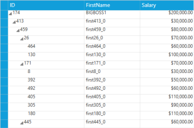

GridTree Control CurrencyEdit Cell Type
{:.caption}

### IntegerEdit

The IntegerEdit cell type is a specialized cell type that restricts the data entry to integer values. The following table contains the style properties specific to this cell type.

#### Properties

<table>
<tr>
<th>
GridStyleInfo</th><th>
Description</th></tr>
<tr>
<td>
Cell Type</td><td>
Sets to IntegerEdit.</td></tr>
<tr>
<td>
NumberGroupSeparator</td><td>
String that separates groups of digits.</td></tr>
<tr>
<td>
NumberGroupSizes</td><td>
Number of digits in each group.</td></tr>
<tr>
<td>
MinValue</td><td>
Least value can be set to the cell.</td></tr>
<tr>
<td>
MaxValue</td><td>
Maximum value can be set to the cell.</td></tr>
<tr>
<td>
MinValidation</td><td>
This Enum property is used to control the minimum value in Key Press and Lost focus modes.</td></tr>
<tr>
<td>
MaxValidation</td><td>
This Enum property is used to control the maximum value in Key Press and Lost focus modes.</td></tr>
<tr>
<td>
IsScrollingOnCircle</td><td>
This property allows you to increase/ decrease the cell value by using Up/Down keys in keyboard.</td></tr>
</table>

The following code demonstrates how to define an IntegerEdit column.




<syncfusion:GridTreeColumn HeaderText="ID" MappingName="Employee ID">

    <syncfusion:GridTreeColumn.StyleInfo>

        <syncfusion:GridStyleInfo CellType="IntegerEdit" />

    </syncfusion:GridTreeColumn.StyleInfo>

</syncfusion:GridTreeColumn>





treeGrid.Columns.Add(new GridTreeColumn("Employee ID")

{

    HeaderText="ID",

    StyleInfo = new GridStyleInfo() { CellType = "IntegerEdit" }

});




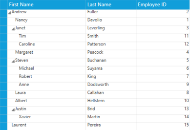

GridTree Control IntegerEdit Cell Type
{:.caption}

### DoubleEdit

The DoubleEdit cell type allows you to enter only values that are _double_ into the cell. Thus it can be used to display System.Double type values. Also, by using the GridDoubleEditStyleInfo class you can customize the DoubleEdit properties and appearance. The style properties that affect this cell are given below. 

#### Properties

<table>
<tr>
<th>
GridStyleInfo</th><th>
Description</th></tr>
<tr>
<td>
Cell Type</td><td>
Set to “DoubleEdit”</td></tr>
<tr>
<td>
NumberGroupSeparator</td><td>
String that separates groups of digits to the left of the decimal</td></tr>
<tr>
<td>
NumberDecimalSeparator</td><td>
String to use as decimal separator</td></tr>
<tr>
<td>
NumberDecimalDigits</td><td>
Number of decimal places</td></tr>
<tr>
<td>
IsScrollingOnCircle</td><td>
When value reaches the max value then the value will be set to the minimum value.</td></tr>
<tr>
<td>
MinValue</td><td>
Least value can be set to the cell</td></tr>
<tr>
<td>
MaxValue</td><td>
Maximum value can be set to the cell</td></tr>
<tr>
<td>
MinValidation</td><td>
This Enum property is used to control the minimum value in Key Press and Lost focus modes.</td></tr>
<tr>
<td>
MaxValidation</td><td>
This Enum property is used to control the maximum value in Key Press and Lost focus modes.</td></tr>
<tr>
<td>
IsScrollingOnCircle</td><td>
This property allows you to increase/ decrease the cell value by using Up/Down keys in keyboard.</td></tr>
</table>

The following code sample demonstrates how to define a DoubleEdit column.




<syncfusion:GridTreeColumn MappingName="Salary" HeaderText="Amount">

    <syncfusion:GridTreeColumn.StyleInfo>

        <syncfusion:GridDataColumnStyle CellType="DoubleEdit"/>

    </syncfusion:GridTreeColumn.StyleInfo>

</syncfusion:GridTreeColumn>





treeGrid.Columns.Add(new GridTreeColumn("Salary")

{

    HeaderText = "Amount",

    StyleInfo = new GridStyleInfo() { CellType = "DoubleEdit" }

});




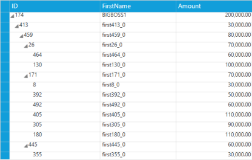

DoubleEdit Cell Type
{:.caption}

### PercentEdit

The PercentEdit cell type restricts the data entry to percentage values only. The following table describes the style properties available with this cell type.

 

#### Properties

<table>
<tr>
<th>
GridStyleInfo</th><th>
Description</th></tr>
<tr>
<td>
Cell Type</td><td>
Sets to PercentEdit.</td></tr>
<tr>
<td>
PercentEditMode</td><td>
Indicates how the the text can be edited in the PercentEdit cells.Possible values: {{ '_PercentMode_' | markdownify }} and {{ '_DoubleMode_' | markdownify }}.</td></tr>
<tr>
<td>
PercentSymbol</td><td>
String to use as the percent symbol.</td></tr>
<tr>
<td>
PercentGroupSizes</td><td>
Number of digits in each group to the left of the decimal.</td></tr>
<tr>
<td>
PercentGroupSeparator</td><td>
String that separates group of digits to the left of the decimal.</td></tr>
<tr>
<td>
PercentDecimalDigits</td><td>
Number of digits that appear after the decimal.</td></tr>
<tr>
<td>
MinValue</td><td>
Least value can be set to the cell</td></tr>
<tr>
<td>
MaxValue</td><td>
Maximum value can be set to the cell</td></tr>
<tr>
<td>
MinValidation</td><td>
This Enum property is used to control the minimum value in Key Press and Lost focus modes.</td></tr>
<tr>
<td>
MaxValidation</td><td>
This Enum property is used to control the maximum value in Key Press and Lost focus modes.</td></tr>
<tr>
<td>
IsScrollingOnCircle</td><td>
This property allows you to increase/ decrease the cell value by using Up/Down keys in keyboard.</td></tr>
</table>

The following code sample demonstrates how to define a PercentEdit column.




<syncfusion:GridTreeColumn MappingName="Hike">

    <syncfusion:GridTreeColumn.StyleInfo>

        <syncfusion:GridStyleInfo HorizontalAlignment="Right" CellType="PercentEdit">

            <syncfusion:GridStyleInfo.PercentEdit>

                <syncfusion:GridPercentEditStyleInfo IsScrollingOnCircle="False" />

            </syncfusion:GridStyleInfo.PercentEdit>

        </syncfusion:GridStyleInfo>

    </syncfusion:GridTreeColumn.StyleInfo>

</syncfusion:GridTreeColumn>





GridTreeColumn percentColumn = new GridTreeColumn("Hike")

{

    StyleInfo = new GridStyleInfo()

    {

        CellType = "PercentEdit",

        PercentEdit = new GridPercentEditStyleInfo()

        {

            IsScrollingOnCircle=false,                        

        }

    }

};

treeGrid.Columns.Add(percentColumn);




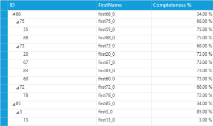

GridTree Control PercentEdit Cell Type
{:.caption}

### DateTimeEdit

The DateTimeEdit cells incorporate the DateTimeEdit controls in the grid cells that will help you interactively set a date and time value. The style properties in the following table are applicable to this cell type.

#### DateTime Edit Cell Properties

<table>
<tr>
<th>
GridStyleInfo</th><th>
Description</th></tr>
<tr>
<td>
CellType</td><td>
Sets to DateTimeEdit.</td></tr>
<tr>
<td>
DateTimePattern</td><td>
Sets the date-time pattern. (The next table lists the available patterns with examples.)</td></tr>
<tr>
<td>
MaxDateTime, MinDateTime</td><td>
Sets the maximum and minimum values for a DateTime cell.</td></tr>
<tr>
<td>
IsCalendarEnabled</td><td>
Enables the calendar pop-up when set to {{ '_true_' | markdownify }}.</td></tr>
<tr>
<td>
IsWatchEnabled</td><td>
Enables the watch pop-up when set to {{ '_true_' | markdownify }}.</td></tr>
<tr>
<td>
NoneDateText</td><td>
Specifies the text to be displayed when no date is set.</td></tr>
<tr>
<td>
IsButtonPopUpEnabled</td><td>
By setting true/false you can disable the button to change the  date-time value.</td></tr>
<tr>
<td>
IsEditable</td><td>
By setting true//false you can enable/disable editing of the cell</td></tr>
<tr>
<td>
IsEmptyDateEnabled</td><td>
You can leave a cell with an empty value, when you set this property to {{ '_true_' | markdownify }}.</td></tr>
<tr>
<td>
IsEnabledRepeatButton</td><td>
The RepeatButton can be disabled by applying {{ '_false_' | markdownify }} to this property.</td></tr>
<tr>
<td>
IsVisibleRepeatButton</td><td>
The visibility of the Repeat Button can be enabled by setting the {{ '_IsEnabledRepeatButton_' | markdownify }} property to {{ '_true._' | markdownify }}</td></tr>
<tr>
<td>
NoneDateText</td><td>
Setting a string value, displays when there is no date set.</td></tr>
<tr>
<td>
PopupDelay</td><td>
Setting time limit to this property opens the PopUp in the given time delay.</td></tr>
<tr>
<td>
RepeatButtonBackground</td><td>
Applying a color to  this property sets as background of RepeatButton.</td></tr>
</table>

### DateTime Patterns for DateTime Edit Cells

<table>
<tr>
<th>
Date and Time Pattern</th><th>
Example</th></tr>
<tr>
<td>
Short Date</td><td>
8/6/2009</td></tr>
<tr>
<td>
Long Date</td><td>
Thursday, August 06, 2009</td></tr>
<tr>
<td>
Long Time</td><td>
7:01:33 AM</td></tr>
<tr>
<td>
Short Time</td><td>
7:01 AM</td></tr>
<tr>
<td>
Full Date Time</td><td>
Thursday, August 06, 2009 7:01:33 AM</td></tr>
<tr>
<td>
MonthDay</td><td>
August 06</td></tr>
<tr>
<td>
RFC1123</td><td>
Thu, 06 Aug 2009 07:01:33 GMT</td></tr>
<tr>
<td>
Sortable Date Time</td><td>
2009-08-06T07:01:33</td></tr>
<tr>
<td>
Universal Sortable Date Time</td><td>
2009-08-06 07:01:33Z</td></tr>
<tr>
<td>
Year Month</td><td>
(August, 2009 is correct)August, 2009</td></tr>
</table>

The following code sample demonstrates how to define a column with DateTime Edit cells.




<syncfusion:GridTreeColumn HeaderText="DOB" MappingName="Birth Date">

    <syncfusion:GridTreeColumn.StyleInfo>

        <syncfusion:GridStyleInfo CellType="DateTimeEdit" />

    </syncfusion:GridTreeColumn.StyleInfo>

</syncfusion:GridTreeColumn>





treeGrid.Columns.Add(new GridTreeColumn("Birth Date")

{

    HeaderText="DOB",

    StyleInfo = new GridStyleInfo() { CellType = "DateTimeEdit" }

});




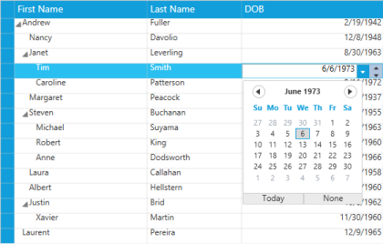

DateTime Edit Cell Type
{:.caption}

### MaskEdit

The MaskEdit cell type allows you to create specially formatted text cells that confirm to an edit mask that you specify. The Style.MaskEdit.Mask property holds the mask string, which controls the format of the input text. The MaskEdit cells are useful when the user wants to display some formatted text such as a social security number, telephone number, etc.

The following table lists the style properties specific to this cell type.

#### Properties

<table>
<tr>
<th>
Property</th><th>
Description</th></tr>
<tr>
<td>
CellType</td><td>
Sets to MaskEdit</td></tr>
<tr>
<td>
Mask</td><td>
Sets to a  string value to mask the cell value.</td></tr>
<tr>
<td>
MaxLength</td><td>
Number of maximum char allowed to entered in the  cell.</td></tr>
<tr>
<td>
MinLength</td><td>
Numberof minimum char  allowed  to  entered in the cell.</td></tr>
<tr>
<td>
StringValidation</td><td>
When the cell value or mask is set to null then the cell is validated based on this  property value.</td></tr>
</table>

The following code sample demonstrates how to define a MaskEdit column.




<syncfusion:GridTreeColumn MappingName="LastName">

    <syncfusion:GridTreeColumn.StyleInfo>

        <syncfusion:GridDataStyleInfo CellType="MaskEdit" />

    </syncfusion:GridTreeColumn.StyleInfo>

</syncfusion:GridTreeColumn>





treeGrid.Columns.Add(new GridTreeColumn("LastName")

{

    HeaderText = "Last Name",

    StyleInfo = new GridStyleInfo() { CellType = "MaskEdit" }

});




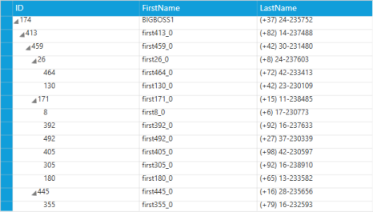

MaskEdit Cell Type
{:.caption}

### UpDownEdit

The UpDownEdit cell type hosts an UpDownEdit control which contains a pair of arrow buttons that increases or decreases the cell value. The style properties applicable to this cell type are provided in the following table. 

#### UpDownEdit Cell Properties

<table>
<tr>
<th>
GridStyleInfo}</th><th>
Description</th></tr>
<tr>
<td>
Cell Type</td><td>
Sets to UpDownEdit.</td></tr>
<tr>
<td>
NumberGroupSeparator</td><td>
String that separates group of digits to the left of the decimal.</td></tr>
<tr>
<td>
NumberDecimalDigits</td><td>
Number of digits that appear after the decimal.</td></tr>
<tr>
<td>
MaxValue</td><td>
Upper limit in the range of applicable values.</td></tr>
<tr>
<td>
MinValue</td><td>
Lower limit in the range of applicable values.</td></tr>
<tr>
<td>
Step</td><td>
Unit value that is to be increased or decreased when the spin buttons are clicked.</td></tr>
<tr>
<td>
NegativeForeground</td><td>
Color to differentiate the negative value.</td></tr>
</table>

The following sample demonstrates how to define a column with UpDownEdit cells.




<syncfusion:GridTreeColumn MappingName="Rating">

    <syncfusion:GridTreeColumn.StyleInfo>

        <syncfusion:GridStyleInfo CellType="UpDownEdit" />

    </syncfusion:GridTreeColumn.StyleInfo>

</syncfusion:GridTreeColumn>





GridTreeColumn updownColumn = new GridTreeColumn("Rating")

{

    StyleInfo = new GridStyleInfo()

    {

        CellType = "UpDownEdit",

        UpDownEdit = new GridUpDownEditStyleInfo()

        {

            NegativeForeground = Brushes.Red

        }

    }

};

treeGrid.Columns.Add(updownColumn);




UpDownEdit Cell Type
{:.caption}

### TimeSpanEdit

The TimeSpanEdit cell type is used to display time value in the Day:Hour:Min:Sec format and also in custom format. The fields can be incremented and decremented by using the up and down arrow keys.

#### TimeSpanEdit properties

<table>
<tr>
<th>
Properties</th><th>
Description</th></tr>
<tr>
<td>
AllowNull</td><td>
Allows to set null value.</td></tr>
<tr>
<td>
Format</td><td>
Specifies the fformat to display the time.</td></tr>
<tr>
<td>
ShowArrowButtons</td><td>
Displays the arrow buttons to change the value by mouse.</td></tr>
</table>

The following code sample demonstrates how to define a column with TimeSpanEdit cells.




<syncfusion:GridTreeColumn HeaderText="Time Avail" MappingName="Time">

    <syncfusion:GridTreeColumn.StyleInfo>

        <syncfusion:GridDataColumnStyle CellType="TimeSpanEdit" />

    </syncfusion:GridTreeColumn.StyleInfo>

</syncfusion:GridTreeColumn>





treeGrid.Columns.Add(new GridTreeColumn("Time")

{

    HeaderText = "Time Avail",

    StyleInfo = new GridStyleInfo() { CellType = "TimeSpanEdit" }

});



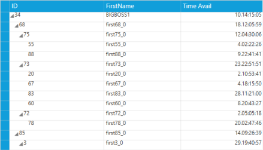

TimeSpanEdit Cell Type
{:.caption}

## ImageCell

The ImageCell type is used to load images inside the graphic cells. To load the graphic image cell in the GridTree control, you have to set the CellType as ImageCell and the CellValue as BitmapImage.

#### Image CellType properties

<table>
<tr>
<th>
Property</th><th>
Description</th></tr>
<tr>
<td>
Image</td><td>
Sets the image path to display.</td></tr>
<tr>
<td>
ImageContentAllignment</td><td>
Sets the alignment of the image (Left or Right).</td></tr>
<tr>
<td>
ImageHeight</td><td>
Sets the height of the image.</td></tr>
<tr>
<td>
ImageWidth</td><td>
Sets the width of the image.</td></tr>
<tr>
<td>
ImageMargins</td><td>
Sets the margin of the image.</td></tr>
</table>

The following code sample demonstrates how to define a column with Image cells.




<syncfusion:GridTreeColumn MappingName="Image" HeaderText="Progress">

    <syncfusion:GridTreeColumn.StyleInfo>

        <syncfusion:GridStyleInfo CellType="ImageCell" />

    </syncfusion:GridTreeColumn.StyleInfo>

</syncfusion:GridTreeColumn>





treeGrid.Columns.Add(new GridTreeColumn("Image")

{

    HeaderText = "Progress",

    StyleInfo = new GridStyleInfo() { CellType = "ImageCell" }

});




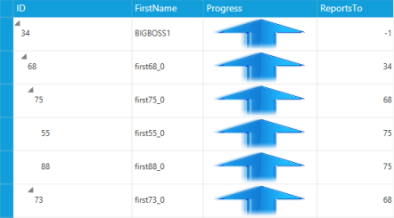

Image Cell Type
{:.caption}

### Hyperlink 

This cell type allows you to perform an operation when click on the cell like navigation from your application to a site or a window.

The following are the list of events that are available for this cell type.

#### Events

<table>
<tr>
<th>
Events</th><th>
Description</th><th>
Arguments</th></tr>
<tr>
<td>
CellRequestNavigate</td><td>
The event rises when the mouse clicks the hyperlink cell value. You can perform operation that need to be done when a hyperlink is clicked.</td><td>
ColumnIndex—contains the current mouse click hyperlink cell column index.RowIndex—contains the current mouse click hyperlink cell row index.Uri—the Uri where you want to navigate should be applied here.</td></tr>
</table>

The following code shows how to define such a column.




<syncfusion:GridTreeColumn HeaderText="Department" MappingName="Department">

                        <syncfusion:GridTreeColumn.StyleInfo>

                            <syncfusion:GridStyleInfo CellType="Hyperlink" />

                        </syncfusion:GridTreeColumn.StyleInfo>

                    </syncfusion:GridTreeColumn>





this.treeGrid.Columns.Add(new GridTreeColumn("Department")

{

    StyleInfo = new GridStyleInfo()

    {

        CellType = "Hyperlink",

    }

});




The following screenshot shows a simple demo of Hyperlink cell.

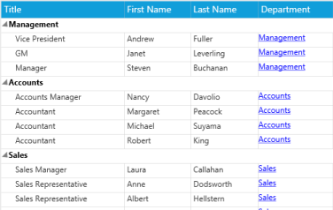

GridTree Control Hyperlink Cell Type
{:.caption}

### Button

The Button cell type allows you to load Button control in each cell of the GridTree control. To load a Button in the GridTree control cell, choose Button cell type. You can perform button click action as in the Button control.

The following table shows the events that are available for this cell type.

#### Events

<table>
<tr>
<th>
Events}</th><th>
Description</th><th>
Arguments</th></tr>
<tr>
<td>
CellButtonClick</td><td>
Fires when you click on the button cell.</td><td>
It contains the following arguments.ColumnIndex—contains the column index where the mouse clicks on the button cell.RowIndex—contains the row index where the mouse clicks on the button cell.</td></tr>
</table>

The following code snippet shows a simple demo of Button cell type.




<syncfusion:GridTreeColumn HeaderText="Department" MappingName="Department">

<syncfusion:GridTreeColumn.StyleInfo>

<syncfusion:GridStyleInfo CellType="Button" />

</syncfusion:GridTreeColumn.StyleInfo>

</syncfusion:GridTreeColumn>





this.treeGrid.Columns.Add(new GridTreeColumn("Department")

{

StyleInfo = new GridStyleInfo()

{

CellType = "Button",

}

});




The following screenshot shows a simple demo of Button cell type.

Button Cell Type
{:.caption}

## Unbound Columns

The GridTree control supports unbound columns in which the data is calculated automatically according to a specified formula, format, or custom data from users.

The GridTree control provides support for adding additional columns which is not in underlying business object. Such additional columns are called as unbound columns, as they do not belong to the data source. These unbound fields can be used when you want to add some additional or custom information to the nodes. 

You can create an unbound column by instantiating the GridTreeUnboundColumn class, which is a derivative of GridTreeColumn.

Also, you can utilize the features that are available in the bound columns, such as sorting, cell type and customization.

### Properties

<table>
<tr>
<th>
Property</th><th>
Description}</th><th>
Type</th><th>
Data Type</th></tr>
<tr>
<td>
Expression</td><td>
Allows the user to set formula to compute the value for the unbound column based on the other column values.</td><td>
Dependency Property</td><td>
String</td></tr>
</table>

### Methods

<table>
<tr>
<th>
Method Name</th><th>
Description</th><th>
Parameters</th><th>
Return Type</th></tr>
<tr>
<td>
GetUnboundColumnValue</td><td>
Gets the unbound column value from a specific record and column.</td><td>
(object Record, GridTreeUnboundColumn Column)</td><td>
Object</td></tr>
</table>

### Events

<table>
<tr>
<th>
Event Name</th><th>
Description</th><th>
Arguements</th></tr>
<tr>
<td>
QueryUnboundCellInfo</td><td>
This event fires when the style of an unbound column is createpd. Using this event you can modify the styles of the unbound column.</td><td>
(RowColumnIndex Cell, GridTreeUnboundColumn Column, GridStyleInfo Style)</td></tr>
<tr>
<td>
QueryUnboundColumnValue</td><td>
This event fires, before the value of the unbound column is evaluated by using Expression and Format. If the user sets the value in this event then the value will not be evaluated using Expression and Format.If the user cancels this event, then the value is not set in the appropriate cell.</td><td>
</td></tr>
</table>

The following code helps you to display the custom values in the unbound columns:



treeGrid.InternalGrid.QueryUnboundColumnValue += new GridTreeQueryUnboundColumnEventHandler(InternalGrid_QueryUnboundColumnValue);

void InternalGrid_QueryUnboundColumnValue(object sender, GridTreeUnboundColumnEventArgs Args)

{

    Args.Style.CellValue = "Value";

}


When the user handles this event and applies cell value then the values calculated by Expression or Format is not displayed in the unbound column.

### Format

A Format is a string that contains a format to display data of a column in a specified unbound column, as formatted.

This property is used to apply a format to display a value with other column values in the unbound column.

Some example of Format is given below:

* Format="'{Cost:c}'"
* Format="'{Cost:c} of {Model}'" 

The following code snippet shows a simple usage of Format.



<syncfusion:GridTreeUnboundColumn Format="'{Cost:c}'"

                                    HeaderText="Cost"

                                    MappingName="CarCost">

    <syncfusion:GridTreeUnboundColumn.StyleInfo>

        <syncfusion:GridStyleInfo HorizontalAlignment="Right" />

    </syncfusion:GridTreeUnboundColumn.StyleInfo>

</syncfusion:GridTreeUnboundColumn> 

<syncfusion:GridTreeUnboundColumn Format="'{Cost:c} of {Model}'"

                                    HeaderText="Cost Per Model"

                                    MappingName="ModelCost">

    <syncfusion:GridTreeUnboundColumn.StyleInfo>

        <syncfusion:GridStyleInfo HorizontalAlignment="Right" />

    </syncfusion:GridTreeUnboundColumn.StyleInfo>

</syncfusion:GridTreeUnboundColumn





treeGrid.Columns.Add(new GridTreeUnboundColumn() { 

    MappingName = "CarCost", HeaderText = "Cost", Format = "{Cost:c}" });

treeGrid.Columns.Add(new GridTreeUnboundColumn() { 

    MappingName = "ModelCost", HeaderText = "Cost Per Model", Format = "{Cost:c} 

    of {Model}" });




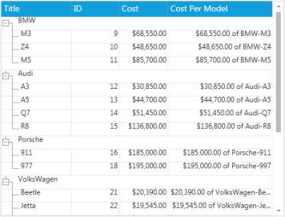

Using Formats in the GridTree Control
{:.caption}

### Expression

An Expression is a string contains formula to calculate values to display in the unbound columns. 

This property is used to set an expression formula for the unbound column, based on which the data is populated in the unbound column. Expression consists of MappingName, constants, and operators.

The following table lists the operators that are supported with example for each.

#### Operators

<table>
<tr>
<th>
Expression</th><th>
Syntax</th><th>
Description</th><th>
Example Usage</th></tr>
<tr>
<td>
Mod</td><td>
%</td><td>
Divides the first argument by the second argument and returns the remainder.</td><td>
[UnitPrice] % 10</td></tr>
<tr>
<td>
Multiplication, Division</td><td>
*,/</td><td>
Multiplies/divides first argument by the second argument.</td><td>
[QunatityPerUnit] * [UnitsInStock]</td></tr>
<tr>
<td>
Addition, Subtraction</td><td>
+,-</td><td>
Adds the first argument with the second argument or subtracts the second argument from the first one.</td><td>
[UnitsInStock]+[Quantity]</td></tr>
<tr>
<td>
Or</td><td>
OR</td><td>
Returns 1, if either the first argument or the second one returns {{ '_true_' | markdownify }}.</td><td>
[Val]=50 OR [Val]=100</td></tr>
<tr>
<td>
And</td><td>
AND</td><td>
Returns 1, if both the parameters return {{ '_true_' | markdownify }}.</td><td>
[Val]< 50 AND [Val]>100</td></tr>
<tr>
<td>
Less than</td><td>
<</td><td>
Returns {{ '_true,_' | markdownify }} if the first parameter is less than the second one.</td><td>
[OrderID] < 2000</td></tr>
<tr>
<td>
Greater than</td><td>
></td><td>
Returns {{ '_true,_' | markdownify }} if the first parameter is greater than the second one.</td><td>
[OrderID] > 2500</td></tr>
<tr>
<td>
Less than Or Equal to</td><td>
<=</td><td>
Returns {{ '_true,_' | markdownify }} if the first parameter is less than or equal to the second one.</td><td>
[OrderID] <= 2050</td></tr>
<tr>
<td>
Greater than Or Equal to</td><td>
>=</td><td>
Returns {{ '_true,_' | markdownify }} if the first parameter is greater than or equal to the second one.</td><td>
[OrderID] >= 2056</td></tr>
<tr>
<td>
Equal</td><td>
=</td><td>
Returns {{ '_true,_' | markdownify }} if both the arguments have the same value.</td><td>
[CustomerID] = 90</td></tr>
<tr>
<td>
Not Equal to</td><td>
<></td><td>
Returns {{ '_true,_' | markdownify }} if both the arguments does not have the same value.</td><td>
[CustomerID] <> 95</td></tr>
<tr>
<td>
StartsWith</td><td>
StartsWith</td><td>
Returns {{ '_true,_' | markdownify }} if the value starts with the given string.</td><td>
ProductName StartsWith Chai</td></tr>
<tr>
<td>
EndsWith</td><td>
EndsWith</td><td>
Returns {{ '_true,_' | markdownify }} if the value ends with the specified string.</td><td>
PruductName EndsWith i</td></tr>
<tr>
<td>
Contains</td><td>
Contains</td><td>
Returns {{ '_true,_'| markdownify }} if the value contains the specified string.</td><td>
ProductName Contains </td></tr>
</table>

The following code snippet shows a simple way to use expressions.



<syncfusion:GridTreeUnboundColumn Expression="Quantity*Cost"

                                    HeaderText="Grand Total"

                                    MappingName="GrandTotal"

                                    PercentWidth="2">

    <syncfusion:GridTreeUnboundColumn.StyleInfo>

     <syncfusion:GridStyleInfo HorizontalAlignment="Right" CellType="CurrencyEdit" />

    </syncfusion:GridTreeUnboundColumn.StyleInfo>

</syncfusion:GridTreeUnboundColumn>





treeGrid.Columns.Add(new GridTreeUnboundColumn() { MappingName = "GrandTotal", 

Expression = "Quantity*Cost" });




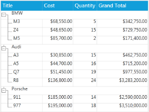

Using Expressions in the GridTree Control
{:.caption}

