# Interactive Features

This section elaborates on the following run time interactive features:

* Selection
* Sorting
* Column Sizing

## Selection Support

GridTree control has the following two types of selection support: 

* Whole Node selection-Whole node selections involve selecting the the entire row when a cell is clicked, and is enabled by setting the EnableNodeSelection property to true.  This is the default node selection type in the Grid Tree.
* Cell Range selection-The cell range selection support allows the selection of cell ranges within the GridTree control. This support is enabled by setting EnableNodeSelection property to _false_.

### Disabling the Selection

To disable all selection support in the GridTree control, set GridTreeControl.EnableSelections to _false_.

### Selection Features

GridTree control does not use the selection support inherited from the Grid control, because the selections in the Grid Tree need to be persisted, as the nodes are expanded/collapsed and sorted. The GridTreeNode.IsSelected property indicates whether the node is selected or not and the GridTreeNode.SelectedColumns property contains the names of the columns selected for the node. You can access selected nodes by using the GridTreeControl.SelectedNodes property. 

The following code example illustrates cell range selections in the Grid Tree.



foreach (GridTreeNode node in treeGrid.SelectedNodes)

{

    foreach (string columnName in node.SelectedColumns)

    {

        Console.Write("{0} ", treeGrid.InternalGrid.GetValueFromNode(columnName, node));

    }

    Console.WriteLine();

}



## Sorting

Sorting will arrange the records either in ascending or descending order of the selected field values. The GridTree control allows you to sort the data against one or more columns. The number of columns on which the sorting can be applied is unlimited.

### Properties

<table>
<tr>
<th>
Property</th><th>
Description</th><th>
Type</th><th>
Data Type</th></tr>
<tr>
<td>
AllowSort</td><td>
Enables/disables the sorting feature in the GridTree control.</td><td>
Dependency property</td><td>
Boolean</td></tr>
<tr>
<td>
EnableMultiColumnSorting</td><td>
Enables/disables the multicolumn sorting.</td><td>
Dependency property</td><td>
Boolean</td></tr>
<tr>
<td>
SortingOptions</td><td>
It is an enum property used to prevent the sorting on property changes.</td><td>
Dependency property</td><td>
Enum of type GridTreeSortingOptions with the following named constants:DefaultDisableSortingOnPropertyChange</td></tr>
<tr>
<td>
EnableTriStateSorting</td><td>
Enables/disables the tri-state sorting.</td><td>
Dependency </td><td>
Boolean </td></tr>
</table>

### Methods

<table>
<tr>
<th>
Method}</th><th>
Description</th><th>
Parameters</th><th>
Parameter Description</th><th>
Return Type</th></tr>
<tr>
<td>
SortTree</td><td>
Used to sort a particular column.</td><td>
Overloads: 1) (string colName, ListSortDirection dir) 2) (string colName, ListSortDirection dir, bool clearSort) </td><td>
ColName—name of the column to be sorted.dir—describes the direction of the sort (ascending or descending).clearSort—checks whether any existing sort should be clear before the new sort is applied.</td><td>
Void</td></tr>
</table>

The sorting can be enabled by using the AllowSort property. The following code example explains this.




this.treeGrid.AllowSort = true;





<syncfusion:GridTreeControl Name="treeGrid"

 AllowSort="True"

  ExpandStateAtStartUp="RootNodesExpanded"                                     VisualStyle="Metro">




### Sorting Options

The GridTree control supports the following sorting options:

* Multicolumn Sorting
* Tri-state Sorting 
* Custom Sorting

### Multicolumn Sorting

The GridTree control provides support to perform multicolumn sorting by holding down the Ctrl key and clicking the left mouse button.

The multicolumn sorting can be enabled by using the EnableMultiColumnSorting property. The following code example illustrates this.




this.treeGrid.EnableMultiColumnSorting = true;





<syncfusion:GridTreeControl Name="treeGrid"

                            AllowSort="True"

                            EnableMultiColumnSorting="True"

                            ExpandStateAtStartUp="RootNodesExpanded"

                            VisualStyle="Metro">




The following screenshot shows the GridTree control enabled with multicolumn sorting where the First Name column is sorted in ascending order and the Last Name column is sorted in descending order.

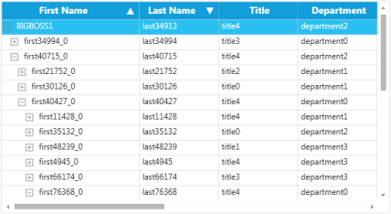

Multicolumn Sorting in GridTree Control
{:.caption}

### Tri-state Sorting

The GridTree control also supports the tri-state sorting. There are three states in this sorting:

* Ascending—sorts the records in an increasing order.
* Descending—sorts the records in a decreasing order.
* No Sorting—it retains the records in their original state.

This sorting can be enabled by using the EnableTriStateSorting property. The no sorting state will occur after the decending state. The following code example illustrates how to enable the tri-state sorting.




this.treeGrid.EnableTriStateSorting = true;





<syncfusion:GridTreeControl Name="treeGrid"

                            AllowSort="True"

                            EnableMultiColumnSorting="True"

                            EnableTriStateSorting="True"

ExpandStateAtStartUp="RootNodesExpanded"

                            VisualStyle="Metro">




### Custom Sorting

The GridTree control also features the custom sorting. The following additional members of GridTreeControlImpl allow you to access sort information and provide support for the custom sorting. 

* public bool IsPropertySorted(string propertyName, out SortState state)—determines whether a particular column is sorted.
* public IComparer<GridTreeNode> SortComparer—allows to perform the custom sorting. The default implementation assumes the underlying node items implement the IComparable technique and uses that implementation for the sorting comparisons within the columns. If your objects are not sortable using this technique, then you need to provide a sort comparer that properly sorts the grid nodes items based on the sort property values.
* public string SortProperty—it is a string that holds the column name to be sorted. You can specify a sort direction by appending a space followed by either ASC or DESC. In addition, you can specify the multicolumn sorting by passing several columns separated by commas. For example, "Price ASC, Weight DESC", which will indicate to sort the Price column in ascending order, and then sort the Weight column in descending order.
* public List<SortState> SortStates—it is a list of sort states for the columns currently sorted in the GridTree control. The SortState class contains information regarding the direction and the property sorted, and it exposes static helper methods, which takes care of the changes between SortStates and SortProperty.

## Column Sizing

The GridTree control supports autosizing its columns such that the display of the tree occupies the entire width of the client area available in the Grid Tree. The sizing is done by columns occupying certain percentages of the available space. To implement this feature, the Grid Tree must be free to size with its parent.

N> You cannot set the Width or HorizontalAlignment properties of the Grid Tree when this feature has been enabled.

You can enable this feature in two ways. 

The first is to set the GridTreeControl.PercentSizingBehavior to any value except “None”. 

The second action is to populate the GridTreeControl.Columns collection, and to set the GridTreeColumn.PercentWidth property for each of the columns that have to be autosized as the Grid Tree is sized. 

The following code example illustrates these settings.



<syncfusion:GridTreeControl Name="gridTreeControl2" Grid.Row="1" RequestTreeItems="gridTreeControl2_RequestTreeItems" PercentSizingBehavior="SizeUntouchedColumns">

    <syncfusion:GridTreeControl.Columns>

        <syncfusion:GridTreeColumn MappingName="Title"  Width="180"/>

        <syncfusion:GridTreeColumn MappingName="FirstName" PercentWidth="1"/>

        <syncfusion:GridTreeColumn MappingName="LastName" PercentWidth="1"/>

    </syncfusion:GridTreeControl.Columns>

</syncfusion:GridTreeControl>



After setting the above properties, the Grid Tree will display three columns with the “Title” column having a fixed width of 180. The other two columns would be equally sized to fill the remaining client area. 

When the PercentWeight property is enabled, the column will occupy a certain percentage of the remaining client area (after all the fixed-sized columns have been allocated). This percentage is calculated by dividing the PercentWeight property by the sum of all the PercentWeight’s present in the Columns collection. 

For example, in the preceding code, if you want the width of the LastName column to be three times the width of the FirstName column, then you have to set its PercentWeight property to 3.

The PercentSizingBehavior property provides the following options to size the columns. They are:

* None–No automatic sizing will be done. The displayed column width will either be the default value (gridTreeControl1.DefaultColumnWidth), or the width specified in the GridTreeColumn.Width property. This is the default behavior.
* SizeUntouchedColumns–This option will autosize the columns which have the PercentWidth property set, as long as the user does not explicitly change the width of this column through the UI. If the user changes the column size, the column width will not be changed as the Grid Tree is sized.
* NoSizingIfAnyTouched–If the user sets the size of any column through the UI, all autosizing stops and the column size will not be changed as the Grid Tree is sized.
* SizeAlwaysPercent–This option will not allow the user to size any column. The columns will always use the percentage sizing to determine their size as the Grid Tree is sized. 

## Update Mode

The UpdateMode property defines the behavior when updating data to the underlying collection while editing. Below are the three UpdateMode behaviors supported by the GridTree control.

Lost Focus—Update the values to the underlying collection when the current cell is out of focus or moved to another cell. Validation also will take place on lost focus of the cell.

PropertyChanged—Update the values to the underlying collection when a single value of a property is changed. Validation will also take place for every change.

RowCachedMode—Update the values to the underlying collection when the focus is moved to the next row. Validation will take place on lost focus of the cell.

### Use Case Scenarios

UpdateMode is mainly used to control the value updates to the bound collection.

### Properties

<table>
<tr>
<th>
Property</th><th>
Description}</th><th>
Type</th><th>
Data Type</th></tr>
<tr>
<td>
UpdateMode</td><td>
Defines the behavior when updating data to the underlying collection while editing.</td><td>
Dependency </td><td>
UpdateMode</td></tr>
</table>

### Adding UpdateMode to an Application 

The following code snippet explains how to set UpdateMode in XAML.



<syncfusion:GridTreeControl 

          Name="treeGrid" 

        UpdateMode="LostFocus" 

        NotifyPropertyChanges="True"                            

          ItemsSource="{Binding Source={StaticResource theWindowDataSource}}"

          ChildPropertyName="Children" 

          VisualStyle="Office14Blue">



The following code sample shows how to set UpdateMode in C#.



this.treeGrid.UpdateMode = UpdateMode.LostFocus;



## Appearance

### Styles Support

This section will elaborate on different style settings.

### Visual Styles

The GridTreeControl.VisualStyle property is used to specify the visual style for the Grid Tree. This property is also bound through the Grid Tree Template to the SkinStorage.VisualStyle property, so it can participate in the general themed appearance of all Syncfusion WPF controls. You can also turn off the visual style support in the GridTree control by setting the SupportVisualStyles property to false.

### Style Object

In addition to the GridTreeControl.VisualStyle property, there is a GridTreeControl.LevelStyles collection that enables you to specify a GridStyleInfo object to customize the appearance of all the cells at a particular level. 

The following code example illustrates how to apply LevelStyles to the Grid Tree.



// Set some miscellaneous level colors so they are easily seen (just set up to 6 levels...).

byte k = 150;

byte k1 = 250;

for (int i = -1; i < 7; ++i)

{

      GridStyleInfo style = new GridStyleInfo();

      style.Background = new SolidColorBrush(Color.FromArgb(255, 239, k1, k));

      gridTreeControl1.LevelStyles.Add(style);

      k += 15;

      k1 -= 15;

}



The following screen shot shows the back color set on a level-by-level basis, with the header cells styles set by using the VisualStyle property.

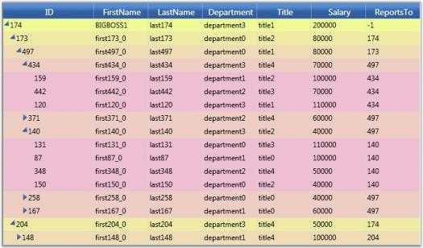

Level Styles
{:.caption}

Grid cell background is customized on a level-by-level basis.

### Setting Style for the Column

You can also control the appearance of cells in a particular column by setting the GridStyleInfo values held in the GridTreeColumn.StyleInfo property for a particular column.

The following code example illustrates how to set this property for a column in the Grid Tree.



GridTreeColumn tc = new GridTreeColumn("Department", "Department", 100);

tc.StyleInfo.Background = Brushes.Azure;

gridTreeControl1.Columns.Add(tc);  



The following screen shot shows the StyleInfo property applied to the “Department” column in the Grid Tree.

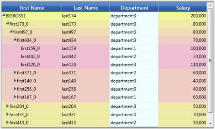

Column Styles
{:.caption}

Grid cell background for the Department column is customized.

### Setting Style for a Cell

To specify the style for a particular cell, you need to handle the QueryCellInfo event on the embedded GridTreeControlImpl. The following code example illustrates this.

Here is the code for coloring a particular cell.



// Subscribe to the event.

gridTreeControl1.Model.QueryCellInfo += new GridQueryCellInfoEventHandler(Model_QueryCellInfo);

// Event handler

void Model_QueryCellInfo(object sender, GridQueryCellInfoEventArgs e)

{

    if (e.Cell.RowIndex > 0) //skip header

    {

        // Get the node.

        GridTreeNode node = gridTreeControl1.InternalGrid.GetNodeAtRowIndex(e.Cell.RowIndex);

        if (node != null && node.Item != null)

        {

            // Cast it to the appropriate type.

            Employee emp = node.Item as Employee;

            if (emp != null)

            {

                // Pick out the cell by employee and column that you want to style.

                // For example, here we color the Department of the employee whose ID is 159.

                if (emp.ID == 159)

                {

                    string name = gridTreeControl1.InternalGrid.ColumnIndexToName(e.Cell.ColumnIndex);

                    if (name == "Department")

                    {

                        e.Style.Background = Brushes.Red;

                        e.Handled = true;

                    }

                }

            }

        }

    }

}



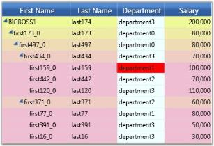

Cell Style
{:.caption}

Thus, the background of a grid cell can be customized.

N> Level styles are the lowest in precedence, followed by column styles, and then followed by cell -specific styles set in QueryCellInfo.

### Customizing the ExpandCell

The GridTreeControl.InternalGrid has a ExpandGlyphType property that enables you to customize the appearance of the Expand cell. It also has a GridTreeControl.InternalGrid.SetExpandBrushesAndPen method that is used to provide the brushes used to draw the expand glyphs. The ExpandGlyph property has the following settings.

GridTree control Property
{:.caption}

<table>
<tr>
<th>
GridTree control Property</th><th>
Description</th></tr>
<tr>
<td>
Triangle</td><td>
The glyph is displayed as a triangle. The color of the triangle is controlled either through the GridTreeControl.VisualStyle property or by explicitly calling the SetExpandBrushesAndPen method. This is the default setting.</td></tr>
<tr>
<td>
PlusMinus</td><td>
The glyph is displayed as a little square containing either a plus sign or a minus sign. The color of the glyph is controlled either through the GridTreeControl.VisualStyle property or by explicitly calling the SetExpandBrushesAndPen method.</td></tr>
<tr>
<td>
PlusMinusLines</td><td>
The glyph is displayed as a little square containing either a plus sign or a minus sign. In addition to the plus-minus squares, tree lines are drawn. The displayed colors are controlled either through the GridTreeControl.VisualStyle property or by explicitly calling the SetExpandBrushesAndPen method.</td></tr>
<tr>
<td>
Themed</td><td>
The Themed button seen in the GridData control is displayed. Its appearance is completely determined by the GridTreeControl.VisualStyle property.</td></tr>
<tr>
<td>
Custom</td><td>
The Grid Tree will not draw its own glyph. Instead, an event on the cell renderer is triggered, so that you can provide a Geometry object at that point which the renderer will draw to display your glyph. The color of the glyph is controlled either through the GridTreeControl.VisualStyle property or by explicitly calling the SetExpandBrushesAndPen method.</td></tr>
</table>

Here are some sample code snippets indicating how you can subscribe to the required event, and use the event handler to provide a PathGeometry object that will be drawn.

PathGeometry Class-Represents a complex shape that may be composed of arcs, curves, ellipses, lines, and rectangles. 



// Subscribe to the event.

GridTreeExpandCellRenderer renderer = treeGrid.InternalGrid.CellRenderers["ExpanderCell"] as GridTreeExpandCellRenderer;

if (renderer != null)

{

      renderer.GlyphDrawing += new GridTreeGlyphDrawingHandler(renderer_GlyphDrawing);

}

// Sample event handler.

void renderer_GlyphDrawing(object sender, GridTreeGlyphDrawingEventArgs args)

{

      // Draw a little circle.

      GridTreeExpandCellRenderer renderer = sender as GridTreeExpandCellRenderer;

      if (renderer != null)

      {

          // Code that draws a circle.

          PathGeometry pg = args.Geometry;

          Point pt0 = args.StartPoint;

          if (args.IsHot)

          {

              pt0.Offset(1, 5);

          }

          else

          {

             pt0.Offset(0, 4);

          }

          PathFigure pf = new PathFigure();

          pf.StartPoint = pt0;

          pf.IsClosed = false;

          pf.IsFilled = !args.Opened;

          // Radius

          double r = args.IsHot ? 4 : 5;

          // Make it essentially a full circle.

          pt0.Offset(0, .001);

          ArcSegment seg = new ArcSegment(pt0, new Size(r, r), 0, true, SweepDirection.Clockwise, true);

          pf.Segments.Add(seg);

          pg.Figures.Add(pf);

      }

 }
 
 

#### Node Images

You can display an image next to the expand glyph in the expand cell of the Grid Tree by setting the GridTreeControl.SupportNodeImages property to true. When this property is set to true, the Grid Tree will raise the RequestNodeImage event that allows you to provide an image for a given node. The EventArgs will provide you with the GridTreeNode object, and then the image can be set using the NodeImage property based on the given tree node. 

The following code example illustrates how to handle the RequestNodeImage event.



void treeGrid_RequestNodeImage(object sender, GridTreeRequestNodeImageEventArgs args)

{

args.NodeImage = employees.GetItemBitmap(args.Item as Employee);

}



Here is a screen shot that shows custom glyphs and node images.

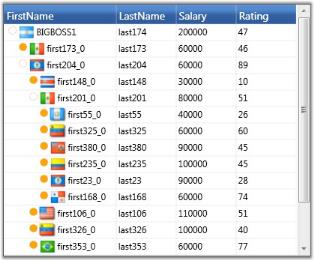

Custom Glyphs and Node Images
{:.caption}

## Blendability

The GridTree control supports setting its styles through XAML and Microsoft Expression Blend.  

### Use Case Scenarios

This feature allows the GridTree control to be customized through Microsoft Expression Blend 3 or 4.

### Properties

<table>
<tr>
<th>
Property}</th><th>
Description</th><th>
Type</th><th>
Data Type</th></tr>
<tr>
<td>
StyleManager </td><td>
Used to Customize the GridTreeControl Apperarance</td><td>
Dependency</td><td>
GridTreeStyleManager</td></tr>
</table>

### Sample Link

The Blend Styling demo in the sample browser is purely customized in XAML through the GridTreeStyleManager class. To access the Blend Styling demo:

1. Open the Syncfusion Essential Studio dashboard.
2. Select User Interface Edition.
3. Select WPF and click the orange Run Samples button on the right side of the screen.
4. Select GridTree control. 
5. In the Styles menu item, select the Blend Styling demo.

## Adding Styles to an Application 

The appearance of the GridTree control can be customized using Microsoft Expression Blend 3 or 4®. This can be achieved through the StyleManager property of type GridTreeStyleManager. The properties required to customize the appearance are defined in the GridTreeStyleManager class. 

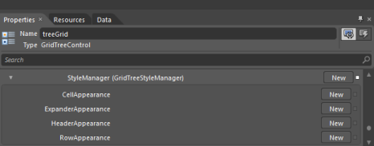

 Blend Property Window Showing StyleManager Properties
 {:.caption}

GridTreeStyleManager properties are organized under different groups, each representing a specific area of the GridTree control.

* CellAppearance
* ExpanderAppearance
* HeaderAppearance
* RowAppearance

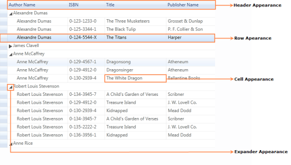

GridTreeStyleManager Properties
{:.caption}

### Cell Appearance

In the cell group, cells can be customized by specifying their margins, borders, etc. The following table shows the properties defined in this group.

#### Properties

<table>
<tr>
<th>
Property</th><th>
Description</th></tr>
<tr>
<td>
CellBackgroundBrush</td><td>
Used to change the background color of the cell</td></tr>
<tr>
<td>
CellBorders</td><td>
CellBorderInfo type property used to change the cell borders values (border color, thickness)</td></tr>
<tr>
<td>
CellFont</td><td>
GridFontInfo type property used to describe the font styles of the cell.</td></tr>
<tr>
<td>
CellForegroundBrush</td><td>
Used to change the foreground color of the cell</td></tr>
<tr>
<td>
CellTextMargin</td><td>
CellMarginsInfo type property describes cell text margins in the cell</td></tr>
</table>

Before Cell Appearance Applied
{:.caption}

After Cell Appearance Applied
{:.caption}



<sf:GridTreeStyleManager.CellAppearance>

   <sf:TreeCellAppearance 

	 CellBackgroundBrush="#FFFDFBFC" 

	 CellForegroundBrush="#FF333333">

        <sf:TreeCellAppearance.CellFont>

           <sf:GridFontInfo FontFamily="Rockwell" FontSize="10" />

        </sf:TreeCellAppearance.CellFont>

        <sf:TreeCellAppearance.CellTextMargins>

           <sf:CellMarginsInfo Bottom="2 Left="2" Right="2" Top="2" />

         </sf:TreeCellAppearance.CellTextMargins>

         <sf:TreeCellAppearance.CellBorders>

           <sf:CellBordersInfo>

              <sf:CellBordersInfo.Top>

                   <Pen Brush="#FFD6BE92" Thickness="0.25" />

              </sf:CellBordersInfo.Top>

              <sf:CellBordersInfo.Right>

                      <Pen Brush="#FFD6BE92" Thickness="0.25" />

               </sf:CellBordersInfo.Right>

               <sf:CellBordersInfo.Left>

                     <Pen Brush="#FFD6BE92" Thickness="0.25" />

               </sf:CellBordersInfo.Left>

               <sf:CellBordersInfo.Bottom>

                     <Pen Brush="#FFD6BE92" Thickness="0.25" />

               </sf:CellBordersInfo.Bottom>

             </sf:CellBordersInfo>

          </sf:TreeCellAppearance.CellBorders>

       </sf:TreeCellAppearance>

    </sf:GridTreeStyleManager.CellAppearance>



Cell Appearance Applied to GridTree Control
{:.caption}

### Expander Appearance

In the expander appearance group, the properties required to customize expand and collapse 

buttons are included. The following table shows the properties defined in this group.

#### Properties

<table>
<tr>
<th>
Property</th><th>
Description}}</th></tr>
<tr>
<td>
ExpanderBackground</td><td>
Used to change the backgound color of the expander</td></tr>
<tr>
<td>
ExpanderBorderBrush</td><td>
Used to change the border color of the expander</td></tr>
<tr>
<td>
ExpanderExpandedBackground</td><td>
Used to change the expanded expander background color</td></tr>
<tr>
<td>
ExpanderExpandedBorderBrush</td><td>
Used to change the expanded expander border color</td></tr>
<tr>
<td>
ExpanderHoverBackground</td><td>
Used to change the background color of the expander while the pointer hovers on the expander</td></tr>
<tr>
<td>
ExpanderHoverBorderBrush</td><td>
Used to change the border color while the mouse hovers on the expander</td></tr>
<tr>
<td>
ExpanderMinusPath</td><td>
Geometry type used to display different types of minus glyph</td></tr>
<tr>
<td>
ExpanderPlusPath</td><td>
Geometry type used to display different types of plus glyph</td></tr>
</table>

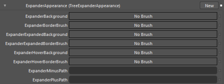

Before Expander Appearance Applied
{:.caption}

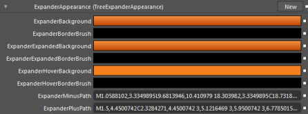

After Expander Appearance Applied
{:.caption}



  <sf:GridTreeStyleManager.ExpanderAppearance>

        <sf:TreeExpanderAppearance ExpanderBorderBrush="Black"

                                   ExpanderExpandedBorderBrush="Black"

                                   ExpanderHoverBackground="#FFF5801D"

                                   ExpanderHoverBorderBrush="Black"

                                   ExpanderMinusPath="M1.0588102,3.3349895L9.6813946,10.410979 18.303982,3.3349895C18.731884,3.3349895 19.118088,3.7399883 19.281094,4.3580003 19.445393,4.9749742 19.354794,5.6889944 19.051689,6.1619864L10.429102,19.646975C10.2323,19.954988 9.959897,20.13199 9.6813946,20.13199 9.4019918,20.13199 9.1295891,19.954988 8.9326878,19.646975L0.31020308,6.1619864C0.10809803,5.8450003 0,5.4219956 0,4.9909959 0,4.7779832 0.026299,4.5619798 0.081700325,4.3580003 0.24469995,3.7399883 0.63000345,3.3349895 1.0588102,3.3349895z M9.7325096,0C11.450365,0 12.84301,1.3382103 12.84301,2.9904997 12.84301,4.6427898 11.450365,5.9809999 9.7325096,5.9809999 8.0146551,5.9809999 6.6220098,4.6427898 6.6220098,2.9904997 6.6220098,1.3382103 8.0146551,0 9.7325096,0z"

                                    ExpanderPlusPath="M1.5,4.4500742C2.3284271,4.4500742 3,5.1216469 3,5.9500742 3,6.7785015 2.3284271,7.4500742 1.5,7.4500742 0.67157292,7.4500742 0,6.7785015 0,5.9500742 0,5.1216469 0.67157292,4.4500742 1.5,4.4500742z M2.8990631,0.00036717192C3.0453069,0.005159697,3.1827641,0.056897067,3.284497,0.15714154L8.5183868,5.3089428C8.6242905,5.4130292,8.6701775,5.5520487,8.6654148,5.6966238L8.6658916,5.6966238C8.6662092,5.7011499 8.6654148,5.7055159 8.6656513,5.710042 8.6654148,5.714488 8.6662092,5.718854 8.6658916,5.7233L8.6654148,5.7233C8.6701775,5.867878,8.6242905,6.0069752,8.5183868,6.1111407L3.284497,11.262862C3.0519648,11.491915 2.6327903,11.467778 2.3486581,11.208635 2.3486581,11.208635 2.2061534,11.101613 1.9369454,10.833023 1.6678151,10.56459 1.7572079,10.396356 1.9367857,10.137055 2.1164434,9.8779926 4.7354136,6.097723 4.7354136,6.097723 4.9301553,5.7890387 4.933569,5.630013 4.7354136,5.3222814 4.7354136,5.3222814 2.1164434,1.5420915 1.9367857,1.2827913 1.7572079,1.0237284 1.6678151,0.85541332 1.9369454,0.58698106 2.2061534,0.31847125 2.3486581,0.21136875 2.3486581,0.21136881 2.5084825,0.065645903 2.711035,-0.0057947943 2.8990631,0.00036717192z">

             <sf:TreeExpanderAppearance.ExpanderBackground>

                <LinearGradientBrush StartPoint="0.5,0" EndPoint="0.5,1">

                    <GradientStop Offset="0" Color="#FFF5913F" />

                    <GradientStop Offset="1" Color="#FFC14804" />

                </LinearGradientBrush>

             </sf:TreeExpanderAppearance.ExpanderBackground>

             <sf:TreeExpanderAppearance.ExpanderExpandedBackground>

                <LinearGradientBrush StartPoint="0.5,0" EndPoint="0.5,1">

                    <GradientStop Color="#FFF5913F" />

                    <GradientStop Offset="1" Color="#FFC14804" />

                </LinearGradientBrush>

              </sf:TreeExpanderAppearance.ExpanderExpandedBackground>

           </sf:TreeExpanderAppearance>

       </sf:GridTreeStyleManager.ExpanderAppearance>



Expander Appearance Applied to the GridTree Control
{:.caption}

### Header Appearance

In the header appearance options, properties required to customize the header are defined. 

The following table shows the properties defined in this group.

#### Properties

<table>
<tr>
<th>
Property</th><th>
Description</th></tr>
<tr>
<td>
HeaderBackgroundBrush</td><td>
Used to change the backgound color of the header</td></tr>
<tr>
<td>
HeaderFont</td><td>
GridFontInfo type property used to describe the font styles of the cell</td></tr>
<tr>
<td>
HeaderForegroundBrush</td><td>
Used to change the foreground color of the header</td></tr>
<tr>
<td>
HeaderHoverBackgroundBrush</td><td>
Used to change the background color of the header on mouse hover</td></tr>
<tr>
<td>
HeaderHoverForegroundBrush</td><td>
Used to change the header foreground color on mouse hover</td></tr>
<tr>
<td>
HeaderTextMargins</td><td>
CellMarginsInfo type property describes text margin in the header</td></tr>
<tr>
<td>
SortWidgetBorderBrush</td><td>
Used to change the sort icon border color</td></tr>
<tr>
<td>
SortWidgetBorderHoverBackgroundBrush</td><td>
Used to change the sort icon border background color</td></tr>
<tr>
<td>
SortWidgetBrush</td><td>
Used to change the sort icon background color</td></tr>
</table>

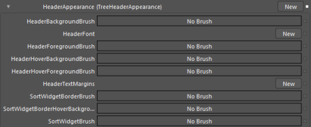

Before Header Appearance Applied
{:.caption}

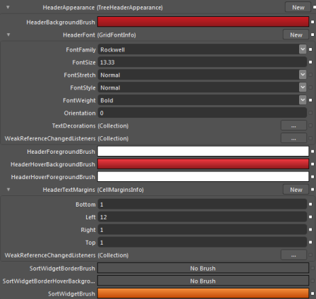

After Header Appearance Applied
{:.caption}



	  <sf:GridTreeStyleManager.HeaderAppearance>

	       <sf:TreeHeaderAppearance 

	           HeaderForegroundBrush="White" 

	           HeaderHoverForegroundBrush="White">

	          <sf:TreeHeaderAppearance.HeaderFont>

	             <sf:GridFontInfo FontFamily="Rockwell"

	                              FontSize="13.33"

	                              FontWeight="Bold" />

	             </sf:TreeHeaderAppearance.HeaderFont>

	           <sf:TreeHeaderAppearance.HeaderHoverBackgroundBrush>

	             <LinearGradientBrush StartPoint="0.5,0" EndPoint="0.5,1">

	                 <GradientStop Offset="0" Color="#FFF33A42" />

	                 <GradientStop Offset="1" Color="#FF8E191C" />

	             </LinearGradientBrush>

	            </sf:TreeHeaderAppearance.HeaderHoverBackgroundBrush>

	           <sf:TreeHeaderAppearance.HeaderBackgroundBrush>

	             <LinearGradientBrush StartPoint="0.5,0" EndPoint="0.5,1">

	                 <GradientStop Offset="0" Color="#FFCB1C23" />

	                 <GradientStop Offset="1" Color="#FF8E191C" />

	             </LinearGradientBrush>

	            </sf:TreeHeaderAppearance.HeaderBackgroundBrush>

	            <sf:TreeHeaderAppearance.SortWidgetBrush>

	             <LinearGradientBrush StartPoint="0.5,0" EndPoint="0.5,1">

	                  <GradientStop Offset="0" Color="#FFF5913F" />

	                  <GradientStop Offset="1" Color="#FFC14804" />

	             </LinearGradientBrush>

	          </sf:TreeHeaderAppearance.SortWidgetBrush>

	          <sf:TreeHeaderAppearance.HeaderTextMargins>

	            <sf:CellMarginsInfo Bottom="1"

	                                Left="12"

	                                Right="1"

	                                Top="1" />

	        </sf:TreeHeaderAppearance.HeaderTextMargins>

	    </sf:TreeHeaderAppearance>

	</sf:GridTreeStyleManager.HeaderAppearance>



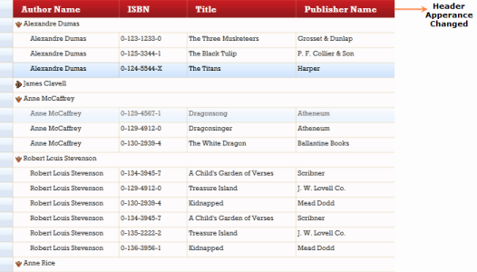

Header Appearance Applied to the GridTreeControl
{:.caption}

### Row Appearance

Properties required to customize the grid rows are defined in the row appearance options. 

The following table shows the properties defined in this group.

#### Properties

<table>
<tr>
<th>
Property</th><th>
Description</th></tr>
<tr>
<td>
CurrentCellBorderBrush</td><td>
Used to change the current cell border color</td></tr>
<tr>
<td>
CurrentCellBorderWidth</td><td>
Used to change the current cell border thickness</td></tr>
<tr>
<td>
CurrentCellSelectionBackground</td><td>
Used to change the current cell selection background color</td></tr>
<tr>
<td>
CurrentCellSelectionForeground</td><td>
Used to change the curent cell selection foreground color</td></tr>
<tr>
<td>
HeaderHoverForegroundBrush</td><td>
Used to change the header hover foreground color</td></tr>
<tr>
<td>
HighlightSelectionBackground</td><td>
Used to change the highlight selection background color</td></tr>
<tr>
<td>
HighlightSelectionForeground</td><td>
Used to change the highlight selection foreground color</td></tr>
<tr>
<td>
RowHeaderBackgroundBrush</td><td>
Used to change the row header background color</td></tr>
<tr>
<td>
RowHeaderForegroundBrush</td><td>
Used to change the row heaeder foreground color</td></tr>
<tr>
<td>
RowHoverBackgroundBrush</td><td>
Used to change the hover color of the GridTree control</td></tr>
<tr>
<td>
RowHoverForegroundBrush</td><td>
Used to change the hover foregrond color of the GridTree control</td></tr>
</table>

Before Row Appearance Applied
{:.caption}

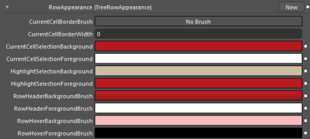

After Row Appearance Applied
{:.caption}



 <sf:GridTreeStyleManager.RowAppearance>

      <sf:TreeRowAppearance CurrentCellSelectionBackground="#FFB31B20"

                            CurrentCellSelectionForeground="White"

                            HighlightSelectionBackground="#FFCDBEA3"

                            HighlightSelectionForeground="#FFB71B21"

                            RowHeaderForegroundBrush="White"

                            RowHoverBackgroundBrush="#FFF9BBBB"

                            RowHoverForegroundBrush="Black">

              <sf:TreeRowAppearance.RowHeaderBackgroundBrush>

                   <LinearGradientBrush StartPoint="0.5,0" EndPoint="0.5,1">

                      <GradientStop Offset="0" Color="#FFCB1C23" />

                      <GradientStop Offset="1" Color="#FF8E191C" />

                   </LinearGradientBrush>

               </sf:TreeRowAppearance.RowHeaderBackgroundBrush>

      </sf:TreeRowAppearance>

 </sf:GridTreeStyleManager.RowAppearance>



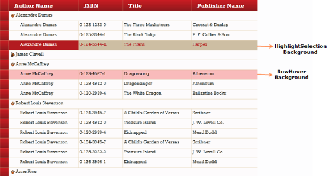

Row Appearance Applied to the GridTree Control
{:.caption}

## Serialization

The GridTree control’s state can be serialized and deserialized in XML format. All the styles and properties that reflect the state of the grid can be serialized.

The following options in the GridTree control can be serialized and deserialized.

* Width Options
* Sort Options
* Selection Options
* Visual Styles
* Editing Options
* Resizing Options

### Use Case Scenarios

Serialization is used to retain the application state when the application is closed and reopened.

### Methods

<table>
<tr>
<th>
Method</th><th>
Description</th><th>
Parameters</th><th>
Type}</th><th>
Return Type</th></tr>
<tr>
<th>
Serialize</th><th>
This method serializes the properties to XML.</th><th>
(String filename)</th><th>
Public</th><th>
void </th></tr>
<tr>
<th>
SerializeAsString</th><th>
This method serializes the properties as an XML string.</th><th>
NA</th><th>
Public</th><th>
String</th></tr>
<tr>
<th>
SerializeToStream</th><th>
This method serializes properties as a stream.</th><th>
(TextWriter textwriter)</th><th>
Public</th><th>
void</th></tr>
<tr>
<th>
Deserialize</th><th>
This method deserializes the XML file.</th><th>
(String filename)</th><th>
Public</th><th>
 void</th></tr>
<tr>
<th>
DeserializeFromString</th><th>
This method is used to deserialize the properties from the XML string.</th><th>
String(fileName)</th><th>
Public</th><th>
void</th></tr>
<tr>
<th>
DeserializeFromStream</th><th>
This method is used to deserialize the property from the stream.</th><th>
TextReader(textreader)</th><th>
Public</th><th>
void</th></tr>
</table>

### Sample Link

The Serialization Demo sample in the sample browser illustrates the GridTree control’s serialization feature.

1. Open the Syncfusion Essential Studio Dashboard.
2. Select User Interface Edition.
3. Select WPF and click the orange Run Samples button on the right side of the window.
4. Select GridTree Control. 
5. Under the Serialization menu item, select Serialization Demo.
Adding Serialization/Deserialization to an Application 

### Serializing 

There are three methods of serialization/deserialization available in the GridTree control.

* XML string
* XML file
* XML stream

### API Usage

### Serializing as an XML String

The following code illustrates how to serialize the GridTree control as an XML string. 



string result=this.treeGrid.InternalGrid.SerializeAsString();



### Serializing as an XML File

The following code illustrates how to serialize the GridTree control as an XML file. 



this.treeGrid.InternalGrid.Serialize("newChanges.xml");



### Serializing as an XML Stream

The following code illustrates how to serialize the GridTree control as an XML stream. 



TextWriter sw=new StreamWriter("newChanges.xml");

this.treeGrid.InternalGrid.SerializeToStream(sw);



### Deserializing 

There are three methods to deserializing forms:

* XML string
* XML file
* XML stream

### API Usage

### Deserialize from XML String

The following code illustrates how to deserialize from an XML string_._ 



 //the result should be an XML string saved during the serialization process.

this.treeGrid.InternalGrid.DeserializeFromString(result);



### Deserialize from XML File

The following code illustrates how to deserialize an XML file.



//newChanges.xml file should be the XML file saved during the serialization 

process.

this.treeGrid.InternalGrid.Deserialize("newChanges.xml");



### Deserialize from XML Stream

The following code illustrates how to deserialize an XML stream.



//newChanges.txt file should be the text file saved during the serialization

process.

TextReader sr = new StreamReader("newChanges.txt");

this.treeGrid.InternalGrid.DeserializeFromStream(sr);



