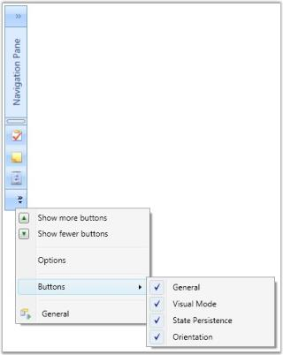

# Collapsing the GroupBar

Enabling this property allows the GroupBar to be collapsed when clicked. The GroupBar will collapse similar to the collapsing action in Microsoft office Outlook. AllowCollapse property is used to enable or disable the collapse button of the GroupBar.

By clicking the Navigation pane, the content of the GroupBar Items are displayed. You can resize the pop-up and also add or remove the GroupBar Item from the Toolbar using the StackItem host pop-up menu.

To enable the AllowCollapse property in GroupBar, use the following code.

<table>
<tr>
<td>
<!-- Adding GroupBar that has allow collapse property to true --><syncfusion:GroupBar Height="300" Width="230" Name="groupBar" AllowCollapse="True" VisualMode="StackMode">    <!-- Adding GroupBarItem -->    <syncfusion:GroupBarItem Name="groupBarItem1" HeaderImageSource="Label.gif" Header="General">      <!-- Adding content for GroupBar item using GroupView -->      <syncfusion:GroupView Name="groupView" IsListViewMode="True">        <syncfusion:GroupViewItem Text="List View"/>        <syncfusion:GroupViewItem Text="Show ContextMenu"/>        <syncfusion:GroupViewItem Text="Show ToolTip"/>      </syncfusion:GroupView>    </syncfusion:GroupBarItem>    <!-- Adding GroupBarItem -->    <syncfusion:GroupBarItem HeaderImageSource="Tasks.png" Name="groupBarItem2" Header="Visual Mode">      <!-- Adding content for GroupBar item using GroupView -->      <syncfusion:GroupView>        <syncfusion:GroupViewItem Text="Default"/>        <syncfusion:GroupViewItem Text="Multiple Expansion"/>        <syncfusion:GroupViewItem Text="StackMode"/>      </syncfusion:GroupView>    </syncfusion:GroupBarItem>    <!-- Adding GroupBarItem -->    <syncfusion:GroupBarItem HeaderImageSource="Notes.png" Name="groupBarItem3" Header="State Persistence">      <!-- Adding content for GroupBar item using GroupView -->      <syncfusion:GroupView>        <syncfusion:GroupViewItem Text="Save State"/>        <syncfusion:GroupViewItem Text="Load State"/>        <syncfusion:GroupViewItem Text="Reset State"/>      </syncfusion:GroupView>    </syncfusion:GroupBarItem>  </syncfusion:GroupBar></td></tr>
<tr>
<td>
myGroupBar.AllowCollapse = true;</td></tr>
</table>

###Events to handle with AllowCollapse

The event corresponding to this property is BeforeGroupBarItemPopupOpened. This event is triggered when AllowCollapse property gets changed.

Note: AllowCollapse property settings works only for GroupBar in StackMode.

Collapsing the GroupBar in Stack Mode

Collapsing and expanding the GroupBar in stackmode is done by using IsCollapsed property. This dependency property indicates the state of GroupBar, whether collapsed or expanded. By setting this property to _true_, groupbar is collapsed. By setting _false_, groupbar is expanded. 

Use the below code snippet to set this property.

<table>
<tr>
<td>
<!-- Adding GroupBar --><syncfusion:GroupBar Height="200" Width="230" IsCollapsed="True" AllowCollapse="True" VisualMode="StackMode" Name="groupBar">  <!-- Adding GroupBarItem -->  <syncfusion:GroupBarItem Name="groupBarItem" Header="GroupBarItem" IsSelected="True">    <!-- Adding content for GroupBar item using panel -->    <StackPanel Orientation="Vertical">      <TextBlock Text="GroupBar Orientation" Margin="4,4,2,2"/>      <RadioButton IsChecked="True" Margin="4,2,2,2">Horizontal</RadioButton>      <RadioButton Margin="4,2,2,2">Vertical</RadioButton>      <TextBlock Text="GroupView Orientation" Margin="4,4,2,2"/>      <RadioButton Margin="4,2,2,2">Horizontal</RadioButton>      <RadioButton IsChecked="True" Margin="4,2,2,2">Vertical</RadioButton>    </StackPanel>  </syncfusion:GroupBarItem>  <!-- Adding GroupBarItem -->  <syncfusion:GroupBarItem Name="groupBarItem1" HeaderImageSource="Label.gif" Header="General">    <!-- Adding content for GroupBar item using GroupView -->    <syncfusion:GroupView Name="groupView" IsListViewMode="True">      <syncfusion:GroupViewItem Text="List View"/>      <syncfusion:GroupViewItem Text="Show ContextMenu"/>      <syncfusion:GroupViewItem Text="Show ToolTip"/>    </syncfusion:GroupView>  </syncfusion:GroupBarItem></syncfusion:GroupBar></td></tr>
<tr>
<td>
//Set the visual mode as stack modegroupBar.VisualMode = VisualMode.StackMode;//Collapsing the GroupBar in stack modegroupBar.IsCollapsed = true;</td></tr>
</table>

See Also

Width of the Collapsed GroupBar

