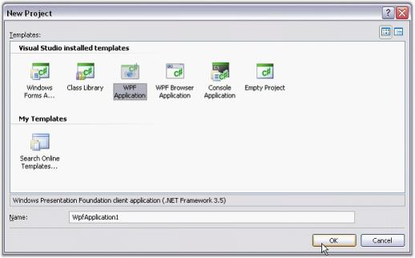

# Getting Started

This section will show you how easy it is to get started using Essential Grouping. It will give you a basic introduction to the concepts you need to know before getting started with the product and some tips and ideas on how to implement Grouping into your projects to improve customization and increase efficiency. It shows how to create an IList data source and use it with Grouping. The datasource is an ArrayList of custom objects. As part of this lesson, you will see how to iterate through the data in the GroupingEngine.

## Creating a WPF Application

1. Open Microsoft Visual Studio. Go to File menu and click New Project. In the New Project dialog, select WPF Application template, name the project and click OK. 

   

2. A WPF application is created.
3. Now you need to deploy Essential Grouping into this WPF application. Refer WPF topic for detailed info.

## Deploying Essential Grouping

This section will guide you to deploy Essential Grouping in a WPF applications.

1. In order to deploy an application that uses the Syncfusion assemblies, the referenced Syncfusion assemblies should reside in the application folder where the exe exists, in the target machine.
2. In order to do that, go to the References folder in the Solution Explorer. Select all the Syncfusion assemblies, right-click and go to Properties. Change the Copy Local property of the Syncfusion assemblies to true and compile the project.
3. Check whether the licenses.licx file listed in the project has its Build Action property to be Embedded Resource.
4. Now you may see that the Syncfusion assemblies referenced in the project are copied to the output directory along with the application executable (bin/debug/).
5. Deploy the exe along with the Syncfusion assemblies in that location to the target machine. Be sure that these Syncfusion assemblies reside in the same location as the application exe in the target machine.
 
Dlls needed for deployment

* Syncfusion.Core.dll
* Syncfusion.Grouping.Base.dll
* Syncfusion.Grouping.Wpf.dll
* Syncfusion.Shared.Base.dll
* Syncfusion.Shared.Wpf.dll

Essential Grouping is now deployed in your WPF applications.

