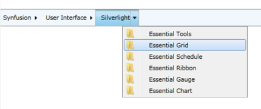
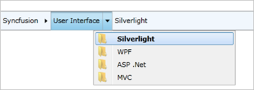

# Populating Data

The steps to add items to the HierarchyNavigator in XAML are as follows: 

1. Create a HierarchyNavigator control.

   ~~~xaml

			<syncfusion:HierarchyNavigator x:Name="hierarchyNavigatorcontrol1" 
			VerticalAlignment="Top" Height="30" Width="600">
			
   ~~~

2. Add the HierarchyNavigatorItem to the HierarchyNavigator control.

   ~~~xaml

		<syncfusion:HierarchyNavigator x:Name="hierarchyNavigatorcontrol1"   VerticalAlignment="Top" Height="30" Width="600">

		<syncfusion:HierarchyNavigator.Items>

		<syncfusion:HierarchyNavigatorItem Content="Syncfusion">

		<syncfusion:HierarchyNavigatorItem.Items>

		<syncfusion:HierarchyNavigatorItem Content="User Interface"/>

		<syncfusion:HierarchyNavigatorItem Content="Silverlight">

		<syncfusion:HierarchyNavigatorItem.Items>

		<syncfusion:HierarchyNavigatorItem Content="Tools"/>

		</syncfusion:HierarchyNavigatorItem.Items>

		</syncfusion:HierarchyNavigatorItem>

		</syncfusion:HierarchyNavigatorItem.Items>

		</syncfusion:HierarchyNavigatorItem>

		</syncfusion:HierarchyNavigator.Items>

		</syncfusion:HierarchyNavigator>

   ~~~

3. The snippet below demonstrates the steps to add items to a HierarchyNavigator control in code:

   ~~~csharp

			HierarchyNavigator hierarchyNavigator1 = new HierarchyNavigator() { Height = 30 };

			HierarchyNavigatorItem hierarchyNavigatorItem1 = new HierarchyNavigatorItem();

			hierarchyNavigatorItem1.Content = "Syncfusion";

			HierarchyNavigatorItem hierarchyNavigatorItem11 = new HierarchyNavigatorItem();

			hierarchyNavigatorItem11.Content = "User Interface";

			HierarchyNavigatorItem hierarchyNavigatorItem111 = new HierarchyNavigatorItem();

			hierarchyNavigatorItem111.Content = "Silverlight";

			HierarchyNavigatorItem hierarchyNavigatorItem112 = new HierarchyNavigatorItem();

			hierarchyNavigatorItem112.Content = "WPF";

			HierarchyNavigatorItem hierarchyNavigatorItem113 = new HierarchyNavigatorItem();

			hierarchyNavigatorItem113.Content = "ASP .Net";

			HierarchyNavigatorItem hierarchyNavigatorItem114 = new HierarchyNavigatorItem();

			hierarchyNavigatorItem114.Content = "MVC";

			hierarchyNavigatorItem11.Items.Add(hierarchyNavigatorItem111);

			hierarchyNavigatorItem11.Items.Add(hierarchyNavigatorItem112);

			hierarchyNavigatorItem11.Items.Add(hierarchyNavigatorItem113);

			hierarchyNavigatorItem11.Items.Add(hierarchyNavigatorItem114);

			hierarchyNavigatorItem1.Items.Add(hierarchyNavigatorItem11);

			hierarchyNavigator1.Items.Add(hierarchyNavigatorItem1);

   ~~~

   The following figure shows the items added in code displayed on the interface.

   

## Data binding

Data binding is the process of establishing a connection between the application UI and business logic.

### Binding to an object

To bind to a Business Object collection, the ItemsSource property and ItemTemplate should be used in HierarchyNavigator. HierarchicalDataTemplate should be used for all item templates.

The steps to bind to a Business Object collection are as follows:

1. Create a class named HierarchyItem.

   ~~~csharp

		public class HierarchyItem

		{

		public string ContentString { get; set; }

		public HierarchyItem(string content, params HierarchyItem[] myItems)

		{

		this.ContentString = content;

		itemsObservableCollection = new ObservableCollection<HierarchyItem>();

		foreach (var item in myItems)

		{

		itemsObservableCollection.Add(item);

		}

		HierarchyItems = itemsObservableCollection;

		}

		private ObservableCollection<HierarchyItem> itemsObservableCollection;

		public ObservableCollection<HierarchyItem> HierarchyItems

		{

		get { return itemsObservableCollection; }

		set

		{

		if (itemsObservableCollection != value)

		{

		itemsObservableCollection = value;

		}

		}

		}

		}

   ~~~

2. Create a collection for ItemsSource to bind with.

   ~~~csharp

		public class HierarchicalItemsSource : ObservableCollection<HierarchyItem>

		{

		public HierarchicalItemsSource()

		{

		this.Add(new HierarchyItem("Syncfusion",

		new HierarchyItem("User Interface",

		new HierarchyItem("Silverlight"),

		new HierarchyItem("WPF"),

		new HierarchyItem("ASP .Net"),

		new HierarchyItem("MVC")),

		new HierarchyItem("Reporting Edition",

		new HierarchyItem("IO"),

		new HierarchyItem("PDF generator"),

		new HierarchyItem("WPF")

		)));

		}

		}

   ~~~

3. In XAML, bind the collections to the ItemsSource property of the HierarchyNavigator control.

   ~~~xaml

		<syncfusion:HierarchyNavigator Name="hierarchyNavigator2">

		<syncfusion:HierarchyNavigator.ItemsSource>

		<local:HierarchicalItemsSource />

		</syncfusion:HierarchyNavigator.ItemsSource>

		<syncfusion:HierarchyNavigator.ItemTemplate>

		<HierarchicalDataTemplate ItemsSource="{Binding HierarchyItems}">

		<TextBlock Text="{Binding ContentString}" Margin="2,0" />

		</HierarchicalDataTemplate>

		</syncfusion:HierarchyNavigator.ItemTemplate>

		</syncfusion:HierarchyNavigator> 

   ~~~

   The following screenshot shows the items added in code displayed on the interface.

   

  
   

### Binding XML data

To bind XML data to a HierarchyNavigator control, convert the XML to a collection, and then bind the collection by using the ItemsSource property.

The XML displayed below is used in this example (attached in the sample project named HierarchyItems.xml).



<categories>

  <category name="Synfusion">

    <category name="User Interface">

      <category name="Silverlight">

        <category name="Essential Tools" />

        <category name="Essential Grid" />

        <category name="Essential Schedule" />

        <category name="Essential Ribbon" />

        <category name="Essential Gauge" />

        <category name="Essential Chart" />

      </category>

      <category name="WPF" />

      <category name="MVC" />

      <category name="ASP .Net" />

    </category>

  </category>

</categories>


The steps to bind XML data to a HierarchyNavigator control are as follows:

1. Create a separate class that represents the node in an XML document. In this example, a class named Category is created.

   ~~~csharp

		public class HierarchyItem

		{

		public string ContentStr { get; set; }

		ObservableCollection<HierarchyItem> hierarchyItems = new  ObservableCollection<HierarchyItem>();

		public ObservableCollection<HierarchyItem> HierarchyItems { get { return hierarchyItems; } set { hierarchyItems = value; } }

		}

   ~~~

2. Convert the XML data to a collection, and then bind the collection to the ItemsSource property of HierarchyNavigator.

   ~~~csharp

		public partial class MainPage : UserControl

		{

		public MainPage()

		{

		InitializeComponent();

		CreateXMLDataItemsSource();

		}

		private void CreateXMLDataItemsSource()

		{

		ObservableCollection<HierarchyItem> categories = new ObservableCollection<HierarchyItem>();

		XDocument XMLItemSource = XDocument.Load("/HierarchyItems.xml");

		categories = this.GetCategories(XMLItemSource.Element("categories"));

		hierarchyNavigator1.ItemsSource = categories;

		}

		private ObservableCollection<HierarchyItem> GetCategories(XElement element)

		{

		var item = from category in element.Elements("category")

		select category;

		var itemsObservableCollection = new ObservableCollection<HierarchyItem>();

		foreach (var itm in item)

		{

		var subitm = new HierarchyItem();

		subitm.ContentStr = itm.Attribute("name").Value;

		subitm.HierarchyItems = this.GetCategories(itm);

		itemsObservableCollection.Add(subitm);

		}

		return itemsObservableCollection;

		}

		}

   ~~~

3. The code for the HierarchyNavigator is shown below. Declare HierarchicalDataTemplate, because the data is in a hierarchical structure. Refer Template Customizing.

   ~~~xaml

		<syncfusion:HierarchyNavigator VerticalAlignment="Center" Name="hierarchyNavigator1" Height="30">

		<syncfusion:HierarchyNavigator.ItemTemplate>

		<HierarchicalDataTemplate ItemsSource="{Binding HierarchyItems}">

		<TextBlock Margin="10,0,0,0" Text="{Binding ContentStr}" Grid.Column="0"/>

		</HierarchicalDataTemplate>

		</syncfusion:HierarchyNavigator.ItemTemplate>

		</syncfusion:HierarchyNavigator>

   ~~~

The image displayed below shows the output of the above code—items bound to XML data.

### Binding to WCF Service

XML data can be bound through WCF services by enabling WCF Services.

The steps to bind XML data through WCF services are as follows:

1. Create an XML and a class object. Refer the XML data-binding class and the XML used in the 
2. The following screenshot shows the items added in code displayed on the interface.

   

3. Binding XML data section.
4. Add an ASP.NET Web application with the sample application, and then add a new WCF Service item to the Web application, to create a WCF service application.
5. Create an Observable Collection from XML data to bind in ItemsSource, as shown below in the service class that has a return type of ObservableCollection.

   ~~~csharp

		[ServiceContract(Namespace = "")]

		[AspNetCompatibilityRequirements(RequirementsMode = AspNetCompatibilityRequirementsMode.Allowed)]

		public class Service1

		{

		[OperationContract]

		public ObservableCollection<HierarchyItem> CreateXMLDataItems()

		{

		ObservableCollection<HierarchyItem> categories = new ObservableCollection<HierarchyItem>();

		XDocument XMLItemSource = XDocument.Load("YourXMLLocation/HierarchyItems.xml");

		categories = this.GetCategories(XMLItemSource.Element("categories"));

		return categories;

		}

		private ObservableCollection<HierarchyItem> GetCategories(XElement element)

		{

		var item = from category in element.Elements("category")

		select category;

		var itemsObservableCollection = new ObservableCollection<HierarchyItem>();

		foreach (var itm in item)

		{

		var subitm = new HierarchyItem();

		subitm.ContentStr = itm.Attribute("name").Value;

		subitm.HierarchyItems = this.GetCategories(itm);

		itemsObservableCollection.Add(subitm);

		}

		return itemsObservableCollection;

		}

		}

		//To connect WCF services with the sample application, use the code snippets displayed below. Also refer Binding data with WCF Service in the How To section.

		namespace WCFServicesInHierarchy

		{

		public partial class MainPage : UserControl

		{

		public MainPage()

		{

		InitializeComponent();

		}

		}

		public class CustomSource

		{

		public CustomSource()

		{

		//This loads WCF Service

		Service1Client client = new Service1Client();

		client.CreateXMLDataItemsCompleted += new EventHandler<CreateXMLDataItemsCompletedEventArgs>(client_CreateXMLDataItemsCompleted);

		client.CreateXMLDataItemsAsync();

		this.Categories = new ObservableCollection<HierarchyItem>();

		}

		private void client_CreateXMLDataItemsCompleted(object sender, CreateXMLDataItemsCompletedEventArgs e)

		{

		if (e.Error == null && e.Result != null)

		{

		foreach (HierarchyItem c in e.Result)

		{

		this.Categories.Add(c);

		}

		}

		}

		public ObservableCollection<HierarchyItem> Categories

		{

		get;

		set;

		}

		}

		}

   ~~~

   ~~~xaml
		<Window
		xmlns="http://schemas.microsoft.com/winfx/2006/xaml/presentation"

		xmlns:x="http://schemas.microsoft.com/winfx/2006/xaml"
		xmlns:syncfusion="http://schemas.syncfusion.com/wpf"
		     xmlns:local="clr-namespace:WCFServicesInHierarchy" 
		x:Class="WCFServicesInHierarchy.MainWindow"
		x:Name="Window" Title="MainWindow" UseLayoutRounding="True" Width="640" Height="480">
		    <Window.DataContext>
		        <local:CustomSource/>
		    </Window.DataContext>

		    <Grid x:Name="LayoutRoot">
		        <syncfusion:HierarchyNavigator Name="hierarchyNavigator1" VerticalAlignment="Center" ItemsSource="{Binding Categories}">
		            <syncfusion:HierarchyNavigator.ItemTemplate>
		                <HierarchicalDataTemplate ItemsSource="{Binding HierarchyItems}">
		                    <Border>
		                        <TextBlock Text="{Binding ContentStr}" Margin="2,0"/>
		                    </Border>
		                </HierarchicalDataTemplate>
		            </syncfusion:HierarchyNavigator.ItemTemplate>
		        </syncfusion:HierarchyNavigator>
		    </Grid>
		</Window>

   ~~~

The image displayed below shows the output of the above code—items bound to XML data.

 

