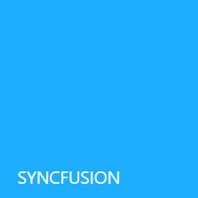
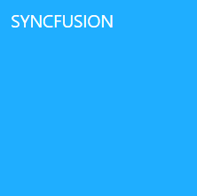
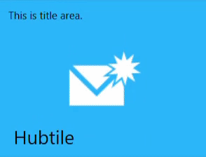

# Hub Tile

The Hub Tile control supports the tile feature similar to the live tile feature of Windows Desktop and Windows Phone. This section explains about the supporting features of Hub Tile control.

## Setting header content

Header can act as the name of the tile, that is placed at the bottom explaining its purpose. The content of the header can be an image, a text or a control, etc. The header can be set to the tile by using the [Header](https://help.syncfusion.com/cr/wpf/Syncfusion.SfShared.Wpf~Syncfusion.Windows.Primitives.HeaderedContentControl~Header.html) property. The below example defines a tile that represents mail application.



<Grid x:Name="grid">
<!--For setting header as text use this code. -->
<syncfusion:SfHubTile x:Name="hubtile" Header="Mail"/>

<!--For setting header as an image use this code.-->
<syncfusion:SfHubTile x:Name="hubtile">
    <syncfusion:SfHubTile.Header>
        <Image Source="/Assets/syncfusion.png" Stretch="None"/>
    </syncfusion:SfHubTile.Header>
</syncfusion:SfHubTile> 

<!--For setting header as a control use this code.-->
<syncfusion:SfHubTile x:Name="hubtile">
   <syncfusion:SfHubTile.Header>
       <TextBlock Text="SYNCFUSION" Foreground="White" FontSize="13"/>
   </syncfusion:SfHubTile.Header>
</syncfusion:SfHubTile> 
</Grid>     



	// For setting header as text use this code.
	SfHubTile hubTile = new SfHubTile();
	hubTile.Header = "Mail";
    
    //For setting header as image use this code.
    SfHubTile hubTile = new SfHubTile();
    Image image = new Image(){Source = new BitmapImage(new Uri(@"/Assets/syncfusion.png",UriKind.RelativeOrAbsolute)),Stretch = Stretch.None };
    hubTile.Header = image;
   
    //For setting header as control use this code.
    SfHubTile hubTile = new SfHubTile();
    TextBlock textblock = new TextBlock(){Text = "SYNCFUSION", Foreground = Brushes.White, FontSize = 13} ; 
    hubTile.Header = textblock;

    grid.Children.Add(hubTile);




## Setting title content 

Title can be used to display updates and notifications in a tile. The content of the title can be an image, a text or a control, etc. The title can be set to the tile by using the [Title](https://help.syncfusion.com/cr/wpf/Syncfusion.SfHubTile.Wpf~Syncfusion.Windows.Controls.Notification.HubTileBase~Title.html) property. The below example represents the notifications in mail applications.



<Grid x:Name="grid">
<!--For setting title as text use this code.-->
<syncfusion:SfHubTile x:Name="hubTile" Title="New mail from Syncfusion"/>

<!--For setting title as an image use this code.-->
<syncfusion:SfHubTile x:Name="hubTile">
   <syncfusion:SfHubTile.Title>
        <Image Source="/Assets/syncfusion.png" Stretch="None" HorizontalAlignment="Left"/>
    </syncfusion:SfHubTile.Title>
</syncfusion:SfHubTile> 

<!--For setting title as a control use this code.-->
<syncfusion:SfHubTile x:Name="hubTile">
   <syncfusion:SfHubTile.Title>
        <TextBlock Text="SYNCFUSION" Foreground="White" FontSize="13"/>
    </syncfusion:SfHubTile.Title>
</syncfusion:SfHubTile>   
</Grid>   



	//Setting title on Hub Tile.
	SfHubTile hubTile = new SfHubTile();
	hubTile.Title = "New Mail from Syncfusion";

    //For setting title as image use this code.
    SfHubTile hubTile = new SfHubTile();
    Image image = new Image(){Source = new BitmapImage(new Uri(@"/Assets/syncfusion.png",UriKind.RelativeOrAbsolute)), Stretch =Stretch.None,HorizontalAlignment = HorizontalAlignment.Left };
    hubTile.Title = image;
   
    // For setting title as control use this code.
    SfHubTile hubTile = new SfHubTile();
    TextBlock textblock = new TextBlock(){Text = "SYNCFUSION", Foreground = Brushes.White, FontSize = 13} ; 
    hubTile.Title = textblock;

    grid.Children.Add(hubTile);




## Setting image 

The image can be set to the tile by setting image path to the [ImageSource](https://help.syncfusion.com/cr/wpf/Syncfusion.SfHubTile.Wpf~Syncfusion.Windows.Controls.Notification.HubTileBase~ImageSource.html) property.



<Grid x:Name="grid">
<!--SfHubTile--> 
<syncfusion:SfHubTile x:Name="hubTile" ImageSource="/Assets/New Mail.png"/>
</Grid>


{% highlight C# % }

    //Setting image for hub tile
    SfHubTile hubTile = new SfHubTile();
    hubTile.ImageSource = new BitmapImage(new Uri(@"/Assets/New Mail.png",UriKind.RelativeOrAbsolute));

    grid.Children.Add(hubTile);



## Setting secondary content

[SecondaryContent](https://help.syncfusion.com/cr/wpf/Syncfusion.SfHubTile.Wpf~Syncfusion.Windows.Controls.Notification.SfHubTile~SecondaryContent.html) specifies the content to be dislayed when the tile content of the tile changes during each transition, that is, from primary view. Secondary content can be an image, a text or a control.


<Window xmlns="http://schemas.microsoft.com/winfx/2006/xaml/presentation"
        xmlns:x="http://schemas.microsoft.com/winfx/2006/xaml"
        xmlns:syncfusion="http://schemas.syncfusion.com/wpf" 
		xmlns:shared="clr-namespace:Syncfusion.Windows.Controls;assembly=Syncfusion.SfShared.Wpf"
        x:Class="WpfApplication1.MainWindow"
        Title="MainWindow" Height="350" Width="525">
<Grid x:Name="grid">
<!--For setting secondary content as image use this code.-->
<syncfusion:SfHubTile x:Name="hubTile" ImageSource="/Assets/New Mail.png" Title="Title area." Header="HubTile" Interval="00:00:03">
	<syncfusion:SfHubTile.HubTileTransitions>
		<shared:SlideTransition/>
	</syncfusion:SfHubTile.HubTileTransitions>
	<!-- For setting secondary content  -->
	<syncfusion:SfHubTile.SecondaryContent>
		<Image Source="/Assets/HubTile.png" Stretch="UniformToFill" Margin="-1"/>
	</syncfusion:SfHubTile.SecondaryContent>
</syncfusion:SfHubTile>

<!--For setting secondary content as text use this code.-->
<syncfusion:SfHubTile x:Name="hubTile" ImageSource="/Assets/New Mail.png" Title="Title area." Header="HubTile" Interval="00:00:03" SecondaryContent="This is the secondary content of the tile"/>

<!--For setting secondary content as control use this code.-->
<syncfusion:SfHubTile x:Name="hubTile" ImageSource="/Assets/New Mail.png" Title="Title area." Header="HubTile" Interval="00:00:03">
	<syncfusion:SfHubTile.HubTileTransitions>
		<shared:SlideTransition/>
	</syncfusion:SfHubTile.HubTileTransitions>
    <syncfusion:SfHubTile.SecondaryContent>
        <TextBlock Text="This is the secondary content of the tile displayed at each transition" TextWrapping="Wrap" FontSize="15" Foreground="White"/>
    </syncfusion:SfHubTile.SecondaryContent>
</syncfusion:SfHubTile>
</Grid>
</Window>



    SfHubTile hubTile= new SfHubTile();
    hubTile.Header = "HubTile";
    hubTile.Title = "Title area";
    hubTile.ImageSource = new BitmapImage(new Uri(@"/Assets/New Mail.png", UriKind.RelativeOrAbsolute));
    hubTile.HubTileTransitions.Add(new SlideTransition());

    //For setting secondary content as an image use this code.
    Image image = new Image() { Source = new BitmapImage(new Uri(@"/Assets/HubTile.png", UriKind.RelativeOrAbsolute)) };
    hubTile.SecondaryContent = image;
    hubTile.Interval = TimeSpan.FromSeconds(3.0);

    //For setting secondary content as a control use this code.
    SfHubTile hubTile= new SfHubTile();
    hubTile.Header = "HubTile";
    hubTile.Title = "Title area";
    hubTile.ImageSource = new BitmapImage(new Uri(@"/Assets/New Mail.png", UriKind.RelativeOrAbsolute));
    hubTile.HubTileTransitions.Add(new SlideTransition());
    TextBlock textblock = new TextBlock() { Text = "This is the secondary content of the tile displayed at each transition", TextWrapping = TextWrapping.Wrap, FontSize = 15, Foreground = Brushes.White };
    hubTile.SecondaryContent = textblock;
    hubTile.Interval = TimeSpan.FromSeconds(3.0);
  
    //For setting secondary content as text use this code.
    SfHubTile hubTile= new SfHubTile();
    hubTile.Header = "HubTile";
    hubTile.Title = "Title area";
    hubTile.ImageSource = new BitmapImage(new Uri(@"/Assets/New Mail.png", UriKind.RelativeOrAbsolute));
    hubTile.HubTileTransitions.Add(new SlideTransition());
    hubTile.SecondaryContent = "Secondary content of tile";
    hubTile.Interval = TimeSpan.FromSeconds(3.0);

    grid.Children.Add(hubTile);

    

## Transitions

The Hub Tile control supports various transitions which causes the tile to change from primary tile content to secondary tile content. The transitions can be set to the Hub Tile by using the [HubTileTransitions](https://help.syncfusion.com/cr/wpf/Syncfusion.SfHubTile.Wpf~Syncfusion.Windows.Controls.Notification.SfHubTile~HubTileTransitions.html) property. These transitions happens based on the specified interval set via [Interval](https://help.syncfusion.com/cr/wpf/Syncfusion.SfHubTile.Wpf~Syncfusion.Windows.Controls.Notification.SfHubTile~Interval.html) property of the Hub Tile. The control provides the following built-in transitions:
1. Slide transition
2. Fade transition




<Window xmlns="http://schemas.microsoft.com/winfx/2006/xaml/presentation"
        xmlns:x="http://schemas.microsoft.com/winfx/2006/xaml"
        xmlns:syncfusion="http://schemas.syncfusion.com/wpf" 
		xmlns:shared="clr-namespace:Syncfusion.Windows.Controls;assembly=Syncfusion.SfShared.Wpf"
        x:Class="WpfApplication1.MainWindow"
        Title="MainWindow" Height="350" Width="525">
<Grid>
<!-- SfHubTile -->
<syncfusion:SfHubTile x:Name="hubTile" ImageSource="/Assets/New Mail.png" Title="Title area." Header="HubTile" Interval="00:00:03">
	<syncfusion:SfHubTile.HubTileTransitions>
	    <!--For SlideTransition use this code.-->
		<shared:SlideTransition/>
		<!--For FadeTransition use this code.-->
	    <shared:FadeTransition/>
	</syncfusion:SfHubTile.HubTileTransitions>
	<!-- For setting secondary content -->
	<syncfusion:SfHubTile.SecondaryContent>
		<Image Source="/Assets/HubTile.png" Stretch="UniformToFill" Margin="-1"/>
	</syncfusion:SfHubTile.SecondaryContent>
</syncfusion:SfHubTile>
</Grid>
</Window>



    SfHubTile hubTile = new SfHubTile();

    //Setting header
    hubTile.Header ="HubTile";

    //Setting title    
    hubTile.Title ="Title area";
    
    //Setting image
    hubTile.ImageSource = new BitmapImage(new Uri(@"/Assets/New Mail.png",UriKind.RelativeOrAbsolute)); 

    //For setting secondary content
    Image image = new Image() { Source = new BitmapImage(new Uri(@"/Assets/HubTile.png", UriKind.RelativeOrAbsolute)) };
    hubTile.SecondaryContent = image;

    //For Slide transition use this code.
    hubTile.HubTileTransitions.Add(new SlideTransition());

    //For Fade transition use this code.
    hubTile.HubTileTransitions.Add(new FadeTransition());

    //Setting transition interval
    hubTile.Interval = TimeSpan.FromSeconds(3.0);

    grid.Children.Add(hubTile);



N> **Syncfusion.SfShared.Wpf** assembly should be included in XAML or import **using Syncfusion.Windows.Controls;** namespace at code behind to support built-in transitions.

### Notifications on transitions

Hub Tile transitions occurs repeatedly at each specified interval. [HubTileTransitionCompleted](https://help.syncfusion.com/cr/wpf/Syncfusion.SfHubTile.Wpf~Syncfusion.Windows.Controls.Notification.SfHubTile~HubTileTransitionCompleted_EV.html) event rises on each transition completion. Below example demonstrates the working of the event in the Hub Tile.



<syncfusion:SfHubTile x:Name="hubtile" Header="HubTile" Title="TitleArea." ImageSource="/Assets/New mail.png" Interval="00:00:03" >
	<syncfusion:SfHubTile.HubTileTransitions>
	    <shared:SlideTransition/>
	</syncfusion:SfHubTile.HubTileTransitions>
	<syncfusion:SfHubTile.SecondaryContent>
	    <Image Source="/Assets/HubTile.png" Stretch="UniformToFill">
	</syncfusion:SfHubTile.SecondaryContent>
	<i:Interaction.Triggers>
        <i:EventTrigger EventName="HubTileTransitionCompleted">
            <local:HubTileTransitionCompleted />
        </i:EventTrigger>
    </i:Interaction.Triggers>
</syncfusion:SfHubTile>


      
	public class HubTileTransitionCompleted : TargetedTriggerAction<SfHubTile>
    {
        protected override void Invoke(object parameter)
        {
          var hubTile = this.AssociatedObject as SfHubTile;
          MainWindow window = VisualUtils.FindAncestor(hubTile, typeof(MainWindow)) as MainWindow;
          if ((window != null) && (hubTile != null))
          {
            window.hubTile.Background=Brushes.Green;
          }
        }
    }



## Grouping

Several tiles can be grouped using the [GroupName](https://help.syncfusion.com/cr/wpf/Syncfusion.SfHubTile.Wpf~Syncfusion.Windows.Controls.Notification.HubTileBase~GroupName.html) property of hub tile control. The group name will be used when the entire group of tiles needs to be freezed/unfreezed.



<Grid x:Name="grid">
<WrapPanel Orientation="Horizontal">
<!-- SfHubTile 1-->
<syncfusion:SfHubTile x:Name="hubTileOne" GroupName="Applications" ImageSource="/Assets/New Mail.png" Title="Title area." Interval="00:00:03" Header="HubTile">
	<syncfusion:SfHubTile.SecondaryContent>
	   <Image Source="/Assets/HubTile.png" Stretch="UniformToFill" Margin="-1"/>
	</syncfusion:SfHubTile.SecondaryContent>
 	<syncfusion:SfHubTile.HubTileTransitions>
	  <shared:SlideTransition/>
	</syncfusion:SfHubTile.HubTileTransitions>
</syncfusion:SfHubTile>
<!-- SfHubTile 2-->
<syncfusion:SfHubTile x:Name="hubTileTwo" Margin="10" GroupName="Applications" ImageSource="/Assets/New Mail.png" Title="Title area." Interval="00:00:03" Header="HubTile">
	<syncfusion:SfHubTile.SecondaryContent>
	    <Image Source="/Assets/HubTile.png" Stretch="UniformToFill" Margin="-1"/>
	</syncfusion:SfHubTile.SecondaryContent>
	<syncfusion:SfHubTile.HubTileTransitions>
	    <shared:SlideTransition/>
	</syncfusion:SfHubTile.HubTileTransitions>
</syncfusion:SfHubTile>
<!-- SfHubTile 3-->
<syncfusion:SfHubTile x:Name="hubTileThree" GroupName="Applications" ImageSource="/Assets/New Mail.png" Title="Title area." Interval="00:00:03" Header="HubTile">
	<syncfusion:SfHubTile.SecondaryContent>
	    <Image Source="/Assets/HubTile.png" Stretch="UniformToFill" Margin="-1"/>
	</syncfusion:SfHubTile.SecondaryContent>
 	<syncfusion:SfHubTile.HubTileTransitions>
	    <shared:SlideTransition/>
	</syncfusion:SfHubTile.HubTileTransitions>
</syncfusion:SfHubTile>
</WrapPanel>
</Grid>


    
    WrapPanel wrapPanel = new WrapPanel();
    wrapPanel.Orientation = Orientation.Horizontal;
    grid.Children.Add(wrappanel);

    //SfHubTile 1
    SfHubTile hubTileOne= new SfHubTile();
    hubTileOne.Header = "HubTile";
    hubTileOne.Title = "Title area";
    hubTileOne.HubTileTransitions.Add(new SlideTransition());
    hubTileOne.Interval = TimeSpan.FromSeconds(3.0);
    Image image = new Image() { Source = new BitmapImage(new Uri(@"/Assets/HubTile.png", UriKind.RelativeOrAbsolute)) };
    hubTileOne.SecondaryContent = image;
        
    //SfHubTile 2
    SfHubTile hubTileTwo= new SfHubTile();
    hubTileTwo.Header = "HubTile";
    hubTileTwo.Title = "Title area";
    hubTileTwo.HubTileTransitions.Add(new SlideTransition());
    hubTileTwo.Interval = TimeSpan.FromSeconds(3.0);
    Image image = new Image() { Source = new BitmapImage(new Uri(@"/Assets/HubTile.png", UriKind.RelativeOrAbsolute)) };
    hubTileTwo.SecondaryContent = image;
    Thickness margin = hubTileTwo.Margin;
    margin.Left = 10;
    hubTileTwo.Margin = margin;

    //SfHubTile 3
    SfHubTile hubTileThree= new SfHubTile();
    hubTileThree.Header = "HubTile";
    hubTileThree.Title = "Title area";
    hubTileThree.HubTileTransitions.Add(new SlideTransition());
    hubTileThree.Interval = TimeSpan.FromSeconds(3.0);
    Image image = new Image() { Source = new BitmapImage(new Uri(@"/Assets/HubTile.png", UriKind.RelativeOrAbsolute)) };
    hubTileThree.SecondaryContent = image;
    
    //Setting group name
    hubTileOne.GroupName = "Applications";
    hubTileTwo.GroupName = "Applications";
	hubTileThree.GroupName = "Applications";

    wrapPanel.Children.Add(hubTileOne);
    wrapPanel.Children.Add(hubTileTwo);
    wrapPanel.Children.Add(hubTileThree);



### Grouping via DataBinding

Grouping several hub tiles can also be done by populating hub tile into a collection by providing proper binding to the collection. Below example demonstartes how to populate a group of hub tiles inside a listview in MVVM pattern.
1. Create a new WPF project.
2. Create a Model class and specify the elements of the Hub Tile. 



    
    public class Model
    {

        public string Header { get; set; }
 
        public string ImageSource { get; set; }

        public TimeSpan Interval { get; set; }
        
        
    }



3. Create a ViewModel class Where the collection has been declared and populate the items into it.




    public class ViewModel
    {
        public ObservableCollection<Model> Items { get; set; }
        public ViewModel()
        {
            Items = new ObservableCollection<Model>();
            PopulateData(); 
        }

        private void PopulateData()
        {
            Model hub1 = new Model { Header= "Mail",ImageSource=@"/Assets/New Mail.png", Interval=TimeSpan.FromSeconds(3.0),};
            Model hub2 = new Model { Header = "Word", ImageSource = @"/Assets/Word.png", Interval=TimeSpan.FromSeconds(3.0),};
            Model hub3 = new Model { Header = "Paint", ImageSource = @"/Assets/Painting Brush.png", Interval=TimeSpan.FromSeconds(3.0),};
            Model hub4 = new Model { Header = "NotePad", ImageSource = @"/Assets/Note.png",Interval=TimeSpan.FromSeconds(3.0),};
            Items.Add(hub1);
            Items.Add(hub2);
            Items.Add(hub3);
            Items.Add(hub4);
        }
    }      



4. In XAML bind the collection to the ListView control and use ItemTemplate to populate Hub Tile control into it.



<Window x:Class="HubTileGrouping_Sample.MainWindow"
        xmlns="http://schemas.microsoft.com/winfx/2006/xaml/presentation"
        xmlns:x="http://schemas.microsoft.com/winfx/2006/xaml"
        xmlns:d="http://schemas.microsoft.com/expression/blend/2008"
        xmlns:mc="http://schemas.openxmlformats.org/markup-compatibility/2006"
        xmlns:local="clr-namespace:HubTileGrouping_Sample"
        xmlns:syncfusion="http://schemas.syncfusion.com/wpf"
        xmlns:viewmodel="clr-namespace:HubTileGrouping_Sample.ViewModel"
        xmlns:shared="clr-namespace:Syncfusion.Windows.Controls;assembly=Syncfusion.SfShared.Wpf"
        mc:Ignorable="d"
        Title="MainWindow" Height="450" Width="800">
    <Window.Resources>
        <local:ImageConverter x:Key="Image"/>
    </Window.Resources>
    <Window.DataContext>
        <viewmodel:ViewModel/>
    </Window.DataContext>
    <Grid>
        <ListView x:Name="List" ItemsSource="{Binding Items}" >
        <ListView.ItemTemplate>
        <DataTemplate>
        <StackPanel Orientation="Horizontal">
        <syncfusion:SfHubTile Header="{Binding Header}" Interval="{Binding Interval}" ImageSource="{Binding Imagesource,Converter={StaticResource Image}}">
        <syncfusion:SfHubTile.SecondaryContentTemplate>
            <DataTemplate>
                <TextBlock Text="This is the secodary content of the tile displayed at each transition" TextWrapping="Wrap" FontStyle="Italic" FontSize="15" Foreground="White"/>
            </DataTemplate>
        </syncfusion:SfHubTile.SecondaryContentTemplate>
        <syncfusion:SfHubTile.HubTileTransitions>
                <shared:FadeTransition/>
        </syncfusion:SfHubTile.HubTileTransitions>
        </syncfusion:SfHubTile>
        </StackPanel>
        </DataTemplate>
        </ListView.ItemTemplate>
        </ListView>
    </Grid>
</Window>



## Freezing/Unfreezing 

Freezing provides support to stop animating the tile contents. Unfreezing provides support to keep the tile content animated. By the following two ways freezing/unfreezing can be set to the Hub Tile:

### Freezing/unfreezing via property

The tile can be freezed by setting [IsFrozen](https://help.syncfusion.com/cr/wpf/Syncfusion.SfHubTile.Wpf~Syncfusion.Windows.Controls.Notification.HubTileBase~IsFrozen.html) property to be **true**.



<Grid x:Name="grid">
<!-- SfHubTile -->
<syncfusion:SfHubTile x:Name="hubTile" Header="Hubtile" IsFrozen="True" Title="Title area." ImageSource="/Assets/New Mail.png" Interval="00:00:03" HorizontalAlignment="Center" VerticalAlignment="Center"  >
    <!-- For setting secondary content -->
	<syncfusion:SfHubTile.SecondaryContent>
		<Image Source="/Assets/HubTile.png" Stretch="UniformToFill" Margin="-1"/>
	</syncfusion:SfHubTile.SecondaryContent>
	<syncfusion:SfHubTile.HubTileTransitions>
	<!--For SlideTransition-->
        <shared:SlideTransition/>
	</syncfusion:SfHubTile.HubTileTransitions>
</syncfusion:SfHubTile>
</Grid>


    
    SfHubTile hubTile= new SfHubTile();
    hubTile.Header = "HubTile";
    hubTile.Title = "Title area.";
    hubTile.HubTileTransitions.Add(new SlideTransition());
    Image image = new Image() { Source = new BitmapImage(new Uri(@"/Assets/HubTile.png", UriKind.RelativeOrAbsolute)) };
    hubTile.SecondaryContent = image;
    hubTile.Interval=TimeSpan.FromSeconds(3.0);

    //Setting freeze property
    hubTile.IsFrozen = true;

    gird.Children.Add(hubTile);


 

The tile can be unfreezed by setting [IsFrozen](https://help.syncfusion.com/cr/wpf/Syncfusion.SfHubTile.Wpf~Syncfusion.Windows.Controls.Notification.HubTileBase~IsFrozen.html) property to **false**.



<Grid x:Name="grid">
<!-- SfHubTile -->
<syncfusion:SfHubTile x:Name="hubTile" Header="HubTile" IsFrozen="False" Title="Title area" ImageSource="Assests/New Mail.png" HorizontalAlignment="Center" VerticalAlignment="Center" >
    <!-- For setting secondary content -->
	<syncfusion:SfHubTile.SecondaryContent>
	    <Image Source="/Assets/HubTile.png" Stretch="UniformToFill" Margin="-1"/>
	</syncfusion:SfHubTile.SecondaryContent>
	<syncfusion:SfHubTile.HubTileTransitions>
        <shared:SlideTransition/>
	</syncfusion:SfHubTile.HubTileTransitions>
</syncfusion:SfHubTile>
</Grid>



    SfHubTile hubTile= new SfHubTile();
    hubTile.Header = "HubTile";
    hubTile.Title = "Title area";
    hubTile.HubTileTransitions.Add(new SlideTransition());
    Image image = new Image() { Source = new BitmapImage(new Uri(@"/Assets/HubTile.png", UriKind.RelativeOrAbsolute)) };
    hubTile.SecondaryContent = image;
    hubTile.Interval = TimeSpan.FromSeconds(3.0);

    //Setting Unfreeze property
    hubTile.IsFrozen = false;

    grid.Children.Add(hubTile);



### Freezing/unfreezing the tiles

The [HubTileService](https://help.syncfusion.com/cr/wpf/Syncfusion.SfHubTile.Wpf~Syncfusion.Windows.Controls.Notification.HubTileService.html) class provides helper methods such as [Freeze](https://help.syncfusion.com/cr/wpf/Syncfusion.SfHubTile.Wpf~Syncfusion.Windows.Controls.Notification.HubTileService~Freeze.html) and [UnFreeze](https://help.syncfusion.com/cr/wpf/Syncfusion.SfHubTile.Wpf~Syncfusion.Windows.Controls.Notification.HubTileService~UnFreeze.html) to freeze and unfreeze the animation by passing a Hub Tile instance or [GroupName](https://help.syncfusion.com/cr/wpf/Syncfusion.SfHubTile.Wpf~Syncfusion.Windows.Controls.Notification.HubTileBase~GroupName.html) as an argument. Add required **System.Windows.Interactivity** assembly reference in application. Import schema for interactivity **http://schemas.microsoft.com/expression/2010/interactivity** in XAML or **using System.Windows.Interactivity** namespace in C#.

N> The [HubTileService](https://help.syncfusion.com/cr/wpf/Syncfusion.SfHubTile.Wpf~Syncfusion.Windows.Controls.Notification.HubTileService.html) class allows to set the freeze/unfreeze state of the tile after the tiles are loaded.

A single tile or a group of tiles can be freezed by using [Freeze](https://help.syncfusion.com/cr/wpf/Syncfusion.SfHubTile.Wpf~Syncfusion.Windows.Controls.Notification.HubTileService~Freeze.html) method.




<Window x:Class="HubTile_Grouping.MainWindow"
        xmlns="http://schemas.microsoft.com/winfx/2006/xaml/presentation"
        xmlns:x="http://schemas.microsoft.com/winfx/2006/xaml"
        xmlns:d="http://schemas.microsoft.com/expression/blend/2008"
        xmlns:mc="http://schemas.openxmlformats.org/markup-compatibility/2006"
        xmlns:local="clr-namespace:HubTile_Grouping"
        xmlns:syncfusion="http://schemas.syncfusion.com/wpf"
        xmlns:shared="clr-namespace:Syncfusion.Windows.Controls;assembly=Syncfusion.SfShared.Wpf"
        xmlns:i="http://schemas.microsoft.com/expression/2010/interactivity"
        mc:Ignorable="d"
        Title="MainWindow" Height="450" Width="800">
<Grid>
<WrapPanel>
<!-- SfHubTile 1-->
<syncfusion:SfHubTile x:Name="hubTileOne" GroupName="Applications" ImageSource="/Assets/New Mail.png" Title="TitleArea." Interval="00:00:03" Header="HubTile">
	<syncfusion:SfHubTile.SecondaryContent>
	    <Image Source="/Assets/HubTile.png" Stretch="UniformToFill" Margin="-1"/>
	</syncfusion:SfHubTile.SecondaryContent>
	<syncfusion:SfHubTile.HubTileTransitions>
	    <shared:SlideTransition/>
	</syncfusion:SfHubTile.HubTileTransitions>
</syncfusion:SfHubTile>
<!-- SfHubTile 2-->
<syncfusion:SfHubTile x:Name="hubTileTwo" GroupName="Application" Margin="10" ImageSource="/Assets/New Mail.png" Title="TitleArea." Interval="00:00:03"  Header="HubTile">
	<syncfusion:SfHubTile.SecondaryContent>
	    <Image Source="/Assets/HubTile.png" Stretch="UniformToFill" Margin="-1"/>
	</syncfusion:SfHubTile.SecondaryContent>
	<syncfusion:SfHubTile.HubTileTransitions>
	    <shared:SlideTransition/>
	</syncfusion:SfHubTile.HubTileTransitions>
</syncfusion:SfHubTile>
<!--SfHubTile 3-->
<syncfusion:SfHubTile x:Name="hubTileThree" GroupName="Applications" ImageSource="/Assets/New Mail.png" Title="TitleArea." Interval="00:00:03" Header="HubTile">
	<syncfusion:SfHubTile.SecondaryContent>
		<Image Source="/Assets/HubTile.png" Stretch="UniformToFill" Margin="-1"/>
	</syncfusion:SfHubTile.SecondaryContent>
 	<syncfusion:SfHubTile.HubTileTransitions>
	    <shared:SlideTransition/>
	</syncfusion:SfHubTile.HubTileTransitions>
    <i:Interaction.Triggers>
	    <i:EventTrigger EventName="Loaded">
	        <local:FreezeTiles/>
	    </i:EventTrigger>
	</i:Interaction.Triggers>
</syncfusion:SfHubTile>
</WrapPanel>   
</Grid>
</Window>


  
    using Syncfusion.Windows.Controls.Notification;
    using Syncfusion.Windows.Shared;
    using System.Windows.Interactivity;
    namespace HubTile_Grouping
	{
        public class FreezeTiles : TargetedTriggerAction<SfHubTile>
        {
            protected override void Invoke(object parameter)
            {
                var hubTile = this.AssociatedObject as SfHubTile;
                MainWindow window = VisualUtils.FindAncestor(hubTile, typeof(MainWindow)) as MainWindow;
                if (window != null && hubTile != null)
                {
                    //For a single tile
                    HubTileService.Freeze(window.hubTileOne); 
            
                    //For  group of tiles
                    HubTileService.Freeze("Applications");
                }
            }
        }
	}



A single tile or a group of tiles can be unfreezed by using [UnFreeze](https://help.syncfusion.com/cr/wpf/Syncfusion.SfHubTile.Wpf~Syncfusion.Windows.Controls.Notification.HubTileService~UnFreeze.html) method.
 


<Window x:Class="HubTile_Grouping.MainWindow"
        xmlns="http://schemas.microsoft.com/winfx/2006/xaml/presentation"
        xmlns:x="http://schemas.microsoft.com/winfx/2006/xaml"
        xmlns:d="http://schemas.microsoft.com/expression/blend/2008"
        xmlns:mc="http://schemas.openxmlformats.org/markup-compatibility/2006"
        xmlns:local="clr-namespace:HubTile_Grouping"
        xmlns:syncfusion="http://schemas.syncfusion.com/wpf"
        xmlns:shared="clr-namespace:Syncfusion.Windows.Controls;assembly=Syncfusion.SfShared.Wpf"
        xmlns:i="http://schemas.microsoft.com/expression/2010/interactivity"
        mc:Ignorable="d"
        Title="MainWindow" Height="450" Width="800">
<Grid>
<WrapPanel>
<!-- SfHubTile 1-->
<syncfusion:SfHubTile x:Name="hubTileOne" GroupName="Applications" ImageSource="/Assets/New Mail.png" Title="Title area." Interval="00:00:03" Header="HubTile">
	<syncfusion:SfHubTile.SecondaryContent>
	    <Image Source="/Assets/HubTile.png" Stretch="UniformToFill" Margin="-1"/>
	</syncfusion:SfHubTile.SecondaryContent>
	<syncfusion:SfHubTile.HubTileTransitions>
	    <shared:SlideTransition/>
	</syncfusion:SfHubTile.HubTileTransitions>
</syncfusion:SfHubTile>
<!-- SfHubTile 2-->
<syncfusion:SfHubTile x:Name="hubTileTwo" GroupName="Applications" Margin="10" ImageSource="/Assets/New Mail.png" Title="Title area." Interval="00:00:03" Header="HubTile">
	<syncfusion:SfHubTile.SecondaryContent>
	    <Image Source="/Assets/HubTile.png" Stretch="UniformToFill" Margin="-1"/>
	</syncfusion:SfHubTile.SecondaryContent>
	<syncfusion:SfHubTile.HubTileTransitions>
	    <shared:SlideTransition/>
	</syncfusion:SfHubTile.HubTileTransitions>
</syncfusion:SfHubTile>
<!--SfHubTile 3-->
<syncfusion:SfHubTile x:Name="hubTileThree" GroupName="Applications" ImageSource="/Assets/New Mail.png" Title="Title area." Interval="00:00:03" Header="HubTile">
	<syncfusion:SfHubTile.SecondaryContent>
	    <Image Source="/Assets/HubTile.png" Stretch="UniformToFill" Margin="-1"/>
	</syncfusion:SfHubTile.SecondaryContent>
	<syncfusion:SfHubTile.HubTileTransitions>
	    <shared:SlideTransition/>
	</syncfusion:SfHubTile.HubTileTransitions>
	<i:Interaction.Triggers>
	    <i:EventTriggers EventName="Loaded">
	        <local:UnfreezeTiles/>
        <i:EventTriggers/>   
	</i:Interaction.Triggers>
</syncfusion:SfHubTile>
</WrapPanel>
</Grid>
</Window>


    
	using Syncfusion.Windows.Controls.Notification;
    using Syncfusion.Windows.Shared;
    using System.Windows.Interactivity;  
	namespace HubTile_Grouping
	{ 
	    public class UnfreezeTiles : TargetedTriggerAction<SfHubTile>
        {
            protected override void Invoke(object parameter)
            {
                var hubTile = this.AssociatedObject as SfHubTile;
                MainWindow window = VisualUtils.FindAncestor(hubTile, typeof(MainWindow)) as MainWindow;
                if (window != null && hubTile != null)
                {
		            //For a single tile use this code
		            HubTileService.UnFreeze(window.hubTileOne);
		  
		            //For group of tiles use this code
		            HubTileService.UnFreeze("Applications");
                }
            }
        }
	}



 
## Notifications

Once the tile is pressed, it is notified by the click event and the command property of the Hub Tile. 
  
The [Click](https://help.syncfusion.com/cr/wpf/Syncfusion.SfHubTile.Wpf~Syncfusion.Windows.Controls.Notification.HubTileBase~Click_EV.html) event rises whenever the tile is pressed.


 
<syncfusion:SfHubTile x:Name="hubTile"  GroupName="HubTiles" Interval="00:00:03"  Header="Hubtile" Title="This is title area." ImageSource="/Assets/New Mail.png">
	<i:Interaction.Triggers>
        <i:EventTrigger EventName="Click">
            <local:ClickEvent/>
        </i:EventTrigger>
    </i:Interaction.Triggers>
</syncfusion:SfHubTile>


      
    public class ClickEvent : TargetedTriggerAction<SfHubTile>
    {
        protected override void Invoke(object parameter)
        {
            var hubTile = this.AssociatedObject as SfHubTile;
            MainWindow window = VisualUtils.FindAncestor(hubtile, typeof(MainWindow)) as MainWindow;
            if ((window != null) && (hubTile != null))
            {
                MessageBox.Show("Hub Tile is Clicked");
            }
        }
    }

 

### Command binding

Command specifies the operation to be performed when the tile is pressed. [Command](https://help.syncfusion.com/cr/wpf/Syncfusion.SfHubTile.Wpf~Syncfusion.Windows.Controls.Notification.HubTileBase~Command.html) and [CommandParameter](https://help.syncfusion.com/cr/wpf/Syncfusion.SfHubTile.Wpf~Syncfusion.Windows.Controls.Notification.HubTileBase~CommandParameter.html) are used instead of click event in MVVM pattern. 


 
<Window x:Class="Hub.MainWindow"
        xmlns="http://schemas.microsoft.com/winfx/2006/xaml/presentation"
        xmlns:x="http://schemas.microsoft.com/winfx/2006/xaml"
        xmlns:d="http://schemas.microsoft.com/expression/blend/2008"
        xmlns:mc="http://schemas.openxmlformats.org/markup-compatibility/2006"
        xmlns:local="clr-namespace:Hub"
        xmlns:syncfusion="http://schemas.syncfusion.com/wpf"
        xmlns:shared="clr-namespace:Syncfusion.Windows.Controls;assembly=Syncfusion.SfShared.Wpf"
        mc:Ignorable="d"
        Title="MainWindow" Height="450" Width="800">
<Window.DataContext>
   <local:Viewmodel/>
</Window.DataContext>
<Grid x:Name="grid">
<syncfusion:SfHubTile x:Name="hubtile" Command="{Binding HubTileCommand}" CommandParameter="{Binding ElementName=hubtile}"  Interval="00:00:03" Header="Hubtile" Title="This is title area." ImageSource="/Assets/New Mail.png"/>
</Grid>
</Window>


           
	public class Viewmodel
    {

        private ICommand hubTileCommand;

        public ICommand HubTileCommand
        {
            get 
            { 
                return hubTileCommand ?? (hubTileCommand = new Command(true, ()=>MyAction("HubTileCommand")));
            }
        }
        private void MyAction(string parameter)
        {
           if (parameter.Equals("HubTileCommand"))
            {
              string meesage = string.Format("Hub Tile Command executed");
              MessageBox.Show(meesage);
            }
        }
    }
	public class Command : ICommand
    {
        private bool _canExecute;
        private Action _execute;
        public Command(bool CanExecute, Action Execute)
        {
            _canExecute = CanExecute;
            _execute = Execute;
        }

        public event EventHandler CanExecuteChanged;

        public bool CanExecute(object parameter)
        {
            return _canExecute;
        }

        public void Execute(object parameter)
        {
            _execute();
        }
    }
   


### Animations

The tile press animation takes place when the center of the tile is pressed. The tile press animation causes the entire tile to be zoomed in/out at specified interval. The tile press animation can be set by using properties such as [ScaleDepth](https://help.syncfusion.com/cr/wpf/Syncfusion.SfHubTile.Wpf~Syncfusion.Windows.Controls.Notification.HubTileBase~ScaleDepth.html) and [TilePressDuration](https://help.syncfusion.com/cr/wpf/Syncfusion.SfHubTile.Wpf~Syncfusion.Windows.Controls.Notification.HubTileBase~TilePressDuration.html) in the Hub Tile. The [ScaleDepth](https://help.syncfusion.com/cr/wpf/Syncfusion.SfHubTile.Wpf~Syncfusion.Windows.Controls.Notification.HubTileBase~ScaleDepth.html) is used to customize the depth of scaling effect while pressing the center of the tile. The [TilePressDuration](https://help.syncfusion.com/cr/wpf/Syncfusion.SfHubTile.Wpf~Syncfusion.Windows.Controls.Notification.HubTileBase~TilePressDuration.html) is used to determine the time taken for the single tile press animation.



<Grid x:Name="grid">
<syncfusion:SfHubTile x:Name="hubtile" TilePressDuration="00:00:02" ScaleDepth="2" Interval="00:00:03" Title="TitleArea" Header="Hubtile"  ImageSource="/Assets/New Mail.png">  
    <syncfusion:SfHubTile.HubTileTransitions>
        <shared1:SlideTransition/>
    </syncfusion:SfHubTile.HubTileTransitions>
    <syncfusion:SfHubTile.SecondaryContent>
        <Image Source="/Assets/HubTile.png" Stretch="UniformToFill"/>
    </syncfusion:SfHubTile.SecondaryContent>
</syncfusion:SfHubTile>
</Grid>



    SfHubTile hubTile = new SfHubTile();
    hubTile.Header = "HubTile";
    hubTile.Title = "TitleArea";
    hubTile.Interval = TimeSpan.FromSeconds(3.0);
    hubTile.ImageSource = new BitmapImage(new Uri(@"/Assets/New Mail.png",UriKind.RelativeOrAbsolute)); 
    hubTile.HubTileTransitions.Add(new SlideTransition());
    Image image = new Image(){Source = new BitmapImage(new Uri(@"/Assets/HubTile.png",UriKind.RelativeOrAbsolute)) };
    hubTile.SecondaryContent = image;

    //Setting tile press duration and scale depth
    hubTile.TilePressDuration = TimeSpan.FromSeconds(2.0);
    hubTile.ScaleDepth = 2;

    grid.Children.Add(hubTile);




N> The tile press animation occurs only if the [OverrideDefualtStates](https://help.syncfusion.com/cr/wpf/Syncfusion.SfHubTile.Wpf~Syncfusion.Windows.Controls.Notification.HubTileBase~OverrideDefaultStates.html) property is said to be **false**. 

## Appearance and styling

### Customizing header

Header of the tile can be customized by setting the properties such as [HeaderStyle](https://help.syncfusion.com/cr/wpf/Syncfusion.SfShared.Wpf~Syncfusion.Windows.Primitives.HeaderedContentControl~HeaderStyle.html) and [HeaderTemplate](https://help.syncfusion.com/cr/wpf/Syncfusion.SfShared.Wpf~Syncfusion.Windows.Primitives.HeaderedContentControl~HeaderTemplate.html). [HeaderStyle](https://help.syncfusion.com/cr/wpf/Syncfusion.SfShared.Wpf~Syncfusion.Windows.Primitives.HeaderedContentControl~HeaderStyle.html) is used to customize the header of the tile by setting its appropriate properties. [HeaderTemplate](https://help.syncfusion.com/cr/wpf/Syncfusion.SfShared.Wpf~Syncfusion.Windows.Primitives.HeaderedContentControl~HeaderTemplate.html) is used to customize the visual appearance of header by adding user-defined template.



<syncfusion:SfHubTile x:Name="hubtile" ImageSource="/Assets/New Mail.png"  Title="This is title area." Header="HubTile">

    <!--For setting header style-->
    <syncfusion:SfHubTile.HeaderStyle>
        
    </syncfusion:SfHubTile.HeaderStyle>
</syncfusion:SfHubTile>  





   
<syncfusion:SfHubTile x:Name="hubTile" ImageSource="/Assets/New Mail.png"  Title="This is a title area." Header="HubTile">

    <!--For setting header template-->
    <syncfusion:SfHubTile.HeaderTemplate>
        <DataTemplate>
        <Grid>
        <Grid.ColumnDefinitions>
            <ColumnDefinition Width="Auto"/>
            <ColumnDefinition/>
        </Grid.ColumnDefinitions>
            <Image Source="/Assets/syncfusion.png" HorizontalAlignment="Left" Stretch="None"/>    
            <TextBlock Text="SYNCFUSION" Foreground="White" Grid.Column="1" FontSize="11"  />
        </Grid>
        </DataTemplate>
    </syncfusion:SfHubTile.HeaderTemplate>
</syncfusion:SfHubTile>



### Customizing title

The [TitleStyle](https://help.syncfusion.com/cr/wpf/Syncfusion.SfHubTile.Wpf~Syncfusion.Windows.Controls.Notification.HubTileBase~TitleStyle.html) property is used to customize the title of the tile by setting its appropriate properties.



<!-- SfHubTile -->
<syncfusion:SfHubTile x:Name="hubTile" ImageSource="/Assets/New Mail.png"  Title="This is a title area." Header="HubTile">

    <!-- For setting title style -->
    <syncfusion:SfHubTile.TitleStyle>
        
    </syncfusion:SfHubTile.TitleStyle>
</syncfusion:SfHubTile>



### Customizing secondary content

By the following two ways the [SecondaryContent](https://help.syncfusion.com/cr/wpf/Syncfusion.SfHubTile.Wpf~Syncfusion.Windows.Controls.Notification.SfHubTile~SecondaryContent.html) of the Hub Tile can be customized:

#### Customizing secondary content via property
 
The secondary content of the tile can be customized by setting the [SecondaryContent](https://help.syncfusion.com/cr/wpf/Syncfusion.SfHubTile.Wpf~Syncfusion.Windows.Controls.Notification.SfHubTile~SecondaryContent.html) property like below.


<!-- SfHubTile -->
<syncfusion:SfHubTile x:Name="hubTile" Width="200" ImageSource="/Assets/New Mail.png" Title="This is title area." Interval="00:00:03" Header="Hubtile">
	<syncfusion:SfHubTile.HubTileTransitions>
        <shared:SlideTransition/>
	</syncfusion:SfHubTile.HubTileTransitions>
   	<syncfusion:SfHubTile.SecondaryContent>
	    <Image Source="/Assets/HubTile.png" Stretch="Fill" ToolTip="Secondarycontent" Margin="-1"/>
	</syncfusion:SfHubTile.SecondaryContent>
</syncfusion:SfHubTile>



#### Customizing secondary content via template
 
The secondary content of the tile can be customized by using the [SecondaryContentTemplate](https://help.syncfusion.com/cr/wpf/Syncfusion.SfHubTile.Wpf~Syncfusion.Windows.Controls.Notification.SfHubTile~SecondaryContentTemplate.html) property too.



<!-- SfHubTile -->
<syncfusion:SfHubTile x:Name="hubTile"  ImageSource="/Assets/New Mail.png" Title="This is title area." Width="200" Height="200" Interval="00:00:03" Header="Hubtile">
	<syncfusion:SfHubTile.HubTileTransitions>
		<shared:SlideTransition/>
	</syncfusion:SfHubTile.HubTileTransitions>

 <!--setting secondary content template-->
    <syncfusion:SfHubTile.SecondaryContentTemplate>
        <DataTemplate>
        <StackPanel Orientation="Vertical" >
            <Image Source="/Assets/HubTile.png" />
            <CheckBox x:Name="checkbox" Margin="10" Content="Freeze" IsChecked="{Binding ElementName=hubtile,Path=IsFrozen}"/>
            <TextBlock  Text="This is the secondary content of the tile displayed at each transition" Foreground="White" FontSize="12" TextWrapping="Wrap" FontStyle="Italic"/>
            </StackPanel>
        </DataTemplate>
    </syncfusion:SfHubTile.SecondaryContentTemplate>
</syncfusion:SfHubTile>



