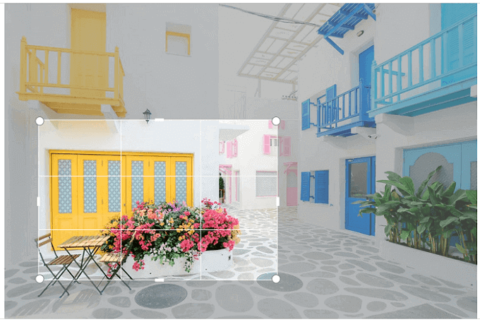
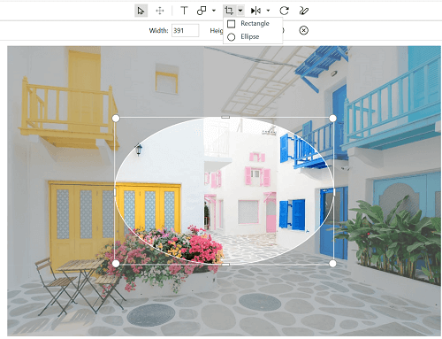
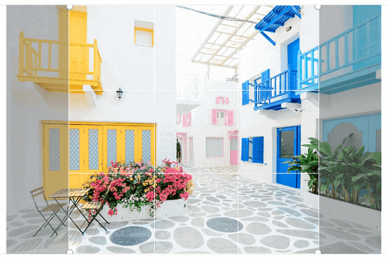
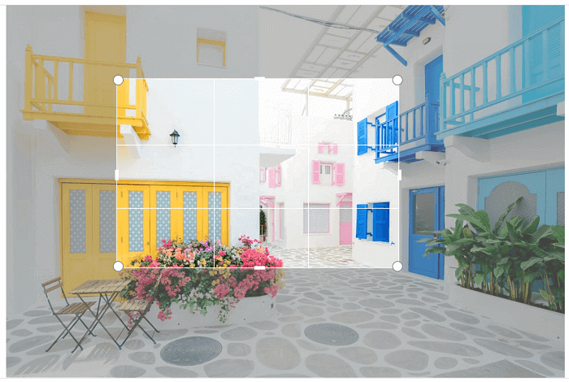
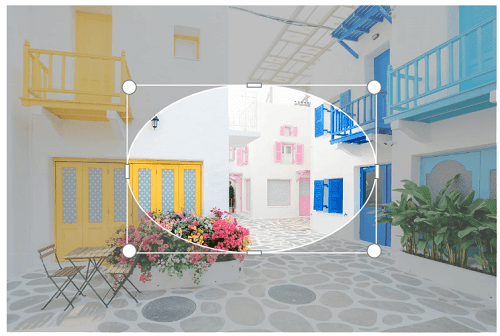

# Crop support in SfImageEditor

An image can be cropped using toolbar and programmatically.

## Toolbar cropping

To crop an image, click the `Crop` icon in the toolbar. Cropping handles will be added on the image. You can resize the handles to crop the required portion.

Upon clicking the `Crop` icon, sub toolbar will be displayed below the main toolbar. After selecting the cropping portion, click `OK` in the sub toolbar to crop that selected portion.

The sub toolbar contains the following the icons:

* Width - Specifies the width of the cropping area.
* Height - Specifies the height of the cropping area.
* OK - Crops the selected portion when clicking OK.
* Cancel - Removes the cropping handles when clicking Cancel.

N> On specifying width and height, cropping area is located from the left-top corner.

You can also perform continuous cropping on an image.

The following screenshot illustrates the area selected for cropping.

 

The following screenshot illustrates the image taken after performing cropping on the selected area.

 

An image can be cropped in rectangle and circle format, by default we have enabled the rectangle format in the toolbar. You can enable the circle format in the toolbar by using the drop-down button in crop icon.

 

## Programmatic cropping

Cropping can be done programmatically using  the following two methods in image editor:

* ToggleCropping - Selects the cropping area.
* Crop - Crops the selected area in an image.

### Toggle cropping

Toggle cropping method selects the cropping area based on the specified parameters.

### Crop area selection

The following method selects the full image area for cropping, and you can resize the image as needed.

 

 

editor.ToggleCropping();



 

The following method gets the ratio as the parameter to select the cropping area.

 

 

editor.ToggleCropping(3,1);



 

 

The following method gets the rect in terms of percentage to select the cropping area.

 

 

Rect rect = new Rect(20, 20, 50, 50);
editor.ToggleCropping(rect);



 

 

### Circle cropping

Specify the [`ToggleCropping`](https://help.syncfusion.com/cr/wpf/Syncfusion.UI.Xaml.ImageEditor.SfImageEditor.html#Syncfusion_UI_Xaml_ImageEditor_SfImageEditor_ToggleCropping) optional parameter is true as shown in the below code sample to enable the circle or elliptical format.

 

 

editor.ToggleCropping(new Rect(25, 25, 50, 50), true);



 

 

### Crop

After selecting the crop area, use the crop method in the image editor to crop the selected portion as demonstrated in the following method.

 

 

editor.Crop(new Rect(0, 0, 0, 0)



 

### Manual cropping

To manually select and crop the location, use the same Crop method, but specify the portion to be cropped in terms of rect as in the following code.

 

 

editor.Crop(new Rect(0, 0, 0, 0)



 

 

## See also

[How to crop an image based on the ratio in the image editor](https://www.syncfusion.com/kb/11225/how-to-crop-an-image-based-on-the-ratio-in-the-image-editor)