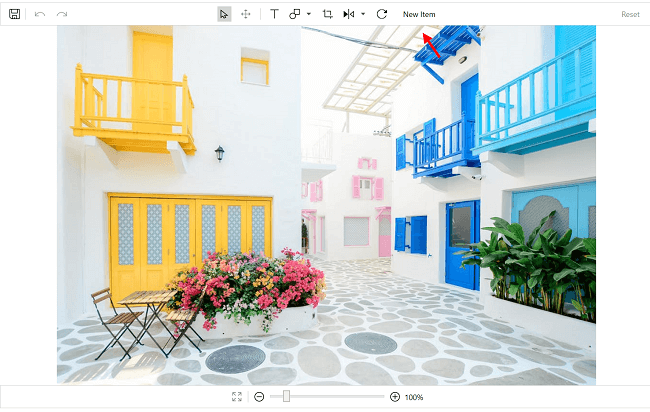

# Toolbar Customization

## Customization

### Visibility

Toolbar can be made visible or hidden using the `IsToolbarVisiblity` property in the [`ToolbarSettings`](https://help.syncfusion.com/cr/cref_files/wpf/Syncfusion.SfImageEditor.WPF~Syncfusion.UI.Xaml.ImageEditor.SfImageEditor~ToolbarSettings.html).

 

 

  <editor:SfImageEditor.ToolbarSettings>
        <editor:ToolbarSettings IsToolbarVisiblity="True" />
  </editor:SfImageEditor.ToolbarSettings>



 

editor.ToolbarSettings.IsToolbarVisibility = true;



 

### Add a item

You can add additional items to the toolbar and can perform your own operation. To add an additional item, specify the toolbar item, and add it in the ToolbarItems collection as demonstrated in following code snippet. You can specify your own template using the `IconTemplate` property in `ToolbarItem`.

 

 

  <Grid.Resources>
            <DataTemplate x:Key="template">
                <TextBlock Text="New Item"></TextBlock>
            </DataTemplate>
  </Grid.Resources>



 

editor.ToolbarSettings.ToolbarItems.Add(new ToolbarItem() { IconTemplate = grid.Resources["template"] as DataTemplate });



 

### Customization

You can change the [`Background`](https://help.syncfusion.com/cr/cref_files/wpf/Syncfusion.SfImageEditor.WPF~Syncfusion.UI.Xaml.ImageEditor.ToolbarSettings~Background.html) and [`BorderColor`](https://help.syncfusion.com/cr/cref_files/wpf/Syncfusion.SfImageEditor.WPF~Syncfusion.UI.Xaml.ImageEditor.ToolbarSettings~BorderColor.html) of the toolbar. Also, you can change the height of the main toolbar using the [`HeaderToolbarHeight`](https://help.syncfusion.com/cr/cref_files/wpf/Syncfusion.SfImageEditor.WPF~Syncfusion.UI.Xaml.ImageEditor.ToolbarSettings~HeaderToolbarHeight.html) property, and the height of the sub toolbar can be changed using the [`SubItemToolbarHeight`](https://help.syncfusion.com/cr/cref_files/wpf/Syncfusion.SfImageEditor.WPF~Syncfusion.UI.Xaml.ImageEditor.ToolbarSettings~SubItemToolbarHeight.html) property, and the footer toolbar height can be changed using the [`FooterToolbarHeight`](https://help.syncfusion.com/cr/cref_files/wpf/Syncfusion.SfImageEditor.WPF~Syncfusion.UI.Xaml.ImageEditor.ToolbarSettings~FooterToolbarHeight.html).

This can be done as in the following code snippet.

 

 

    <editor:SfImageEditor.ToolbarSettings>
                <editor:ToolbarSettings IsToolbarVisibility="True" HeaderToolbarHeight="36" 
                                        FooterToolbarHeight="36"  Background="#DEDEDE" BorderColor="Black"
                                        />
    </editor:SfImageEditor.ToolbarSettings>



 

 editor.ToolbarSettings.Background= (SolidColorBrush)new BrushConverter().ConvertFromString("#DEDEDE");
            editor.ToolbarSettings.BorderColor = new SolidColorBrush(Colors.Black);
            editor.ToolbarSettings.HeaderToolbarHeight = 36;
            editor.ToolbarSettings.FooterToolbarHeight = 36;
            editor.ToolbarSettings.IsToolbarVisibility = true;


 

 

## Events

### ToolbarItemSelected

This event occurs when an item in the toolbar is selected. `ToolbarItemSelectedEventArgs` is the parameter. You can control the selected item operation by setting the Cancel property to true. You can also get the information about the ToolbarItem.

 

 

  private void ToolbarSettings_ToolbarItemSelected(object sender, ToolbarItemSelectedEventArgs e)
        {          
           e.Cancel = true;
        }



 

 

## Image picker support

You can browse images in a local folder and load them in the Image Editor using the toolbar item browse icon. 

 

## Commands

Invoke commands from the custom toolbar to customize toolbar items of the image editor. Must set the `CommandTarget` while using the Command.

<table>
<tr>
<td>
Command  </td><td>
Description  </td></tr>
<tr>
<td>
BrowseImage  </td><td>
Browses the local folder to pick and load the image  to an image editor.  </td></tr>
<tr>
<td>
Save  </td><td>
Saves the edited image.  </td></tr>
<tr>
<td>
Undo  </td><td>
Reverses the last performed action.  </td></tr>
<tr>
<td>
Redo  </td><td>
Restores the actions carried out by Undo.  </td></tr>
<tr>
<td>
Reset  </td><td>
Clears all the editing done on the image and brings to an initial state.  </td></tr>
<tr>
<td>
ResetZoom  </td><td>
Resets the zooming applied to the image.  </td></tr>
<tr>
<td>
IncreaseZoom  </td><td>
Zoom In the image by increasing the zoom level from its current state.  </td></tr>
<tr>
<td>
DecreaseZoom  </td><td>
Zoom Out the image by decreasing the zoom level from its current state.  </td></tr>
<tr>
<td>
Select  </td><td>
Used to select the items such as Shapes, Text, Custom view added on the image.  </td></tr>
<tr>
<td>
Pan  </td><td>
Used to Pan the image when it is in zoomed state.  </td></tr>
</table>

This can be done as in the below code snippet.

 

 

    <Grid>
        <Grid.ColumnDefinitions>
            <ColumnDefinition Width="*"/>
            <ColumnDefinition Width="200"/>
        </Grid.ColumnDefinitions>
        <editor:SfImageEditor Grid.Column="0" x:Name="imageEditor" ImageSource="Assets\RoadView.jpeg">
            <editor:SfImageEditor.ToolbarSettings>
                <editor:ToolbarSettings IsToolbarVisiblity="False"></editor:ToolbarSettings>
            </editor:SfImageEditor.ToolbarSettings>
        </editor:SfImageEditor>
		
          <Button  Grid.Column="1" HorizontalAlignment="Center" VerticalAlignment="Center" Background="White"
                    Width="Auto" CommandTarget="{Binding ElementName=imageEditor}"
                    Content="Save" Command="{x:Static editor:ImageEditorCommands.Save}"></Button>
    </Grid>




 
