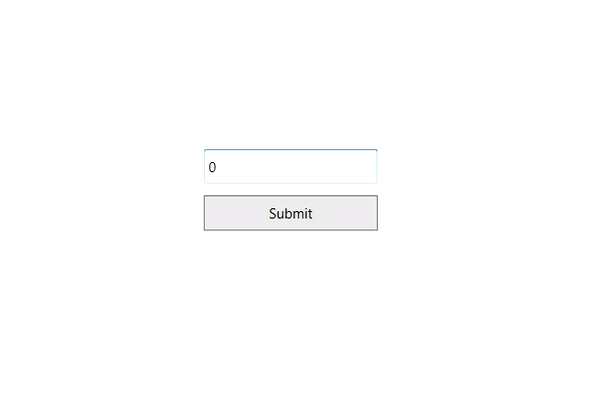

# Restriction or Validation in WPF IntegerTextBox

This section explains how to validate or restrict the [IntegerTextBox](https://help.syncfusion.com/cr/wpf/Syncfusion.Shared.Wpf~Syncfusion.Windows.Shared.IntegerTextBox.html) control value.

## Restrict the value within minimum and maximum value

The [Value](https://help.syncfusion.com/cr/wpf/Syncfusion.Shared.Wpf~Syncfusion.Windows.Shared.IntegerTextBox~Value.html) of the [IntegerTextBox](https://help.syncfusion.com/cr/wpf/Syncfusion.Shared.Wpf~Syncfusion.Windows.Shared.IntegerTextBox.html) can be restricted within the maximum and minimum limits. Once the value has reached the maximum or minimum value , the value does not exceed the limit. We can change the minimum and maximum limits by using the [MinValue](https://help.syncfusion.com/cr/wpf/Syncfusion.Shared.Wpf~Syncfusion.Windows.Shared.IntegerTextBox~MinValue.html) and [MaxValue](https://help.syncfusion.com/cr/wpf/Syncfusion.Shared.Wpf~Syncfusion.Windows.Shared.IntegerTextBox~MaxValue.html) properties.

You can choose when to validate the maximum and minimum limits while changing the values by using the [MinValidation](https://help.syncfusion.com/cr/cref_files/wpf/Syncfusion.Shared.Wpf~Syncfusion.Windows.Shared.EditorBase~MinValidation.html) and [MaxValidation](https://help.syncfusion.com/cr/cref_files/wpf/Syncfusion.Shared.Wpf~Syncfusion.Windows.Shared.EditorBase~MaxValidation.html) properties.

* `OnKeyPress` — When [MaxValidation](https://help.syncfusion.com/cr/cref_files/wpf/Syncfusion.Shared.Wpf~Syncfusion.Windows.Shared.EditorBase~MaxValidation.html) or [MinValidation](https://help.syncfusion.com/cr/cref_files/wpf/Syncfusion.Shared.Wpf~Syncfusion.Windows.Shared.EditorBase~MinValidation.html) properties value is  `OnKeyPress`, the value in the IntegerTextBox will be validated shortly after pressing a key. It is not possible to provide any invalid input at all and the value does not exceed the maximum and minimum limits.

* `OnLostFocus` - When [MaxValidation](https://help.syncfusion.com/cr/cref_files/wpf/Syncfusion.Shared.Wpf~Syncfusion.Windows.Shared.EditorBase~MaxValidation.html) or [MinValidation](https://help.syncfusion.com/cr/cref_files/wpf/Syncfusion.Shared.Wpf~Syncfusion.Windows.Shared.EditorBase~MinValidation.html) properties is `OnLostFocus`, the value in the IntegerTextBox is validated only when the IntegerTextBox loses the focus.  After validation, when the value of the IntegerTextBox is greater than the `MaxValue` or less than the `MinValue`, the value will be automatically set to `MaxValue` or `MinValue`.

* [MaxValueOnExceedMaxDigit](https://help.syncfusion.com/cr/cref_files/wpf/Syncfusion.Shared.Wpf~Syncfusion.Windows.Shared.EditorBase~MaxValueOnExceedMaxDigit.html) - When you give input greater than specified maximum limit, MaxValueOnExceedMaxDigit property will either  retain the old value or reset to maximum limit that is specified. For example, if `MaxValue` is set to 100 and you are trying to input 200. `Value` will changed to 100 when `MaxValueOnExceedMaxDigit` is `true` or 20 will be retained if `MaxValueOnExceedMaxDigit` is `false`.

* [MinValueOnExceedMinDigit](https://help.syncfusion.com/cr/cref_files/wpf/Syncfusion.Shared.Wpf~Syncfusion.Windows.Shared.EditorBase~MinValueOnExceedMinDigit.html) - When you give input less than specified minimum limit, `MinValueOnExceedMinDigit` property will either it should retain the old value or reset to minimum limit that is specified. For example, if `MinValue` is set to 200 and the `Value` is 205 and you are trying change the value to 20. `Value` will changed to 200 when `MinValueOnExceedMinDigit` is `true` or when `MinValueOnExceedMinDigit` is `false`, Old value 205 will be retained.

  N> `MaxValueOnExceedMinDigit` and `MinValueOnExceedMinDigit` properties will be enabled only when the `MaxValidation` and `MinValidation` is set to `OnKeyPress`.




<syncfusion:IntegerTextBox x:Name="integerTextBox" Width="150" MaxValue="100" MinValue="10"
                          MinValueOnExceedMinDigit="True" MaxValueOnExceedMaxDigit="True"
                          MinValidation="OnKeyPress" MaxValidation="OnLostFocus"/>




IntegerTextBox integerTextBox = new IntegerTextBox();
integerTextBox.Width = 100;
integerTextBox.Height = 25;
integerTextBox.MinValue = 10;
integerTextBox.MaxValue =100;
integerTextBox.MinValidation = MinValidation.OnKeyPress;
integerTextBox.MaxValidation = MaxValidation.OnLostFocus;
integerTextBox.MinValueOnExceedMinDigit = true;
integerTextBox.MaxValueOnExceedMaxDigit = true;




When `MinValidation` value is OnKeyPress, you cannot enter value less than the `MinValue`. If try to enter a value less than the `MinValue`, then the `MinValue` will set to the `Value` property because `MinValueOnExceedMinDigit` is set to `true`.

`MaxValidation` is set to OnLostFocus, so the `MaxValidation` will be performed only in the lost focus.

## Read only mode

The [IntegerTextBox](https://help.syncfusion.com/cr/wpf/Syncfusion.Shared.Wpf~Syncfusion.Windows.Shared.IntegerTextBox.html) doesn't allow the user input on application runtime when [IsReadOnly](https://docs.microsoft.com/en-us/dotnet/api/system.windows.controls.primitives.textboxbase.isreadonly?redirectedfrom=MSDN&view=netframework-4.7.2#System_Windows_Controls_Primitives_TextBoxBase_IsReadOnly) property is `true`. The user can still select text and display the cursor on the `IntegerTextBox` by setting the [IsReadOnlyCaretVisible](https://docs.microsoft.com/en-us/dotnet/api/system.windows.controls.primitives.textboxbase.isreadonlycaretvisible?view=netframework-4.8) property to `true`.




<syncfusion:IntegerTextBox x:Name="integerTextBox" IsReadOnly="True" Value="78" IsReadOnlyCaretVisible="True"/>




IntegerTextBox integerTextBox = new IntegerTextBox();
integerTextBox.Value = 78;
integerTextBox.IsReadOnly = true;
integerTextBox.IsReadOnlyCaretVisible = true;




## Customize the behavior for invalid value

You can customize how the [IntegerTextBox](https://help.syncfusion.com/cr/wpf/Syncfusion.Shared.Wpf~Syncfusion.Windows.Shared.IntegerTextBox.html) behaves when you enter a value which you consider as not valid using [InvalidValueBehavior](https://help.syncfusion.com/cr/cref_files/wpf/Syncfusion.Shared.Wpf~Syncfusion.Windows.Shared.IntegerTextBox~InvalidValueBehavior.html) property. It can be customized by below values,

 * `DisplayErrorMessage` - Shows a MessageBox with message" String validation failed" after focus is lost from IntegerTextBox.

 * `None` - No behavior is implemented.

 * `ResetValue` - Resets the entered value to 0 after focus is lost.




<syncfusion:IntegerTextBox x:Name="integerTextBox1" Margin="10"
                           Width="150" Height="30"
                           ValueChanged="IntegerTextBox1_ValueChanged" />




private void IntegerTextBox1_ValueChanged(DependencyObject d, DependencyPropertyChangedEventArgs e)
{
  // To check and set the behavior for a specific value in IntegerTextBox
  if (integerTextBox1.Value == 30)
  {
    integerTextBox1.InvalidValueBehavior = InvalidInputBehavior.DisplayErrorMessage;
  }
  else
  {
    integerTextBox1.InvalidValueBehavior = InvalidInputBehavior.None;
  }
}




