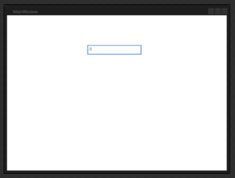
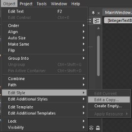
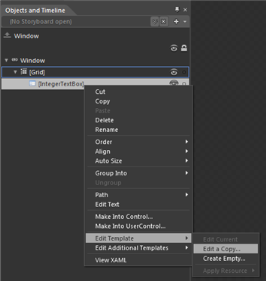

# Appearance      

## Setting VisualStyle for IntegerTextBox

The appearance of the IntegerTextBox control can be customized by using the VisualStyle property. The following are the various built-in visual styles for IntegerTextBox control.

* Blend
* Office2003
* Office2007Blue
* Office2007Black
* Office2007Silver
* ShinyBlue
* ShinyRed
* SyncOrange
* VS2010
* Metro
* Transparent
## Blendability

You can edit the IntegerTextBox Template to give a nice look and feel by using Expression Blend.

The steps to edit the IntegerTextBox Template by using Expression Blend are as follows:

1. Create a simple WPF application in Expression Blend.
2. Drag and drop the IntegerTextBox into the application from the Assets tab.

{  | markdownify }
{:.image }

3. After creating the IntegerTextBox, select the IntegerTextBox and navigate to Object > Edit Style > Edit a Copy, to edit the Template of the IntegerTextBox.

{  | markdownify }
{:.image }

Another way to edit the Template is as follows:

4. In Object and Timeline, right-click the IntegerTextBox control and select the Edit Template option, as displayed below. 

{  | markdownify }
{:.image }

This will open a dialog (below) where you can give your style a name and define exactly where you’d like to store it.

{  | markdownify }
{:.image }

The result of these steps is an XAML, which is placed within your application. This XAML represents the default style for the Integer Textbox.

<syncfusion:IntegerTextBox Width="150" Height="25" VerticalAlignment="Top" 

                           Style="{StaticResource IntegerTextBoxStyle1}"/>

All template items can now be found in the Objects and Timeline window.

{  | markdownify }
{:.image }

Now you can replace the existing Template setter and Triggers with your own creation. In the Triggers tab you can select the Trigger and customize it as you want.

{  | markdownify }
{:.image }

Here is a simple example to customize the UnFocused state of the IntegerTextBox: 

&lt;Trigger Property="IsFocused" Value="False"&gt;

    &lt;Setter Property="Background" TargetName="Border" Value="LightGray"/&gt;

&lt;/Trigger&gt;

When a control lost the Focus, the Background color of the IntegerTextBox will change to LightGray. Similarly, you can customize every state and property in Expression Blend.

{  | markdownify }
{:.image }

See Also

Creating an IntegerTextBox by using Expression Blend

