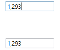

# Getting Started

## Assembly deployment

Refer to the [control dependencies](https://help.syncfusion.com/wpf/control-dependencies#integertextbox) section to get the list of assemblies or NuGet package that needs to be added as a reference to use the control in any application.

You can find more details about installing the NuGet packages in a WPF application in the following link:

[How to install nuget packages](https://help.syncfusion.com/wpf/nuget-packages)

## Create a simple application with IntegerTextBox

You can create a WPF application with the IntegerTextBox control using the following steps:

## Create a project

Create a new WPF project in Visual Studio to display the IntegerTextBox with functionalities.

## Add control through designer

The IntegerTextBox control can be added to an application by dragging it from the toolbox to a designer view. The **Syncfusion.Shared.WPF** assembly reference will be added automatically to the project.

## Add control manually in XAML

To add the control manually in XAML, follow the given steps:

1.	Add the **Syncfusion.Shared.WPF** assembly reference to the project.
2.	Import Syncfusion WPF schema **http://schemas.syncfusion.com/wpf** in the XAML page.
3.	Declare the IntegerTextBox control in the XAML page.



<Window xmlns="http://schemas.microsoft.com/winfx/2006/xaml/presentation"
        xmlns:x="http://schemas.microsoft.com/winfx/2006/xaml"
        xmlns:syncfusion="http://schemas.syncfusion.com/wpf" 
        x:Class="IntegerTextBoxSample.MainWindow"
        Title="IntegerTextBox Sample" Height="350" Width="525">
    <Grid>
        <!--Adding IntegerTextBox control -->
       <syncfusion:IntegerTextBox x:Name="integerTextBox" Width="100" Height="20" VerticalAlignment="Center" HorizontalAlignment="Center"/>
    </Grid>
</Window>



## Add control manually in C\#

To add the control manually in C#, follow the given steps:

1. Add the **Syncfusion.Shared.WPF** assembly reference to the project. 
2. Import the IntegerTextBox namespace **using Syncfusion.Windows.Shared;**.
3. Create an IntegerTextBox instance, and add it to the window.



using Syncfusion.Windows.Shared;
namespace IntegerTextBoxSample
{
    /// 

    /// Interaction logic for MainWindow.xaml
    /// 

    public partial class MainWindow : Window
    {
        public MainWindow()
        {
            InitializeComponent();
            //Creating an instance of IntegerTextBox control
            IntegerTextBox integerTextBox = new IntegerTextBox();
            //Adding IntegerTextBox as window content
            this.Content = integerTextBox;
        } 
    }
}



## Bind value

Data binding is the process of establishing a connection between the application UI and business logic. Data binding can be unidirectional (source -> target or target <- source) or bidirectional (source <-> target). You can bind data to the IntegerTextBox using the [Value](https://help.syncfusion.com/cr/wpf/Syncfusion.Shared.Wpf~Syncfusion.Windows.Shared.IntegerTextBox~Value.html) property. Refer to the [Data binding](https://help.syncfusion.com/wpf/integertextbox/binding-support) section for more details.



<StackPanel>
<syncfusion:IntegerTextBox x:Name="integerTextBox1" Width="150" Margin="10"/>
<syncfusion:IntegerTextBox x:Name="integerTextBox2" Width="150" Margin="10" Value="{Binding ElementName=integerTextBox1,Path=Value,Mode=TwoWay}"/>
</StackPanel>



## Setting minimum and maximum values

You can set the minimum and maximum values by setting the [MinVal](https://help.syncfusion.com/cr/wpf/Syncfusion.Shared.Wpf~Syncfusion.Windows.Shared.IntegerTextBox~MinValue.html) and [MaxVal](https://help.syncfusion.com/cr/wpf/Syncfusion.Shared.Wpf~Syncfusion.Windows.Shared.IntegerTextBox~MaxValue.html) properties of the IntegerTextBox.



<syncfusion:IntegerTextBox x:Name="integerTextBox" Height="25" Width="100" Value="100" MinValue="-999" MaxValue="999"/>


//Setting minimum value
integerTextBox.MinValue = -999;
//Setting maximum value
integerTextBox.MaxValue = 999;



## Number format

You can customize the number format by setting either the [NumberFormat](https://help.syncfusion.com/cr/wpf/Syncfusion.Shared.Wpf~Syncfusion.Windows.Shared.EditorBase~NumberFormat.html) property or the [NumberGroupSeparator](https://help.syncfusion.com/cr/wpf/Syncfusion.Shared.Wpf~Syncfusion.Windows.Shared.IntegerTextBox~NumberGroupSeparator.html) and the [NumberGroupSizes](https://help.syncfusion.com/cr/wpf/Syncfusion.Shared.Wpf~Syncfusion.Windows.Shared.IntegerTextBox~NumberGroupSizes.html) property of IntegerTextBox.



<!--Number Format -->
<syncfusion:IntegerTextBox x:Name="integerTextBox" Grid.Row="1" Height="25" Width="150" Culture="en-US" Value="123456789012345" NumberGroupSeparator="/"/>


Syncfusion.Windows.Shared.IntegerTextBox integerTextBox = new Syncfusion.Windows.Shared.IntegerTextBox();
integerTextBox.Width = 150;
integerTextBox.Height = 25;
integerTextBox.Value = 1234567;
integerTextBox.Culture = new System.Globalization.CultureInfo("en-US");
integerTextBox.NumberFormat = new System.Globalization.NumberFormatInfo() 
{ 
NumberGroupSeparator = "/" 
};



