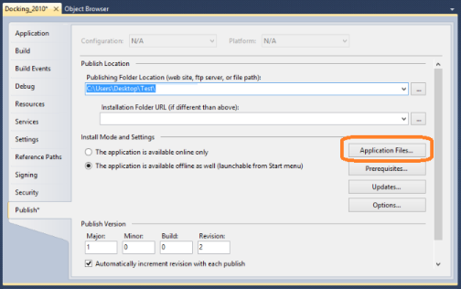
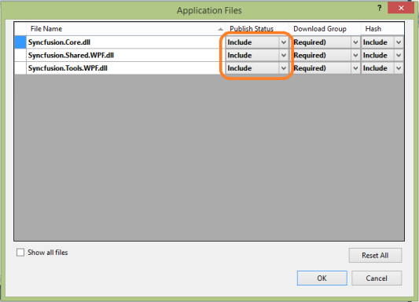
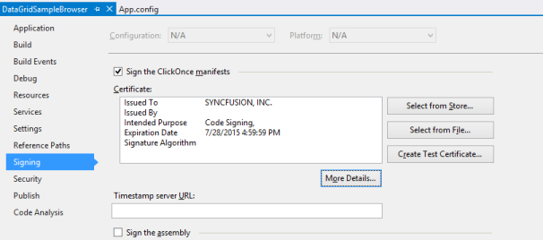
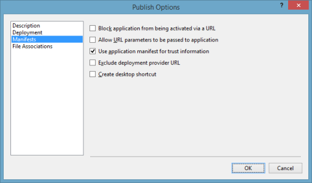

# Deployment

## Control Dependencies

The following table illustrates the Control’s assembly and its dependencies.

### List of Control’s assembly and its dependencies

<table>
<tr>
<th>
Controls</th><th>
Assembly</th><th>
Dependencies</th></tr>
<tr>
<td>
SfDataGrid </td><td>
Syncfusion.SfGrid.WPF</td><td>
Syncfusion.Data.WPFSyncfusion.Shared.WPFSyncfusion.Core </td></tr>
<tr>
<td>
SfDataPager</td><td>
Syncfusion.SfGrid.Wpf</td><td>
Syncfusion.Data.WpfSyncfusion.Core </td></tr>
<tr>
<td>
SfGridTree</td><td>
Syncfusion.Grid.Wpf</td><td>
Syncfusion.GridCommon.WpfSyncfusion.Linq.BaseSyncfusion.Core </td></tr>
<tr>
<td>
Spreadsheet</td><td>
Syncfusion.Spreadsheet.WPF</td><td>
Syncfusion.Grid.WPFSyncfusion.GridCommon.WPFSyncfusion.Linq.BaseSyncfusion.Shared.WPFSyncfusion.Tools.WPFSyncfusion.XlsIO.BaseSyncfusion.Core</td></tr>
<tr>
<td>
PropertyGrid</td><td>
Syncfusion.PropertyGrid.WPF</td><td>
Syncfusion.Tools.WPF, Syncfusion.Shared.WPFSyncfusion.Core</td></tr>
<tr>
<td>
Diagram</td><td>
Syncfusion.Diagram.WPF</td><td>
Syncfusion.Shared.WPFSyncfusion.Core</td></tr>
<tr>
<td>
Gantt</td><td>
Syncfusion.Gantt.WPF</td><td>
Syncfusion.Grid.WPFSyncfusion.GridCommon.WPFSyncfusion.Shared.WPFSyncfusion.ProjIO.BaseSyncfusion.Core</td></tr>
<tr>
<td>
SfBarcode</td><td>
Syncfusion.SfBarcode.WPF</td><td>
Syncfusion.Core</td></tr>
<tr>
<td>
SfBulletGraph</td><td>
Syncfusion.SfBulletGraph.WPF</td><td>
Syncfusion.Core</td></tr>
<tr>
<td>
SfChart</td><td>
Syncfusion.SfChart.WPF</td><td>
Syncfusion.Core</td></tr>
<tr>
<td>
SfGauge</td><td>
Syncfusion.SfGauge.WPF</td><td>
Syncfusion.SfShared.WPFSyncfusion.Core</td></tr>
<tr>
<td>
SfMaps</td><td>
Syncfusion.SfMaps.WPF</td><td>
Syncfusion.RichTextBoxAdv.WPFSyncfusion.Shared.WPFSyncfusion.Core</td></tr>
<tr>
<td>
SfSchedule </td><td>
Syncfusion.SfSchedule.WPF</td><td>
Syncfusion.SfRadialMenu.WpfSyncfusion.SfShared.WpfSyncfusion.Shared.WpfSyncfusion.Core</td></tr>
<tr>
<td>
SfAreaSparkline</td><td>
Syncfusion.SfChart.WPF</td><td>
Syncfusion.Core</td></tr>
<tr>
<td>
SfLineSparkline</td><td>
Syncfusion.SfChart.WPF</td><td>
Syncfusion.Core</td></tr>
<tr>
<td>
SfColumnSparkline</td><td>
Syncfusion.SfChart.WPF</td><td>
Syncfusion.Core</td></tr>
<tr>
<td>
SfWinLossSparkline</td><td>
Syncfusion.SfChart.WPF</td><td>
Syncfusion.Core</td></tr>
<tr>
<td>
SfTreeMap</td><td>
Syncfusion.SfTreeMap.WPF</td><td>
Syncfusion.Core</td></tr>
<tr>
<td>
Carousel</td><td>
Syncfusion.Shared.WPF</td><td>
Syncfusion.Core</td></tr>
<tr>
<td>
CardView</td><td>
Syncfusion.Tools..WPF</td><td>
Syncfusion.Core</td></tr>
<tr>
<td>
DockingManager</td><td>
Syncfusion.Tools.WPF</td><td>
Syncfusion.Shared.WpfSyncfusion.Core</td></tr>
<tr>
<td>
DocumentContainer</td><td>
Syncfusion.Tools.WPF</td><td>
Syncfusion.Shared.WpfSyncfusion.Core</td></tr>
<tr>
<td>
Ribbon</td><td>
Syncfusion.Tools.WPF</td><td>
Syncfusion.Shared.WpfSyncfusion.Core</td></tr>
<tr>
<td>
SfChromelessWindow</td><td>
Syncfusion.Shared.WPF</td><td>
Syncfusion.Core</td></tr>
<tr>
<td>
TabSplitter</td><td>
Syncfusion.Tools.WPF</td><td>
Syncfusion.Shared.WpfSyncfusion.Core</td></tr>
<tr>
<td>
TileView</td><td>
Syncfusion.Shared.WPF</td><td>
Syncfusion.Core</td></tr>
<tr>
<td>
AutoComplete</td><td>
Syncfusion.Tools.WPF</td><td>
Syncfusion.Shared.WPFSyncfusion.Core</td></tr>
<tr>
<td>
ButtonAdv</td><td>
Syncfusion.Shared.WPF</td><td>
Syncfusion.Core</td></tr>
<tr>
<td>
CalendarEdit</td><td>
Syncfusion.Shared.WPF</td><td>
Syncfusion.Core</td></tr>
<tr>
<td>
CheckedListBox</td><td>
Syncfusion.Tools.WPF</td><td>
Syncfusion.Shared.WPFSyncfusion.Core</td></tr>
<tr>
<td>
ColorPicker</td><td>
Syncfusion.Shared.WPF</td><td>
Syncfusion.Core</td></tr>
<tr>
<td>
ColorPickerPalette</td><td>
Syncfusion.Shared.WPF</td><td>
Syncfusion.Core</td></tr>
<tr>
<td>
ComboBoxAdv</td><td>
Syncfusion.Shared.WPF</td><td>
Syncfusion.Core</td></tr>
<tr>
<td>
DateTimeEdit</td><td>
Syncfusion.Shared.WPF</td><td>
Syncfusion.Core</td></tr>
<tr>
<td>
DoubleTextBox</td><td>
Syncfusion.Shared.WPF</td><td>
Syncfusion.Core</td></tr>
<tr>
<td>
DropDownButtonAdv</td><td>
Syncfusion.Shared.WPF</td><td>
Syncfusion.Core</td></tr>
<tr>
<td>
RichTextBoxAdv</td><td>
RichTextBoxAdv.WPF</td><td>
WPF 3.5 and 4.0 Framework: Syncfusion.Compression.Base Syncfusion.Core Syncfusion.DocIO.ClientProfile Syncfusion.RichTextDocIOParser.Wpf Syncfusion.RichTextRibbon.WPFSyncfusion.Shared.WpfSyncfusion.Tools.WPF WPF 4.5 and 4.5.1 Framework: Syncfusion.Compression.Base Syncfusion.Core Syncfusion.DocIO.Base Syncfusion.RichTextDocIOParser.Wpf Syncfusion.RichTextRibbon.WPFSyncfusion.Shared.Wpf Syncfusion.Tools.WPF</td></tr>
<tr>
<td>
SfCalculator</td><td>
Syncfusion.SfInput.WPF</td><td>
Syncfusion.SfShared.WPFSyncfusion.Core</td></tr>
<tr>
<td>
SfDomainUpDown</td><td>
Syncfusion.SfInput.WPF</td><td>
Syncfusion.SfShared.WPFSyncfusion.Core</td></tr>
<tr>
<td>
SfMaskedEdit</td><td>
Syncfusion.SfInput.WPF</td><td>
Syncfusion.SfShared.WPFSyncfusion.Core</td></tr>
<tr>
<td>
SfRadialSlider</td><td>
Syncfusion.SfRadialMenu.WPF</td><td>
Syncfusion.SfShared.WPFSyncfusion.Core</td></tr>
<tr>
<td>
SfRangeSlider</td><td>
Syncfusion.SfInput.WPF</td><td>
Syncfusion.SfShared.WPFSyncfusion.Core</td></tr>
<tr>
<td>
SfRating</td><td>
Syncfusion.SfInput.WPF</td><td>
Syncfusion.SfShared.WPFSyncfusion.Core</td></tr>
<tr>
<td>
SfTextboxExt</td><td>
Syncfusion.SfInput.WPF</td><td>
Syncfusion.SfShared.WPFSyncfusion.Core</td></tr>
<tr>
<td>
SplitButton</td><td>
Syncfusion.Shared.WPF</td><td>
Syncfusion.Core</td></tr>
<tr>
<td>
TimespanEdit</td><td>
Syncfusion.Shared.WPF</td><td>
Syncfusion.Core</td></tr>
<tr>
<td>
GroupBar</td><td>
Syncfusion.Tools.WPF</td><td>
Syncfusion.Shared.WpfSyncfusion.Core</td></tr>
<tr>
<td>
HierarchyNavigator</td><td>
Syncfusion.Tools.WPF</td><td>
Syncfusion.Shared.WpfSyncfusion.Core</td></tr>
<tr>
<td>
MenuAdv</td><td>
Syncfusion.Shared.WPF</td><td>
Syncfusion.Core</td></tr>
<tr>
<td>
SfColorPalette</td><td>
Syncfusion.SfShared.WPF</td><td>
Syncfusion.Core</td></tr>
<tr>
<td>
SfDateTimeRangeNavigator</td><td>
Syncfusion.SfChart.WPF</td><td>
Syncfusion.Core</td></tr>
<tr>
<td>
SfTreeNavigator</td><td>
Syncfusion.SfTreeNavigator.WPF</td><td>
Syncfusion.SfShared.WPFSyncfusion.Core</td></tr>
<tr>
<td>
TabControlExt</td><td>
Syncfusion.Tools.WPF</td><td>
Syncfusion.Shared.WPFSyncfusion.Core</td></tr>
<tr>
<td>
TabNavigation</td><td>
Syncfusion.Tools.WPF</td><td>
Syncfusion.Shared.WPFSyncfusion.Core</td></tr>
<tr>
<td>
TaskBar</td><td>
Syncfusion.Tools.WPF</td><td>
Syncfusion.Shared.WPFSyncfusion.Core</td></tr>
<tr>
<td>
ToolBarAdv</td><td>
Syncfusion.Shared.WPF</td><td>
Syncfusion.Core</td></tr>
<tr>
<td>
TreeViewAdv</td><td>
Syncfusion.Tools.WPF</td><td>
Syncfusion.Shared.WPFSyncfusion.Core</td></tr>
<tr>
<td>
NotifyIcon</td><td>
Syncfusion.Tools.WPF</td><td>
Syncfusion.Shared.WPFSyncfusion.Core</td></tr>
<tr>
<td>
SfBusyIndicator</td><td>
Syncfusion.SfBusyIndicator.WPF</td><td>
Syncfusion.SfShared.WPFSyncfusion.Core</td></tr>
<tr>
<td>
SfHubTile</td><td>
Syncfusion.SfShared WPF</td><td>
Syncfusion.Core</td></tr>
<tr>
<td>
SfRadialMenu</td><td>
Syncfusion.SfRadialMenu.WPF</td><td>
Syncfusion.SfShared.WPFSyncfusion.Core</td></tr>
<tr>
<td>
SfColorPalette</td><td>
Syncfusion.SfColorPalette.WPF</td><td>
Syncfusion.SfShared.WPFSyncfusion.Core</td></tr>
<tr>
<td>
SfBusyIndicator</td><td>
Syncfusion.SfBusyIndicator.WPF</td><td>
Syncfusion.SfShared.WPFSyncfusion.Core</td></tr>
<tr>
<td>
SfHubTile</td><td>
Syncfusion.SfHubTile.WPF</td><td>
Syncfusion.SfShared.WPFSyncfusion.Core</td></tr>
<tr>
<td>
Calculate</td><td>
Calculate.WPF</td><td>
Syncfusion.Calculate.BaseSyncfusion.Core</td></tr>
<tr>
<td>
SkinManager</td><td>
Syncfusion.Shared.WPF</td><td>
Syncfusion.Core</td></tr>
<tr>
<td>
SpellChecker</td><td>
Syncfusion.Shared.WPF</td><td>
Syncfusion.Core</td></tr>
<tr>
<td>
Wizard</td><td>
Syncfusion.Tools.WPF</td><td>
Syncfusion.Shared.WpfSyncfusion.Core</td></tr>
<tr>
<td>
DocIO</td><td>
Syncfusion.DocIO.Base</td><td>
Syncfusion.Compression.BaseSyncfusion.DocToPdfConverter.BaseSyncfusion.Pdf.BaseSyncfusion.Core</td></tr>
<tr>
<td>
PDF</td><td>
Syncfusion.Pdf.base</td><td>
Syncfusion.Compression.BaseSyncfusion.CoreSyncfusion.HtmlConverter.Base</td></tr>
<tr>
<td>
PDFViewer</td><td>
Syncfusion.PdfViewer.Wpf</td><td>
Syncfusion.Compression.BaseSyncfusion.CoreSyncfusion.Pdf.BaseSyncfusion.Shared.Wpf</td></tr>
<tr>
<td>
XlsIO</td><td>
Syncfusion.XlsIO.Base</td><td>
Syncfusion.Compression.BaseSyncfusion.ExcelToPdfConverter.BaseSyncfusion.ExcelChartToImageConverter.BaseSyncfusion.Pdf.BaseSyncfusion.SfChart.WPFSyncfusion.Shared.WPFSyncfusion.Core</td></tr>
<tr>
<td>
Presentation</td><td>
Syncfusion.Presentation.Base</td><td>
Syncfusion.CoreSyncfusion.Compression.Base Syncfusion.OfficeChart.BaseSyncfusion.OfficeChartToImageConverter.BaseSyncfusion.SfChart.WpfSyncfusion.PresentationToPdfConverter.BaseSyncfusion.Pdf.Base</td></tr>
<tr>
<td>
ReportDesigner</td><td>
Syncfusion.ReportDesigner.WPF</td><td>
Syncfusion.Chart.WpfSyncfusion.Gauge.WPFSyncfusion.Grid.WpfSyncfusion.GridCommon.WpfSyncfusion.Linq.BaseSyncfusion.SfMaps.WPFSyncfusion.Shared.WpfSyncfusion.Tools.WpfSyncfusion.PropertyGrid.WpfSyncfusion.Compression.BaseSyncfusion.DocIO.BaseSyncfusion.Pdf.BaseSyncfusion.XlsIO.BaseSyncfusion.ReportControls.WpfSyncfusion.ReportWriter.BaseSyncfusion.ReportViewer.WpfSyncfusion.Core</td></tr>
<tr>
<td>
ReportWriter</td><td>
Syncfusion.ReportWriter.Base</td><td>
Syncfusion.Chart.WpfSyncfusion.Gauge.WPFSyncfusion.Grid.WpfSyncfusion.GridCommon.WpfSyncfusion.Linq.BaseSyncfusion.SfMaps.WPFSyncfusion.Shared.WpfSyncfusion.Compression.BaseSyncfusion.DocIO.BaseSyncfusion.Pdf.BaseSyncfusion.XlsIO.BaseSyncfusion.ReportControls.WpfSyncfusion.Core</td></tr>
<tr>
<td>
ReportViewer</td><td>
Syncfusion.ReportViewer.WPF</td><td>
Syncfusion.Chart.WpfSyncfusion.Gauge.WPFSyncfusion.Grid.WpfSyncfusion.GridCommon.WpfSyncfusion.Linq.BaseSyncfusion.SfMaps.WPFSyncfusion.Shared.WpfSyncfusion.Compression.BaseSyncfusion.DocIO.BaseSyncfusion.Pdf.BaseSyncfusion.XlsIO.BaseSyncfusion.ReportControls.WpfSyncfusion.ReportWriter.BaseSyncfusion.Core</td></tr>
<tr>
<td>
OlapChart</td><td>
Syncfusion.OlapChart.WPF</td><td>
Syncfusion.Chart.WPFSyncfusion.CoreSyncfusion.Olap.BaseSyncfusion.OlapShared.WPFSyncfusion.Shared.WPFSyncfusion.Tools.WPFSyncfusion.Linq.Base</td></tr>
<tr>
<td>
OlapClient</td><td>
Syncfusion.OlapClient.WPF</td><td>
Syncfusion.Chart.WPFSyncfusion.Core    Syncfusion.Grid.WPFSyncfusion.GridCommon.WPSyncfusion.Linq.BaseSyncfusion.Olap.BaseSyncfusion.OlapChart.WPFSyncfusion.OlapChartConverter.WPFSyncfusion.OlapGrid.WPFSyncfusion.OlapGridCommon.WPFSyncfusion.OlapGridConverter.WPFSyncfusion.OlapShared.WPFSyncfusion.OlapTools.WPFSyncfusion.Shared.WPFSyncfusion.Tools.WPF</td></tr>
<tr>
<td>
OlapGauge</td><td>
Syncfusion.OlapGauge.WPF</td><td>
Syncfusion.Gauge.WPFSyncfusion.Shared.WPFSyncfusion.Olap.BaseSyncfusion.OlapShared.WPFSyncfusion.Core</td></tr>
<tr>
<td>
OlapGrid</td><td>
Syncfusion.OlapGrid.WPF</td><td>
Syncfusion.CoreSyncfusion.Grid.WpfSyncfusion.GridCommon.WPFSyncfusion.Linq.BaseSyncfusion.Olap.BaseSyncfusion.OlapGridCommon.WPFSyncfusion.OlapShared.WPFSyncfusion.Shared.WPFSyncfusion.Tools.WPFSyncfusion.Linq.Base</td></tr>
<tr>
<td>
PivotGrid</td><td>
Syncfusion.PivotAnalysis.WPF</td><td>
Syncfusion.Grid.WPFSyncfusion.GridCommon.WPFSyncfusion.Shared.WPFSyncfusion.PivotAnalysis.BaseSyncfusion.Linq.BaseSyncfusion.Core</td></tr>
</table>

## ClickOnce Deployment

While processing [ClickOnce](https://msdn.microsoft.com/en-us/library/ms996413.aspx) deployment for publishing an applications with Syncfusion WPF component, change the Publish Status option of the Syncfusion Assemblies as “Include”.

Selecting Application Files for changing the status
{:.caption}

Publish Status option changed as Include
{:.caption}

### ClickOnce signing process

Before publishing a ClickOnce application, sign to ensure whether its fully trusted, so that you can authenticate the information. The following steps are used for signing a ClickOnce application.

Signing ClickOnce involves two steps,

1. Signing the application manifest
2. Signing application executable

### Signing the manifest

Navigate to project properties and select Signing tab. In the tab check “Sign the ClickOnce manifests” and select “Select From File” option and sign the application with the attached .pfx file.

 ClickOnce signing
 {:.caption}

In the Publish tab, click “Options” and in the publish options dialog check “Use application manifest for trust information” under Manifest as in the following screenshot.

Publish options dialog box
{:caption}

N> Before publishing, install the attached certificate in your machine and also follow step 2. Follow the following steps for installing certificate in your machine.

N>
 
 1. Press Windows + R and type “certmgr.msc” and press enter that opens certificate manager.
 2. Right click the “Trusted Root certification Authorities” and navigate to All Tasks -> Import. Now import the_ .pfx _to “Trusted Root certification Authorities”. It displays a warning for first time. Press Yes to continue the importing.

### Signing EXE

The above process signs only deployment manifest. To sign the application executable, refer to the following steps.

You can sign the application executable by using the Post-build command and use the signtool.exe as in the following command. 

"C:\Program Files (x86)\Microsoft SDKs\Windows\v7.1A\Bin\signtool.exe" sign /f "$(ProjectDir)syncfusion.pfx" /p Coolcomp299 /v "$(ProjectDir)obj\x86\$(ConfigurationName)\DataGridSampleBrowser.exe"

N> Now,sign the EXE inside obj folder and Syncfusion.pfx file placed inside Project directory.

