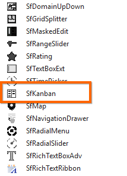
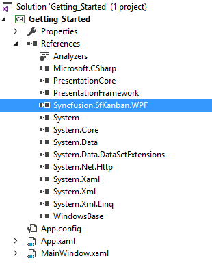
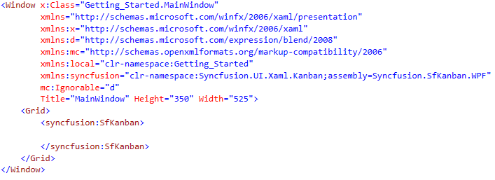
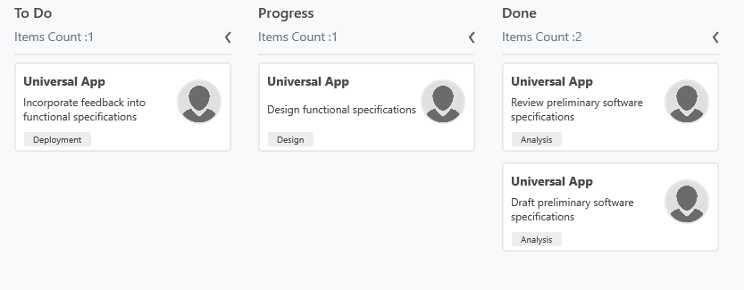
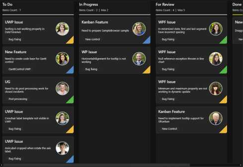

# Getting Started with WPF Kanban Board (SfKanban)

The following section provides an assistance to create a simple Kanban application and to configure it. 

## Adding assembly reference

1. Open the Add Reference window from your project
2. Choose Assemblies -> Extensions -> Syncfusion.SfKanban.WPF

N> This window differs for the Visual Basic project.

## Create a simple Kanban

In this walk through, you will create a new application that contains the SfKanban which includes the below topics.

* Adding SfKanban 
* Create data model
* Binding data
* Defining columns
* Working with Workflows
* Work In-Progress Limit

### Adding SfKanban

1. Add the required assembly references to the project as discussed in the Reference Essential Studio Components in your Solution section.
2. Add the “Syncfusion.UI.Xaml.Kanban” namespace to the application as shown below.




xmlns:syncfusion="clr-namespace:Syncfusion.UI.Xaml.Kanban;assembly=Syncfusion.SfKanban.WPF"



using Syncfusion.UI.Xaml.Kanban;




3. Create an instance of SfKanban control.




<syncfusion:SfKanban>

</syncfusion:SfKanban>




SfKanban kanban = new SfKanban();





### Adding SfKanban from toolbox

Drag and drop the Kanban control from the toolbox to your application.

Now the Syncfusion.SfKanban.WPF reference is added to the application references and the xmlns namespace code is generated in MainWindow.xaml as below.

### Create data model

You need to create a collection of KanbanModel objects for populating SfKanban.


   
    public class TaskDetails
    {
        public TaskDetails()
        {

            Tasks = new ObservableCollection<KanbanModel>();

            Tasks.Add(new KanbanModel()
            {

                Title = "Universal App",

                ID = "27654",

                Description = "Incorporate feedback into functional specifications",

                Category = "Open",

                ColorKey = "Low",

                Tags = new string[] { "Deployment" },

                ImageURL = new Uri("/images/icon.jpg", UriKind.RelativeOrAbsolute )
            });

            Tasks.Add(new KanbanModel()
            {

                Title = "Universal App",

                ID = "29477",

                Description = "Design functional specifications",

                Category = "In Progress",

                ColorKey = "Normal",

                Tags = new string[] { "Design" },

                ImageURL = new Uri("/images/icon.jpg", UriKind.RelativeOrAbsolute )
            });

            Tasks.Add(new KanbanModel()
            {
                Title = "Universal App",

                ID = "25678",

                Description = "Review preliminary software specifications",

                Category = "Done",

                ColorKey = "Low",

                Tags = new string[] { "Analysis" },

                ImageURL = new Uri("/images/icon.jpg", UriKind.RelativeOrAbsolute )
            });

            Tasks.Add(new KanbanModel()
            {
                Title = "Universal App",

                ID = "6593",

                Description = "Draft preliminary software specifications",

                Category = "Review",

                ColorKey = "High",

                Tags = new string[] { "Analysis" },

                ImageURL = new Uri("/images/icon.jpg", UriKind.RelativeOrAbsolute )

            });
        }
        public ObservableCollection<KanbanModel> Tasks { get; set; }
    }



### Binding data

In order to bind the data source of the SfKanban, set ItemsSource property as shown below.





<syncfusion:SfKanban ItemsSource="{Binding Tasks}" />





SfKanban kanban = new SfKanban()
{
    ItemsSource = new TaskDetails().Tasks
};





### Defining columns

By default, we need to define the columns manually by adding the KanbanColumn object to the [`Columns`](https://help.syncfusion.com/cr/wpf/Syncfusion.UI.Xaml.Kanban.SfKanban.html#Syncfusion_UI_Xaml_Kanban_SfKanban_Columns) collection property in SfKanban.

ItemsSource which was bound to the Kanban will be added to the respective columns using ColumnMappingPath property in SfKanban and Categories property in KanbanColumn.

We need to set the required property name to ColumnMappingPath which will be essential to add the data to the respective columns.

In this example, the data whose Category property’s value is set as Open will be added to the ‘To Do’ Column and other data will be added to the respective columns.

The following code example illustrates how this can be done.





  <syncfusion:SfKanban MinColumnWidth="150" 
                      
                       ColumnMappingPath="Category" 
                      
                       ItemsSource="{Binding Tasks}"
                      
                       AutoGenerateColumns="False">

            <syncfusion:KanbanColumn Categories="Open" Title="To Do"></syncfusion:KanbanColumn>

            <syncfusion:KanbanColumn Categories="In Progress" Title="Progress"></syncfusion:KanbanColumn>

            <syncfusion:KanbanColumn Categories="Review,Done" Title="Done"></syncfusion:KanbanColumn>

</syncfusion:SfKanban>





SfKanban kanban = new SfKanban()

{

    AutoGenerateColumns = false,

    ItemsSource = new TaskDetails().Tasks

};

kanban.Columns.Add(new KanbanColumn()

{

    Categories = "Open",

    Title = "To Do",

    MinimumLimit = 1,

    MaximumLimit = 2,

});

kanban.Columns.Add(new KanbanColumn()

{

    Categories = "In Progress",

    Title = "Progress",

    MinimumLimit = 1,

    MaximumLimit = 2

});

kanban.Columns.Add(new KanbanColumn()

{

    Categories = "Review,Done",

    Title = "Done",

    MinimumLimit = 1,

    MaximumLimit = 2

});

grid.Children.Add(kanban);





You can also set [`AutoGenerateColumns`](https://help.syncfusion.com/cr/wpf/Syncfusion.UI.Xaml.Kanban.SfKanban.html#Syncfusion_UI_Xaml_Kanban_SfKanban_AutoGenerateColumns) property to true in which you don’t need to define the columns as mentioned in the above example. This will create columns depending on the ColumnMappingPath property for all the distinct values in ItemsSource.

You can find the complete getting started sample from this [`link`](https://github.com/SyncfusionExamples/Getting-started-in-SfKanban-WPF).

N> When the columns are auto-generated, you can handle the ColumnsGenerated event to customize the columns.

## Theme

Kanban control supports various built-in themes. Refer to the below links to apply themes for the Kanban control,

  * [Apply theme using SfSkinManager](https://help.syncfusion.com/wpf/themes/skin-manager)
	
  * [Create a custom theme using ThemeStudio](https://help.syncfusion.com/wpf/themes/theme-studio#creating-custom-theme)

  