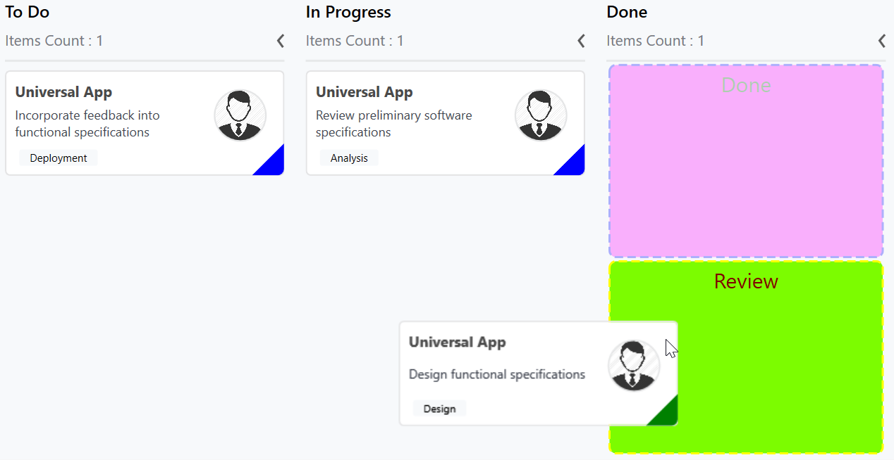

# Placeholder

The placeholder is to denote a card's new position in the [`KanbanColumn`](https://help.syncfusion.com/cr/wpf/Syncfusion.UI.Xaml.Kanban.KanbanColumn.html). It will appear while dragging a card over the column.

### Placeholder style

[`PlaceholderStyle`](https://help.syncfusion.com/cr/wpf/Syncfusion.UI.Xaml.Kanban.SfKanban.html#Syncfusion_UI_Xaml_Kanban_SfKanban_PlaceholderStyle) property is used to customize the placeholder. Following properties are used to customize its appearance.

* [`Fill`](https://help.syncfusion.com/cr/wpf/Syncfusion.UI.Xaml.Kanban.PlaceholderStyle.html#Syncfusion_UI_Xaml_Kanban_PlaceholderStyle_Fill)  	 - This property is used to change the background color of the placeholder.
* [`Stroke`](https://help.syncfusion.com/cr/wpf/Syncfusion.UI.Xaml.Kanban.PlaceholderStyle.html#Syncfusion_UI_Xaml_Kanban_PlaceholderStyle_Stroke) 	 	 - This property is used to change the border color of the placeholder.
* [`StrokeThickness`](https://help.syncfusion.com/cr/wpf/Syncfusion.UI.Xaml.Kanban.PlaceholderStyle.html#Syncfusion_UI_Xaml_Kanban_PlaceholderStyle_StrokeThickness)  	 - This property is used to change the border width of the placeholder.
* [`StrokeDashArray`](https://help.syncfusion.com/cr/wpf/Syncfusion.UI.Xaml.Kanban.PlaceholderStyle.html#Syncfusion_UI_Xaml_Kanban_PlaceholderStyle_StrokeDashArray)     - This property is used to change the dashes of the placeholder border.
* [`FontSize`](https://help.syncfusion.com/cr/wpf/Syncfusion.UI.Xaml.Kanban.PlaceholderStyle.html#Syncfusion_UI_Xaml_Kanban_PlaceholderStyle_FontSize)            - This is used to change the text size of the placeholder.
* [`Foreground`](https://help.syncfusion.com/cr/wpf/Syncfusion.UI.Xaml.Kanban.PlaceholderStyle.html#Syncfusion_UI_Xaml_Kanban_PlaceholderStyle_Foreground)           - This property is used to change the text color of the placeholder.
* [`RadiusX`](https://help.syncfusion.com/cr/wpf/Syncfusion.UI.Xaml.Kanban.PlaceholderStyle.html#Syncfusion_UI_Xaml_Kanban_PlaceholderStyle_RadiusX) - This property is used to change the x-radius of the placeholder.
* [`RadiusY`](https://help.syncfusion.com/cr/wpf/Syncfusion.UI.Xaml.Kanban.PlaceholderStyle.html#Syncfusion_UI_Xaml_Kanban_PlaceholderStyle_RadiusY) - This property is used to change the y-radius of the placeholder.
* [`TextHorizontalAlignment`](https://help.syncfusion.com/cr/wpf/Syncfusion.UI.Xaml.Kanban.PlaceholderStyle.html#Syncfusion_UI_Xaml_Kanban_PlaceholderStyle_TextHorizontalAlignment) - This property is used to change the horizontal alignment of the placeholder text.
* [`TextVerticalAlignment`](https://help.syncfusion.com/cr/wpf/Syncfusion.UI.Xaml.Kanban.PlaceholderStyle.html#Syncfusion_UI_Xaml_Kanban_PlaceholderStyle_TextVerticalAlignment) - This property is used to change the vertical alignment of the placeholder text.

Following properties are used to customize the selected category when you have more than one category in a column.

* [`SelectedBackground`](https://help.syncfusion.com/cr/wpf/Syncfusion.UI.Xaml.Kanban.PlaceholderStyle.html#Syncfusion_UI_Xaml_Kanban_PlaceholderStyle_SelectedBackground) 	- This property is used to change the background color of the selected placeholder.
* [`SelectedStroke`](https://help.syncfusion.com/cr/wpf/Syncfusion.UI.Xaml.Kanban.PlaceholderStyle.html#Syncfusion_UI_Xaml_Kanban_PlaceholderStyle_SelectedStroke) 		- This property is used to change the border color of the selected placeholder.
* [`SelectedStrokeThickness`](https://help.syncfusion.com/cr/wpf/Syncfusion.UI.Xaml.Kanban.PlaceholderStyle.html#Syncfusion_UI_Xaml_Kanban_PlaceholderStyle_SelectedStrokeThickness) 	- This property is used to change the border width of the selected placeholder.
* [`SelectedStrokeDashArray`](https://help.syncfusion.com/cr/wpf/Syncfusion.UI.Xaml.Kanban.PlaceholderStyle.html#Syncfusion_UI_Xaml_Kanban_PlaceholderStyle_SelectedStrokeDashArray)     - This property is used to change the dashes of the selected placeholder.
* [`SelectedFontSize`](https://help.syncfusion.com/cr/wpf/Syncfusion.UI.Xaml.Kanban.PlaceholderStyle.html#Syncfusion_UI_Xaml_Kanban_PlaceholderStyle_SelectedFontSize)            - This is used to change the font size of the text in selected placeholder.
* [`SelectedForeground`](https://help.syncfusion.com/cr/wpf/Syncfusion.UI.Xaml.Kanban.PlaceholderStyle.html#Syncfusion_UI_Xaml_Kanban_PlaceholderStyle_SelectedForeground)           - This property is used to change the color of the text in selected placeholder.
The following code example describes the above behavior.





<kanban:PlaceholderStyle FontSize="20"

                         Foreground="DarkGreen"

                         Fill="Fuchsia"

                         Stroke="Blue"

                         StrokeThickness="2"

                         SelectedFontSize="20"

                         SelectedForeground="Maroon"

                         SelectedStroke="Yellow"

                         SelectedStrokeThickness="2"

                         SelectedBackground="LawnGreen">

</kanban:PlaceholderStyle>





PlaceholderStyle style = new PlaceholderStyle();

style.FontSize = 20;

style.Foreground = new SolidColorBrush(Colors.DarkGreen);

style.Fill = new SolidColorBrush(Colors.Fuchsia);

style.Stroke = new SolidColorBrush(Colors.Blue);

style.StrokeThickness = 2;

style.StrokeDashArray = new DoubleCollection() {1, 1};

style.SelectedFontSize = 20;

style.SelectedForeground = new SolidColorBrush(Colors.Maroon);

style.SelectedStroke = new SolidColorBrush(Colors.Yellow);

style.SelectedBackground = new SolidColorBrush(Colors.LawnGreen);

style.SelectedStrokeThickness = 2;

style.SelectedStrokeDashArray = new DoubleCollection() {2, 1};

sfKanban.PlaceholderStyle = style;





The following output demonstrates the above code example.

N> The UI of the placeholder can be replaced entirely using [`PlaceholderTemplate`](https://help.syncfusion.com/cr/wpf/Syncfusion.UI.Xaml.Kanban.PlaceholderStyle.html#Syncfusion_UI_Xaml_Kanban_PlaceholderStyle_PlaceholderTemplate) property.