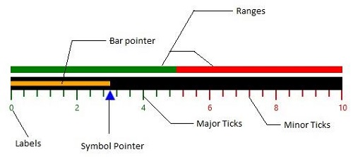

# WPF Linear Gauge (SfLinearGauge) Overview

The [`LinearGauge`](https://help.syncfusion.com/cr/wpf/Syncfusion.Windows.Gauge.LinearGauge.html) displays a range of values graphically along the linear scale, which is considered as the linear form of the linear gauge. It measures the values of the scale and presents in the horizontal sliding, vertical sliding, or meter.

The [`LinearGauge`](https://help.syncfusion.com/cr/wpf/Syncfusion.Windows.Gauge.LinearGauge.html) control is used to visualize numerical values of a scale in linear manner. By using the [`LinearGauge`](https://help.syncfusion.com/cr/wpf/Syncfusion.Windows.Gauge.LinearGauge.html) control, you can render thermometer.

## Key features

### Scale

The [`Scale`](https://help.syncfusion.com/wpf/sflineargauge/scale) support adding a scale to linear gauge using horizontal and vertical orientations.

### Ranges

Highlights the desired [`Ranges`](https://help.syncfusion.com/wpf/sflineargauge/ranges) of values in the gauge scale.

### Pointers

The [`Pointers`](https://help.syncfusion.com/wpf/sflineargauge/pointers) supports adding multiple pointers (bar and symbol) to the linear scale.

