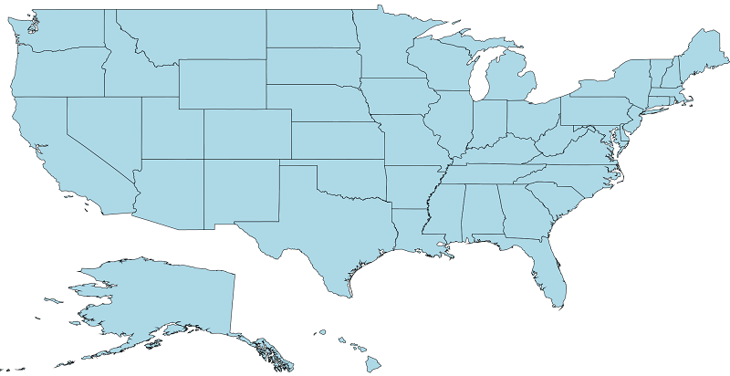

# Layers in syncfusion SfMap control

The maps control is maintained through [`Layers`](https://help.syncfusion.com/cr/cref_files/wpf/Syncfusion.SfMaps.WPF~Syncfusion.UI.Xaml.Maps.MapLayer.html), a map can accommodate one or more layers.

The maps control consists the following two layers:

* Imagery layer

* Shape file layer

## Imagery layer

The [`MapsProvider`](https://help.syncfusion.com/wpf/maps/map-providers) section explains about the imagery layer.

## Shape file layer

Using shape file layer, custom shape files can be rendered and the shapes can be customized.

### Shape settings

This section defines how to customize the shapes in a map.

You can customize a shape's fill, stroke, and stroke thickness using the [`ShapeFill`](https://help.syncfusion.com/cr/wpf/Syncfusion.SfMaps.WPF~Syncfusion.UI.Xaml.Maps.ShapeSetting~ShapeFill.html), [`ShapeStroke`](https://help.syncfusion.com/cr/wpf/Syncfusion.SfMaps.WPF~Syncfusion.UI.Xaml.Maps.ShapeSetting~ShapeStroke.html),[`ShapeStrokeThickness`](https://help.syncfusion.com/cr/wpf/Syncfusion.SfMaps.WPF~Syncfusion.UI.Xaml.Maps.ShapeSetting~ShapeStrokeThickness.html) properties.

Refer to the following code sample for customizing shapes.





		<maps:SfMap>
            <maps:SfMap.Layers >
                <maps:ShapeFileLayer Uri="GettingStarted.ShapeFiles.usa_state.shp" >
                    <maps:ShapeFileLayer.ShapeSettings>
                        <maps:ShapeSetting  ShapeFill="LightBlue" ShapeStroke="Black" ShapeStrokeThickness="1" >
                        </maps:ShapeSetting>
                    </maps:ShapeFileLayer.ShapeSettings>
                </maps:ShapeFileLayer>
            </maps:SfMap.Layers>
        </maps:SfMap>





			SfMap maps = new SfMap();
            ShapeFileLayer layer = new ShapeFileLayer();
            layer.Uri = "GettingStarted.ShapeFiles.usa_state.shp";
            ShapeSetting shapeSetting = new ShapeSetting();
            shapeSetting.ShapeFill = new SolidColorBrush(Colors.LightBlue);
            shapeSetting.ShapeStroke = new SolidColorBrush(Colors.Black);
            shapeSetting.ShapeStrokeThickness = 1;
            layer.ShapeSettings = shapeSetting;
            maps.Layers.Add(layer);
            this.Content = maps;





### Customize selected shapes

The shape selection is enabled when the [`EnableSelection`] (https://help.syncfusion.com/cr/cref_files/wpf/Syncfusion.SfMaps.WPF~Syncfusion.UI.Xaml.Maps.ShapeFileLayer~EnableSelection.html) property is set to true. To customize the selected shapes alone, use the following properties:

[`SelectedShapeColor`](https://help.syncfusion.com/cr/wpf/Syncfusion.SfMaps.WPF~Syncfusion.UI.Xaml.Maps.ShapeSetting~SelectedShapeColor.html): Sets the color for selected shapes in a map.

[`SelectedShapeStroke`](https://help.syncfusion.com/cr/wpf/Syncfusion.SfMaps.WPF~Syncfusion.UI.Xaml.Maps.ShapeSetting~SelectedShapeStroke.html): Sets the border color for selected shapes in a map.

[`SelectedShapeStrokeThickness`](https://help.syncfusion.com/cr/wpf/Syncfusion.SfMaps.WPF~Syncfusion.UI.Xaml.Maps.ShapeSetting~SelectedShapeStrokeThickness.html): Sets the border thickness for selected shapes in a map.





        <syncfusion:SfMap >
            <syncfusion:SfMap.Layers>
                <syncfusion:ShapeFileLayer EnableSelection="True"  Uri="GettingStarted.ShapeFiles.usa_state.shp">
                    <syncfusion:ShapeFileLayer.ShapeSettings>
                        <syncfusion:ShapeSetting  SelectedShapeColor="Green" SelectedShapeStroke="Black" ShapeStrokeThickness="1" >
                        </syncfusion:ShapeSetting>
                    </syncfusion:ShapeFileLayer.ShapeSettings>
                </syncfusion:ShapeFileLayer>
            </syncfusion:SfMap.Layers>
        </syncfusion:SfMap>





            SfMap maps = new SfMap();
            ShapeFileLayer layer = new ShapeFileLayer();
            layer.EnableSelection = true;
            layer.Uri = "GettingStarted.ShapeFiles.usa_state.shp";
            ShapeSetting shapeSetting = new ShapeSetting();
            shapeSetting.SelectedShapeColor = new SolidColorBrush(Colors.Green);
            shapeSetting.SelectedShapeStroke = new SolidColorBrush(Colors.Black);
            shapeSetting.SelectedShapeStrokeThickness = 1;
            layer.ShapeSettings = shapeSetting;
            maps.Layers.Add(layer);





### Events

The [`ShapeSelected`](https://help.syncfusion.com/cr/wpf/Syncfusion.SfMaps.WPF~Syncfusion.UI.Xaml.Maps.ShapeFileLayer~ShapesSelected_EV.html) event will be triggered when a map shape is selected. A corresponding model data is passed as an argument.

The [`ShapesUnSelected`] (https://help.syncfusion.com/cr/wpf/Syncfusion.SfMaps.WPF~Syncfusion.UI.Xaml.Maps.ShapeFileLayer~ShapesUnSelected_EV.html) event will be triggered when a map shape is un selected. A corresponding model data is passed as an argument.




		<syncfusion:SfMap >
            <syncfusion:SfMap.Layers>
                <syncfusion:ShapeFileLayer EnableSelection="True"  Uri="GettingStarted.ShapeFiles.usa_state.shp"  ShapesSelected="ShapeFileLayer_ShapesSelected" ShapesUnSelected="ShapeFileLayer_ShapesUnSelected">
                 </syncfusion:ShapeFileLayer>
            </syncfusion:SfMap.Layers>
        </syncfusion:SfMap>
		




    public partial class MainWindow : Window
    {
        public MainWindow()
        {
            InitializeComponent();
            SfMap maps = new SfMap();
            ShapeFileLayer layer = new ShapeFileLayer();
            layer.ShapesUnSelected += ShapeFileLayer_ShapesUnSelected;
            layer.ShapesSelected += ShapeFileLayer_ShapesSelected;
            layer.EnableSelection = true;
            layer.Uri = "GettingStarted.ShapeFiles.usa_state.shp";
            maps.Layers.Add(layer);
            this.Content = maps;
        }

        private void ShapeFileLayer_ShapesSelected(object sender, SelectionEventArgs args)
        {
            var data = args.Items;
        }

        private void ShapeFileLayer_ShapesUnSelected(object sender, SelectionEventArgs args)
        {
            var data = args.Items;
        }
    }


