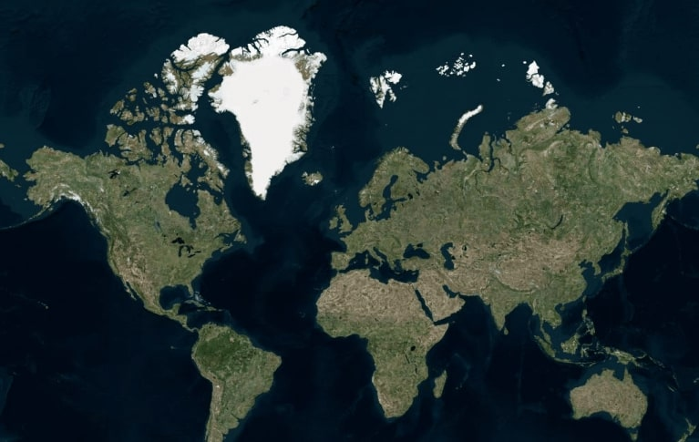
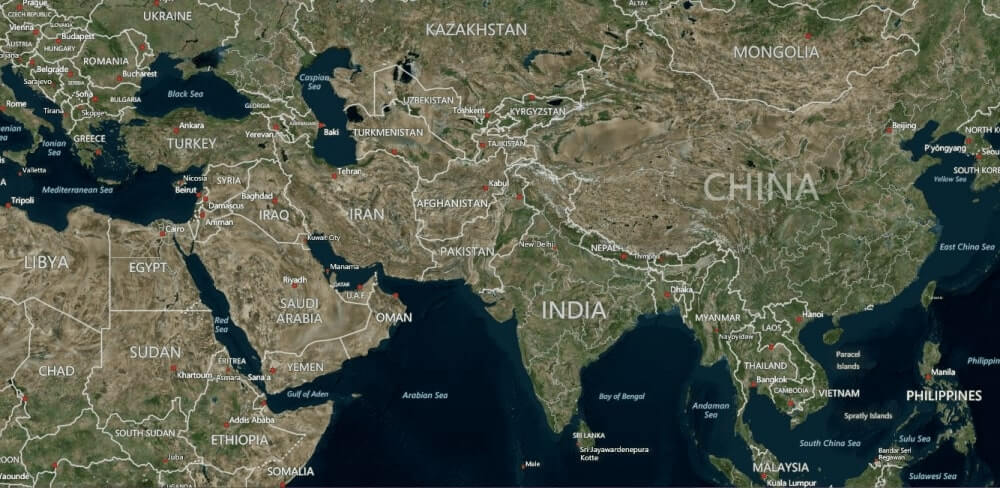

# Map Providers in WPF Maps (SfMap)

SfMap control supports map providers such as OpenStreetMap that can be added to any layers in maps.

## Open Street Map

The OpenStreetMap (OSM) is a map of the world built by a community of mappers that is free to use under an open license. It allows you to view geographical data in a collaborative way from anywhere on the Earth. It provides small tile images based on our requests and combines those images into a single one to display the map area in our maps control.

### Enable an OSM

You can enable this feature by setting the [`LayerType`](https://help.syncfusion.com/cr/wpf/Syncfusion.UI.Xaml.Maps.ImageryLayer.html#Syncfusion_UI_Xaml_Maps_ImageryLayer_LayerType) property value as `OSM`.


 
   <syncfusion:SfMap ZoomLevel="3">
        <syncfusion:SfMap.Layers>
            <syncfusion:ImageryLayer LayerType="OSM"/>
        </syncfusion:SfMap.Layers>
    </syncfusion:SfMap>
       


### Markers

Markers are used to leave some message on the map.





    <syncfusion:SfMap x:Name="map">
            <syncfusion:SfMap.Layers>
                <syncfusion:ImageryLayer Markers="{Binding Models}" LayerType="OSM">
                </syncfusion:ImageryLayer>
            </syncfusion:SfMap.Layers>
        </syncfusion:SfMap>





    public class Model
      {
         public string Name { get; set; }
         public string Longitude { get; set; }
         public string Latitude { get; set; }
      }
    public class MapViewModel
    {
        public ObservableCollection<Model> Models { get; set; }

        public MapViewModel()
        {
            this.Models = new ObservableCollection<Model>();
            this.Models.Add(new Model() { Name = "USA ", Latitude = "38.8833N", Longitude = "77.0167W" });
            this.Models.Add(new Model() { Name = "Brazil ", Latitude = "15.7833S", Longitude = "47.8667W" });
            this.Models.Add(new Model() { Name = "India ", Latitude = "21.0000N", Longitude = "78.0000E" });
            this.Models.Add(new Model() { Name = "China ", Latitude = "35.0000N", Longitude = "103.0000E" });
            this.Models.Add(new Model() { Name = "Indonesia ", Latitude = "6.1750S", Longitude = "106.8283E" });
        }

    }





### Customizing the Marker Template

The default appearance of the Marker can be customized by using the [`MarkerTemplate`](https://help.syncfusion.com/cr/wpf/Syncfusion.UI.Xaml.Maps.ImageryLayer.html#Syncfusion_UI_Xaml_Maps_ImageryLayer_MarkerTemplate) property.



    <syncfusion:SfMap x:Name="map">
            <syncfusion:SfMap.Layers>
                <syncfusion:ImageryLayer Markers="{Binding Models}"   LayerType="OSM">
                    <syncfusion:ImageryLayer.MarkerTemplate>
                        <DataTemplate>
                            <Grid Margin="-12,-30,0,0">
                                <Canvas>
                                    <Image Source="pin.png" Height="30"/>
                                </Canvas>
                                <Grid DataContext="{Binding Data}" Width="265">
                                    <Grid.RowDefinitions>
                                        <RowDefinition />
                                    </Grid.RowDefinitions>
                                    <Grid.ColumnDefinitions>
                                        <ColumnDefinition/>
                                    </Grid.ColumnDefinitions>
                                    <Canvas Grid.Row="0" Grid.Column="0" Margin="0,0,106,0">
                                        <Image Source="mappath.png" Width="92" Canvas.Top="25" Canvas.Left="10"/>
                                        <TextBlock Foreground="White" HorizontalAlignment="Center" FontSize="15" FontFamily="Segoe UI" Text="{Binding Name}" Canvas.Left="25" Canvas.Top="25" RenderTransformOrigin="0.515,-0.3"/>
                                    </Canvas>
                                </Grid>
                            </Grid>
                        </DataTemplate>
                    </syncfusion:ImageryLayer.MarkerTemplate>
                  </syncfusion:ImageryLayer>
            </syncfusion:SfMap.Layers>
        </syncfusion:SfMap>  



Refer to this [`link`](https://help.syncfusion.com/wpf/maps/markers) for customizing marker icons, labels, marker alignment, marker selection and events. 

### Adding a multiple layers in OSM

Multiple layers can be added in the ImageryLayer itself. They have to be added in SubShapeFileLayers within the ImageryLayer.

### SubShapeFileLayers

SubShapeFileLayers is the collection of SubShapeFileLayer. SubShapeFileLayer is also a type of shapefile layer. The following code adds the multiple layers in the ImageryLayer.





        <syncfusion:SfMap>
            <syncfusion:SfMap.Layers>
                <syncfusion:ImageryLayer LayerType="OSM" >
                    <syncfusion:ImageryLayer.SubShapeFileLayers>                   
                        <syncfusion:SubShapeFileLayer  Uri="DataMarkers.ShapeFiles.Africa.shp">                            
                            <syncfusion:SubShapeFileLayer.ShapeSettings>                               
                                <syncfusion:ShapeSetting  ShapeStroke="#C1C1C1" ShapeStrokeThickness="0.5"  ShapeFill="Chocolate"/>                           
                            </syncfusion:SubShapeFileLayer.ShapeSettings>                       
                        </syncfusion:SubShapeFileLayer>                   
                    </syncfusion:ImageryLayer.SubShapeFileLayers>               
                </syncfusion:ImageryLayer>     
            </syncfusion:SfMap.Layers>
        </syncfusion:SfMap>





## Bing Map

Bing maps is a map of the entire world owned by Microsoft. As with OSM, it provides map tile images based on our requests and combines those images into a single one to display a map area.

### Enable a Bing Map 

You can enable this feature by defining the LayerType as `Bing`. 

### Bing Map Key

The [`BingMapKey`](https://help.syncfusion.com/cr/wpf/Syncfusion.UI.Xaml.Maps.ImageryLayer.html#Syncfusion_UI_Xaml_Maps_ImageryLayer_BingMapKey) is provided as input to this key property. The Bing Map key can be obtained from 

[http://www.microsoft.com/maps/create-a-bing-maps-key.aspx](http://www.microsoft.com/maps/create-a-bing-maps-key.aspx).

Maps supports three types of Bing map viewing style options.

1. Aerial
2. AerialWithLabel
3. Road. 

The default view of Bing map style is Road.

### Aerial View

Aerial view displays satellite images to highlight roads and major landmarks for easy identification. To apply the Aerial view, you need to set BingMapStyle as `Aerial`, as shown in the following code.


       
	   <syncfusion:SfMap>
            <syncfusion:SfMap.Layers>
                <syncfusion:ImageryLayer LayerType="Bing" BingMapKey="<Your Bing map key>" BingMapStyle="Aerial" />  
            </syncfusion:SfMap.Layers>
        </syncfusion:SfMap >



The following screenshot illustrates the Aerial View.

### Road View

Road view displays the default map view of roads, buildings, and geography. To apply the Road view, you need to set BingMapStyle as `Road`, as shown in the following code.



       <syncfusion:SfMap>
            <syncfusion:SfMap.Layers>
                <syncfusion:ImageryLayer LayerType="Bing" BingMapKey="<Your Bing map key>" BingMapStyle="Road" />     
            </syncfusion:SfMap.Layers>
        </syncfusion:SfMap >



The following screenshot illustrates the Road view.

'

### AerialWithLabelView

AerialWithLabel view displays the Aerial map areas with labels for continent, country, ocean, etc., names. To apply this type of view style, you need to set BingMapStyle as `AerialWithLabel`, as shown in the following code.



        <syncfusion:SfMap>
            <syncfusion:SfMap.Layers>
                <syncfusion:ImageryLayer LayerType="Bing" BingMapKey="<Your Bing map key>" BingMapStyle="AerialWithLabels" />    
            </syncfusion:SfMap.Layers>
        </syncfusion:SfMap>



The following screenshot illustrates the AerialWithLabel view.

N> You can refer to our [WPF Map](https://www.syncfusion.com/wpf-controls/map) feature tour page for its groundbreaking feature representations. You can also explore our [WPF Map example](https://github.com/syncfusion/wpf-demos/tree/master/map) to know how to render and configure the map.

## See also

[How to show google map in WPF SfMap](https://www.syncfusion.com/kb/11928/how-to-show-google-map-in-wpf-map-sfmap)

[How to view bing map using WPF SfMap](https://www.syncfusion.com/kb/10799/how-to-view-bing-map-using-wpf-map-control-sfmap)

[How to customize the markers in maps](https://www.syncfusion.com/kb/7656/how-to-customize-the-markers-in-maps)

[How to drilldown map layers]( https://www.syncfusion.com/kb/7647/how-to-drilldown-map-layers)

