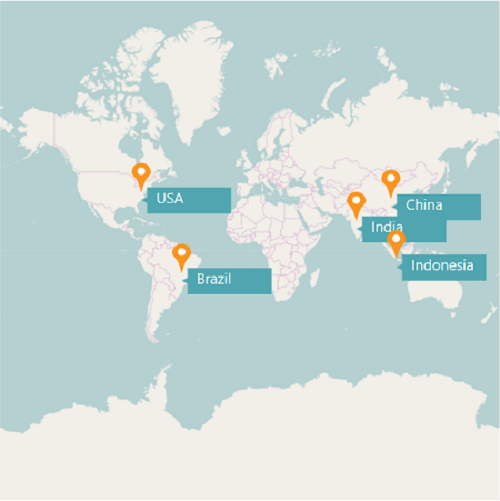
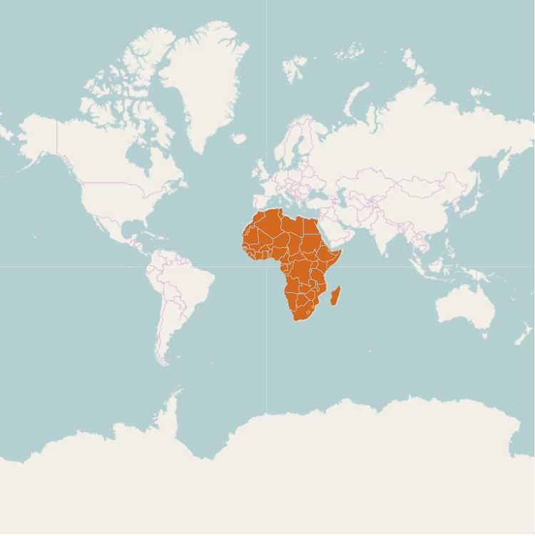
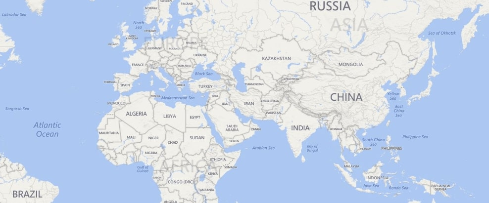

# SfMaps control map Providers

SfMap control supports map providers such as OpenStreetMap that can be added to any layers in maps.

## Open Street Map

OpenStreetMap is a map of the entire world. The OpenStreetMap allows you to view, edit and use geographical data in a collaborative way from any place on the Earth.

### Enable OSM

You can enable this feature by setting the layerType property value as "OSM".


 

        <syncfusion:SfMap>

            <syncfusion:SfMap.Layers>

                <syncfusion:ImageryLayer LayerType="OSM" />

            </syncfusion:SfMap.Layers>

        </syncfusion:SfMap >


### Markers

Markers are used to leave some message on the map.





    <syncfusion:SfMap x:Name="map">
            <syncfusion:SfMap.Layers>
                <syncfusion:ImageryLayer Markers="{Binding Models}" LayerType="OSM">
                </syncfusion:ImageryLayer>
            </syncfusion:SfMap.Layers>
        </syncfusion:SfMap>





    public class Model
      {
         public string Name { get; set; }
         public string Longitude { get; set; }
         public string Latitude { get; set; }
      }
    public class MapViewModel
    {
        public ObservableCollection<Model> Models { get; set; }

        public ObservableCollection<Country> AfricaList { get; set; }
        public MapViewModel()
        {
            this.Models = new ObservableCollection<Model>();
            this.Models.Add(new Model() { Name = "USA ", Latitude = "38.8833N", Longitude = "77.0167W" });
            this.Models.Add(new Model() { Name = "Brazil ", Latitude = "15.7833S", Longitude = "47.8667W" });
            this.Models.Add(new Model() { Name = "India ", Latitude = "21.0000N", Longitude = "78.0000E" });
            this.Models.Add(new Model() { Name = "China ", Latitude = "35.0000N", Longitude = "103.0000E" });
            this.Models.Add(new Model() { Name = "Indonesia ", Latitude = "6.1750S", Longitude = "106.8283E" });
        }

    }





### Customizing the Marker Template

The default appearance of the Marker can be customized by using the MarkerTemplate property.



    <syncfusion:SfMap x:Name="map">
            <syncfusion:SfMap.Layers>
                <syncfusion:ImageryLayer Markers="{Binding Models}"   LayerType="OSM">
                    <syncfusion:ImageryLayer.MarkerTemplate>
                        <DataTemplate>
                            <Grid Margin="-12,-30,0,0">
                                <Canvas>
                                    <Image Source="pin.png" Height="30"/>
                                </Canvas>
                                <Grid DataContext="{Binding Data}" Width="265">
                                    <Grid.RowDefinitions>
                                        <RowDefinition />
                                    </Grid.RowDefinitions>
                                    <Grid.ColumnDefinitions>
                                        <ColumnDefinition/>
                                    </Grid.ColumnDefinitions>
                                    <Canvas Grid.Row="0" Grid.Column="0" Margin="0,0,106,0">
                                        <Image Source="mappath.png" Width="92" Canvas.Top="25" Canvas.Left="10"/>
                                        <TextBlock Foreground="White" HorizontalAlignment="Center" FontSize="15" FontFamily="Segoe UI" Text="{Binding Name}" Canvas.Left="25" Canvas.Top="25" RenderTransformOrigin="0.515,-0.3"/>
                                    </Canvas>
                                </Grid>
                            </Grid>
                        </DataTemplate>
                    </syncfusion:ImageryLayer.MarkerTemplate>
                  </syncfusion:ImageryLayer>
            </syncfusion:SfMap.Layers>
        </syncfusion:SfMap>  



### Adding Multiple Layers in OSM

Multiple layers can be added in the ImageryLayer itself. They have to be added in SubShapeFileLayers within the ImageryLayer.

### SubShapeFileLayers

SubShapeFileLayers is the collection of SubShapeFileLayer. SubShapeFileLayer is also a type of shapefile layer. The following code adds multiple layers in the ImageryLayer.





        <syncfusion:SfMap>

            <syncfusion:SfMap.Layers>

                <syncfusion:ImageryLayer LayerType="OSM" >
                                    
                    <syncfusion:ImageryLayer.SubShapeFileLayers>
                    
                        <syncfusion:SubShapeFileLayer  Uri="DataMarkers.ShapeFiles.Africa.shp">
                            
                            <syncfusion:SubShapeFileLayer.ShapeSettings>
                               
                                <syncfusion:ShapeSetting  ShapeStroke="#C1C1C1" ShapeStrokeThickness="0.5"  ShapeFill="Chocolate"/>
                           
                            </syncfusion:SubShapeFileLayer.ShapeSettings>
                       
                        </syncfusion:SubShapeFileLayer>
                   
                    </syncfusion:ImageryLayer.SubShapeFileLayers>
               
                </syncfusion:ImageryLayer>     

            </syncfusion:SfMap.Layers>

        </syncfusion:SfMap >




## Bing Map

Bing Map is a key feature in accessing the external geospatial imagery services for deep-zoom satellite view.

### Enable Bing Map 

You can enable this feature by defining the LayerType as “bing”. 

### Bing Map Key

The bing Map key is provided as input to this key property. The Bing Map key can be obtained from 

[http://www.microsoft.com/maps/create-a-bing-maps-key.aspx](http://www.microsoft.com/maps/create-a-bing-maps-key.aspx).

### Aerial View


       

	   <syncfusion:SfMap>

            <syncfusion:SfMap.Layers>

                <syncfusion:ImageryLayer LayerType="Bing" BingMapKey="Bing Map Key" BingMapStyle="Aerial" />     

            </syncfusion:SfMap.Layers>

        </syncfusion:SfMap >



The following screenshot illustrates the Aerial View

### Road View



       <syncfusion:SfMap>

            <syncfusion:SfMap.Layers>

                <syncfusion:ImageryLayer LayerType="Bing" BingMapKey="Bing Map Key" BingMapStyle="Road" />     

            </syncfusion:SfMap.Layers>

        </syncfusion:SfMap >



The following screenshot illustrates the Road view.

'

### AerialWithLabelView



        <syncfusion:SfMap>

            <syncfusion:SfMap.Layers>

                <syncfusion:ImageryLayer LayerType="Bing" BingMapKey="Bing Map Key" BingMapStyle="AerialWithLabels" />     

            </syncfusion:SfMap.Layers>

        </syncfusion:SfMap >


The following screenshot illustrates the AerialWithLabel view.

## Calculate zoom level

This feature allows set the initial zoom level automatically in two ways.

* Distance Radius(KM/miles)
* Geo-bounds(Northeast, Southwest)

### Distance Radius 

N> DistanceType default value is KiloMeter.

Calculate the initial zoom level automatically based on the `Radius` and `DistanceType` properties of ImageryLayer.





      <Window.Resources>
        <ResourceDictionary >
            <DataTemplate x:Key="markerTemplate">
                <Grid Margin="-12,-30,0,0">
                    <Canvas>
                        <Image Source="pin.png" Height="30"/>
                    </Canvas>
                </Grid>
            </DataTemplate>
        </ResourceDictionary>
    </Window.Resources>
	
    <Grid>
        <maps:SfMap>
            <maps:SfMap.Layers>
                <maps:ImageryLayer MarkerTemplate="{StaticResource ResourceKey=markerTemplate}" Markers="{Binding Models}" Center="38.909804, -77.043442" Radius="5" DistanceType="KiloMeter" >
                </maps:ImageryLayer>
            </maps:SfMap.Layers>
        </maps:SfMap>
    </Grid>





            SfMap maps = new SfMap();
            ImageryLayer layer = new ImageryLayer();
            layer.Center = new Point(38.909804, -77.043442);
            layer.Radius = 5;
            layer.DistanceType = DistanceType.KiloMeter;
            layer.Markers = obj.Models;
            layer.MarkerTemplate = this.Resources["markerTemplate"] as DataTemplate;
            maps.Layers.Add(layer);
			
	  public class Model
      {
        public string Longitude { get; set; }
        public string Latitude { get; set; }
      }
			
	   public class ViewModel
       {
          public ObservableCollection<Model> Models { get; set; }
          public ViewModel()
          {
            this.Models = new ObservableCollection<Model>();
            this.Models.Add(new Model() { Latitude = "38.909804", Longitude = "-77.043442" });
         }
      }





### Geo-bounds

Calculate the initial zoom level automatically based on the LatLngBounds of ImageryLayer.





        <Window.Resources>
        <ResourceDictionary >
            <DataTemplate x:Key="markerTemplate">
                <Grid Margin="-12,-30,0,0">
                    <Canvas>
                        <Image Source="pin.png" Height="30"/>
                    </Canvas>
                </Grid>
            </DataTemplate>
        </ResourceDictionary>
    </Window.Resources>
    <Grid>
        <maps:SfMap>
            <maps:SfMap.Layers>
                <maps:ImageryLayer LayerType="OSM" MarkerTemplate="{StaticResource ResourceKey=markerTemplate}"  Markers="{Binding Models}"  >
                    <maps:ImageryLayer.LatLngBounds>
                        <maps:LatLngBounds Northeast="38.909804, -77.043442" Southwest="38.909804, -77.043442" >
                        </maps:LatLngBounds>
                    </maps:ImageryLayer.LatLngBounds>
                </maps:ImageryLayer>
            </maps:SfMap.Layers>
        </maps:SfMap>
    </Grid>





            SfMap maps = new SfMap();
            ImageryLayer layer = new ImageryLayer();
            LatLngBounds bounds = new LatLngBounds();
            bounds.Northeast = new Point(38.909804, -77.043442);
            bounds.Southwest = new Point(38.909804, -77.043442);
            layer.LatLngBounds = bounds;
            layer.Markers = obj.Models;
            layer.MarkerTemplate = this.Resources["markerTemplate"] as DataTemplate;
            maps.Layers.Add(layer);
			
	  public class Model
      {
        public string Longitude { get; set; }
        public string Latitude { get; set; }
      }
			
	   public class ViewModel
       {
          public ObservableCollection<Model> Models { get; set; }
          public ViewModel()
          {
            this.Models = new ObservableCollection<Model>();
            this.Models.Add(new Model() { Latitude = "38.909804", Longitude = "-77.043442" });
         }
      }





N> When setting LatLngBounds and DistanceRadius at the same time, the priority is DistanceRadius and calculate zoom level based Radius value.

## Calculate the map tile layer bounds

Calculate imagery layer pixel bounds while zooming, panning and Geo-Coordinate value changing.





      <maps:SfMap>
            <maps:SfMap.Layers>
                <maps:ImageryLayer x:Name="layer"  Center="30.9709225, -100.2187212" CenterChanged="layer_CenterChanged">
                </maps:ImageryLayer>
            </maps:SfMap.Layers>
      </maps:SfMap>





    public partial class MapBound : ContentPage
    {
        ImageryLayer layer = new ImageryLayer();
        public MapBound()
        {
            InitializeComponent();
            SfMap maps = new SfMap();
            layer.Center = new Point(30.9709225, -100.2187212);
            layer.CenterChanged += layer_CenterChanged;
            maps.Layers.Add(layer);
            this.Content = maps;
        }
        private void layer_CenterChanged(object sender, CenterChangedEventArgs e)
        {
            var pixelbounds = layer.MapBounds;
        }
    }




