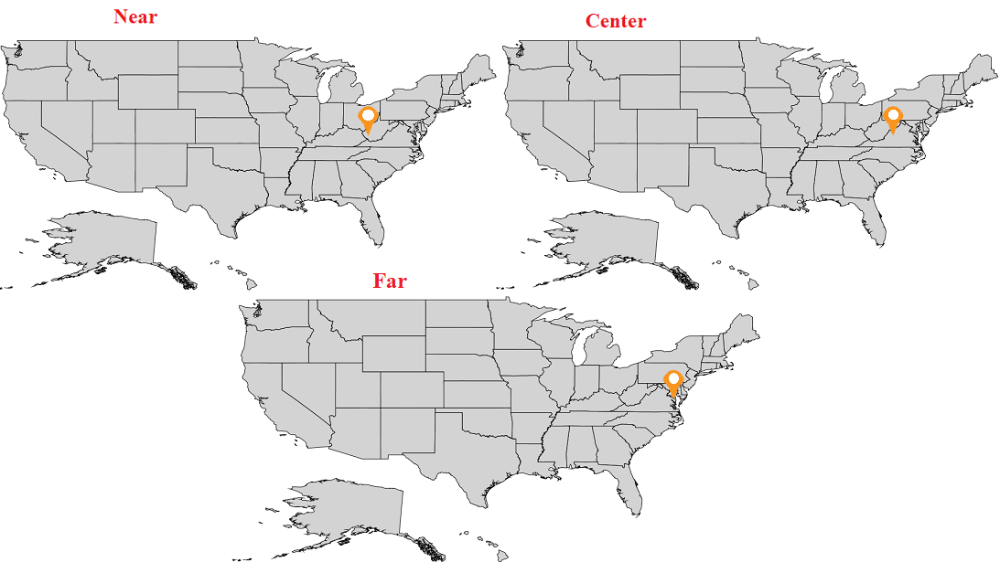
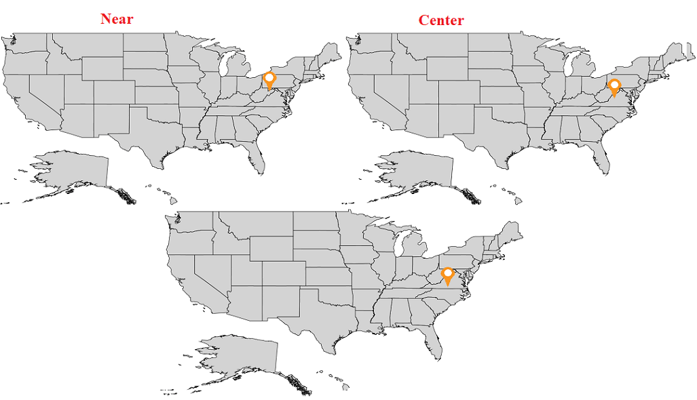
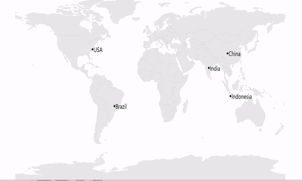
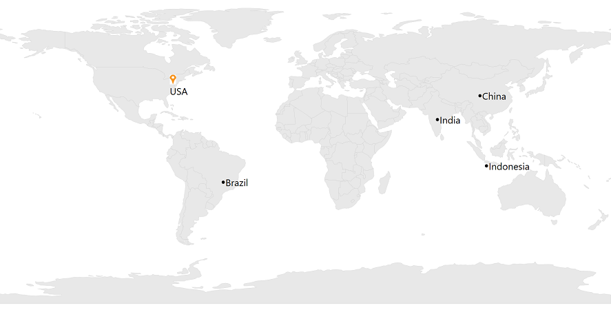

# Markers in WPF SfMaps control

Markers are used to show some messages on maps.

## Adding the marker

Any number of markers can be added to the shape file layers using the `Markers` property. Each marker contains the following properties:

`Label`: Displays some messages on maps.

`Latitude`: Specifies y-axis position of the marker.

`Longitude`: Specifies x-axis position of the marker.





        <syncfusion:SfMap>
            <syncfusion:SfMap.Layers>
                <syncfusion:ShapeFileLayer Uri="Maps.ShapeFiles.world1.shp"  Markers="{Binding Models}" >
                </syncfusion:ShapeFileLayer>
            </syncfusion:SfMap.Layers>
        </syncfusion:SfMap>





    public partial class MainWindow : Window
    {
        public MainWindow()
        {
            InitializeComponent();
            ViewModel view = new ViewModel();
            this.DataContext =view;
            SfMap maps = new SfMap();
            ShapeFileLayer shape = new ShapeFileLayer();
            shape.Uri = "Maps.ShapeFiles.world1.shp";
            shape.Markers = view.Models;
            maps.Layers.Add(shape);
            this.Content = maps;
        }
    }

    public class ViewModel
    {
        public ObservableCollection<Model> Models { get; set; }
        public ViewModel()
        {
            this.Models = new ObservableCollection<Model>();
            this.Models.Add(new Model() { Label = "USA", Latitude = "38.8833N", Longitude = "77.0167W" });
            this.Models.Add(new Model() { Label = "Brazil ", Latitude = "15.7833S", Longitude = "47.8667W" });
            this.Models.Add(new Model() { Label = "India ", Latitude = "21.0000N", Longitude = "78.0000E" });
            this.Models.Add(new Model() { Label = "China ", Latitude = "35.0000N", Longitude = "103.0000E" });
            this.Models.Add(new Model() { Label = "Indonesia ", Latitude = "6.1750S", Longitude = "106.8283E" });
        }
    }

    public class Model
    {
        public string Label { get; set; }
        public string Longitude { get; set; }
        public string Latitude { get; set; }
    }





## Add a custom marker

The maps control provides the support for defining the custom markers using the `MarkerTemplate` property.





      <Window.Resources>
        <ResourceDictionary>
            <DataTemplate x:Key="markerTemplate">
                <Grid>
                    <Canvas Margin="-12,-30,0,0">
                        <Image Source="pin.png" Height="30" />
                        <TextBlock HorizontalAlignment="Center" Margin="0,30,0,0" FontSize="30" FontFamily="Segoe UI" Text="{Binding Label}"/>
                    </Canvas>
                </Grid>
            </DataTemplate>
        </ResourceDictionary>
    </Window.Resources>
    <Grid>
        <syncfusion:SfMap>
            <syncfusion:SfMap.Layers>
                <syncfusion:ShapeFileLayer Uri="Maps.ShapeFiles.world1.shp"  Markers="{Binding Models}"  MarkerTemplate="{StaticResource markerTemplate}">
               </syncfusion:ShapeFileLayer>
            </syncfusion:SfMap.Layers>
        </syncfusion:SfMap>
    </Grid>
		




	SfMap maps = new SfMap();
	ShapeFileLayer shape = new ShapeFileLayer();
	shape.Uri = "Maps.ShapeFiles.world1.shp";
	shape.MarkerTemplate=Resources["markerTemplate"] as DataTemplate;
	shape.Markers = view.Models;
	maps.Layers.Add(shape);
	this.Content = maps;





## Customizing marker icons

The size and color of marker icons can be customized using the `MarkerIconSize` and `MarkerIconFill` properties.

### Icon types

The shape of a marker icons can be customized using the `MarkerIconType` property. The maps control supports the following types of marker icons:

* Circle
* Diamond
* Image
* Rectangle
* Square





         <syncfusion:SfMap>
            <syncfusion:SfMap.Layers>
                <syncfusion:ShapeFileLayer Uri="Maps.ShapeFiles.world1.shp" MarkerIconType="Diamond" MarkerIconSize="30,20"  MarkerIconFill="Green"  Markers="{Binding Models}" >
               </syncfusion:ShapeFileLayer>
            </syncfusion:SfMap.Layers>
        </syncfusion:SfMap>





            SfMap maps = new SfMap();
            ShapeFileLayer shape = new ShapeFileLayer();
            shape.Uri = "Maps.ShapeFiles.world1.shp";
            shape.Markers = view.Models;
            shape.MarkerIconType = MarkerIcon.Diamond;
            shape.MarkerIconFill = new SolidColorBrush(Colors.Green);
            shape.MarkerIconSize = new Size(30, 20);
            maps.Layers.Add(shape);
            this.Content = maps;





### Setting an image marker icon

You can set the image as marker icon by setting the icon type as an image. Set `MarkerIconSource` to get the image from local path.





        <syncfusion:SfMap>
            <syncfusion:SfMap.Layers>
                <syncfusion:ShapeFileLayer Uri="Maps.ShapeFiles.world1.shp" MarkerIconType="Image" MarkerIconSource="pin.png" MarkerIconSize="30,30" Markers="{Binding Models}"  >
               </syncfusion:ShapeFileLayer>
            </syncfusion:SfMap.Layers>
        </syncfusion:SfMap>





            SfMap maps = new SfMap();
            ShapeFileLayer shape = new ShapeFileLayer();
            shape.Uri = "Maps.ShapeFiles.world1.shp";
			shape.MarkerIconSize = new Size(30, 30);
            shape.Markers = view.Models;
            shape.MarkerIconType = MarkerIcon.Image;
            BitmapImage bimage = new BitmapImage();
            bimage.BeginInit();
            bimage.UriSource = new Uri("..\\..\\pin.png", UriKind.Relative);
            bimage.EndInit();
            shape.MarkerIconSource = bimage;
            maps.Layers.Add(shape);
            this.Content = maps;





## Customizing labels

You can customize the marker labels using the `FontSize`, `LabelForeground`, `FontStyle`, and `FontWeight` properties.





         <syncfusion:SfMap>
            <syncfusion:SfMap.Layers>
                <syncfusion:ShapeFileLayer Uri="Maps.ShapeFiles.world1.shp" MarkerLabelFontSize="30" MarkerLabelForeground="Red" MarkerLabelFontStyle="Italic" MarkerLabelFontWeight="Bold" MarkerLabelFontFamily="Segoe UI" Markers="{Binding Models}" >
               </syncfusion:ShapeFileLayer>
            </syncfusion:SfMap.Layers>
        </syncfusion:SfMap>





            SfMap maps = new SfMap();
            ShapeFileLayer shape = new ShapeFileLayer();
            shape.Uri = "Maps.ShapeFiles.world1.shp";
            shape.Markers = view.Models;
            shape.MarkerLabelFontSize = 30;
            shape.MarkerLabelForeground = new SolidColorBrush(Colors.Red);
            shape.MarkerLabelFontStyle = FontStyles.Italic;
            shape.MarkerLabelFontWeight = FontWeights.Bold;
            shape.MarkerLabelFontFamily = new FontFamily("Segoe UI");
            maps.Layers.Add(shape);





## Marker Alignment

You can align the maps marker horizontally and vertically using the `HorizontalAlignment` and `VerticalAlignment` properties.

### Setting a horizontal alignment

The `HorizontalAlignment` property is used to position the marker icon in x-axis. The marker icon can be positioned using the following ways in x-axis:

* `Near`: Specifies the near position of the marker icon for the given latitude and longitude values in x-axis position.
* `Center`: Specifies the center position of the marker icon for the given latitude and longitude values in x-axis position.
* `Far`: Specifies the far position of the marker icon for the given latitude and longitude values in x-axis position.





        <Grid>
            <syncfusion:SfMap>
                <syncfusion:SfMap.Layers>
                    <syncfusion:ShapeFileLayer Uri="Maps.ShapeFiles.usa_state.shp" MarkerIconSize="30,30" MarkerLabelFontSize="30" MarkerHorizontalAlignment="Near" Markers="{Binding Models}"  >
                    </syncfusion:ShapeFileLayer>
                </syncfusion:SfMap.Layers>
            </syncfusion:SfMap>
        </Grid>	





            SfMap maps = new SfMap();
            ShapeFileLayer shape = new ShapeFileLayer();
            shape.Uri = "Maps.ShapeFiles.usa_state.shp";
            shape.Markers = view.Models;
			shape.MarkerIconSize = new Size(30, 30);
            shape.MarkerLabelFontSize = 30;
            shape.MarkerHorizontalAlignment = MarkerAlignment.Near;
            maps.Layers.Add(shape);





### Setting a vertical alignment

The `VerticalAlignment` property is used to position the marker icon in y-axis. The marker icon can be positioned using the following ways in y-axis:

* `Near`: Specifies the near position of the marker icon for the given latitude and longitude values in y-axis position.
* `Center`: Specifies the center position of the marker icon for the given latitude and longitude values in y-axis position.
* `Far`: Specifies the far position of the marker icon for the given latitude and longitude values in y-axis position.





        <Grid>
            <syncfusion:SfMap>
                <syncfusion:SfMap.Layers>
                    <syncfusion:ShapeFileLayer Uri="Maps.ShapeFiles.usa_state.shp" MarkerIconSize="30,30" MarkerLabelFontSize="30" MarkerVerticalAlignment="Near" Markers="{Binding Models}" >
                    </syncfusion:ShapeFileLayer>
                </syncfusion:SfMap.Layers>
            </syncfusion:SfMap>
        </Grid>		





            SfMap maps = new SfMap();
            ShapeFileLayer shape = new ShapeFileLayer();
            shape.Uri = "Maps.ShapeFiles.usa_state.shp";
            shape.Markers = view.Models;
			shape.MarkerIconSize = new Size(30, 30);
            shape.MarkerLabelFontSize = 30;
            shape.MarkerVerticalAlignment = MarkerAlignment.Near;
            maps.Layers.Add(shape);





N> The default marker icon position for VerticalAlignment and HorizontalAlignment is Center.

## Selection Mode

If you add any view for marker using the `MarkerTemplate` property from `MarkerSelected` event, then the corresponding view will be applied to the selected marker. Custom view will be added continuously for all the selected marker, but do not have option to reset the old one. Now, you can achieve this using the `MarkerSelectionMode` property. If set selection mode as `Single`, then it will be removed the old view of marker and load the initially rendered marker. If set selection mode as `Multiple`, then the marker template does not reset.





    <Window.Resources>
        <ResourceDictionary>
            <DataTemplate x:Key="markerTemplate">
                <Grid>
                    <StackPanel Margin="-12,-30,0,0" Height="50" Orientation="Horizontal">
                        <Image Source="pin.png" Height="30" />
                        <TextBlock HorizontalAlignment="Center" VerticalAlignment="Center" Margin="10" FontSize="30" FontFamily="Segoe UI" Text="{Binding Label}"/>
                    </StackPanel>
                </Grid>
            </DataTemplate>
        </ResourceDictionary>
    </Window.Resources>
    <Grid>
        <syncfusion:SfMap>
            <syncfusion:SfMap.Layers>
                <syncfusion:ShapeFileLayer Uri="Maps.ShapeFiles.world1.shp" MarkerSelected="ShapeFileLayer_MarkerSelected" MarkerSelectionMode="Single"  Markers="{Binding Models}"  >
               </syncfusion:ShapeFileLayer>
            </syncfusion:SfMap.Layers>
        </syncfusion:SfMap>
   </Grid>
		




            SfMap maps = new SfMap();
            ShapeFileLayer shape = new ShapeFileLayer();
            shape.Uri = "Maps.ShapeFiles.world1.shp";
            shape.Markers = view.Models;
            shape.MarkerSelected += ShapeFileLayer_MarkerSelected;
            maps.Layers.Add(shape);
            this.Content = maps;

            private void ShapeFileLayer_MarkerSelected(object sender, MarkerSelectedEventArgs e)
            {
                e.MarkerTemplate = Resources["markerTemplate"] as DataTemplate;
            }





## Events

The `MarkerSelected` event is fired when a marker is selected. The `MarkerTemplate`, `SelectedMarker`, and `IsSelected` will be passed to MarkerSelectedEventArgs.

If you set any view for the `MarkerTemplate` property of MarkerSelectedEventArgs, then the corresponding view will be applied to the selected marker.

`SelectedMarker`: Contains selected marker data.

`IsSelected`: Used to identify whether the marker is selected or unselected.





    <Window.Resources>
        <ResourceDictionary>
            <DataTemplate x:Key="markerTemplate">
                <Grid>
                    <StackPanel Margin="-12,-30,0,0" Height="50" Orientation="Horizontal">
                        <Image Source="pin.png" Height="30" />
                        <TextBlock HorizontalAlignment="Center" VerticalAlignment="Center" Margin="10" FontSize="30" FontFamily="Segoe UI" Text="{Binding Label}"/>
                    </StackPanel>
                </Grid>
            </DataTemplate>
        </ResourceDictionary>
    </Window.Resources>
    <Grid>
        <syncfusion:SfMap>
            <syncfusion:SfMap.Layers>
                <syncfusion:ShapeFileLayer Uri="Maps.ShapeFiles.world1.shp" MarkerSelected="ShapeFileLayer_MarkerSelected" Markers="{Binding Models}"  >
               </syncfusion:ShapeFileLayer>
            </syncfusion:SfMap.Layers>
        </syncfusion:SfMap>
   </Grid>
		




            SfMap maps = new SfMap();
            ShapeFileLayer shape = new ShapeFileLayer();
            shape.Uri = "Maps.ShapeFiles.world1.shp";
            shape.Markers = view.Models;
            shape.MarkerSelected += ShapeFileLayer_MarkerSelected;
            maps.Layers.Add(shape);
            this.Content = maps;

            private void ShapeFileLayer_MarkerSelected(object sender, MarkerSelectedEventArgs e)
            {
                e.MarkerTemplate = Resources["markerTemplate"] as DataTemplate;
                object selectedMarker = e.SelectedMarker;
                bool MarkerSelected = e.IsSelected;
            }





