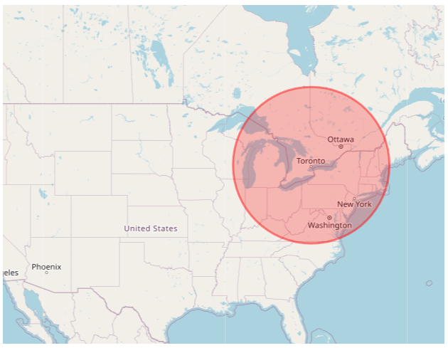
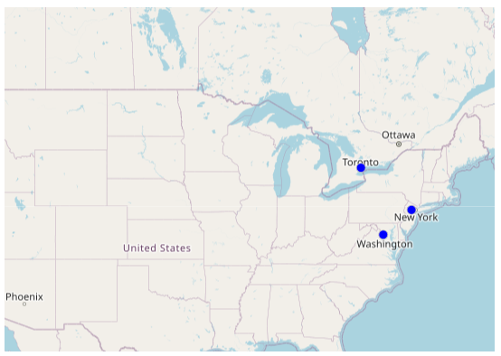

# Shape Types in WPF Maps (SfMaps)

This feature allows you to draw a polygon, polyline, or circle on the map. You can provide input as Geo points to draw shapes in two different ways:

    1.Add shapes using map element collection
    2.Add shapes using point collection
	
## Add shapes using map element collection

You can provide input as a Geo points collection in sample to draw multiple shapes in a single layer. You can also add more shapes using the `MapElements` property of the layer. There are three types of shapes available in map element.

    1.MapPolygon
    2.MapPolyline
    3.MapCircle

### Polygon

Polygon shape type defines a group of land, water bodies, and other features with a spatial extent.




        <Grid Margin="20">
        <Grid.Resources>
            <local:ViewModel x:Key="viewModel"/>
        </Grid.Resources>
        <maps:SfMap x:Name="Maps" ZoomLevel="4" DataContext="{StaticResource viewModel}">
            <maps:SfMap.Layers>
                <maps:ImageryLayer  x:Name="layer" Center="30.9709225,-100.2187212">
                    <maps:ImageryLayer.SubShapeFileLayers>
                        <maps:SubShapeFileLayer x:Name="subLayer">
                            <maps:SubShapeFileLayer.MapElements>

                                <maps:MapPolygon Points="{Binding PolygonPoints1, Source={StaticResource viewModel}}" Fill="Blue" Stroke="DarkBlue" 
                                               StrokeThickness="4"/>

                                <maps:MapPolygon Points="{Binding PolygonPoints2, Source={StaticResource viewModel}}" Fill="Orange" Stroke="Red"
                                               StrokeThickness="4"/>

                            </maps:SubShapeFileLayer.MapElements>
                        </maps:SubShapeFileLayer>
                    </maps:ImageryLayer.SubShapeFileLayers>
                </maps:ImageryLayer>
            </maps:SfMap.Layers>
        </maps:SfMap>
    </Grid>





    public partial class MyPage : ContentPage
    {
        
        public MyPage()
        {
            InitializeComponent();
             
	    ViewModel viewModel = new ViewModel();
            SfMap maps = new SfMap();
            maps.ZoomLevel = 4;
            ImageryLayer layer = new ImageryLayer();
            SubShapeFileLayer subLayer = new SubShapeFileLayer();
            layer.Center = new Point(30.9709225, -100.2187212);

            MapPolygon mapPolygon = new MapPolygon();
            mapPolygon.Fill = new SolidColorBrush(Colors.Blue);
            mapPolygon.Stroke = new SolidColorBrush(Colors.DarkBlue);
            mapPolygon.StrokeThickness = 4;
            mapPolygon.Points = viewModel.PolygonPoints1;
            subLayer.MapElements.Add(mapPolygon);

            mapPolygon = new MapPolygon();
            mapPolygon.Fill = new SolidColorBrush(Colors.Orange);
            mapPolygon.Stroke = new SolidColorBrush(Colors.Red);
            mapPolygon.StrokeThickness = 4;
            mapPolygon.Points = viewModel.PolygonPoints2;
            subLayer.MapElements.Add(mapPolygon);

            layer.SubShapeFileLayers.Add(subLayer);
            maps.Layers.Add(layer);
            this.Content = maps;
       }
    }

    public class ViewModel
    {
        public ObservableCollection<Point> PolygonPoints1
        {
            get; set;
        }

        public ObservableCollection<Point> PolygonPoints2
        {
            get; set;
        }
        public ViewModel()
        {

            PolygonPoints1 = new ObservableCollection<Point>()
            {
                new Point(37.042972,-109.085003),
                new Point(40.992567,-109.021030),
                new Point(40.968420,-102.048065),
                new Point(36.991893,-102.144024),
                new Point(37.042972,-109.085003)
            };
            PolygonPoints2 = new ObservableCollection<Point>()
            {
              new Point(41.04621681452063, -104.0625),
              new Point(41.04621681452063, -102.0849609375),
              new Point(40.01078714046552, -102.041015625),
              new Point(40.04443758460856, -95.44921875),
              new Point(42.48830197960227, -96.3720703125),
              new Point(43.03677585761058, -98.4375),
              new Point(43.068887774169625, -104.0625),
              new Point(41.04621681452063, -104.0625),
            };
        }
    }
   




### Polyline

Polylines are frequently used to define linear features such as roads, rivers, and power lines.




       <maps:SfMap x:Name="Maps" ZoomLevel="5">
            <maps:SfMap.Layers>
                <maps:ImageryLayer  x:Name="layer" Center="49.9709225,10.2187212">
                    <maps:ImageryLayer.SubShapeFileLayers>
                        <maps:SubShapeFileLayer x:Name="subLayer" >
                            <maps:SubShapeFileLayer.MapElements>

                                <maps:MapPolyline Stroke="Black">
                                    <maps:MapPolyline.Points>
                                        <Point>
                                            <Point.X>51.5008</Point.X>
                                            <Point.Y>-0.1224</Point.Y>
                                        </Point>
                                        <Point>
                                            <Point.X>48.8567</Point.X>
                                            <Point.Y>2.3508</Point.Y>
                                        </Point>
                                        <Point>
                                            <Point.X>52.5166</Point.X>
                                            <Point.Y>13.3833</Point.Y>
                                        </Point>
                                        <Point>
                                            <Point.X>48.21327949272514</Point.X>
                                            <Point.Y>16.388290236693138</Point.Y>
                                        </Point>
                                    </maps:MapPolyline.Points>
                                </maps:MapPolyline>

                            </maps:SubShapeFileLayer.MapElements>
                        </maps:SubShapeFileLayer>
                    </maps:ImageryLayer.SubShapeFileLayers>
                </maps:ImageryLayer>
            </maps:SfMap.Layers>
        </maps:SfMap>





    public partial class MyPage : ContentPage
    {
        
        public MyPage()
        {
            InitializeComponent();
             
	     SfMap maps = new SfMap();
            maps.ZoomLevel = 5;
            ImageryLayer layer = new ImageryLayer();
            layer.Center = new Point(49.9709225, 10.2187212);
            SubShapeFileLayer subLayer = new SubShapeFileLayer();
            MapPolyline mapPolyline = new MapPolyline();
            mapPolyline.Stroke = new SolidColorBrush(Colors.Black);
            mapPolyline.Points = new ObservableCollection<Point>()
            {
                new Point(51.5008, -0.1224),
                new Point(48.8567, 2.3508),
                new Point(52.5166, 13.3833),
                new Point(48.21327949272514, 16.388290236693138)
            };
            subLayer.MapElements.Add(mapPolyline);

            layer.SubShapeFileLayers.Add(subLayer);
            maps.Layers.Add(layer);
            this.Content = maps;
       }
    }
   




### Circle

A circle icon has a single geo coordinate value. The circle icons are often used to define features such as oil wells, landmarks, and elevations.


          
    
     <maps:SfMap x:Name="Maps" ZoomLevel="4">
            <maps:SfMap.Layers>
                <maps:ImageryLayer  x:Name="layer" Center="42.9709225,-90.2187212">
                    <maps:ImageryLayer.SubShapeFileLayers>
                        <maps:SubShapeFileLayer x:Name="subLayer" >
                            <maps:SubShapeFileLayer.MapElements>

                                <maps:MapCircle Fill="Blue">
                                    <maps:MapCircle.Center>
                                        <Point>
                                            <Point.X>43.76140927456403</Point.X>
                                            <Point.Y>-79.35451013248883</Point.Y>
                                        </Point>
                                    </maps:MapCircle.Center>
                                </maps:MapCircle>
                                <maps:MapCircle Fill="Blue">
                                    <maps:MapCircle.Center>
                                        <Point>
                                            <Point.X>40.7324105</Point.X>
                                            <Point.Y>-74.4416047</Point.Y>
                                        </Point>

                                    </maps:MapCircle.Center>
                                </maps:MapCircle>
                                <maps:MapCircle Fill="Blue">
                                    <maps:MapCircle.Center>

                                        <Point>
                                            <Point.X>38.8781708</Point.X>
                                            <Point.Y>-77.1889971</Point.Y>
                                        </Point>
                                    </maps:MapCircle.Center>
                                </maps:MapCircle>

                            </maps:SubShapeFileLayer.MapElements>
                        </maps:SubShapeFileLayer>
                    </maps:ImageryLayer.SubShapeFileLayers>
                </maps:ImageryLayer>
            </maps:SfMap.Layers>
        </maps:SfMap>





    public partial class MyPage : ContentPage
    {
        
        public MyPage()
        {
            InitializeComponent();
             
	    SfMap maps = new SfMap();
            maps.ZoomLevel = 4;
            ImageryLayer layer = new ImageryLayer();
            layer.Center = new Point(42.9709225, -90.2187212);
            SubShapeFileLayer subLayer = new SubShapeFileLayer();
            MapCircle mapCircle = new MapCircle();
            mapCircle.Fill = new SolidColorBrush(Colors.Blue);
            mapCircle.Center = new Point(43.76140927456403, -79.35451013248883);
            subLayer.MapElements.Add(mapCircle);

            mapCircle = new MapCircle();
            mapCircle.Fill = new SolidColorBrush(Colors.Blue);
            mapCircle.Center = new Point(40.7324105, -74.4416047);
            subLayer.MapElements.Add(mapCircle);

            mapCircle = new MapCircle();
            mapCircle.Fill = new SolidColorBrush(Colors.Blue);
            mapCircle.Center = new Point(38.8781708, -77.1889971);
            subLayer.MapElements.Add(mapCircle);

            layer.SubShapeFileLayers.Add(subLayer);
            maps.Layers.Add(layer);
            this.Content = maps;
       }
    }

   




### Customization of map elements

The following properties are used to customize `MapPolygon`, `MapPolyline`, and `MapCircle`.

* `Fill`, `Stroke`, `StrokeThickness` - Used to customize the appearance of the map element's shape UI.
* `Center` - Holds latitude and longitude values that defines the center of the circle. This property is available only for `MapCircle`.
* `Radius` - Used to customize radius or range of the map circle. This property is available only for `MapCircle`.


          
    
      <maps:SfMap x:Name="Maps" ZoomLevel="4">
            <maps:SfMap.Layers>
                <maps:ImageryLayer  x:Name="layer" Center="42.9709225,-90.2187212">
                    <maps:ImageryLayer.SubShapeFileLayers>
                        <maps:SubShapeFileLayer x:Name="subLayer" >
                            <maps:SubShapeFileLayer.MapElements>

                                <maps:MapCircle Fill="#3eFF0000" Stroke="#73FF0000" 
                                                StrokeThickness="3" Radius="110">
                                    <maps:MapCircle.Center>
                                        <Point>
                                            <Point.X>43.76140927456403</Point.X>
                                            <Point.Y>-79.35451013248883</Point.Y>
                                        </Point>
                                    </maps:MapCircle.Center>
                                </maps:MapCircle>
                               

                            </maps:SubShapeFileLayer.MapElements>
                        </maps:SubShapeFileLayer>
                    </maps:ImageryLayer.SubShapeFileLayers>
                </maps:ImageryLayer>
            </maps:SfMap.Layers>
        </maps:SfMap>





    public partial class MyPage : ContentPage
    {
        
        public MyPage()
        {
            InitializeComponent();
             
	    SfMap maps = new SfMap();
            maps.ZoomLevel = 4;
            ImageryLayer layer = new ImageryLayer();
            layer.Center = new Point(42.9709225, -90.2187212);
            SubShapeFileLayer subLayer = new SubShapeFileLayer();
            MapCircle mapCircle = new MapCircle();
            mapCircle.Fill = new SolidColorBrush(Color.FromArgb(115, 255, 0, 0));
            mapCircle.StrokeThickness = 3;
            mapCircle.Stroke = new SolidColorBrush(Color.FromArgb(62, 255, 0, 0));
            mapCircle.Radius = 110;
            mapCircle.Center = new Point(43.76140927456403, -79.35451013248883);
            subLayer.MapElements.Add(mapCircle);

            layer.SubShapeFileLayers.Add(subLayer);
            maps.Layers.Add(layer);
            this.Content = maps;
       }
    }

   




## Add shapes using point collection

To draw a shape, you can provide input as a Geo point collection in sample. You can also add more number of shapes by using Maps [`SubShapeFileLayer`](https://help.syncfusion.com/wpf/maps/multilayer-support#subshapefilelayers) support. In shape file layer, there are three type of shapes that can be changed by using the [`ShapeType`](https://help.syncfusion.com/cr/wpf/Syncfusion.UI.Xaml.Maps.ShapeFileLayer.html#Syncfusion_UI_Xaml_Maps_ShapeFileLayer_ShapeType) property.

    1.Polyline
    2.Polygon
    3.Point icon
    
### Polygon

Polygon shape type defines a group of land, water bodies, and other features with a spatial extent.




       <maps:SfMap x:Name="maps" ZoomLevel="4">
            <maps:SfMap.Layers>
                <maps:ImageryLayer Center="30.9709225,-100.2187212" >
                    <maps:ImageryLayer.SubShapeFileLayers>
                        <maps:SubShapeFileLayer  x:Name="sublayer1" ShapeType="Polygon" Points="{Binding SubLayer1}">
                            <maps:SubShapeFileLayer.ShapeSettings>
                                <maps:ShapeSetting ShapeFill="Blue" ShapeStroke="DarkBlue" 
                                               ShapeStrokeThickness="4" />
                            </maps:SubShapeFileLayer.ShapeSettings>
                        </maps:SubShapeFileLayer>
                        <maps:SubShapeFileLayer  x:Name="sublayer2" ShapeType="Polygon" Points="{Binding SubLayer2}">
                            <maps:SubShapeFileLayer.ShapeSettings>
                                <maps:ShapeSetting ShapeFill="Orange" ShapeStroke="Red"
                                               ShapeStrokeThickness="4" />
                            </maps:SubShapeFileLayer.ShapeSettings>
                        </maps:SubShapeFileLayer>
                    </maps:ImageryLayer.SubShapeFileLayers>
                </maps:ImageryLayer>
            </maps:SfMap.Layers>
        </maps:SfMap>





    public partial class MainPage : ContentPage
    {
        ViewModel obj = new ViewModel();
        public MainPage()
        {
            InitializeComponent();
            this.DataContext = obj;
            SfMap maps = new SfMap();
            maps.ZoomLevel = 4;
            ImageryLayer layer = new ImageryLayer();
            layer.Center = new Point(30.9709225, -100.2187212);
            SubShapeFileLayer subLayer1 = new SubShapeFileLayer();
            subLayer1.ShapeType = ShapeType.Polygon;
            subLayer1.Points = obj.SubLayer1;
            layer.SubShapeFileLayers.Add(subLayer1);
            SubShapeFileLayer subLayer2 = new SubShapeFileLayer();
            subLayer2.ShapeType = ShapeType.Polygon;
            subLayer1.Points = obj.SubLayer2;
            layer.SubShapeFileLayers.Add(subLayer2);
            ShapeSetting subLayerSetting1 = new ShapeSetting();
            subLayerSetting1.ShapeStrokeThickness = 4;
            subLayerSetting1.ShapeFill = new SolidColorBrush(Colors.Blue);
            subLayerSetting1.ShapeStroke = new SolidColorBrush(Colors.DarkBlue);
            subLayer1.ShapeSettings = subLayerSetting1;
            ShapeSetting subLayerSetting2 = new ShapeSetting();
            subLayerSetting2.ShapeStrokeThickness = 4;
            subLayerSetting2.ShapeFill = new SolidColorBrush(Colors.Orange);
            subLayerSetting2.ShapeStroke = new SolidColorBrush(Colors.Red);
            subLayer2.ShapeSettings = subLayerSetting2;
            subLayer1.Points = obj.SubLayer1;
            subLayer2.Points = obj.SubLayer2;
            maps.Layers.Add(layer);
            this.Content = maps;
        }
    }

    public class ViewModel
    {
         public ObservableCollection<Point> SubLayer1
        {
            get;set;
        }

        public ObservableCollection<Point> SubLayer2
        {
            get; set;
        }
        public ViewModel()
        {

            SubLayer1 = new ObservableCollection<Point>()
            {
                new Point(37.042972,-109.085003),
                new Point(40.992567,-109.021030),
                new Point(40.968420,-102.048065),
                new Point(36.991893,-102.144024),
                new Point(37.042972,-109.085003)
            };
            SubLayer2 = new ObservableCollection<Point>()
            {
              new Point(41.04621681452063, -104.0625),
              new Point(41.04621681452063, -102.0849609375),
              new Point(40.01078714046552, -102.041015625),
              new Point(40.04443758460856, -95.44921875),
              new Point(42.48830197960227, -96.3720703125),
              new Point(43.03677585761058, -98.4375),
              new Point(43.068887774169625, -104.0625),
              new Point(41.04621681452063, -104.0625),
            };
        }
    }




### Polyline

Polylines are frequently used to define linear features such as roads, rivers, and power lines.




 
        <maps:SfMap x:Name="Maps" ZoomLevel="5">
            <maps:SfMap.Layers>
                <maps:ImageryLayer  x:Name="layer" Center="49.9709225,10.2187212">
                    <maps:ImageryLayer.SubShapeFileLayers>
                        <maps:SubShapeFileLayer x:Name="subLayer" ShapeType="Polyline">
                            <maps:SubShapeFileLayer.Points>
                                <Point>
                                    <Point.X>51.5008</Point.X>
                                    <Point.Y>-0.1224</Point.Y>
                                </Point>
                                <Point>
                                    <Point.X>48.8567</Point.X>
                                    <Point.Y>2.3508</Point.Y>
                                </Point>
                                <Point>
                                    <Point.X>52.5166</Point.X>
                                    <Point.Y>13.3833</Point.Y>
                                </Point>
                                <Point>
                                    <Point.X>48.21327949272514</Point.X>
                                    <Point.Y>16.388290236693138</Point.Y>
                                </Point>

                            </maps:SubShapeFileLayer.Points>
                            <maps:SubShapeFileLayer.ShapeSettings>
                                <maps:ShapeSetting x:Name="settings" ShapeFill="Black" ShapeStrokeThickness="1"/>
                            </maps:SubShapeFileLayer.ShapeSettings>
                        </maps:SubShapeFileLayer>
                    </maps:ImageryLayer.SubShapeFileLayers>
                </maps:ImageryLayer>
            </maps:SfMap.Layers>
        </maps:SfMap>    





    public partial class MyPage : ContentPage
    {
        
        public MyPage()
        {
            InitializeComponent();
            
            SfMap maps = new SfMap();
            maps.ZoomLevel = 5;
            ImageryLayer layer = new ImageryLayer();
            layer.Center = new Point(49.9709225, 10.2187212);
            SubShapeFileLayer subLayer = new SubShapeFileLayer();
            subLayer.Points = new ObservableCollection<Point>()
            {
                new Point(51.5008, -0.1224),
                new Point(48.8567, 2.3508),
                new Point(52.5166, 13.3833),
                new Point(48.21327949272514, 16.388290236693138)
            };
            subLayer.ShapeType = ShapeType.Polyline;

            ShapeSetting subLayerSetting = new ShapeSetting();
            subLayerSetting.ShapeStrokeThickness = 1;
            subLayerSetting.ShapeFill = new SolidColorBrush(Colors.Black);
            subLayer.ShapeSettings = subLayerSetting;
            layer.SubShapeFileLayers.Add(subLayer);
            maps.Layers.Add(layer);
            this.Content = maps;
        }
    }
    
    




### Point icon

A point icon has a single geo coordinate value. The point icons are often used to define features such as oil wells, landmarks, and elevations.




             <maps:SfMap x:Name="Maps" >
            <maps:SfMap.Layers>
                <maps:ImageryLayer  x:Name="layer">
                    <maps:ImageryLayer.SubShapeFileLayers>
                        <maps:SubShapeFileLayer x:Name="subLayer" MapPointIconSize="10" ShapeType="PointIcon">
                            <maps:SubShapeFileLayer.Points>
                                <Point>
                                    <Point.X>48.95</Point.X>
                                    <Point.Y>-122.68</Point.Y>
                                </Point>
                                <Point>
                                    <Point.X>30.197</Point.X>
                                    <Point.Y>-102.6564</Point.Y>
                                </Point>
                                <Point>
                                    <Point.X>36.3305</Point.X>
                                    <Point.Y>-77.5437</Point.Y>
                                </Point>
                                <Point>
                                    <Point.X>47.2331</Point.X>
                                    <Point.Y>-90.140212</Point.Y>
                                </Point>
                            </maps:SubShapeFileLayer.Points>
                            <maps:ShapeFileLayer.ShapeSettings>
                                <maps:ShapeSetting ShapeFill="Red" ShapeStroke="Red"/>
                            </maps:ShapeFileLayer.ShapeSettings>
                        </maps:SubShapeFileLayer>
                    </maps:ImageryLayer.SubShapeFileLayers>
                </maps:ImageryLayer>
            </maps:SfMap.Layers>
        </maps:SfMap>





    public partial class MyPage : ContentPage
    {
        ViewModel obj = new ViewModel();
        public MyPage()
        {
            InitializeComponent();
            this.DataContext = obj;
            SfMap maps = new SfMap();
            ImageryLayer layer = new ImageryLayer();
            SubShapeFileLayer subLayer = new SubShapeFileLayer();
            subLayer.Points.Add(new Point(48.95, -122.68));
            subLayer.Points.Add(new Point(30.197, -102.6564));
            subLayer.Points.Add(new Point(36.3305, -77.5437));
            subLayer.Points.Add(new Point(47.2331, -90.140212));
            subLayer.MapPointIconSize = 10;
            subLayer.ShapeType = ShapeType.PointIcon;
            ShapeSetting subLayerSetting = new ShapeSetting();
            subLayerSetting.ShapeFill = new SolidColorBrush(Colors.Red);
            subLayerSetting.ShapeStroke = new SolidColorBrush(Colors.Red);
            subLayer.ShapeSettings = subLayerSetting;
            layer.SubShapeFileLayers.Add(subLayer);
            maps.Layers.Add(layer);
            this.Content = maps;
       }
    }




### Customization of points

The size, shape, and position of the map points can be customized using the [`MapPointIconSize`](https://help.syncfusion.com/cr/wpf/Syncfusion.UI.Xaml.Maps.ShapeFileLayer.html#Syncfusion_UI_Xaml_Maps_ShapeFileLayer_MapPointIconSize), [`MapPointIcon`](https://help.syncfusion.com/cr/wpf/Syncfusion.UI.Xaml.Maps.ShapeFileLayer.html#Syncfusion_UI_Xaml_Maps_ShapeFileLayer_MapPointIcon), [`MapPointHorizontalAlignment`](https://help.syncfusion.com/cr/wpf/Syncfusion.UI.Xaml.Maps.ShapeFileLayer.html#Syncfusion_UI_Xaml_Maps_ShapeFileLayer_MapPointHorizontalAlignment), and [`MapPointVerticalAlignment`](https://help.syncfusion.com/cr/wpf/Syncfusion.UI.Xaml.Maps.ShapeFileLayer.html#Syncfusion_UI_Xaml_Maps_ShapeFileLayer_MapPointVerticalAlignment) properties of the shape file layer.
