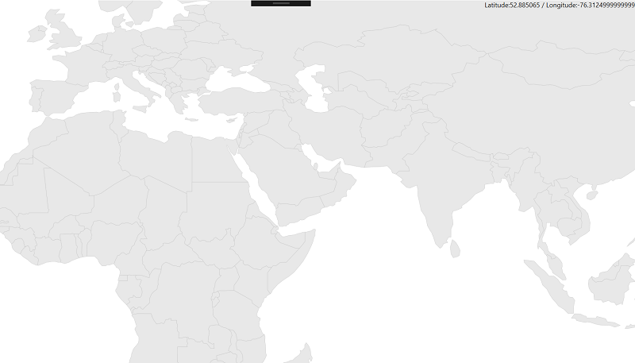
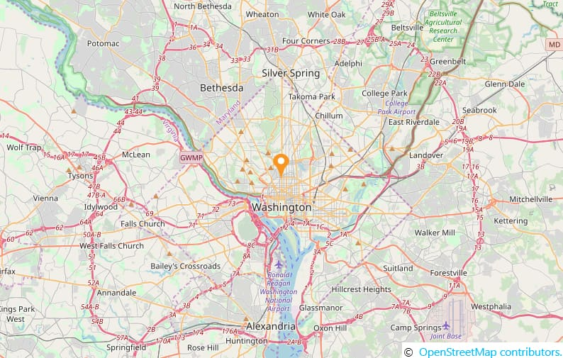
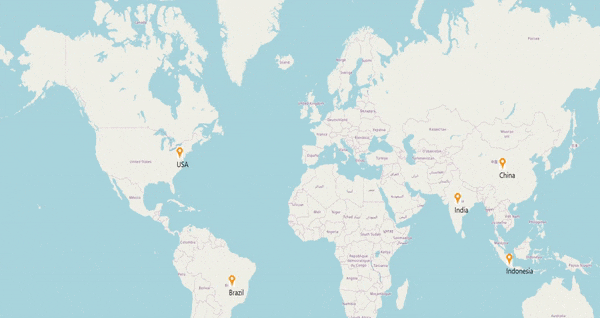

# Zooming and Panning in WPF Maps (SfMap)

The Zooming and Panning feature of the Maps control allows you to zoom in and out and navigate the map.

### Zooming

The zooming feature enables you to zoom in and out of the map to show in-depth information. It is controlled by the [`ZoomLevel`](https://help.syncfusion.com/cr/wpf/Syncfusion.SfMaps.WPF~Syncfusion.UI.Xaml.Maps.SfMap~ZoomLevel.html) property of the map. When the zoom level of the Map control is increased, the map is zoomed in. When the zoom level is decreased, then the map is zoomed out.

### Properties Related to Zooming

The following properties are related to the zooming feature of the Maps control:

1. ZoomLevel
2. EnableZoom
3. MinZoom
4. MaxZoom

#### ZoomLevel

[`ZoomLevel`](https://help.syncfusion.com/cr/wpf/Syncfusion.SfMaps.WPF~Syncfusion.UI.Xaml.Maps.SfMap~ZoomLevel.html) is the primary property of the zooming feature. It controls the map’s scale size while zooming. Initially, the zoom level is 1. ZoomLevel cannot be less than 1.

#### EnableZoom

The [`EnableZoom`](https://help.syncfusion.com/cr/wpf/Syncfusion.SfMaps.WPF~Syncfusion.UI.Xaml.Maps.SfMap~EnableZoom.html) property enables or disables the zooming feature. A “True” value of this property enables the zooming feature and “False” disables the zooming feature.

#### MinZoom

The [`MinZoom`](https://help.syncfusion.com/cr/wpf/Syncfusion.SfMaps.WPF~Syncfusion.UI.Xaml.Maps.SfMap~MinZoom.html) property is used to set the minimum zoom level of the map. 

####  MaxZoom

The [`MaxZoom`](https://help.syncfusion.com/cr/wpf/Syncfusion.SfMaps.WPF~Syncfusion.UI.Xaml.Maps.SfMap~MaxZoom.html) property is used to set the maximum zoom level of the Map control.

Sample code for setting zooming feature properties:



<syncfusion:SfMap ZoomLevel="3" MinZoom="1" MaxZoom="20" EnableZoom="True">                

</syncfusion:SfMap >



## Zooming in ShapeFileLayer 

### Methods to Zoom the Map

Maps can be zoomed by using the following methods:

1. By changing the ZoomLevel.
2. Through the Zoom method.
3. Through the mouse scroll.

#### Changing the ZoomLevel

A map can be zoomed by changing the zoom level of the Map control. Incrementing the ZoomLevel, zooms in the map and decrementing the ZoomLevel, zooms out the map.

#### Through the Zoom method

Maps can be zoomed through the [`Zoom`](https://help.syncfusion.com/cr/wpf/Syncfusion.SfMaps.WPF~Syncfusion.UI.Xaml.Maps.SfMap~Zoom.html) method. The Zoom method has the parameter zoom value. The map can be zoomed or scaled with the zoom value parameter.



   SfMap syncMap = new SfMap();

   ShapeFileLayer shapeLayer = new ShapeFileLayer();

   shapeLayer.Uri = "MapApp.ShapeFiles.world1.shp";

   syncMap.Layers.Add(shapeLayer);

   syncMap.Zoom(5);



#### Through a mouse wheel event

In addition to the pinching event, the map can be zoomed with mouse events.  When the mouse is scrolled up, the map is zoomed in. When the mouse is scrolled down, the map is zoomed out.

### Panning the map

The panning feature enables navigation through the map.

Properties related to Panning are:

* EnablePan

#### Enable and disable pan

The [`EnablePan`](https://help.syncfusion.com/cr/wpf/Syncfusion.SfMaps.WPF~Syncfusion.UI.Xaml.Maps.SfMap~EnablePan.html) property enables or disables the panning feature of the map. A “True” value enables the panning feature. A “False” value disables the panning feature of the map.



       <syncfusion:SfMap ShowCoords="True" LatitudeLongitudeType="Decimal" EnablePan="True">         
            <syncfusion:SfMap.Layers>
                <syncfusion:ShapeFileLayer   Uri="MapApp.world1.shp">                    
                </syncfusion:ShapeFileLayer>
            </syncfusion:SfMap.Layers>
        </syncfusion:SfMap >



### Ways to pan the map

There are two methods for panning the map. They are:

1. Through the Pan method.
2. By dragging the map.

#### Through the Pan method

The map can be panned with the [`Pan`](https://help.syncfusion.com/cr/wpf/Syncfusion.SfMaps.WPF~Syncfusion.UI.Xaml.Maps.SfMap~Pan.html) method in the Maps control. The Pan method has two parameters: x and y.  The map is translated with respect to the x and y parameters.

##### Code sample for the Pan method:



           SfMap syncMap = new SfMap();

            syncMap.EnablePan = true;

            ShapeFileLayer layer = new ShapeFileLayer();

            layer.Uri = "App2.world1.shp";

            syncMap.Layers.Add(layer);

            syncMap.Pan(200, 200);


#### Dragging the map

The map can be panned by dragging the map through mouse interactions. This works automatically for touch events.

N> The map can be panned only when some parts of the map are outside the view of the control.

## Zooming in ImageryLayer

### Calculate a zoom level

This feature allows you to set the initial zoom level automatically in two ways:

* Distance Radius(KM/miles)
* Geo-bounds(Northeast, Southwest)

### Distance Radius 

N> DistanceType default value is KiloMeter.

Calculate the initial zoom level automatically based on the [`Radius`](https://help.syncfusion.com/cr/wpf/Syncfusion.SfMaps.WPF~Syncfusion.UI.Xaml.Maps.ImageryLayer~Radius.html) and [`DistanceType`](https://help.syncfusion.com/cr/wpf/Syncfusion.SfMaps.WPF~Syncfusion.UI.Xaml.Maps.ImageryLayer~DistanceType.html) properties of ImageryLayer.

* [`Center`](https://help.syncfusion.com/cr/wpf/Syncfusion.SfMaps.WPF~Syncfusion.UI.Xaml.Maps.ImageryLayer~Center.html) - Represents center point of ImageryLayer.  





      <Window.Resources>
        <ResourceDictionary >
            <DataTemplate x:Key="markerTemplate">
                <Grid Margin="-12,-30,0,0">
                    <Canvas>
                        <Image Source="pin.png" Height="30"/>
                    </Canvas>
                </Grid>
            </DataTemplate>
        </ResourceDictionary>
    </Window.Resources>
	
    <Grid>
        <maps:SfMap>
            <maps:SfMap.Layers>
                <maps:ImageryLayer MarkerTemplate="{StaticResource ResourceKey=markerTemplate}" Markers="{Binding Models}" Center="38.909804, -77.043442" Radius="5" DistanceType="KiloMeter" >
                </maps:ImageryLayer>
            </maps:SfMap.Layers>
        </maps:SfMap>
    </Grid>





            SfMap maps = new SfMap();
            ImageryLayer layer = new ImageryLayer();
            layer.Center = new Point(38.909804, -77.043442);
            layer.Radius = 5;
            layer.DistanceType = DistanceType.KiloMeter;
            layer.Markers = obj.Models;
            layer.MarkerTemplate = this.Resources["markerTemplate"] as DataTemplate;
            maps.Layers.Add(layer);
			
	  public class Model
      {
        public string Longitude { get; set; }
        public string Latitude { get; set; }
      }
			
	   public class ViewModel
       {
          public ObservableCollection<Model> Models { get; set; }
          public ViewModel()
          {
            this.Models = new ObservableCollection<Model>();
            this.Models.Add(new Model() { Latitude = "38.909804", Longitude = "-77.043442" });
         }
      }





### Geo-bounds

Calculate the initial zoom level automatically based on the [`LatLngBounds`](https://help.syncfusion.com/cr/wpf/Syncfusion.SfMaps.WPF~Syncfusion.UI.Xaml.Maps.ImageryLayer~LatLngBounds.html) of ImageryLayer.





        <Window.Resources>
        <ResourceDictionary >
            <DataTemplate x:Key="markerTemplate">
                <Grid Margin="-12,-30,0,0">
                    <Canvas>
                        <Image Source="pin.png" Height="30"/>
                    </Canvas>
                </Grid>
            </DataTemplate>
        </ResourceDictionary>
    </Window.Resources>
    <Grid>
        <maps:SfMap>
            <maps:SfMap.Layers>
                <maps:ImageryLayer LayerType="OSM" MarkerTemplate="{StaticResource ResourceKey=markerTemplate}"  Markers="{Binding Models}"  >
                    <maps:ImageryLayer.LatLngBounds>
                        <maps:LatLngBounds Northeast="38.909804, -77.043442" Southwest="38.909804, -77.043442" >
                        </maps:LatLngBounds>
                    </maps:ImageryLayer.LatLngBounds>
                </maps:ImageryLayer>
            </maps:SfMap.Layers>
        </maps:SfMap>
    </Grid>





            SfMap maps = new SfMap();
            ImageryLayer layer = new ImageryLayer();
            LatLngBounds bounds = new LatLngBounds();
            bounds.Northeast = new Point(38.909804, -77.043442);
            bounds.Southwest = new Point(38.909804, -77.043442);
            layer.LatLngBounds = bounds;
            layer.Markers = obj.Models;
            layer.MarkerTemplate = this.Resources["markerTemplate"] as DataTemplate;
            maps.Layers.Add(layer);
			
	  public class Model
      {
        public string Longitude { get; set; }
        public string Latitude { get; set; }
      }
			
	   public class ViewModel
       {
          public ObservableCollection<Model> Models { get; set; }
          public ViewModel()
          {
            this.Models = new ObservableCollection<Model>();
            this.Models.Add(new Model() { Latitude = "38.909804", Longitude = "-77.043442" });
         }
      }





N> When setting LatLngBounds and DistanceRadius at the same time, the priority is DistanceRadius, and calculate zoom level based on Radius value.

### Calculate the map tile layer bounds

Calculate the imagery layer pixel bounds while zooming, panning, and Geo-Coordinate value changing.





      <maps:SfMap>
            <maps:SfMap.Layers>
                <maps:ImageryLayer x:Name="layer"  Center="30.9709225, -100.2187212" CenterChanged="layer_CenterChanged">
                </maps:ImageryLayer>
            </maps:SfMap.Layers>
      </maps:SfMap>





    public partial class MapBound : ContentPage
    {
        ImageryLayer layer = new ImageryLayer();
        public MapBound()
        {
            InitializeComponent();
            SfMap maps = new SfMap();
            layer.Center = new Point(30.9709225, -100.2187212);
            layer.CenterChanged += layer_CenterChanged;
            maps.Layers.Add(layer);
            this.Content = maps;
        }
        private void layer_CenterChanged(object sender, CenterChangedEventArgs e)
        {
            var pixelbounds = layer.MapBounds;
        }
    }





### Pinch zooming in ImageryLayer

If you want to zoom the imagery layer using fingers by touch, then you have to enable `EnableZoom` and `IsManipulationEnabled` property of map control.





    <Window.Resources>
        <ResourceDictionary>
            <DataTemplate x:Key="markerTemplate">
                <Grid>
                    <Canvas Margin="-12,-30,0,0">
                        <Image Source="pin.png" Height="30" />
                        <TextBlock HorizontalAlignment="Center" Margin="0,30,0,0" FontSize="20" FontFamily="Segoe UI" Text="{Binding Label}"/>
                    </Canvas>
                </Grid>
            </DataTemplate>
        </ResourceDictionary>
    </Window.Resources>
    <Grid>
        <Grid>
            <syncfusion:SfMap ZoomLevel="3" IsManipulationEnabled="True" EnableZoom="True">
                <syncfusion:SfMap.Layers>
                    <syncfusion:ImageryLayer  Markers="{Binding Models}" MarkerTemplate="{StaticResource markerTemplate}">
                    </syncfusion:ImageryLayer>
                </syncfusion:SfMap.Layers>
            </syncfusion:SfMap>
        </Grid>





            SfMap maps = new SfMap();
            ImageryLayer layer = new ImageryLayer();
            layer.Markers = view.Models;
            maps.ZoomLevel = 3;
            layer.MarkerTemplate = Resources["markerTemplate"] as DataTemplate;
            maps.IsManipulationEnabled = true;
            maps.EnableZoom = true;
            maps.Layers.Add(layer);
            this.Content = maps;
			
    public class ViewModel
    {
        public ObservableCollection<Model> Models { get; set; }
        public ViewModel()
        {
            this.Models = new ObservableCollection<Model>();
            this.Models.Add(new Model() { Label = "USA", Latitude = "38.8833N", Longitude = "77.0167W" });
            this.Models.Add(new Model() { Label = "Brazil ", Latitude = "15.7833S", Longitude = "47.8667W" });
            this.Models.Add(new Model() { Label = "India ", Latitude = "21.0000N", Longitude = "78.0000E" });
            this.Models.Add(new Model() { Label = "China ", Latitude = "35.0000N", Longitude = "103.0000E" });
            this.Models.Add(new Model() { Label = "Indonesia ", Latitude = "6.1750S", Longitude = "106.8283E" });
        }
    }

    public class Model
    {
        public string Label { get; set; }
        public string Longitude { get; set; }
        public string Latitude { get; set; }
    }





You can able to cancel the pinch zooming in ImageryLayer by setting [`Cancel`](https://help.syncfusion.com/cr/wpf/Syncfusion.SfMaps.WPF~Syncfusion.UI.Xaml.Maps.ZoomLevelChangingEventArgs~Cancel.html) property as true in [`ZoomLevelChanging`](https://help.syncfusion.com/cr/wpf/Syncfusion.SfMaps.WPF~Syncfusion.UI.Xaml.Maps.ImageryLayer~ZoomLevelChanging_EV.html) event argument as per the below code snippet. 





       <syncfusion:SfMap EnableZoom="True" IsManipulationEnabled="True">
            <syncfusion:SfMap.Layers>
                <syncfusion:ImageryLayer Markers="{Binding Models}"
                                        ZoomLevelChanging="ImageryLayer_ZoomLevelChanging"/>
            </syncfusion:SfMap.Layers>
        </syncfusion:SfMap>





        private void ImageryLayer_ZoomLevelChanging(object sender, ZoomLevelChangingEventArgs e)
        {
            e.Cancel = true;
        }
          



