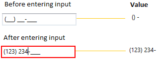
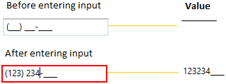
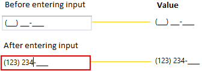
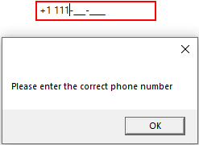

# Working with SfMaskedEdit

This section explains accessing the [SfMaskedEdit](https://help.syncfusion.com/cr/wpf/Syncfusion.SfInput.Wpf~Syncfusion.Windows.Controls.Input.SfMaskedEdit.html) properties and events associated with it.

## Restrict the user to enter valid data

You can restrict the user to enter the valid input without any custom validation by creating the mask pattern as your requirement. You can enable the mask by setting the mask pattern to the [Mask](https://help.syncfusion.com/cr/wpf/Syncfusion.SfInput.Wpf~Syncfusion.Windows.Controls.Input.SfMaskedEdit~Mask.html) property and set the [MaskType](https://help.syncfusion.com/cr/wpf/Syncfusion.SfInput.Wpf~Syncfusion.Windows.Controls.Input.SfMaskedEdit~MaskType.html) property value as `Regex`. The default value of `Mask` property is `null` and `MaskType` property is `Simple`. The following table demonstrates the mask elements with its description,

<table>
<tr>
<th>
Elements</th><th>
Description</th></tr>
<tr>
<td>
[]</td><td>
It denotes the set to define the particular input elements</td></tr>
<tr>
<td>
[ABC]</td><td>
Accepts any single character included in the specified set of characters.</td></tr>
<tr>
<td>
[^ABC]</td><td>
Accepts any single character not included in the specified set of characters.</td></tr> 
<tr>
<td>
[A-Z]</td><td>
Accepts any character between two specified set of characters inclusive.</td></tr>
<tr>
<td>
\d</td><td>
Accepts any digit. Same as [0-9].</td></tr>
<tr>
<td>
\D</td><td>
Accepts any non-digit. Same as [^0-9].</td></tr>
<tr>
<td>
\w</td><td>
Accepts any word character. \w is the same as [a-zA-Z_0-9].</td></tr>
<tr>
<td>
\W</td><td>
Accepts any non-word character. \W is the same as [^a-zA-Z_0-9].</td></tr>
<tr>
<td>
\s</td><td>
Accepts any white space characters.</td></tr>
<tr>
<td>
\S</td><td>
Accepts any non-white space characters.</td></tr>
<tr>
<td>
(?=subexpression)</td><td>
Matches a group after the main expression without including it in the result.</td></tr>
<tr>
<td>
(?!subexpression )</td><td>
Specifies a group that cannot match after the main expression.</td></tr>
<tr>
<td>
{n}</td><td>
Accepts the input for n number of times.</td></tr>
<tr>
<td>
{n,}</td><td>
Accepts the input for 'n' and more than 'n' number of times. </td></tr>
<tr>
<td>
{n,m}</td><td>
Accepts the input for n minimum number of times and m maximum number of times.</td></tr>
<tr>
<td>
+</td><td>
Accepts one or more matches for the preceding character.</td></tr>
<tr>
<td>
*</td><td>
Accepts zero or more matches for the preceding character.</td></tr>
<tr>
<td>
?</td><td>
Optional input (Zero or one occurrence  of the matching input).</td></tr>
<tr>
<td>
|</td><td>
Acts like a Boolean OR. Matches the expression before or after the |.</td></tr>
<tr>
<td>
.</td><td>
Accepts any character. It can be changed based on culture.</td></tr>
</table>

### Allow specific values

If you want to allow the user to enter only the specific values, use the `(?=subexpression)` with the mask. It will match the input with the mask when value is same as the subexpression.




<syncfusion:SfMaskedEdit Mask="(?=123)\d{3}" 
                         MaskType = "RegEx"
                         Name="sfMaskedEdit"/>




SfMaskedEdit sfMaskedEdit = new SfMaskedEdit();
sfMaskedEdit.MaskType = MaskType.RegEx;
sfMaskedEdit.Mask = @"(?=123)\d{3}";




For the input mask `(?=123)\d{3}`. It allows first two digit. While entering the third digit, it will validate the regex and restrict the input. It allows the output only when the MaskText is “123” for this given input.

### Restrict specific values

If you want to restrict the user to enter some specific values, use the `(?!subexpression)` with the mask. It will not allow the input when value is same as the subexpression.




<syncfusion:SfMaskedEdit Mask="(?!55)(?!000)(?!666)\d{3}" 
                         MaskType = "RegEx"
                         Name="sfMaskedEdit"/>




SfMaskedEdit sfMaskedEdit = new SfMaskedEdit();
sfMaskedEdit.MaskType = MaskType.RegEx;
sfMaskedEdit.Mask = @"(?!55)(?!000)(?!666)\d{3}";




For the input mask `(?!55)(?!000)(?!666)\d{3}` – `\d{3}` denotes that the output will be of 3 character length. `(?55)` denotes the value will not begin with `55`. `(?!000)(?!666)` denotes the output cannot be `000` or `666`.

### Basic Mask examples

You can create your custom mask as follows,

<table>
<tr>
<th>
Mask use case </th><th>
Pattern</th><th>
Example</th></tr>
<tr>
<td>
Positive whole number</td><td>
\d+</td><td>
</td></tr>
<tr>
<td>
Negative whole number</td><td>
-\d+</td><td>
</td></tr>
<tr>
<td>
Positive and negative whole number</td><td>
-?\d+</td><td>
</td></tr>
<tr>
<td>
Positive and negative float number</td><td>
-?\d+\.?\d*</td><td>
</td></tr>
<tr>
<td>
Percent value</td><td>
\d+\.\d{2}%</td><td>
</td></tr>
<tr>
<td>
Currency value</td><td>
$ \d+\.\d{2}"</td><td>
</td></tr>
<tr>
<td>
Alphanumeric with space</td><td>
[a-zA-Z0-9 ]*</td><td>
</td></tr>
<tr>
<td>
Alphanumeric without space</td><td>
[a-zA-Z0-9]*</td><td>
</td></tr>
<tr>
<td>
Email ID</td><td>
[A-Za-z0-9._%-]+@[A-Za-z0-9]+.[A-Za-z]{2,3}</td><td>
</td></tr>
<tr>
<td>
Hexadecimal number</td><td>
\\x[0-9A-Fa-f]{1,2}</td><td>
</td></tr>
<tr>
<td>
Octal number</td><td>
\\0[0-7]{1,3}</td><td>
</td></tr>
<tr>
<td>
Hexadecimal color code</td><td>
#[A-Fa-f0-9]{6}</td><td>
</td></tr>
<tr>
<td>
Time</td><td>
(0[0-9]|1[0-9]|2[0-3]):[0-5][0-9]</td><td>
</td></tr>
<tr>
<td>
Phone number</td><td>
\([0-9]\d{2}\) [0-9]\d{2}-[0-9]\d{3}</td><td>
</td></tr>
<tr>
<td>
Product key</td><td>
[A-Z\d]{5}-[A-Z\d]{5}-[A-Z\d]{5}-[A-Z\d]{5}-[A-Z\d]{5}</td><td>
</td></tr>
<tr>
<td>
Zip code</td><td>
\d{5}-\d{5}</td><td>
</td></tr>
<tr>
<td>
Bank SWIFT code</td><td>
[A-Z]{6}[0-9]{2}[A-Z]{3}</td><td>
</td></tr>
<tr>
<td>
Bank Account Number</td><td>
\d{8,12}</td><td>
</td></tr>
<tr>
<td>
Credit Card Number</td><td>
\d{4} \d{4} \d{4} \d{4}</td><td>
</td></tr>
</table>

N> View [Sample](https://github.com/SyncfusionExamples/syncfusion-wpf-maskedtextbox-examples/tree/master/Samples/BasicMasks) in GitHub

## Setting the value

You can set the value for the `SfMaskedEdit` by using the [Value](https://help.syncfusion.com/cr/wpf/Syncfusion.SfInput.Wpf~Syncfusion.Windows.Controls.Input.SfMaskedEdit~Value.html) property. Based on the mask, the value of `Value` property is formatted. The default value of `Value` property is `null`.




<syncfusion:SfMaskedEdit Value="4553456789"
                         Mask="\([0-9]\d{2}\) [0-9]\d{2}-[0-9]\d{3}" 
                         MaskType = "RegEx"
                         Name="sfMaskedEdit"/>




SfMaskedEdit sfMaskedEdit = new SfMaskedEdit();
sfMaskedEdit.Value="4553456789";
sfMaskedEdit.MaskType = MaskType.RegEx;
sfMaskedEdit.Mask = @"\([0-9]\d{2}\) [0-9]\d{2}-[0-9]\d{3}";




N> View [Sample](https://github.com/SyncfusionExamples/syncfusion-wpf-maskedtextbox-examples/tree/master/Samples/InputOptions) in GitHub

## Get the value in various formats

By default, the `Value` property holds your input characters, prompt characters, and the literals defined in the mask. You can modify this and allow the `Value` property to hold the characters without prompt and literals by setting the [ValueMaskFormat](https://help.syncfusion.com/cr/wpf/Syncfusion.SfInput.Wpf~Syncfusion.Windows.Controls.Input.SfMaskedEdit~ValueMaskFormat.html) property. The value can be formatted by any one of the following formatting options,

* ExcludePromptAndLiterals
* IncludeLiterals
* IncludePrompt
* IncludePromptAndLiterals

### Value without prompt character and literals

If you wants to get only the text entered by the user, use the `ValueMaskFormat` property as `ExcludePromptAndLiterals`. It does not include prompt and literals characters in the `Value` property.




<syncfusion:SfMaskedEdit ValueMaskFormat="ExcludePromptAndLiterals"
                         Mask="\([0-9]\d{2}\) [0-9]\d{2}-[0-9]\d{3}" 
                         MaskType = "RegEx"
                         Name="sfMaskedEdit"/>




SfMaskedEdit sfMaskedEdit = new SfMaskedEdit();
sfMaskedEdit.ValueMaskFormat = MaskFormat.ExcludePromptAndLiterals;
sfMaskedEdit.MaskType = MaskType.RegEx;
sfMaskedEdit.Mask = @"\([0-9]\d{2}\) [0-9]\d{2}-[0-9]\d{3}";




N> View [Sample](https://github.com/SyncfusionExamples/syncfusion-wpf-maskedtextbox-examples/tree/master/Samples/InputOptions) in GitHub

### Value with literals

If you wants to get the text entered by the user as well as any literal characters defined in the mask, use the `ValueMaskFormat` property as `IncludeLiterals`. It does not include prompt characters in the `Value` property.




<syncfusion:SfMaskedEdit ValueMaskFormat="IncludeLiterals"
                         Mask="\([0-9]\d{2}\) [0-9]\d{2}-[0-9]\d{3}" 
                         MaskType = "RegEx"
                         Name="sfMaskedEdit"/>




SfMaskedEdit sfMaskedEdit = new SfMaskedEdit();
sfMaskedEdit.ValueMaskFormat = MaskFormat.IncludeLiterals;
sfMaskedEdit.MaskType = MaskType.RegEx;
sfMaskedEdit.Mask = @"\([0-9]\d{2}\) [0-9]\d{2}-[0-9]\d{3}";




N> View [Sample](https://github.com/SyncfusionExamples/syncfusion-wpf-maskedtextbox-examples/tree/master/Samples/InputOptions) in GitHub

### Value with prompt character

If you wants to get the text entered by the user as well as any prompt characters defined in the mask, use the `ValueMaskFormat` property as `IncludePrompt`. It does not include literals characters in the `Value` property.




<syncfusion:SfMaskedEdit ValueMaskFormat="IncludePrompt"
                         Mask="\([0-9]\d{2}\) [0-9]\d{2}-[0-9]\d{3}" 
                         MaskType = "RegEx"
                         Name="sfMaskedEdit"/>




SfMaskedEdit sfMaskedEdit = new SfMaskedEdit();
sfMaskedEdit.ValueMaskFormat = MaskFormat.IncludePrompt;
sfMaskedEdit.MaskType = MaskType.RegEx;
sfMaskedEdit.Mask = @"\([0-9]\d{2}\) [0-9]\d{2}-[0-9]\d{3}";




N> View [Sample](https://github.com/SyncfusionExamples/syncfusion-wpf-maskedtextbox-examples/tree/master/Samples/InputOptions) in GitHub

### Value with prompt characters and literals

If you wants to get the text entered by the user as well as any literals and the prompt character defined in the mask , use the `ValueMaskFormat` property as `IncludePromptAndLiterals`. It includes the prompt and literals characters in the `Value` property.




<syncfusion:SfMaskedEdit ValueMaskFormat="IncludePromptAndLiterals"
                         Mask="\([0-9]\d{2}\) [0-9]\d{2}-[0-9]\d{3}" 
                         MaskType = "RegEx"
                         Name="sfMaskedEdit"/>




SfMaskedEdit sfMaskedEdit = new SfMaskedEdit();
sfMaskedEdit.ValueMaskFormat = MaskFormat.IncludePromptAndLiterals;
sfMaskedEdit.MaskType = MaskType.RegEx;
sfMaskedEdit.Mask = @"\([0-9]\d{2}\) [0-9]\d{2}-[0-9]\d{3}";




N> View [Sample](https://github.com/SyncfusionExamples/syncfusion-wpf-maskedtextbox-examples/tree/master/Samples/InputOptions) in GitHub

## Input validation

You can validate the user input on key press or control lost focus.

### Input validation on each input entering

You can validate the user input on each input key press. You can enable it by setting the [ValidationMode](https://help.syncfusion.com/cr/wpf/Syncfusion.SfInput.Wpf~Syncfusion.Windows.Controls.Input.SfMaskedEdit~ValidationMode.html) property as `KeyPress` . The default value of `ValidationMode` property is `KeyPress`.




<syncfusion:SfMaskedEdit ValidationMode="KeyPress" 
                         Mask="\+1 [0-9]\d{2}-[0-9]\d{2}-[0-9]\d{3}" 
                         MaskType = "RegEx"
                         Name="sfMaskedEdit"/>




SfMaskedEdit sfMaskedEdit = new SfMaskedEdit();
sfMaskedEdit.ValidationMode = InputValidationMode.KeyPress;
sfMaskedEdit.MaskType = MaskType.RegEx;
sfMaskedEdit.Mask = @"\+1 [0-9]\d{2}-[0-9]\d{2}-[0-9]\d{3}";




N> View [Sample](https://github.com/SyncfusionExamples/syncfusion-wpf-maskedtextbox-examples/tree/master/Samples/InputOptions) in GitHub

### Input validation on lost focus

You can validate the user input on when control lost focus. You can enable it by setting the `ValidationMode` property as `LostFocus`. 




<syncfusion:SfMaskedEdit ValidationMode="LostFocus" 
                         Mask="\+1 [0-9]\d{2}-[0-9]\d{2}-[0-9]\d{3}" 
                         MaskType = "RegEx"
                         Name="sfMaskedEdit"/>




SfMaskedEdit sfMaskedEdit = new SfMaskedEdit();
sfMaskedEdit.ValidationMode = InputValidationMode.LostFocus;
sfMaskedEdit.MaskType = MaskType.RegEx;
sfMaskedEdit.Mask = @"\+1 [0-9]\d{2}-[0-9]\d{2}-[0-9]\d{3}";




N> View [Sample](https://github.com/SyncfusionExamples/syncfusion-wpf-maskedtextbox-examples/tree/master/Samples/InputOptions) in GitHub

## Get the validation result

You can check whether the input validation is succeed or failed by using the [HasError](https://help.syncfusion.com/cr/wpf/Syncfusion.SfInput.Wpf~Syncfusion.Windows.Controls.Input.SfMaskedEdit~HasError.html) property on once validation is completed. The `HasError` property returns the following results,

* **True** - If validation is successful.
* **False** - If validation is failed.




<syncfusion:SfMaskedEdit ValidationMode="LostFocus" 
                         Mask="\+1 [0-9]\d{2}-[0-9]\d{2}-[0-9]\d{3}" 
                         MaskType = "RegEx"
                         LostFocus="SfMaskedEdit_LostFocus" 
                         Name="sfMaskedEdit"/>




SfMaskedEdit sfMaskedEdit = new SfMaskedEdit();
sfMaskedEdit.ValidationMode = InputValidationMode.LostFocus;
sfMaskedEdit.MaskType = MaskType.RegEx;
sfMaskedEdit.Mask = @"\+1 [0-9]\d{2}-[0-9]\d{2}-[0-9]\d{3}";
sfMaskedEdit.LostFocus += SfMaskedEdit_LostFocus;




You can Get the validation result as follows,




private void SfMaskedEdit_LostFocus(object sender, RoutedEventArgs e) {
    if ((sender as SfMaskedEdit).HasError){
        MessageBox.Show("Please enter the correct phone number");
    }
}




## Indicates error on invalid input

After input validation failed, you can indicate to the user about the invalid input by the showing error border. The error border automatically disappeared when the input validation is succeed. You can change the error border color by using the [ErrorBorderBrush](https://help.syncfusion.com/cr/wpf/Syncfusion.SfInput.Wpf~Syncfusion.Windows.Controls.Input.SfMaskedEdit~ErrorBorderBrush.html) property. The default value of `ErrorBorderBrush` property is `Red`.




<syncfusion:SfMaskedEdit ErrorBorderBrush="Yellow" 
                         Name="sfMaskedEdit"/>




SfMaskedEdit sfMaskedEdit = new SfMaskedEdit();
sfMaskedEdit.ErrorBorderBrush = Brushes.Yellow;




N> View [Sample](https://github.com/SyncfusionExamples/syncfusion-wpf-maskedtextbox-examples/tree/master/Samples/InputOptions) in GitHub

## Indicates the missed input

You can indicate to the user to enter the missed input by using the prompt character. You can change the prompt character by using the [PromptChar](https://help.syncfusion.com/cr/wpf/Syncfusion.SfInput.Wpf~Syncfusion.Windows.Controls.Input.SfMaskedEdit~PromptChar.html) property. The default prompt character is `_`.




<syncfusion:SfMaskedEdit PromptChar="X"
                         MaskType="RegEx"
                         Mask="\+1 [0-9]\d{2}-[0-9]\d{2}-[0-9]\d{3}"
                         Name="sfMaskedEdit"/>




SfMaskedEdit sfMaskedEdit = new SfMaskedEdit();
sfMaskedEdit.PromptChar = 'X';
sfMaskedEdit.MaskType = MaskType.RegEx;
sfMaskedEdit.Mask = @"\+1 [0-9]\d{2}-[0-9]\d{2}-[0-9]\d{3}";




N> View [Sample](https://github.com/SyncfusionExamples/syncfusion-wpf-maskedtextbox-examples/tree/master/Samples/InputOptions) in GitHub

### Display the prompt character on got focus

By default, the prompt character shown only on while entering the input. If you want to show the prompt character on when control got focus, use the [ShowPromptOnFocus](https://help.syncfusion.com/cr/wpf/Syncfusion.SfInput.Wpf~Syncfusion.Windows.Controls.Input.SfMaskedEdit~ShowPromptOnFocus.html) property value as `true`. The default vale of `ShowPromptOnFocus` property is `false`. 




<syncfusion:SfMaskedEdit ShowPromptOnFocus="True"
                         PromptChar="X"
                         MaskType="RegEx"
                         Mask="\+1 [0-9]\d{2}-[0-9]\d{2}-[0-9]\d{3}"
                         Name="sfMaskedEdit"/>




SfMaskedEdit sfMaskedEdit = new SfMaskedEdit();
sfMaskedEdit.ShowPromptOnFocus = true;
sfMaskedEdit.PromptChar = 'X';
sfMaskedEdit.MaskType = MaskType.RegEx;
sfMaskedEdit.Mask = @"\+1 [0-9]\d{2}-[0-9]\d{2}-[0-9]\d{3}";




N> View [Sample](https://github.com/SyncfusionExamples/syncfusion-wpf-maskedtextbox-examples/tree/master/Samples/InputOptions) in GitHub

## Setting the watermark

You can prompt the user with instructions or important information when control is not on focus and any valid character is not entered. You can set watermark by using the [Watermark](https://help.syncfusion.com/cr/wpf/Syncfusion.SfInput.Wpf~Syncfusion.Windows.Controls.Input.SfTextBoxExt~Watermark.html) property. The default value of `Watermark` property is `null`.




<syncfusion:SfMaskedEdit Watermark="Type here" 
                         Name="sfMaskedEdit"/>




SfMaskedEdit sfMaskedEdit = new SfMaskedEdit();
sfMaskedEdit.Watermark = "Type here";




N> View [Sample](https://github.com/SyncfusionExamples/syncfusion-wpf-maskedtextbox-examples/tree/master/Samples/InputOptions) in GitHub

### Custom template for Watermark

You can change the template of the `Watermark` by using the [WatermarkTemplate](https://help.syncfusion.com/cr/wpf/Syncfusion.SfInput.Wpf~Syncfusion.Windows.Controls.Input.SfTextBoxExt~WatermarkTemplate.html) property.




<syncfusion:SfMaskedEdit Watermark="Type here" 
                         Name="sfMaskedEdit">
    <syncfusion:SfMaskedEdit.WatermarkTemplate >
        <DataTemplate>
            <Border Background="Yellow">
                <TextBlock Foreground="Blue" 
                           FontWeight="Bold"
                           Text="{Binding}" 
                           TextAlignment="Center"/>
            </Border>
        </DataTemplate>
    </syncfusion:SfMaskedEdit.WatermarkTemplate>
</syncfusion:SfMaskedEdit>




N> View [Sample](https://github.com/SyncfusionExamples/syncfusion-wpf-maskedtextbox-examples/tree/master/Samples/InputOptions) in GitHub

## Value changed notification

you can notified when changing the value of `SfMaskedEdit.Value` property by using the [ValueChanged](https://help.syncfusion.com/cr/wpf/Syncfusion.SfInput.Wpf~Syncfusion.Windows.Controls.Input.SfMaskedEdit~ValueChanged_EV.html) event.

N> Your valid input character is updated to the `Value` property based on the `ValidationMode` property.
Refer  [Input Validation](https://help.syncfusion.com/wpf/maskedtextbox/working-with-sfmaskededit#input-validation) to know more about the `ValidationMode`.




<syncfusion:SfMaskedEdit ValueChanged="SfMaskedEdit_ValueChanged" 
                         Name="sfMaskedEdit"/>




SfMaskedEdit sfMaskedEdit = new SfMaskedEdit();	
sfMaskedEdit.ValueChanged += SfMaskedEdit_ValueChanged;




You can handle the event as follows,




private void SfMaskedEdit_ValueChanged(object sender, EventArgs e) {
   MessageBox.Show("Value changed");
}



