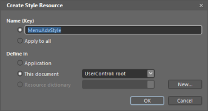
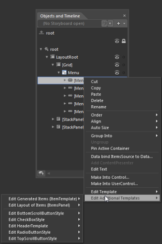
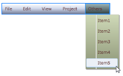

# Blendability Support

You can customize MenuAdv and MenuItemAdv in Expression Blend. After adding MenuAdv and MenuItemAdv to the design view, you can see MenuAdv and MenuItemAdv in the Objects and Timeline window.

{{ '' | markdownify }}
{:.image }

{{ '' | markdownify }}
{:.image }

Right-click MenuAdv and in EditTemplate option select Edit a Copy and assign the key name to the resource edited. The same process can be repeated to edit the MenuItemAdv style.

{{ '' | markdownify }}
{:.image }

{{ '' | markdownify }}
{:.image }

User can also customize the appearance of the TopScrollButtonStyle, BottomScrollButtonStyle, CheckBoxStyle & RadioButtonStyle using the Edit Additional Templates option by doing right click on the MenuItemAdv and selecting the respective styles from the option.

{{ '' | markdownify }}
{:.image }

The following screen shot shows the MenuAdv and MenuItemAdv templates edited and customized by using Expression Blend.

{{ '' | markdownify }}
{:.image }

