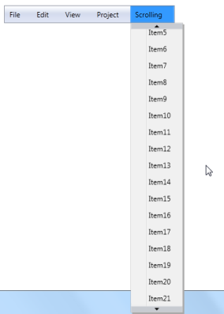

# Scroll Support

MenuAdv allows users to scroll through the submenu items so that all the items of the submenu are visible even if the submenu crosses the vertical boundary. The Scroll support can be enabled by setting the IsScrollEnabled property to true. If the IsScrollEnabled property is set to false, users will not be able to scroll through the submenu items and the items that cross the vertical boundary will not be visible.

{{ '' | markdownify }}
{:.image }

Use Case Scenarios

MenuAdv will be very useful in the case of adding more number of items to the single MenuItemAdv and the size of the submenu crosses the vertical boundary.

Using the Scroll Support in an Application

If the value of the IsScrollEnabled property is set to true, users can scroll through the submenu items by using the TopScrollButton, BottomScrollButton, and  mouse wheel. If the value of the IsScrollEnabled property is set to false, users will not be able to scroll through the submenu items.

Properties

The property for the Scroll support is described in the following tabulation:

_Property Table_

<table>
<tr>
<td>
Property </td><td>
Description </td><td>
Type </td><td>
Data Type </td></tr>
<tr>
<td>
IsScrollEnabled</td><td>
Gets or sets IsScrollEnabled of MenuAdv.</td><td>
DependencyProperty</td><td>
bool(true)</td></tr>
</table>

Sample Link

WPF Sample Browser-> Tools -> MenuAdv -> MenuAdv Demo

