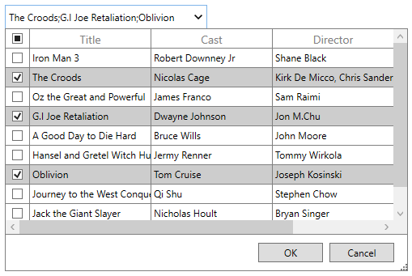

# Selection

[SfMultiColumnDropDownControl](https://help.syncfusion.com/cr/cref_files/wpf/Syncfusion.SfGrid.WPF~Syncfusion.UI.Xaml.Grid.SfMultiColumnDropDownControl.html) allows you to select one or more rows based on the [SelectionMode]. You can get the selected item in the SfDataGrid by using [SelectedItem](http://help.syncfusion.com/cr/cref_files/wpf/Syncfusion.SfGrid.WPF~Syncfusion.UI.Xaml.Grid.SfMultiColumnDropDownControl~SelectedItem.html) property and the selected index by using [SelectedIndex](http://help.syncfusion.com/cr/cref_files/wpf/Syncfusion.SfGrid.WPF~Syncfusion.UI.Xaml.Grid.SfMultiColumnDropDownControl~SelectedIndex.html) property. 

By using[SelectedValue](http://help.syncfusion.com/cr/cref_files/wpf/Syncfusion.SfGrid.WPF~Syncfusion.UI.Xaml.Grid.SfMultiColumnDropDownControl~SelectedValue.html) property, you can get the selected value from the selected item based on the `ValueMember` property.

Its recommend to use the `SelectedItem` and `SelectedValue` instead of using `SelectedIndex` to get the selected value.

## SelectionModes

The [SelectionMode] property defines the selection behavior of `SfMultiColumnDropDownControl`. If [SelectionMode] is [Single], you can select only one item from the dropdown and if [SelectionMode] is [Multiple], you can select more than one item from the dropdown.

### Single

By default, [SelectionMode] is [Single] in `SfMultiColumnDropDownControl` and you can select only one item at a time. 



<syncfusion:SfMultiColumnDropDownControl x:Name="MultiColumnDropDown"
                         ItemsSource="{Binding Orders}"
                         SelectionMode="Single">
</syncfusion:SfMultiColumnDropDownControl>


using Syncfusion.UI.Xaml.Grid;

this.MultiColumnDropDown.SelectionMode = DropDownSelectionMode.Single;



### Multiple

`SfMultiColumnDropDownControl` allows you to select multiple rows by setting [SelectionMode] property as [Multiple]. Further in Multiple selection mode, you can select multiple rows in the following ways

1. By clicking on the respective rows.
2. By dragging mouse on the dropdown grid.
3. By using `Space` key.
4. By interacting with the checkbox in the `Selector column`.



<syncfusion:SfMultiColumnDropDownControl x:Name="MultiColumnDropDown"
                         ItemsSource="{Binding Orders}"
                         SelectionMode="Multiple">
</syncfusion:SfMultiColumnDropDownControl>


using Syncfusion.UI.Xaml.Grid;

this.MultiColumnDropDown.SelectionMode = DropDownSelectionMode.Multiple;



Note: SelectedItem will be added, only after clicking on `Ok` button in the dropdown or by pressing `Enter` key. `SelectedItem`, `SelectedIndex` and `SelectedValue` denotes the first selected row.

#### SeparatorString Customization

In `SfMultiColumnDropDownControl`, the selected values in editor is separated by using [SeparatorString] property and its default value is `;` .



<syncfusion:SfMultiColumnDropDownControl x:Name="MultiColumnDropDown"
                         ItemsSource="{Binding Orders}"
                         SelectionMode="Multiple"
                         SeparatorString="-">            
</syncfusion:SfMultiColumnDropDownControl>


using Syncfusion.UI.Xaml.Grid;

this.MultiColumnDropDown.SeparatorString = "-";



#### DropDown Header Customization

You can set [HeaderTemplate] in order to customize the header of dropdown. For example, you can filter items in dropdown by adding textbox at the top of the dropdown.



xmlns:interactivity="http://schemas.microsoft.com/expression/2010/interactivity"

<Window.Resources>
    <local:MultiConverter x:Key="multiConverter"/>
    <DataTemplate x:Key="headerTemplate">
        <Border BorderThickness="0,0,0,1" BorderBrush="Gray">
            <TextBox x:Name="searchTextBox" Margin="3" >
                <interactivity:Interaction.Triggers>
                    <interactivity:EventTrigger EventName="TextChanged">
                        <interactivity:InvokeCommandAction Command="{Binding Path=DataContext.TextChanged, Source={x:Reference Name=MultiColumnControl5}}" >
                            <interactivity:InvokeCommandAction.CommandParameter>
                                <MultiBinding Converter="{StaticResource multiConverter}">
                                    <Binding Source="{x:Reference Name=MultiColumnControl5}"/>
                                    <Binding RelativeSource="{RelativeSource Mode=FindAncestor, AncestorType=TextBox}"/>
                                </MultiBinding>
                            </interactivity:InvokeCommandAction.CommandParameter>
                        </interactivity:InvokeCommandAction>
                    </interactivity:EventTrigger>
                </interactivity:Interaction.Triggers>
            </TextBox>
        </Border>
    </DataTemplate>
</Window.Resources>
	
<syncfusion:SfMultiColumnDropDownControl x:Name="MultiColumnControl"                                        
                                         DisplayMember="Title"
                                         HeaderTemplate="{StaticResource headerTemplate}"
                                         ItemsSource="{Binding MoviesLists}" 
                                         ValueMember="Cast" 
                                         SelectionMode="Multiple">
    <interactivity:Interaction.Triggers>
        <interactivity:EventTrigger EventName="PopupOpening">
            <interactivity:InvokeCommandAction 
			        Command="{Binding Path=DataContext.PopupOpening, ElementName=MultiColumnControl}"
                    CommandParameter="{Binding ElementName=MultiColumnControl}" />
        </interactivity:EventTrigger>
    </interactivity:Interaction.Triggers>
</syncfusion:SfMultiColumnDropDownControl>


using Syncfusion.UI.Xaml.Grid;
using Syncfusion.UI.Xaml.Utility;

public BaseCommand TextChanged
{
    get
    {
        if (textChanged == null)
            textChanged = new BaseCommand(OnTextChangedExecuted);
        return textChanged;
    }
}

public BaseCommand PopupOpening
{
    get
    {
        if (popupOpeningCommand == null)
            popupOpeningCommand = new BaseCommand(OnPopupOpening);
        return popupOpeningCommand;
    }
}

private void OnTextChangedExecuted(object obj)
{
    var param = (object[])obj;
    var multiColumnControl = param[0] as SfMultiColumnDropDownControl;
    searchTextBox = param[1] as TextBox;
    var grid = multiColumnControl.GetDropDownGrid();
    if (grid != null && grid.View != null && grid.View.Filter != null)
        grid.View.RefreshFilter();
}

private void OnPopupOpening(object obj)
{
    var multiColumnControl = obj as SfMultiColumnDropDownControl;
    var grid = multiColumnControl.GetDropDownGrid();
    if (grid != null)
        grid.View.Filter = CustomerFilter;
}

private bool CustomerFilter(object item)
{
    var movie = item as GrossingMoviesList;
    return movie.Title.ToLower().Contains(searchTextBox.Text.ToLower());
}

internal class MultiConverter : IMultiValueConverter
{
    public object Convert(object[] values, Type targetType, object parameter, CultureInfo culture)
    {
        return values.ToArray();
    }

    public object[] ConvertBack(object value, Type[] targetTypes, object parameter, CultureInfo culture)
    {
        throw new NotImplementedException();
    }
}
	



You can download the sample [here](https://www.syncfusion.com/downloads/support/directtrac/general/ze/DropDownHeaderCustomizationDemo-859504129).

## Events

You can handle the selection operations in SfMultiColumnDropDownControl by using [SelectionChanged](http://help.syncfusion.com/cr/cref_files/wpf/Syncfusion.SfGrid.WPF~Syncfusion.UI.Xaml.Grid.SfMultiColumnDropDownControl~SelectionChanged_EV.html) event.

### SelectionChanged

`SelectionChanged` event is fired when select the item in SfDataGrid. You can use this event to get the SelectedItem, SelectedValue.[SelectionChangedEventArgs](http://help.syncfusion.com/cr/cref_files/wpf/Syncfusion.SfGrid.WPF~Syncfusion.UI.Xaml.Grid.SelectionChangedEventArgs.html) provides data for `SelectionChanged` event.



sfMultiColumn.SelectionChanged += sfMultiColumn _SelectionChanged;

void sfMultiColumn _SelectionChanged(object sender, Syncfusion.UI.Xaml.Grid.SelectionChangedEventArgs args)
{
     var selectedValue = (sender as SfMultiColumnDropDownControl).SelectedValue;
}



N> SelectionChanged event will not trigger when [SelectionMode] is [Multiple] for [SfMultiColumnDropDownControl].