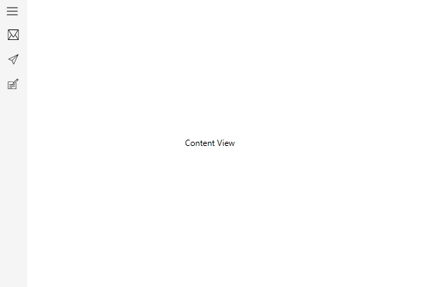
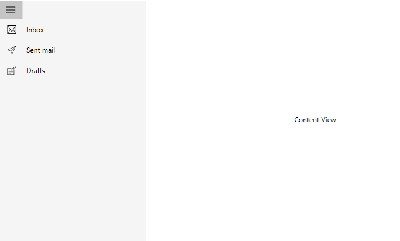
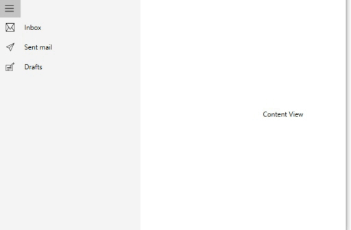

# DisplayMode with SfNavigationDrawer (Sidebar) control 

The sidebar of the navigation menu has three built-in layouts that dynamically adjusts its layout depending on its size. The display mode can be set using the [DisplayMode](https://help.syncfusion.com/cr/wpf/Syncfusion.UI.Xaml.NavigationDrawer.SfNavigationDrawer.html#Syncfusion_UI_Xaml_NavigationDrawer_SfNavigationDrawer_DisplayMode) property. The recommended mode to have an elegant and more organized content UI is the Compact mode.

## Compact display mode

A navigation sidebar is shown as a narrow bar to the width set to the [CompactModeWidth](https://help.syncfusion.com/cr/wpf/Syncfusion.UI.Xaml.NavigationDrawer.SfNavigationDrawer.html#Syncfusion_UI_Xaml_NavigationDrawer_SfNavigationDrawer_CompactModeWidth) property. The navigation menu gets expanded on clicking the built-in toggle button and appears as an overlay above the main content to the width set to the [ExpandedModeWidth](https://help.syncfusion.com/cr/wpf/Syncfusion.UI.Xaml.NavigationDrawer.SfNavigationDrawer.html#Syncfusion_UI_Xaml_NavigationDrawer_SfNavigationDrawer_ExpandedModeWidth) property.

N> The navigation menu will get toggled back to compact width when any interaction performed on the main content area.




<syncfusion:SfNavigationDrawer x:Name="navigationDrawer" DisplayMode="Compact">
        <syncfusion:NavigationItem Header="Inbox">
            <syncfusion:NavigationItem.Icon>
                <Path Data="M32.032381, 16.445429 L25.410999, 23 22.598995, 23 15.853724, 16.561278 3.4150009, 29 44.586115, 29z M2.0000003, 3.3371553 L2.0000003, 27.587 14.406845, 15.180154z M46.000002, 2.6187388 L33.45355, 15.038597 46.000002, 27.585888z M3.4950623, 2.0000003 L23.399998, 21 24.589001, 21 43.782564, 2.0000003z M0, 0 L48.000002, 0 48.000002, 31 0, 31z" .... />
            </syncfusion:NavigationItem.Icon>
        </syncfusion:NavigationItem>
        <syncfusion:NavigationItem Header="Sent mail">
            <syncfusion:NavigationItem.Icon>
                <Path Data="M42.128046,6.7269681 L18.53705,30.317964 25.278003,43.798z M40.380997,5.6460154 L4.6410007,23.1 17.108567,28.918443z M47.383005,0 L25.364002,48.443 16.582001,30.878999 0,23.141z" ...../>
            </syncfusion:NavigationItem.Icon>
        </syncfusion:NavigationItem>
        <syncfusion:NavigationItem Header="Drafts">
            <syncfusion:NavigationItem.Icon>
                <Path Data="M6.9999996,48.353 L19,48.353 19,50.353 6.9999996,50.353z M6.9999996,42.353 L32,42.353 32,44.353 6.9999996,44.353z M6.9999996,36.353 L32,36.353 32,38.353 6.9999996,38.353z M6.4999996,30.353 L31.5,30.353 31.5,32.353 6.4999996,32.353z M25.523109,22.610376 L24.94,25.014999 27.461736,24.549429z M0,15.853 L23,15.853 23,17.853 1.9999989,17.853 1.9999989,54.853 37,54.853 37,21.853 39,21.853 39,56.853 0,56.853z M40.953857,5.9638548 L26.382576,20.641725 29.510826,23.770661 44.083183,9.0931849z M44.058998,2.8360004 L42.362705,4.5447035 45.492099,7.6741037 47.184002,5.9699993 z M44.055,0 L50.004001,5.9659996 30.003,26.115 22.271,27.542999 24.065,20.137z" ...../>
            </syncfusion:NavigationItem.Icon>
        </syncfusion:NavigationItem>
        <syncfusion:SfNavigationDrawer.ContentView>
            <Label
                Content="Content View" .../>
        </syncfusion:SfNavigationDrawer.ContentView>
    </syncfusion:SfNavigationDrawer>





            SfNavigationDrawer navigationDrawer = new SfNavigationDrawer();
            navigationDrawer.DisplayMode = DisplayMode.Compact;
            navigationDrawer.Items.Add(new NavigationItem()
            {
                Header = "Inbox",
                Icon = new Path()
                {
                    Data = Geometry.Parse("M32.032381, 16.445429 L25.410999, 23 22.598995, 23 15.853724, 16.561278 3.4150009, 29 44.586115, 29z M2.0000003, 3.3371553 L2.0000003, 27.587 14.406845, 15.180154z M46.000002, 2.6187388 L33.45355, 15.038597 46.000002, 27.585888z M3.4950623, 2.0000003 L23.399998, 21 24.589001, 21 43.782564, 2.0000003z M0, 0 L48.000002, 0 48.000002, 31 0, 31z"), 
                    .....
                }            
            });
            navigationDrawer.Items.Add(new NavigationItem()
            {
                Header = "Sent mail",
                Icon = new Path()
                {
                    Data = Geometry.Parse("M42.128046,6.7269681 L18.53705,30.317964 25.278003,43.798z M40.380997,5.6460154 L4.6410007,23.1 17.108567,28.918443z M47.383005,0 L25.364002,48.443 16.582001,30.878999 0,23.141z"),
                    ........
                }
            });
            navigationDrawer.Items.Add(new NavigationItem()
            {
                Header = "Drafts",
                Icon = new Path()
                {
                    Data = Geometry.Parse("M6.9999996,48.353 L19,48.353 19,50.353 6.9999996,50.353z M6.9999996,42.353 L32,42.353 32,44.353 6.9999996,44.353z M6.9999996,36.353 L32,36.353 32,38.353 6.9999996,38.353z M6.4999996,30.353 L31.5,30.353 31.5,32.353 6.4999996,32.353z M25.523109,22.610376 L24.94,25.014999 27.461736,24.549429z M0,15.853 L23,15.853 23,17.853 1.9999989,17.853 1.9999989,54.853 37,54.853 37,21.853 39,21.853 39,56.853 0,56.853z M40.953857,5.9638548 L26.382576,20.641725 29.510826,23.770661 44.083183,9.0931849z M44.058998,2.8360004 L42.362705,4.5447035 45.492099,7.6741037 47.184002,5.9699993 z M44.055,0 L50.004001,5.9659996 30.003,26.115 22.271,27.542999 24.065,20.137z"),
                    .....
                }
            });
            Label label = new Label();
            label.Content = "Content View";
            label.HorizontalAlignment = HorizontalAlignment.Center;
            label.VerticalAlignment = VerticalAlignment.Center;
            label.Height = 30;
            label.Width = 150;
            navigationDrawer.ContentView = label;
            this.Content = navigationDrawer;





## Expanded display mode

The navigation sidebar stays open to the left or right of the window based on the [Position](https://help.syncfusion.com/cr/wpf/Syncfusion.UI.Xaml.NavigationDrawer.SfNavigationDrawer.html#Syncfusion_UI_Xaml_NavigationDrawer_SfNavigationDrawer_Position) property pushing the main content alongside. The [ExpandedModeWidth](https://help.syncfusion.com/cr/wpf/Syncfusion.UI.Xaml.NavigationDrawer.SfNavigationDrawer.html#Syncfusion_UI_Xaml_NavigationDrawer_SfNavigationDrawer_ExpandedModeWidth) property defines the width of the drawer.

When the drawer menu is toggled using the built-in toggle button, the drawer menu gets collapsed and shown as a narrow bar to the width set to the [CompactModeWidth](https://help.syncfusion.com/cr/wpf/Syncfusion.UI.Xaml.NavigationDrawer.SfNavigationDrawer.html#Syncfusion_UI_Xaml_NavigationDrawer_SfNavigationDrawer_CompactModeWidth) property.




    <syncfusion:SfNavigationDrawer x:Name="navigationDrawer" DisplayMode="Expanded">
        <syncfusion:NavigationItem Header="Inbox">
            <syncfusion:NavigationItem.Icon>
                <Path Data="M32.032381, 16.445429 L25.410999, 23 22.598995, 23 15.853724, 16.561278 3.4150009, 29 44.586115, 29z M2.0000003, 3.3371553 L2.0000003, 27.587 14.406845, 15.180154z M46.000002, 2.6187388 L33.45355, 15.038597 46.000002, 27.585888z M3.4950623, 2.0000003 L23.399998, 21 24.589001, 21 43.782564, 2.0000003z M0, 0 L48.000002, 0 48.000002, 31 0, 31z" ..../>
            </syncfusion:NavigationItem.Icon>
        </syncfusion:NavigationItem>
        <syncfusion:NavigationItem Header="Sent mail">
            <syncfusion:NavigationItem.Icon>
                <Path Data="M42.128046,6.7269681 L18.53705,30.317964 25.278003,43.798z M40.380997,5.6460154 L4.6410007,23.1 17.108567,28.918443z M47.383005,0 L25.364002,48.443 16.582001,30.878999 0,23.141z" .../>
            </syncfusion:NavigationItem.Icon>
        </syncfusion:NavigationItem>
        <syncfusion:NavigationItem Header="Drafts">
            <syncfusion:NavigationItem.Icon>
                <Path Data="M6.9999996,48.353 L19,48.353 19,50.353 6.9999996,50.353z M6.9999996,42.353 L32,42.353 32,44.353 6.9999996,44.353z M6.9999996,36.353 L32,36.353 32,38.353 6.9999996,38.353z M6.4999996,30.353 L31.5,30.353 31.5,32.353 6.4999996,32.353z M25.523109,22.610376 L24.94,25.014999 27.461736,24.549429z M0,15.853 L23,15.853 23,17.853 1.9999989,17.853 1.9999989,54.853 37,54.853 37,21.853 39,21.853 39,56.853 0,56.853z M40.953857,5.9638548 L26.382576,20.641725 29.510826,23.770661 44.083183,9.0931849z M44.058998,2.8360004 L42.362705,4.5447035 45.492099,7.6741037 47.184002,5.9699993 z M44.055,0 L50.004001,5.9659996 30.003,26.115 22.271,27.542999 24.065,20.137z" ...../>
            </syncfusion:NavigationItem.Icon>
        </syncfusion:NavigationItem>
        <syncfusion:SfNavigationDrawer.ContentView>
            <Label
                Content="Content View" ....../>
        </syncfusion:SfNavigationDrawer.ContentView>
    </syncfusion:SfNavigationDrawer>





            SfNavigationDrawer navigationDrawer = new SfNavigationDrawer();
            navigationDrawer.DisplayMode = DisplayMode.Expanded;
            navigationDrawer.Items.Add(new NavigationItem()
            {
                Header = "Inbox",
                Icon = new Path()
                {
                    Data = Geometry.Parse("M32.032381, 16.445429 L25.410999, 23 22.598995, 23 15.853724, 16.561278 3.4150009, 29 44.586115, 29z M2.0000003, 3.3371553 L2.0000003, 27.587 14.406845, 15.180154z M46.000002, 2.6187388 L33.45355, 15.038597 46.000002, 27.585888z M3.4950623, 2.0000003 L23.399998, 21 24.589001, 21 43.782564, 2.0000003z M0, 0 L48.000002, 0 48.000002, 31 0, 31z"),
                    ..............
                }            
            });
            navigationDrawer.Items.Add(new NavigationItem()
            {
                Header = "Sent mail",
                Icon = new Path()
                {
                    Data = Geometry.Parse("M42.128046,6.7269681 L18.53705,30.317964 25.278003,43.798z M40.380997,5.6460154 L4.6410007,23.1 17.108567,28.918443z M47.383005,0 L25.364002,48.443 16.582001,30.878999 0,23.141z"),
                    ..........
                }
            });
            navigationDrawer.Items.Add(new NavigationItem()
            {
                Header = "Drafts",
                Icon = new Path()
                {
                    Data = Geometry.Parse("M6.9999996,48.353 L19,48.353 19,50.353 6.9999996,50.353z M6.9999996,42.353 L32,42.353 32,44.353 6.9999996,44.353z M6.9999996,36.353 L32,36.353 32,38.353 6.9999996,38.353z M6.4999996,30.353 L31.5,30.353 31.5,32.353 6.4999996,32.353z M25.523109,22.610376 L24.94,25.014999 27.461736,24.549429z M0,15.853 L23,15.853 23,17.853 1.9999989,17.853 1.9999989,54.853 37,54.853 37,21.853 39,21.853 39,56.853 0,56.853z M40.953857,5.9638548 L26.382576,20.641725 29.510826,23.770661 44.083183,9.0931849z M44.058998,2.8360004 L42.362705,4.5447035 45.492099,7.6741037 47.184002,5.9699993 z M44.055,0 L50.004001,5.9659996 30.003,26.115 22.271,27.542999 24.065,20.137z"),
                    ...............
                }
            });
            Label label = new Label();
            label.Content = "Content View";
            label.HorizontalAlignment = HorizontalAlignment.Center;
            label.VerticalAlignment = VerticalAlignment.Center;
            label.Height = 30;
            label.Width = 150;
            navigationDrawer.ContentView = label;
            this.Content = navigationDrawer;





## Auto display mode change

The Navigation Drawer handles its display mode based on the values set to the [ExpandedModeThresholdWidth](https://help.syncfusion.com/cr/wpf/Syncfusion.UI.Xaml.NavigationDrawer.SfNavigationDrawer.html#Syncfusion_UI_Xaml_NavigationDrawer_SfNavigationDrawer_ExpandedModeThresholdWidth) property. This can be enabled by setting the [AutoChangeDisplayMode](https://help.syncfusion.com/cr/wpf/Syncfusion.UI.Xaml.NavigationDrawer.SfNavigationDrawer.html#Syncfusion_UI_Xaml_NavigationDrawer_SfNavigationDrawer_AutoChangeDisplayMode) property to `True`.

This switches the display mode to compact when the application window size is less than the [ExpandedModeThresholdWidth](https://help.syncfusion.com/cr/wpf/Syncfusion.UI.Xaml.NavigationDrawer.SfNavigationDrawer.html#Syncfusion_UI_Xaml_NavigationDrawer_SfNavigationDrawer_ExpandedModeThresholdWidth) and switches to expanded mode when the application window size is larger.




<syncfusion:SfNavigationDrawer x:Name="navigationDrawer" DisplayMode="Expanded" AutoChangeDisplayMode="True" ExpandedModeThresholdWidth="600">
        <syncfusion:NavigationItem Header="Inbox">
            <syncfusion:NavigationItem.Icon>
                <Path
                    Data="M32.032381, 16.445429 L25.410999, 23 22.598995, 23 15.853724, 16.561278 3.4150009, 29 44.586115, 29z M2.0000003, 3.3371553 L2.0000003, 27.587 14.406845, 15.180154z M46.000002, 2.6187388 L33.45355, 15.038597 46.000002, 27.585888z M3.4950623, 2.0000003 L23.399998, 21 24.589001, 21 43.782564, 2.0000003z M0, 0 L48.000002, 0 48.000002, 31 0, 31z" ...... />
            </syncfusion:NavigationItem.Icon>
        </syncfusion:NavigationItem>
        <syncfusion:NavigationItem Header="Sent mail">
            <syncfusion:NavigationItem.Icon>
                <Path
                    Data="M42.128046,6.7269681 L18.53705,30.317964 25.278003,43.798z M40.380997,5.6460154 L4.6410007,23.1 17.108567,28.918443z M47.383005,0 L25.364002,48.443 16.582001,30.878999 0,23.141z" .../>
            </syncfusion:NavigationItem.Icon>
        </syncfusion:NavigationItem>
        <syncfusion:NavigationItem Header="Drafts">
            <syncfusion:NavigationItem.Icon>
                <Path Data="M6.9999996,48.353 L19,48.353 19,50.353 6.9999996,50.353z M6.9999996,42.353 L32,42.353 32,44.353 6.9999996,44.353z M6.9999996,36.353 L32,36.353 32,38.353 6.9999996,38.353z M6.4999996,30.353 L31.5,30.353 31.5,32.353 6.4999996,32.353z M25.523109,22.610376 L24.94,25.014999 27.461736,24.549429z M0,15.853 L23,15.853 23,17.853 1.9999989,17.853 1.9999989,54.853 37,54.853 37,21.853 39,21.853 39,56.853 0,56.853z M40.953857,5.9638548 L26.382576,20.641725 29.510826,23.770661 44.083183,9.0931849z M44.058998,2.8360004 L42.362705,4.5447035 45.492099,7.6741037 47.184002,5.9699993 z M44.055,0 L50.004001,5.9659996 30.003,26.115 22.271,27.542999 24.065,20.137z" .../>
            </syncfusion:NavigationItem.Icon>
        </syncfusion:NavigationItem>
        <syncfusion:SfNavigationDrawer.ContentView>
            <Label
                Content="Content View" ....../>
        </syncfusion:SfNavigationDrawer.ContentView>
    </syncfusion:SfNavigationDrawer>





            SfNavigationDrawer navigationDrawer = new SfNavigationDrawer();
            navigationDrawer.DisplayMode = DisplayMode.Expanded;
            navigationDrawer.AutoChangeDisplayMode = true;
            navigationDrawer.ExpandedModeThresholdWidth = 600;
            navigationDrawer.Items.Add(new NavigationItem()
            {
                Header = "Inbox",
                Icon = new Path()
                {
                    Data = Geometry.Parse("M32.032381, 16.445429 L25.410999, 23 22.598995, 23 15.853724, 16.561278 3.4150009, 29 44.586115, 29z M2.0000003, 3.3371553 L2.0000003, 27.587 14.406845, 15.180154z M46.000002, 2.6187388 L33.45355, 15.038597 46.000002, 27.585888z M3.4950623, 2.0000003 L23.399998, 21 24.589001, 21 43.782564, 2.0000003z M0, 0 L48.000002, 0 48.000002, 31 0, 31z"),
                    .............
                }            
            });
            navigationDrawer.Items.Add(new NavigationItem()
            {
                Header = "Sent mail",
                Icon = new Path()
                {
                    Data = Geometry.Parse("M42.128046,6.7269681 L18.53705,30.317964 25.278003,43.798z M40.380997,5.6460154 L4.6410007,23.1 17.108567,28.918443z M47.383005,0 L25.364002,48.443 16.582001,30.878999 0,23.141z"),
                    .....
                }
            });
            navigationDrawer.Items.Add(new NavigationItem()
            {
                Header = "Drafts",
                Icon = new Path()
                {
                    Data = Geometry.Parse("M6.9999996,48.353 L19,48.353 19,50.353 6.9999996,50.353z M6.9999996,42.353 L32,42.353 32,44.353 6.9999996,44.353z M6.9999996,36.353 L32,36.353 32,38.353 6.9999996,38.353z M6.4999996,30.353 L31.5,30.353 31.5,32.353 6.4999996,32.353z M25.523109,22.610376 L24.94,25.014999 27.461736,24.549429z M0,15.853 L23,15.853 23,17.853 1.9999989,17.853 1.9999989,54.853 37,54.853 37,21.853 39,21.853 39,56.853 0,56.853z M40.953857,5.9638548 L26.382576,20.641725 29.510826,23.770661 44.083183,9.0931849z M44.058998,2.8360004 L42.362705,4.5447035 45.492099,7.6741037 47.184002,5.9699993 z M44.055,0 L50.004001,5.9659996 30.003,26.115 22.271,27.542999 24.065,20.137z"),
                    ........
                }
            });
            Label label = new Label();
            label.Content = "Content View";
            label.HorizontalAlignment = HorizontalAlignment.Center;
            label.VerticalAlignment = VerticalAlignment.Center;
            label.Height = 30;
            label.Width = 150;
            navigationDrawer.ContentView = label;
            this.Content = navigationDrawer;





## Collapsible drawer mode

A collapsible drawer can be achieved using the Navigation Drawer by setting the display mode to [Default mode](https://help.syncfusion.com/cr/wpf/Syncfusion.UI.Xaml.NavigationDrawer.DisplayMode.html). In this display mode, the drawer menu is populated using [custom views](https://help.syncfusion.com/wpf/navigation-drawer/custom-views).

See also [Custom Views](https://help.syncfusion.com/wpf/navigation-drawer/custom-views) topic in Navigation Drawer.




	<Window x:Class="NavigationDrawerWPF.MainWindow"
        xmlns="http://schemas.microsoft.com/winfx/2006/xaml/presentation"
        xmlns:x="http://schemas.microsoft.com/winfx/2006/xaml"
        xmlns:d="http://schemas.microsoft.com/expression/blend/2008"
        xmlns:mc="http://schemas.openxmlformats.org/markup-compatibility/2006"
        xmlns:syncfusion="http://schemas.syncfusion.com/wpf"
        xmlns:local="clr-namespace:NavigationDrawerWPF"
        mc:Ignorable="d"
        Title="MainWindow" Height="450" Width="800">
    <Window.DataContext>
        <local:ViewModel/>
    </Window.DataContext>
    <syncfusion:SfNavigationDrawer x:Name="navigationDrawer" DrawerWidth="300">
        <syncfusion:SfNavigationDrawer.ContentView>
            <Grid x:Name="mainContentView" 
                  Background="White">
                <Grid.RowDefinitions>
                    <RowDefinition Height="auto"/>
                    <RowDefinition/>
                </Grid.RowDefinitions>
                <StackPanel Background="#1aa1d6" 
                            Orientation="Horizontal">
                    <Button x:Name="hamburgerButton" 
                            Height="50" Width="50" 
                            HorizontalAlignment="Left"  
                            Click="HamburgerButton_Click">
                        <Image Source="hamburger_icon.png" 
                               Height="20" 
                               Width="20" />
                    </Button>
                    <Label x:Name="headerLabel" 
                           Height="50" 
                           Content="Home" 
                           Background="#1aa1d6"/>
                </StackPanel>
                <Label Grid.Row="1" 
                       x:Name="contentLabel" 
                       Content="Content View" 
                       Foreground="Black"/>
            </Grid>
        </syncfusion:SfNavigationDrawer.ContentView>
        <syncfusion:SfNavigationDrawer.DrawerHeaderView>
            <Grid Background="#31ade9">
                <Label Content="Header View" />
            </Grid>
        </syncfusion:SfNavigationDrawer.DrawerHeaderView>
        <syncfusion:SfNavigationDrawer.DrawerContentView>
            <Grid>
                <ListBox x:Name="list" 
                         ItemsSource="{Binding Contents}">
                    <ListBox.ItemTemplate>
                        <DataTemplate>
                            <TextBlock  Text="{Binding Name}" 
                                        Foreground="Black"/>
                        </DataTemplate>
                    </ListBox.ItemTemplate>
                </ListBox>
            </Grid>
        </syncfusion:SfNavigationDrawer.DrawerContentView>
        <syncfusion:SfNavigationDrawer.DrawerFooterView>
            <Grid Background="#31ade9">
                <Label Content="Footer View" />
            </Grid>
        </syncfusion:SfNavigationDrawer.DrawerFooterView>
    </syncfusion:SfNavigationDrawer>
</Window>
    




using System.Collections.Generic;
using System.Windows;

namespace NavigationDrawerWPF
{
    public partial class MainWindow : Window
    {
        public MainWindow()
        {
            InitializeComponent();
        }

        private void HamburgerButton_Click(object sender, RoutedEventArgs e)
        {
            navigationDrawer.ToggleDrawer();
        }
    }

    public class ViewModel
    {
        public ViewModel()
        {
            Contents = new List<Model>();

            Contents.Add(new Model() { Name = "Home" });
            Contents.Add(new Model() { Name = "Profile" });
            Contents.Add(new Model() { Name = "Inbox" });
            Contents.Add(new Model() { Name = "Outbox" });
            Contents.Add(new Model() { Name = "Sent" });
            Contents.Add(new Model() { Name = "Trash" });
            Contents.Add(new Model() { Name = "Sign Out" });
        }

        public List<Model> Contents { get; set; }
    }

    public class Model
    {
        public string Name { get; set; }
    }
}




