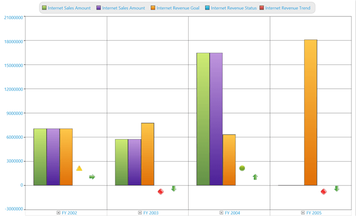

# KPI in WPF Olap Chart

KPI is a collection of calculations that are associated with a measure group in a cube, which is used to evaluate business success. Typically, these calculations are a combination of multi-dimensional expressions (MDX) or calculated members. KPIs also have additional metadata that provides information about how Grid applications should display the results of KPIs calculations.

The following are the different types of indicators:

* KPI goal
* KPI status
* KPI trend
* KPI value

The KPI elements can be defined in the OLAP report in the following way.





/// 

/// OlapReport with KPI Elements
/// 

/// <returns></returns>
private OlapReport LoadBasicKPI()
{
    OlapReport olapReport = new OlapReport();
    // Selecting the Cube
    olapReport.CurrentCubeName = "Adventure Works";
    KpiElements kpiElement = new KpiElements();
    // Specifying the KPI Element name and configuring its Indicators
    kpiElement.Elements.Add(new KpiElement
    {
        Name = "Internet Revenue",
        ShowKPIGoal = true,
        ShowKPIStatus = true,
        ShowKPIValue = true,
        ShowKPITrend = true
    });
    DimensionElement dimensionElementRow = new DimensionElement();
    // Specifying the Name for Row Dimension Element
    dimensionElementRow.Name = "Date";
    // Specifying the Level element
    dimensionElementRow.AddLevel("Fiscal", "Fiscal Year");
    // Adding Row Elements
    olapReport.SeriesElements.Add(dimensionElementRow);
    // Adding Column Elements
    olapReport.CategoricalElements.Add(kpiElement);
    return olapReport;
}




  
''' 

''' OlapReport with KPI Elements
''' 

''' <returns></returns>
Private Function LoadBasicKPI() As OlapReport
    Dim olapReport As New OlapReport()
    ' Selecting the Cube
    olapReport.CurrentCubeName = "Adventure Works"
    Dim kpiElement As New KpiElements()
    ' Specifying the KPI Element name and configuring its Indicators
    kpiElement.Elements.Add(New KpiElement() With { _
        Key .Name = "Internet Revenue", _
        Key .ShowKPIGoal = True, _
        Key .ShowKPIStatus = True, _
        Key .ShowKPIValue = True, _
        Key .ShowKPITrend = True _
    })
    Dim dimensionElementRow As New DimensionElement()
    ' Specifying the Name for Row Dimension Element
    dimensionElementRow.Name = "Date"
    ' Specifying the Level element
    dimensionElementRow.AddLevel("Fiscal", "Fiscal Year")
    ' Adding Row Elements
    olapReport.SeriesElements.Add(dimensionElementRow)
    ' Adding Column Elements
    olapReport.CategoricalElements.Add(kpiElement)
    Return olapReport
End Function





