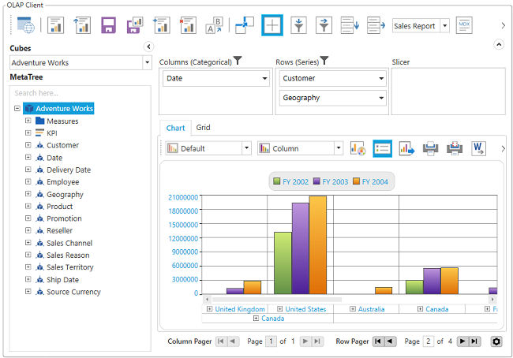

# Paging in WPF Olap Client

Paging in the OLAP client supports you to load and render the large amount of data without any performance constraint.

The OLAP pager (user control) is included and bound with the OlapDataManager object of the respective OLAP client. To enable paging, set the `EnablePaging` property to true.

When you process the large CellSet, it is split into several number of segments and each segment is assigned and rendered in a separate page. You can navigate back and forth in all possible ways by using the UI options in the OLAP pager. You can also change the page size and other pager settings at runtime by using the **PageSetting** window.

Include the following Syncfusion assembly from the installed location to add the OLAP pager (user control) with OLAP client.

* Syncfusion.OlapShared.Wpf

N> You can also get the assemblies by browsing to the default assembly location: {System Drive}:\Program Files (x86)\Syncfusion\Essential Studio\&lt;version number&gt;\precompiledassemblies\&lt;version number&gt;\&lt;framework version&gt;\

**Enable paging through XAML**



<Window 
    xmlns="http://schemas.microsoft.com/winfx/2006/xaml/presentation"
    xmlns:x="http://schemas.microsoft.com/winfx/2006/xaml"
    xmlns:syncfusion="http://schemas.syncfusion.com/wpf"
    x:Class="SampleApplication.MainWindow"
    Title="MainWindow" Height="350" Width="525">
    <Grid>
        <Grid.RowDefinitions>
            <RowDefinition Height="*"/>
            <RowDefinition Height="Auto"/>
        </Grid.RowDefinitions>
        <GroupBox  Header="OlapClient" Grid.Row="0">
            <syncfusion:OlapClient  Name="olapClient" EnablePaging="True"  Background="Transparent" SeriesStrokeThickness="0">
            </syncfusion:OlapClient>
        </GroupBox>
    </Grid>
</Window>
	


**Enable paging through report:**





using Syncfusion.Olap.Manager;
using Syncfusion.Olap.Reports;
namespace SampleApplication
{
	public partial class MainWindow : SampleWindow
	{
		private string _connectionString;
		private OlapDataManager _olapDataManager;
		public MainWindow()
		{
			InitializeComponent();
			_connectionString = "Enter a valid connection string";
			//Created connection string is passed to OlapDataManager as argument
			_olapDataManager = new OlapDataManager(_connectionString);
			//Created OlapReport is set as a current report to OlapDataManager
			_olapDataManager.SetCurrentReport(SimpleDimensions());
			//Finally OlapClient control gets the data from the created OlapDataManager
			this.olapClient.OlapDataManager = _olapDataManager;
			this.olapClient.DataBind();
		}
            
		private OlapReport SimpleDimensions()
		{
			OlapReport olapReport = new OlapReport();
			olapReport.CurrentCubeName = "Adventure Works";
			olapReport.EnablePaging = true;
			olapReport.PagerOptions.CategorialPageSize = 10;
			olapReport.PagerOptions.SeriesPageSize = 10;
			DimensionElement dimensionElement = new DimensionElement() { Name = "Customer", HierarchyName = "Customer" };
			dimensionElement.AddLevel("Customer Geography", "Country");
			olapReport.CategoricalElements.Add(dimensionElement);
			MeasureElements measureElements = new MeasureElements();
			measureElements.Add(new MeasureElement { Name = "Internet Sales Amount" });
			olapReport.SeriesElements.Add(measureElements);
			dimensionElement = new DimensionElement() { Name = "Geography", HierarchyName = "Geography" };
			dimensionElement.AddLevel("Geography", "Country");
			olapReport.CategoricalElements.Add(dimensionElement);
			dimensionElement = new DimensionElement() { Name = "Date" };
			dimensionElement.AddLevel("Fiscal", "Fiscal Year");
			olapReport.SeriesElements.Add(dimensionElement);
			return olapReport;
		}
	}
}
		



   
Imports Syncfusion.Olap.Manager
Imports Syncfusion.Olap.Reports
Namespace SampleApplication
	Partial Public Class MainWindow
	    Inherits SampleWindow
		Private _connectionString As String
		Private _olapDataManager As OlapDataManager
		Public Sub New()
			InitializeComponent()
			_connectionString = "Enter a valid connection string"
			'Created connection string is passed to OlapDataManager as argument
			_olapDataManager = New OlapDataManager(_connectionString)
			'Created OlapReport is set as a current report to OlapDataManager
			_olapDataManager.SetCurrentReport(SimpleDimensions())
			'Finally OlapClient control gets the data from the created OlapDataManager
			Me.olapClient.OlapDataManager = _olapDataManager
			Me.olapClient.DataBind()
		End Sub
        
   		Private Function SimpleDimensions() As OlapReport
			Dim olapReport As New OlapReport()
			olapReport.CurrentCubeName = "Adventure Works"
			olapReport.EnablePaging = True
			olapReport.PagerOptions.CategorialPageSize = 10
			olapReport.PagerOptions.SeriesPageSize = 10
			Dim dimensionElement As New DimensionElement() With {.Name = "Customer", .HierarchyName = "Customer"}
			dimensionElement.AddLevel("Customer Geography", "Country")
			olapReport.CategoricalElements.Add(dimensionElement)
			Dim measureElements As New MeasureElements()
			measureElements.Add(New MeasureElement With {.Name = "Internet Sales Amount"})
			olapReport.SeriesElements.Add(measureElements)
			dimensionElement = New DimensionElement() With {.Name = "Geography", .HierarchyName = "Geography"}
			dimensionElement.AddLevel("Geography", "Country")
			olapReport.CategoricalElements.Add(dimensionElement)
			dimensionElement = New DimensionElement() With {.Name = "Date"}
			dimensionElement.AddLevel("Fiscal", "Fiscal Year")
			olapReport.SeriesElements.Add(dimensionElement)
			Return olapReport
		End Function
	End Class
End Namespace
	




OlapPager in OlapClient control
{:.caption}

Page Setting Window
{:.caption}
   
A sample demo is available at the following location.

{system drive}:\Users\&lt;User Name&gt;\AppData\Local\Syncfusion\EssentialStudio\&lt;Version Number&gt;\WPF\OlapClient.WPF\Samples\Paging\Paging

