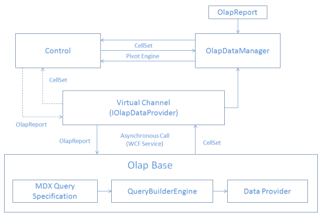

# Syncfusion OLAP Architecture in WPF OLAP Common

Syncfusion OLAP architecture allows you to build a full life cycle reporting solution for your enterprise. Here are the important pieces of the architecture:

* OLAP access layer: Built on the top of ADOMD.NET and provides a high level object model to define the reports easily.
* OLAP controls: Chart, grid, gauge, client for ASP.NET (excluding Gauge), WPF, silverlight, and ASP.NET MVC (grid only).
* OLAP report builder: Rapid Application Development (RAD) tool allows you to select the dimensions you are interested in visualizing and define the appearance for the chart and grid.

The following screenshot shows how the Syncfusion OLAP components allow you to build a full life cycle reporting solution for your enterprise.

Syncfusion OLAP Architecture
{:.caption}

## OLAP base

The OLAP base is a class library that contains several namespaces and classes to perform data processing operations required by OLAP controls. OLAP base is the processing unit of all Syncfusion OLAP controls. For establishing connection and retrieving data, format the input and provide it to each control. This is controlled by the OLAP base.

Syncfusion OLAP controls communicate to the OLAP cube through the OlapDataManager class available in the Syncfusion.Olap.Base namespace.

OLAP Base Architecture
{:.caption}

N> This class library was organized under the Syncfusion.Olap.Base assembly.

## OLAP Silverlight base

OLAP Silverlight base is a class library, which contains several namespaces and classes to perform data processing operation required by OLAP Silverlight controls. The OlapDataManager retrieves OLAP data and binds the result to an OLAP control.

N> This class library was organized under the Syncfusion.OlapSilverlight.Base assembly.

## OLAP Silverlight base wrapper

The OLAP Silverlight base wrapper is a class library, which contains several namespaces and classes. This library helps to perform data conversion between OLAP Silverlight base and OLAP base. Data conversion process is used to achieve the following features:

1. Establishing the connection and retrieving data by converting the OLAP Silverlight base information to OLAP base information.
2. Send retrieved data to OLAP Silverlight base by converting the OLAP base data to OLAP Silverlight base data.

Data flow in Silverlight
{:.caption}

N> This class library was organized under the Syncfusion.OlapSilverlight.BaseWrapper assembly.

### WCF service

To query the database, the OLAP Silverlight controls use the WCF service. The DataProvider property of OlapDataManager performs the service call operations.
