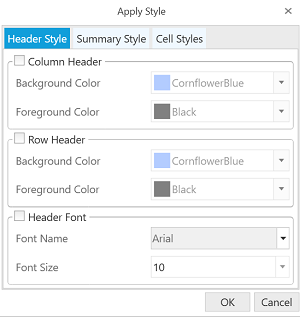
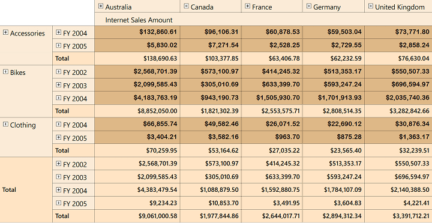

# Grid Style Dialog in WPF Olap Grid

The OLAP grid can be formatted the following ways:

* Style dialog.
* Configuring the properties of cell style.

## Style dialog

The OLAP grid style dialog is used to format the cells of the control. Styling can be applied to column headers, row headers, summary cells, and value cells. The following properties of headers and summary cells can be formatted:

* Background color
* Foreground color
* Font name
* Font size

The following are the properties of value cells that can be formatted:

* Font name
* Font style
* Font color
* Font size

The following code sample will launch the OLAP grid style dialog.


  


// To display style dialog
this.OlapGrid1.ShowStyleDialog();





' To display style dialog
Me.OlapGrid1.ShowStyleDialog()





## Configuring the properties of cell style

The following properties allow the OLAP grid cell to be customized, so that it appears in a custom style rather than the default one.

* **Background**: Gets or sets the background color of the cell.
* **FontFamily**: Gets or sets the font family of the cell.
* **FontSize**: Gets or sets the font size of the cell.
* **FontWeight**: Gets or sets the font weight of the cell.
* **Foreground**: Gets or sets the foreground color of the cell.

The column, row, summary, and value cells of OLAP grid can be formatted independently using the following properties.

* ColumnHeaderStyle
* RowHeaderStyle
* SummaryColumnStyle
* SummaryRowStyle
* ValueCellsStyle


  


// Specifying the background color for column header
this.OlapGrid1.ColumnHeaderStyle.Background = new SolidColorBrush(Color.FromRgb(175, 209, 255));
// Specifying the background color for row header
this.OlapGrid1.RowHeaderCellStyle.Background = new SolidColorBrush(Color.FromRgb(175, 209, 255));
// Specifying the background color for summary cell
this.OlapGrid1.SummaryColumnStyle.Background = new SolidColorBrush(Color.FromRgb(206, 225, 248)); 





' Specifying the background color for column header
Me.OlapGrid1.ColumnHeaderStyle.Background = New SolidColorBrush(Color.FromRgb(175, 209, 255))
' Specifying the background color for row header
Me.OlapGrid1.RowHeaderCellStyle.Background = New SolidColorBrush(Color.FromRgb(175, 209, 255))
' Specifying the background color for summary cell
Me.OlapGrid1.SummaryColumnStyle.Background = New SolidColorBrush(Color.FromRgb(206, 225, 248))





The value cell text alignment can be changed using the following property of the OLAP grid.





// Specifying the value cell text alignment
this.OlapGrid1.ValueCellTextAlignment = HorizontalAlignment.Center;





' Specifying the value cell text alignment
Me.OlapGrid1.ValueCellTextAlignment = HorizontalAlignment.Center





A sample demo is available in the following location.

{system drive}:\Users\&lt;User Name&gt;\AppData\Local\Syncfusion\EssentialStudio\&lt;Version Number&gt;\WPF\OlapGrid.WPF\Samples\Exporting\Exporting Grid

