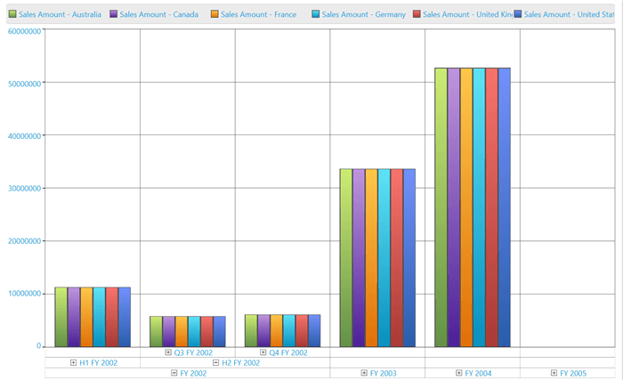
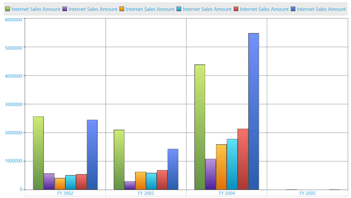

# Drill Operation

This is a basic feature of OlapChart through which the amount of information can be limited, for a better view. It allows you to drill down to access the detailed level of data or drill up to see the summarized data by using the Context Menu present in the OlapChart.

Drill up, also called roll up, navigates from more detailed data to less detailed data, by climbing up a concept hierarchy for a dimension.

Drill down, also called roll down, is the reverse of drill up. It navigates from less detailed data to more detailed data, by climbing down a concept hierarchy for a dimension.

While binding hierarchical dimensions (for example, the time dimension could include 3 levels namely Year, Quarter, and Month), the Chart allows you to visualize the data for different levels by using the collapsible labels. This is illustrated in the following screenshot:

A sample demo is available at the following link:

{system drive}:\Users\\{User Name}\AppData\Local\Syncfusion\EssentialStudio\\{Version Number}\WPF\OlapChart.WPF\Samples\Creating Reports\Reports In Code

## Drill Position

Drill position allows the user to drill only the current position of a selected member and it will exclude the drilled data of the selected member in other positions by using MDX query. It can be enabled by setting the **"DrillType"** enumeration to **"DrillPosition"** in the OlapReport.





dataManager.CurrentReport.DrillType = DrillType.DrillPosition;




  
dataManager.CurrentReport.DrillType = DrillType.DrillPosition





A sample demo is available at the following link:

{system drive}:\Users\\{User Name}\AppData\Local\Syncfusion\EssentialStudio\\{Version Number}\WPF\OlapChart.WPF\Samples\Data Relation\Drill Types Demo
 
## Show/Hide Expanders
 
The visibility of the expanders in the OlapChart can be toggled by using the **ShowExpanders** property available in the OlapReport. 




 
this.olapchart1.OlapDataManager.CurrentReport.ShowExpanders = false;




  
Me.olapchart1.OlapDataManager.CurrentReport.ShowExpanders = False





The following image shows an OlapChart without expanders:

N> Since this property interacts with the OlapDataManager you need to assign this before you call DataBind() method in OlapChart.

