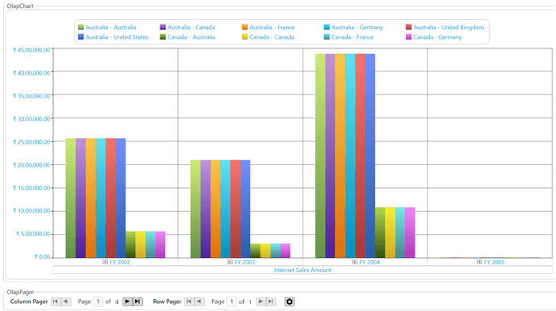
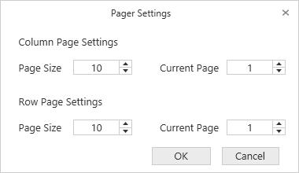

# Paging

Paging in OlapChart provides you support to load and render large amount of data without any performance constraint.  

OlapPager user control is included and bounded with the same OlapDataManager object of OlapChart. To enable paging, set EnablePaging property of OlapReport object to True.

When you process large CellSet, it is split into several number of segments and each segment is assigned and rendered in a separate page. You can navigate back and forth in all possible way by utilizing the GUI options in OlapPager. You can also change the page size at runtime by using PageSetting window.

## Adding OlapPager in Application

1. Include the following Syncfusion assembly from the installed location.
   1. Syncfusion.OlapShared.Wpf

   Assembly Location: &lt;system drive&gt;:\Program Files (x86)\Syncfusion\EssentialStudio\<version number>\precompiledassemblies\<version number>\

2. Add the respective namespace and OlapPager in XAML as follows.

   

   ~~~xaml    

		<Window       xmlns="http://schemas.microsoft.com/winfx/2006/xaml/presentation"

		xmlns:x="http://schemas.microsoft.com/winfx/2006/xaml"

		xmlns:syncfusion="http://schemas.syncfusion.com/wpf"

		xmlns:pager="clr-namespace:Syncfusion.Windows.Shared.Olap;assembly=Syncfusion.OlapShared.WPF"

		x:Class="SampleApplication.MainWindow"

		Title="MainWindow" Height="350" Width="525">

		<Grid>

		<Grid.RowDefinitions>

		<RowDefinition Height="*"/>

		<RowDefinition Height="Auto"/>

		</Grid.RowDefinitions>

		<GroupBox  Header="OlapChart" Grid.Row="0">

		<syncfusion:OlapChart  Name="olapChart" Background="Transparent" SeriesStrokeThickness="0"></syncfusion:OlapChart>

		</GroupBox>

		<GroupBox Grid.Row="1" Header="OlapPager" Margin="5" >

		<pager:OlapPager x:Name="olapPager" ></pager:OlapPager>

		</GroupBox>

		</Grid>

		</Window> 

   ~~~
   

3. Enable paging in OlapReport.

   ~~~csharp

      

			using Syncfusion.Olap.Manager;

			using Syncfusion.Olap.Reports;

			namespace SampleApplication

			{

			public partial class MainWindow : SampleWindow

		   {

			private string _connectionString;

			private OlapDataManager _olapDataManager;

			public MainWindow()

			 {  

			   InitializeComponent();

			   _connectionString = "Enter a valid connection string";

			   //Created connection string is passed to OlapDataManager as argument

			   _olapDataManager = new OlapDataManager(_connectionString);

			   //Created OlapReport is set as a current report to OlapDataManager

			   _olapDataManager.SetCurrentReport(SimpleDimensions());

			   //Finally OlapChart control gets the data from the created OlapDataManager

			   this.olapChart.OlapDataManager = _olapDataManager;

			   this.olapChart.DataBind();

			 }

			private OlapReport SimpleDimensions()

			{

			   OlapReport olapReport = new OlapReport();

			   olapReport.CurrentCubeName = "Adventure Works";

			   olapReport.EnablePaging = true;

			   olapReport.PagerOptions.CategorialPageSize = 10;

				olapReport.PagerOptions.SeriesPageSize = 10;

			   DimensionElement dimensionElement = new DimensionElement() { Name = "Customer", HierarchyName = "Customer" };

			   dimensionElement.AddLevel("Customer Geography", "Country");

			   olapReport.CategoricalElements.Add(dimensionElement);

			   MeasureElements measureElements = new MeasureElements();

			   measureElements.Add(new MeasureElement { Name = "Internet Sales Amount" });

			   olapReport.SeriesElements.Add(measureElements);

			   dimensionElement = new DimensionElement() { Name = "Geography", HierarchyName = "Geography" };

			   dimensionElement.AddLevel("Geography", "Country");

			   olapReport.CategoricalElements.Add(dimensionElement);

			   dimensionElement = new DimensionElement() { Name = "Date" };

			   dimensionElement.AddLevel("Fiscal", "Fiscal Year");

			   olapReport.SeriesElements.Add(dimensionElement);

			   return olapReport;

			 }

			}

			}   
			
   ~~~
   

         
   ~~~csharp

				

		Imports Syncfusion.Olap.Manager

		Imports Syncfusion.Olap.Reports

		Namespace SampleApplication

		Partial Public Class MainWindow

		Inherits SampleWindow

		Private _connectionString As String

		Private _olapDataManager As OlapDataManager

		Public Sub New()

		InitializeComponent()

		_connectionString = "Enter a valid connection string"

		'Created connection string is passed to OlapDataManager as argument

		_olapDataManager = New OlapDataManager(_connectionString)

		'Created OlapReport is set as a current report to OlapDataManager

		_olapDataManager.SetCurrentReport(SimpleDimensions())

		'Finally OlapChart control gets the data from the created OlapDataManager

		Me.olapChart.OlapDataManager = _olapDataManager

		Me.olapChart.DataBind()

		End Sub

		Private Function SimpleDimensions() As OlapReport

		Dim olapReport As New OlapReport()

		olapReport.CurrentCubeName = "Adventure Works"

		olapReport.EnablePaging = True

		olapReport.PagerOptions.CategorialPageSize = 10

		olapReport.PagerOptions.SeriesPageSize = 10

		Dim dimensionElement As New DimensionElement() With {.Name = "Customer", .HierarchyName = "Customer"}

		dimensionElement.AddLevel("Customer Geography", "Country")

		olapReport.CategoricalElements.Add(dimensionElement)

		Dim measureElements As New MeasureElements()

		measureElements.Add(New MeasureElement With {.Name = "Internet Sales Amount"})

		olapReport.SeriesElements.Add(measureElements)

		dimensionElement = New DimensionElement() With {.Name = "Geography", .HierarchyName = "Geography"}

		dimensionElement.AddLevel("Geography", "Country")

		olapReport.CategoricalElements.Add(dimensionElement)

		dimensionElement = New DimensionElement() With {.Name = "Date"}

		dimensionElement.AddLevel("Fiscal", "Fiscal Year")

		olapReport.SeriesElements.Add(dimensionElement)

		Return olapReport

		End Function

		End Class

		End Namespace

	
   ~~~

   

   

### Sample Link

Refer to the following location for the sample:

&lt;system drive&gt;\Users\<user name>\AppData\Local\Syncfusion\EssentialStudio\<version number>\

WPF\OlapChart.WPF\Paging

