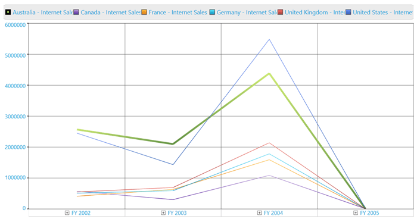
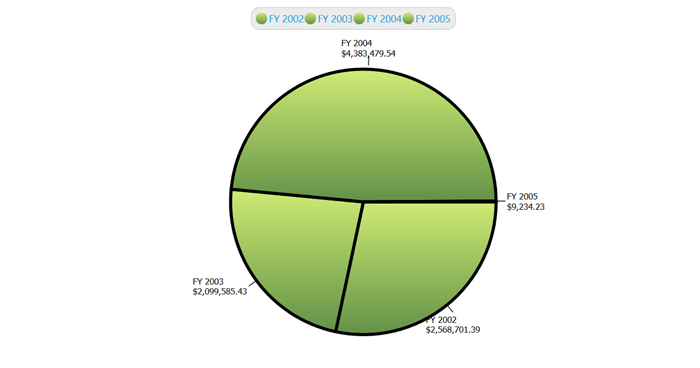
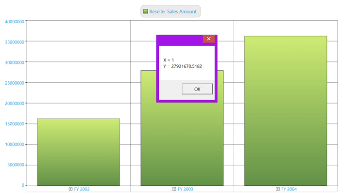
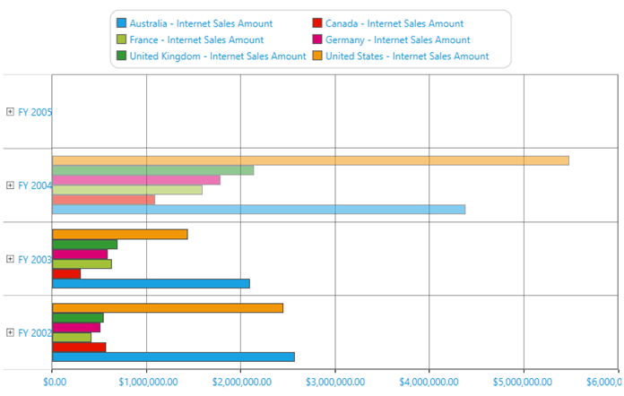
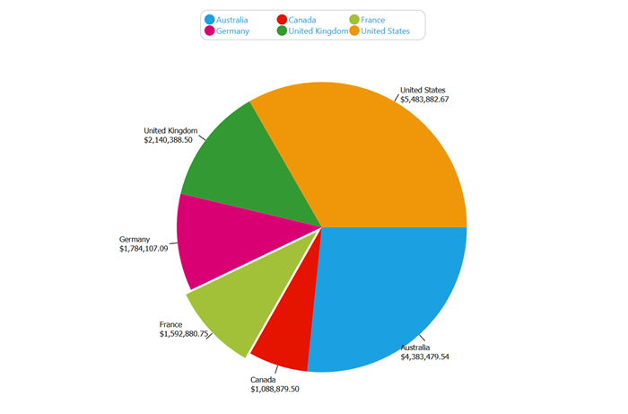

# Series

Series are the data points plotted in the rectangular co-ordinate system.

## Point label

Point label provides information about the data point. Data point can be added to a series by using the following code sample.





for(int i=0; i< this.olapChart.Series.Count; i++)
{ 
    //// Setting the visibility of adornment.
    this.olapChart.Series[i].AdornmentsInfo.Visible = true;
    //// Setting horizontal alignment
    this.olapChart.Series[i].AdornmentsInfo.SegmentHorizontalAlignment = System.Windows.HorizontalAlignment.Right;
    //// Makes the segment out from the series.
    this.olapChart.Series[i].AdornmentsInfo.SegmentIsOut = true;
    this.olapChart.Series[i].AdornmentsInfo.LabelContentPath = "DataPoint.Y";
    this.olapChart.Series[i].AdornmentsInfo.SegmentLabelFontSize = 12;
    this.olapChart.Series[i].AdornmentsInfo.SegmentLabelRotation = 325;
}





For i As Integer = 0 To Me.olapChart.Series.Count - 1
    ' Setting the visibility of adornment.
    Me.olapChart.Series(i).AdornmentsInfo.Visible = True
    ' Setting horizontal alignment
    Me.olapChart.Series(i).AdornmentsInfo.SegmentHorizontalAlignment = System.Windows.HorizontalAlignment.Right
    ' Makes the segment out from the series.
    Me.olapChart.Series(i).AdornmentsInfo.SegmentIsOut = True
    Me.olapChart.Series(i).AdornmentsInfo.LabelContentPath = "DataPoint.Y"
    Me.olapChart.Series(i).AdornmentsInfo.SegmentLabelFontSize = 12
    Me.olapChart.Series(i).AdornmentsInfo.SegmentLabelRotation = 325
Next i





The following screenshot shows an OLAP chart with point labels enabled.

## Color customization

You can set a custom color for each series in the OLAP chart. To apply different colors to different series iterate through the series, apply the custom brush to the series.





this.olapChart.Series[0].Interior = Brushes.Orange;





Me.olapChart.Series(0).Interior = Brushes.Orange





## Border customization

You can customize the thickness of series border of the OLAP chart by using the following code sample.




    
this.olapchart.Series[0].Stroke = Brushes.Black;
this.olapChart.Series[0].StrokeThickness = 4;





Me.olapChart.Series(0).Stroke = Brushes.Black
Me.olapChart.Series(0).StrokeThickness = 4





N> The behavior of the series border varies for different chart types. The following illustration describes them in detail.

The series border is applied to the first series of a column chart by using the `StrokeThickness` property. Now, the first series element is surrounded with applied border.

Notice the variation. The same series border property is applied to a series in the line chart. Instead of creating a 4 pixel width border it increases the thickness of the particular series line.

The pie chart renders everything in a single series; each block in the pie chart known as segments. The border will be applied on each segments. This is illustrated in the following screenshot.

## Custom data templates

Series can be customized with user-defined data templates. The following sample usage describes how to apply a data template to series in the OLAP chart.

The following data template can be used to customize the series.





<DataTemplate x:Key="ColumnTemplate">
  <Canvas Name="myCanvas">
     <Grid Name="OuterGrid" Canvas.Left="{Binding X}" Width="{Binding Width}" 
           Height="{Binding ElementName=myCanvas, Path=ActualHeight}" >
           <Border Name="ColumnRect" VerticalAlignment="Bottom"   Width="{Binding Width}" Height="{Binding Height}" 
               CornerRadius="8,8,0,0" Background="{Binding Interior}">
           </Border>
     </Grid>
  </Canvas>
</DataTemplate>





for (int i = 0; i < this.olapchart1.Series.Count; i++)
{
    //Apply Series Template to display the series cylindrical style.
    this.olapchart1.Series[i].Template = this.Resources["ColumnTemplate"] as DataTemplate;
    //Apply Series Interior to display the series in different colors.
    this.olapchart1.Series[i].Interior = App.Current.Resources["SeriesInterior" + i] as LinearGradientBrush;
}





For i As Integer = 0 To Me.olapchart1.Series.Count - 1
    'Apply Series Template to display the series cylindrical style
    Me.olapchart1.Series(i).Template = TryCast(Me.Resources("ColumnTemplate"), DataTemplate)
    'Apply Series Interior to display the series in different colors.
    Me.olapchart1.Series(i).Interior = TryCast(App.Current.Resources("SeriesInterior" & i), LinearGradientBrush)
Next i





A sample demo is available at the following location.

{system drive}:\Users\&lt;User Name&gt;\AppData\Local\Syncfusion\EssentialStudio\&lt;Version Number&gt;\WPF\OlapChart.WPF\Samples\Customization\Series Customization Demo

## Event

**ChartMouseEventArgs** are the arguments returned when the mouse events are triggered by the ChartSeries. **ChartMouseEventArgs** return the segment on which the mouse events are triggered along with default mouse event args. This event args can be used to customize a segment when the mouse event is encountered. The segment returns different values that are used to perform calculations or operations.

The following code sample demonstrates how the **ChartMouseEventArgs** can be used to retrieve information on the ChartSeries segment.





//// Event Tagging
this.olapchart1.Series[0].MouseClick += new ChartMouseEventHandler(series_MouseClick);
//// Mouse click event for a series.
void series_MouseClick(object sender, ChartMouseEventArgs e)
{
    ChartPoint point = (ChartPoint)e.Segment.CorrespondingPoints[0].DataPoint;
    MessageBox.Show("X = " + point.X.ToString() + "\n" + "Y = " + point.Y.ToString());
}





' Event Tagging
AddHandler olapchart1.Series(0).MouseClick, AddressOf series_MouseClick
' Mouse click event for a series.
Private Sub series_MouseClick(ByVal sender As Object, ByVal e As ChartMouseEventArgs)
    Dim point As ChartPoint = CType(e.Segment.CorrespondingPoints(0).DataPoint, ChartPoint)
    MessageBox.Show("X = " & point.X.ToString() & Constants.vbLf & "Y = " & point.Y.ToString())
End Sub







[Chart Series](http://help.syncfusion.com/wpf/sfchart/series)



## Chart animation

Animations can be added to the OLAP chart control. This can be achieved through the following properties:

* **SeriesAnimateOption**: Gets or sets animation for each series.
* **SeriesAnimateOneByOne**: Gets or sets whether each series animate one by one. By default, it is false.
* **EnableSeriesAnimation**: Gets or sets whether the animation for each series is enabled.
* **SeriesAnimationDuration**: Gets or sets the animation duration for each series.

The following code sample is used for enabling chart animations.





<syn:OlapChart ChartType="{Binding OlapChartType}" Name="olapChart"   
    OlapDataManager="{Binding DataManager}" Grid.Row="1"  
    Background="Transparent" ColorPalette="Metro"      
    SeriesAnimateOption="Bottom"  
    SeriesAnimateOneByOne="True"        
    EnableSeriesAnimation="True"
    SeriesAnimationDuration="00:00:3" />





// To set the Series Animate Option to Bottom in OlapChart.
this.olapChart.SeriesAnimateOption = Syncfusion.Windows.Chart.AnimationOptions.Bottom;
// To enable the Series Animate OneByOne in OlapChart.
this.olapChart.SeriesAnimateOneByOne = true;
// To disable Series Animate OneByOne in OlapChart.
this.olapChart.SeriesAnimateOneByOne = false;
// To disable Series Animation in OlapChart.
this.olapChart.EnableSeriesAnimation = false;
// To set the Series Animation Duration in OlapChart.
this.olapChart.SeriesAnimationDuration = new TimeSpan(1);





The following illustration shows the chart animations.

A sample demo is available at the following location.

{system drive}:\Users\&lt;User Name&gt;\AppData\Local\Syncfusion\EssentialStudio\&lt;Version Number&gt;\WPF\OLAPChart.WPF\Samples\Appearance\Chart Animations Demo\

## Pie chart customization

You can set the explode index and explode radius and enable or disable the series effects for each series in the pie chart.

The following code sample demonstrates the customization of each series in the pie chart.



foreach (ChartSeries series in this. olapchart.Series)
{
    //To enable the chart to explode we have pass the ChartSeries and true as parameter to SetExplodedAll method
    ChartPieType.SetExplodedAll(series, true);
}
foreach (ChartSeries series in this. olapchart.Series)
{
    //To enable the chart to explode we have pass the ChartSeries and false as parameter to disable the SetExplodedAll method
    ChartPieType.SetExplodedAll(series, false);
}
foreach (ChartSeries series in this.olapchart.Series)
{
    //To enable the effects in Pie chart
        series.EnableEffects = true;
}
foreach (ChartSeries series in this. olapchart.Series)
{
    //To disable the effects in Pie chart
    series.EnableEffects = false;
}
foreach (ChartSeries series in this. olapchart.Series)
{
    //To set the explore index value we have to pass the ChartSeries and the index value of which part of the Chart to explode
    ChartPieType.SetExplodedIndex(series, 2);
}
foreach (ChartSeries series in this. olapchart.Series)
{
    //To set the radius of the exploded chart we have to pass the ChartSeries and the radius which is n double value
    ChartPieType.SetExplodeRadius(series, 8.0);
}
    

  
The following illustration shows the customization.

A sample demo is available at the following location.

{system drive}:\Users\&lt;User Name&gt;\AppData\Local\Syncfusion\EssentialStudio\&lt;Version Number&gt;\WPF\OLAPChart.WPF\Samples\Chart Types\Pie Chart Demo
