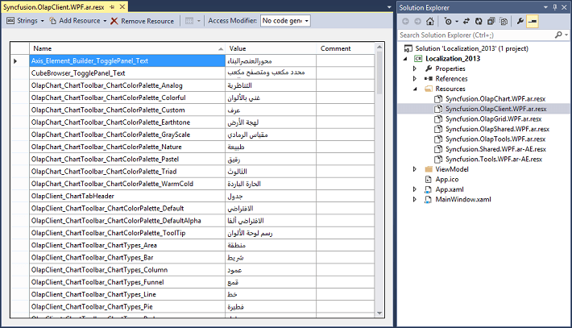
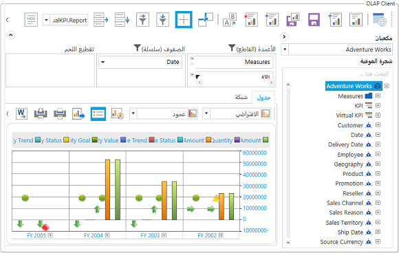

# Localization

Localization deals with customizing data and resources for specific culture or language. The built-in localization and globalization mechanism in WPF allows you to localize any string resource used by OlapClient control.

We need to create and place the resource files in a separate location inside in the user application. Then we can access to the culture specific resources from the current application assembly.

For this, first create a resource file for our OlapClient control and translate the strings to your culture. Basically, OlapClient contains control assemblies such as OlapChart.WPF, OlapGrid.WPF and Tools assemblies such as OlapShared.WPF and OlapTools.WPF within it. So, it is mandatory to localize the necessary strings available in those assemblies as well. Once it is translated, you might use the resources in your projects by setting corresponding culture in your application.

Please refer the below code sample.





public MainWindow()
{
    System.Threading.Thread.CurrentThread.CurrentUICulture = new System.Globalization.CultureInfo("ar-AE");
    InitializeComponent();
}
    




Public Sub New()
    System.Threading.Thread.CurrentThread.CurrentUICulture = New System.Globalization.CultureInfo("ar-AE")
    InitializeCompenent()
End Sub
    

 

 
## RTL Support

RTL support for OlapClient is used to display the content from right to left by setting the "FlowDirection" property to "RightToLeft". The following code sample explains how to set this property.



 

<syncfusion:OlapClient x:Name="olapClient1" FlowDirection="RightToLeft" HorizontalAlignment="Stretch" VerticalAlignment="Stretch" OlapDataManager="{Binding ClientDataManager}" />



 

this.olapClient1.FlowDirection = System.Windows.FlowDirection.RightToLeft;
  


 

Me.olapClient1.FlowDirection = System.Windows.FlowDirection.RightToLeft;





A sample demo is available at the following link:

{system drive}:\Users\\{User Name}\AppData\Local\Syncfusion\EssentialStudio\\{Version Number}\WPF\OlapClient.WPF\Samples\Localization\Localization

