# OlapClient: Elements 

## Cube Selector

Cube Selector allows to select any one of the cube from the cubes available in the connected database. This can be achieved with a dropdown list displaying the list of names of cubes. On selecting a cube from the dropdown list the corresponding cube elements get loaded.

## Cube Dimension Browser

Cube Dimension Browser is a tree-view like structure that organizes the cube elements such as dimensions, hierarchies, measures, etc., from the selected cube into independent, logical groups.

### Types of Node in Cube Dimension Browser

* **Display Folder** - Folder that contains a set of similar elements.
* **Measure** - Quantity available for analysis.
* **Dimension** - A name given to the parts of the cube that categorize the data.
* **Attribute Hierarchy** - Level of attributes down the hierarchy.
* **User-Defined Hierarchy** - Members of a dimension in a hierarchical structure.
* **Level** - Denotes a specific level in the category.
* **Named Set** - A collection of tuples and members, which can be defined and saved as a part of the cube definition.
 
### Attribute Hierarchy

Attribute hierarchy contains the following levels:

* A leaf level contains each distinct attribute member called leaf member with each member of the leaf level.
* Intermediate levels if the attribute hierarchy is a parent-child hierarchy.
 
### User-Defined Hierarchy 

User-defined hierarchy organizes the members of a dimension into hierarchical structure and provides navigation paths in a cube. For example, take a dimension table that supports three attributes such as Year, Quarter and Month. The Year, Quarter and Month attributes are used to construct a user-defined hierarchy, named Calendar, in the time dimension which relates all the levels.

### Differentiating User-defined Hierarchy and Attribute Hierarchy

* User-defined hierarchy may contain more than one level whereas attribute hierarchy contains only one level.
* User-defined hierarchy provides the navigation path between the levels taken from attribute hierarchies of the same dimension.

### Symbolic representation of the nodes inside Cube Dimension Browser

<table>
<tr>
<th>
Icon</th><th>
Name</th><th>
Node type</th><th>
Is Draggable</th></tr>
<tr>
<td> 

{{ '' | markdownify }}

</td><td>
Display Folder</td><td>
Display Folder</td><td>
False</td></tr>
<tr>
<td>

{{ '' | markdownify }}

</td><td>
Measure</td><td>
Measure</td><td>
True</td></tr>
<tr>
<td>
{{ '' | markdownify }}

</td><td>
Dimension</td><td>
Dimension</td><td>
True</td></tr>
<tr>
<td>
{{ '' | markdownify }}

</td><td>
User Defined Heirarchy</td><td>
Hierarchy</td><td>
True</td></tr>
<tr>
<td>
{{ '' | markdownify }}

</td><td>
Attribute Heirarchy</td><td>
Hierarchy</td><td>
True</td></tr>
<tr>
<td>

{{ '' | markdownify }}

{{ '' | markdownify }}

{{ '' | markdownify }}

</td><td>
Levels (in order)</td><td>
Level Element</td><td>
True</td></tr>
<tr>
<td>
{{ '' | markdownify }}

</td><td>
Named Set</td><td>
Named Set</td><td>
True</td></tr>
</table> 
 
## Axis Element Builder 

Axis Element Builder allows you to build the elements in the axes of OlapClient. It supports three axes namely Categorical, Series and Slicer. Based on the construction of axes, OlapGrid and OlapChart will display the resultant data.

### Categorical (Column)

The categorical axis defines one or more elements that are displayed along the Chart’s y-axis as labels and in the columns of the Grid. If more than one dimension is on the categorical axis, the Chart/Grid will stack each dimension. The order in which the dimensions are stacked is based on the order that they appear on the categorical axis.

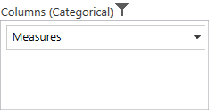
  
### Series (Row) 

The series axis defines one or more dimensions that are displayed along the Chart’s x-axis as labels and in the rows of the Grid. If more than one dimension is on the series axis, the Chart/Grid will stack each dimension. The order in which the dimensions are stacked is based on the order that they appear on the series axis.
  
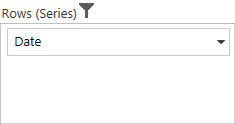
  
### Slicer

The slicer axis is used as a filter to narrow the focus of the multidimensional data displayed in the Chart/Grid. The slicer axis lets you analyze any member of a dimension, in-depth. For the slicer to display the member’s data, that member must not be present on both categorical axis and series axis.

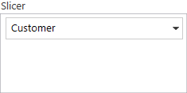
  
### Adding elements to an axis 

The measure, dimension, hierarchy, level and named set elements can be dragged from the Cube Dimension Browser and dropped into the Axis Element Builder at desired position using the drag-and-drop operation. Also the measure, dimension, hierarchy, level and named set elements can be moved from one axis to another by dragging an appropriate element and dropping them at desired position.
  
### Removing elements from an axis

In order to remove measures, dimension, hierarchy, level and named set element from the Axis Element Builder, hover the element and click "Delete" icon. You can also use the content menu to remove the element by right clicking on it.

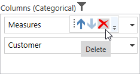 
   
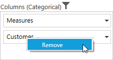
   
### Rearrange elements in an axis

Rearranging can be done using Move Up/Move Down options visible while hovering the element.

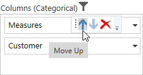
  
## Elements Editor

### Measure Editor

Measure Editor is a dialog that displays the collection of measures in the current report. It can be opened by clicking the Split Button over right corner of the Measure node in Axis Element Builder. 

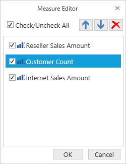
  
### Member Editor

Member Editor is a dialog which displays the members of the current hierarchy in a tree-view structure. It can be opened by clicking the Split Button over right corner of the Member node in Axis Element Builder.

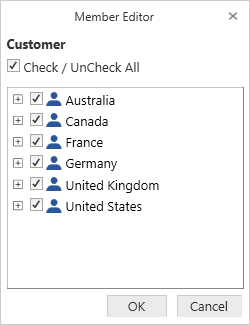
  
The “Check All” and “Uncheck All” option in the dialog lets the user to select and unselect entire nodes for filtering.

## Toolbar

The options available in the toolbar are,

* **Connect to Server** - It provides the connection option to connect the datasource with OlapClient through Offline Cube, Online Server or Connection string. 
* **New Report** - Creates a new reports list, clearing the existing report collection in order to provide a new platform for new deployment based on the existing cube elements.
* **Load Report** - The load report option picks the saved report collection from the database and loads it by clearing the existing collection of reports.
* **Save Report** - The save option stores the report collection at the instant in a local system.
* **SaveAs Report** - The save as option allows the user to store the copy of report collection with a new name in a local system.
* **Add Report** - Adds a new report to the existing list of reports.
* **Remove Report** - Removes the current report from the report list. It could not be possible if the report list contains only one report in it.
* **Rename Report** - The rename option lets the user to change the name of the current report.
* **Toggle Axis** – Interchanges the items between Categorical and Series axes.
* **Show Expander** - This option is used to display expander option for Grid and Chart to perform drilldown operation.
* **Filter/Sort Column** - Filters/Sorts the data in the OlapReport with respect to Column.
* **Filter/Sort Row** - Filters/Sorts the data in the OlapReport with respect to Row.
* **Report List** - Report List will hold all the reports of the current session of the OlapClient control and displays in a dropdown list. From the dropdown list a report can be selected.
* **MDX Query** – This option displays the MDX query executed to retrieve the data at that instant.

## Report Manipulation

### New Report 

New Report option helps the user to clear the existing report collection and to create a new report collection with a single report. On clicking the New Report icon in toolbar, the New Report dialog opens prompting for a name for the report.

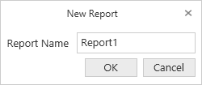

By giving the required name and clicking OK, the report collection gets loaded with only one empty report with entered name. On clicking Cancel button, report creation gets cancelled.

### Add Report

Add Report option lets the user to add a report to the existing report collection. On clicking the Add Report icon in toolbar, the Add Report dialog opens prompting for a name for the report.

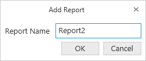

On clicking OK button after giving appropriate name in the respective column, a report with the entered name is added to the collection. On clicking Cancel button, report creation gets cancelled.

### Remove Report

Remove Report option removes the current/active report from the report collection. This option works only if the report collection has more than one report.

### Rename Report

Rename Report option lets the user to rename the current/active report. On clicking the corresponding icon at toolbar, the Rename Report dialog opens prompting for new name.

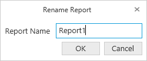

After giving a name and clicking OK, the active report gets refreshed with the new name. On clicking Cancel button, the operation gets cancelled.

### Save Report

Save Report option saves the report in local system. On clicking the Save Report icon, the SaveAs Report dialog opens prompting for a name with which the report needs to be stored.

After providing appropriate name and clicking **Save**, the report will get saved in selected sysem location. Clicking Cancel button, withdraws the saving operation.

### Load Report

Load Report option loads a report from local system. Click on Load Report icon at toolbar to load a report into the OlapClient.   

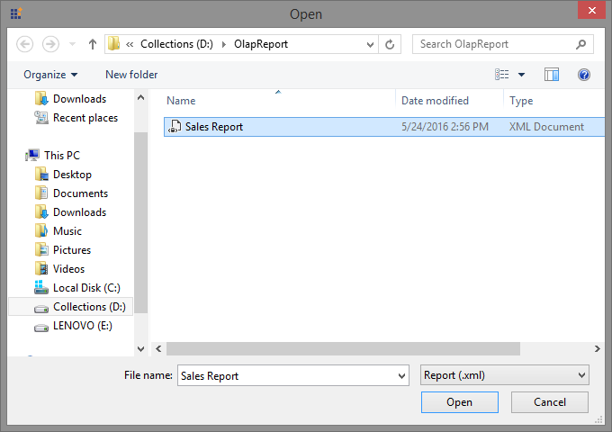

### Report List

Report List dropdown contains the names of all the reports in the report collection.

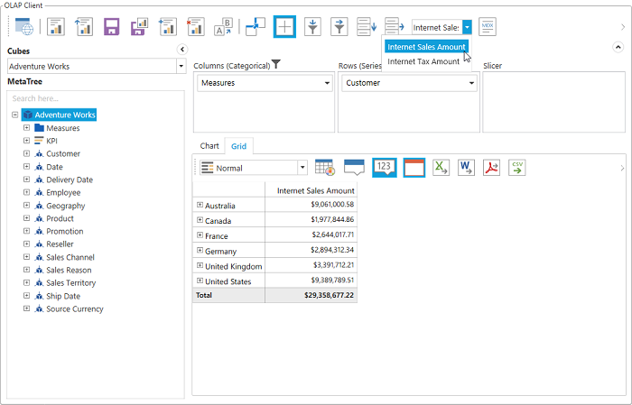

On selecting the required report from the report list, the selected report will be set as active report and gets loaded.

## OlapGrid and OlapChart

The [OlapGrid](http://help.syncfusion.com/wpf/olapgrid/overview/) and [OlapChart](http://help.syncfusion.com/wpf/olapchart/overview) controls will be rendered with respect to the operations done at Axis Element Builder.

   