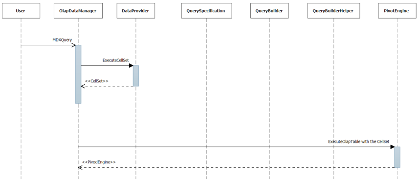

# Bind the MDX query to OlapDataManager

MDX query is one of the inputs accepted by the OlapDataManager to process the data in the connected data source. There are two way to pass the MDX query to OlapDataManager:

1. Through MdxQuery property
2. Through ExecuteCellSet() method argument 

OlapDataManager will accept the MDX query in the string format through any one of this and process the data based on the query. Once the connection is established you can pass the MDX query in string format.

The following code will illustrate the passing of the MXD query as input:



OlapDataManager olapDataManager = new OlapDataManager("DataSource=localhost; Initial Catalog=Adventure Works DW");
string mdxQuery = 

@"SELECT NON EMPTY ({Hierarchize({DrilldownLevel(

[Customer].[Customer Geography].[All Customers])})} * 

{[MEASURES].[Internet Sales Amount]}) dimension properties

 member_type ON COLUMNS, NON EMPTY (Hierarchize(

DrilldownLevel([Date].[Fiscal].[All Periods])) ) 

dimension properties member_type ON ROWS 

FROM [Adventure Works]  CELL PROPERTIES 

VALUE, FORMAT_STRING, FORMATTED_VALUE";
olapDataManager.MdxQuery = mdxQuery;
olapDataManager.ExecuteCellSet();




Dim olapDataManager As OlapDataManager = New OlapDataManager("DataSource=localhost; Initial Catalog=Adventure Works DW")

Dim mdxQuery As String = "SELECT NON EMPTY ({Hierarchize({DrilldownLevel({

[Customer].[Customer Geography].[All Customers]})})} * 

{[MEASURES].[Internet Sales Amount]}) dimension properties

 member_type ON COLUMNS, NON EMPTY ({Hierarchize({

DrilldownLevel({[Date].[Fiscal].[All Periods]})})} ) 

dimension properties member_type ON ROWS 

FROM [Adventure Works]  CELL PROPERTIES 

VALUE, FORMAT_STRING, FORMATTED_VALUE"

olapDataManager.MdxQuery = mdxQuery

olapDataManager.ExecuteCellSet()



This will accept the MDX query as a string and assign it to the OlapDataManager’d mdxQuery property and invoke the data process.



OlapDataManager olapDataManager = new OlapDataManager("DataSource=localhost; Initial Catalog=Adventure Works DW");
string mdxQuery = 

@"SELECT NON EMPTY ({Hierarchize({DrilldownLevel({

[Customer].[Customer Geography].[All Customers]})})} * 

{[MEASURES].[Internet Sales Amount]}) dimension properties

 member_type ON COLUMNS, NON EMPTY ({Hierarchize({

DrilldownLevel({[Date].[Fiscal].[All Periods]})})} ) 

dimension properties member_type ON ROWS 

FROM [Adventure Works]  CELL PROPERTIES 

VALUE, FORMAT_STRING, FORMATTED_VALUE";

olapDataManager.ExecuteCellSet(mdxQuery);





Dim olapDataManager As OlapDataManager = New OlapDataManager("DataSource=localhost; Initial Catalog=Adventure Works DW")

Dim mdxQuery As String = "SELECT NON EMPTY ({Hierarchize({DrilldownLevel({

[Customer].[Customer Geography].[All Customers]})})} * 

{[MEASURES].[Internet Sales Amount]}) dimension properties

 member_type ON COLUMNS, NON EMPTY ({Hierarchize({

DrilldownLevel({[Date].[Fiscal].[All Periods]})})} ) 

dimension properties member_type ON ROWS 

FROM [Adventure Works]  CELL PROPERTIES 

VALUE, FORMAT_STRING, FORMATTED_VALUE"

olapDataManager.ExecuteCellSet(mdxQuery)



## Sequential Diagram 

The following sequential diagram is matching when user gives input as MDX query:

_Figure10: Olap base sequential diagram_

