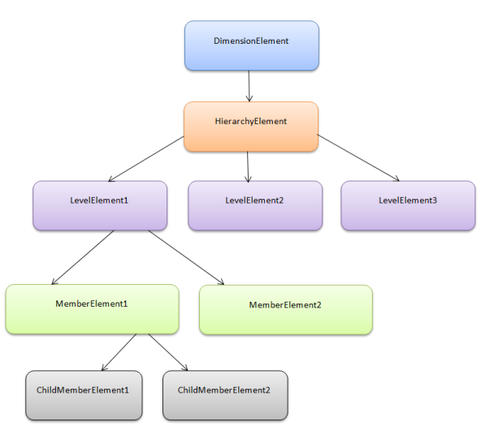

# Dimension Element

A simple [dimension](http://msdn.microsoft.com/en-us/library/microsoft.analysisservices.dimension.aspx) object is composed of basic information such as Name, Hierarchy, Level and Members. We can create the dimension element by specifying its name and providing the hierarchy and level name. 

The dimension element will contain the hierarchical details and information about each included level elements in that hierarchy. A hierarchy can have any number of level elements and the level elements can have any number of members and the member elements can have any number of child members.

## Hierarchy Element

Each element of a dimension could be summarized using a [hierarchy](http://en.wikipedia.org/wiki/Hierarchy). The hierarchy is a series of parent-child relationship, where a parent member represents the consolidation of members which are its children. Parent members can be further aggregated as the children of another parent.

For example, May 2005 could be summarized into Second Quarter 2005 which in turn would be summarized in the year 2005.

## Level Element

Level element is the child of hierarchy element which contains a set of members, each of which has the same rank within a hierarchy.

## Member Element

Member element represents a member of a level in a cube, the children of a member of level.

## Member Properties

Member properties cover the basic information about each member in each tuple. This basic information includes the member name, parent level, the number of children, and so on. Member properties are available for all members at a given level.

The following code will illustrate the creation of different types of dimensions:

## Creating Simple Dimension Element



DimensionElement dimensionElementColumn = new DimensionElement();

// Specifying the Name for Column Dimension Element

dimensionElementColumn.Name = "Customer";

// Specifying the Hierarchy and Level Element Name

dimensionElementColumn.AddLevel("Customer Geography", "Country");





Dim dimensionElementRow As DimensionElement = New DimensionElement()

'Specifying the Name for Row Dimension Element

dimensionElementRow.Name = "Date"

' Specifying the Hierarchy and Level Element Name

dimensionElementRow.AddLevel("Fiscal", "Fiscal Year")



## Creating Sliced Dimension



DimensionElement dimensionElementSlicer = new DimensionElement();

// Specifying the dimension Name

dimensionElementSlicer.Name = "Product";

// Adding the Level Name along with the Hierarchy Name

dimensionElementSlicer.AddLevel("Product Categories", "Category");

// Adding the Member Element           dimensionElementSlicer.Hierarchy.LevelElements["Category"].Add("Bikes");          dimensionElementSlicer.Hierarchy.LevelElements["Category"].IncludeAvailableMembers = true;





Dim dimensionElementSlicer As DimensionElement = New DimensionElement()

' Specifying the dimension Name

dimensionElementSlicer.Name = "Product"

' Adding the Level Name along with the Hierarchy Name

dimensionElementSlicer.AddLevel("Product Categories", "Category")

' Adding the Member Element

dimensionElementSlicer.Hierarchy.LevelElements("Category").Add("Bikes")

dimensionElementSlicer.Hierarchy.LevelElements("Category").IncludeAvailableMembers = True



