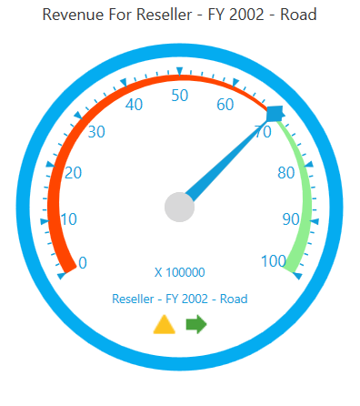
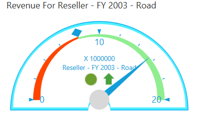

# Appearance

## How to set gauge radius?

The OLAP Gauge control provides support to adjust its radius. This is achieved by assigning a proper value to the radius property of OLAP Gauge.


 
   

this.olapGauge1.Radius = 100;

this.olapGauge1.DataBind();

 

 
  
    

Me.olapGauge1.Radius = 100

Me.olapGauge1.DataBind()

 

## Sample Location

A sample demo is available at the following location:

..\Syncfusion\EssentialStudio\<Version Number>\BI\WPF\OlapGauge.WPF\Samples\Gauge Customization\Customization Demo\

## Explain the built-in frame types available for gauge control

OLAP Gauge supports built-in frame types to provide effective rim styles. The FrameType property is used to set the frame type for the Gauge control.

The following are the frame types supported by OLAP Gauge. 

* CircularWithInnerLeftGradient (Default)
* CircularWithDarkOuterFrames
* CircularCenterGradient
* CircularWithInnerTopGradient
* Full Circle 
* HalfCircle 

The following code example illustrates how to set the frame type for the OLAP Gauge control.


 
    

this.olapGauge1.FrameType = GaugeFrameType.CircularWithInnerLeftGradient;

 

 
  
    

Me.olapGauge1.FrameType = GaugeFrameType.CircularWithInnerLeftGradient

 

The following screen shots illustrate the various frame types.

## Sample Location

A sample demo is available at the following location:

..\Syncfusion\EssentialStudio\<Version Number>\BI\WPF\OlapGauge.WPF\Samples\Gauge Customization\Customization Demo\

## Explain the skin types that are available for Gauge control

The OLAP Gauge control allows you to present your data using different built-in-skins. These skins allow you to theme and style the look and feel of the control in various rich color schemes. You can use Skin Manager Framework to apply a wide range of skins to the Essential OLAP Gauge. These skins have been designed to suit the needs of a wide range of audience. The following are the types of skins available:

* Default-The visual style of this skin depends upon the operating System used. 
* Office2007Blue-This skin is similar to the Microsoft Office2007Blue skin. 
* Office2007Black-This skin is similar to the Microsoft Office2007Black skin. 
* Office2007Silver-This skin is similar to the Microsoft Office2007Silver skin. 
* Office2003Blue-This skin is similar to the Microsoft Office2003 skin. 
* Blend-This skin is similar to the Microsoft Blend skin. 
* Metro -This skin is similar to the Windows 8 Metro Style.

## Applying Skins

The various skin themes available can be applied to the control using the _SkinStorage.VisualStyle_ property. 

To set the visual style for the controls, use the code given below.

 

    

<!—To set Office2007Blue visual style for OLAP Gauge-->

<gauge:OlapGauge Name="olapGauge1" Radius="120" syncfusion:SkinStorage.VisualStyle="Office2007Blue"/>

 

 
 
    

//To set Office2007Blue visual style for Olap Gauge

SkinStorage.SetVisualStyle(olapGauge1, "Office2007Blue");

 

 
  
    

'To set Office2007Blue visual style for Olap Gauge

SkinStorage.SetVisualStyle(olapGauge1, "Office2007Blue");

 

Run the code. The following output is obtained.

## Sample Location

A sample demo is available at the following location:

..\Syncfusion\EssentialStudio\<Version Number>\BI\WPF\OlapGauge.WPF\Samples\Gauge Customization\Customization Demo\

