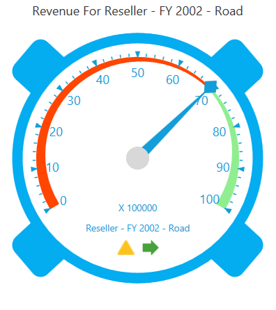
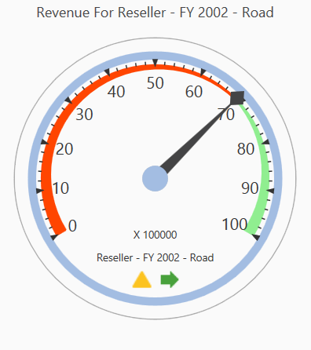

# Appearance

## Gauge Radius

OlapGauge provides support to adjust its radius and it can be achieved by assigning a proper value to the `Radius` property of OlapGauge. The following code snippet illustrates about modifying the radius of OlapGauge.





<syncfusion:OlapGauge Name="olapGauge1" Radius="120"/>





this.OlapGauge1.Radius = 100;





Me.OlapGauge1.Radius = 100





A demo sample is available at the following location:

{system drive}:\Users\&lt;User Name&gt;\AppData\Local\Syncfusion\EssentialStudio\&lt;Version Number&gt;\WPF\OlapGauge.WPF\Samples\Appearance\Customization\

## Built-In Frame Types

OlapGauge supports 4 kinds of built-in frames to provide effective rim styles. The `FrameType` property is used to set the frame type for OlapGauge. The following are the frame types supported by OlapGauge:

* CircularCenterGradient

* CircularWithDarkOuterFrames

* FullCircle

* HalfCircle

The following code snippet illustrates about how to set frame type for OlapGauge.





this.OlapGauge1.FrameType = GaugeFrameType.CircularWithInnerLeftGradient;





Me.OlapGauge1.FrameType = GaugeFrameType.CircularWithInnerLeftGradient





A demo sample is available at the following location:

{system drive}:\Users\&lt;User Name&gt;\AppData\Local\Syncfusion\EssentialStudio\&lt;Version Number&gt;\WPF\OlapGauge.WPF\Samples\Appearance\Customization\

## Skins

Built-in-skins allow you to theme and style the look and feel of the OlapGauge control in various rich color schemes. You can use Skin Manager framework to apply a wide range of skins to the OlapGauge control. These skins have been designed to suit the needs of wide range of audience.

**Types of Skins:**

* Metro- This skin is similar to the Windows 8 Metro style.

* Blend- This skin is similar to the Microsoft Blend skin.

* Office2010Black- This skin is similar to the Microsoft Office2010Black skin.

* Office2010Blue- This skin is similar to the Microsoft Office2010Blue skin.

* Office2010Silver- This skin is similar to the Microsoft Office2010Silver skin.

* Office2013LightGray- This skin is similar to the Microsoft Office2013LightGray skin.

* Office2013DarkGray- This skin is similar to the Microsoft Office2013DarkGray skin.

* Office2013White- This skin is similar to the Microsoft Office2013White skin.

* VisualStudio2013- This skin is similar to the VisualStudio2013 skin.

In order to apply skin to OlapGauge, **SkinStorage.VisualStyle** property is used. The following code snippet shows how to set visual style for the control.





<syncfusion:OlapGauge Name="olapGauge1" sfshared:SkinStorage.VisualStyle="Metro"/>





SfSkinManager.SetVisualStyle(olapGauge1, Syncfusion.SfSkinManager.VisualStyles.Metro);





SfSkinManager.SetVisualStyle(olapGauge1, Syncfusion.SfSkinManager.VisualStyles.Metro);





A demo sample is available at the following location:

{system drive}:\Users\&lt;User Name&gt;\AppData\Local\Syncfusion\EssentialStudio\&lt;Version Number&gt;\WPF\OlapGauge.WPF\Samples\Appearance\Visual Styles\