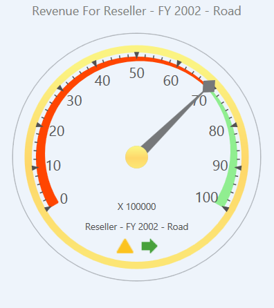
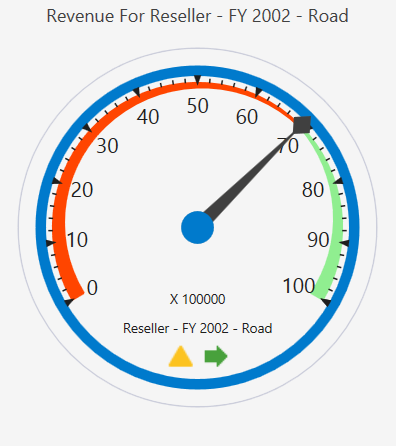

# Customize the appearance of OLAP Gauge

## Gauge radius

The OLAP gauge supports adjusting its radius and this can be achieved by assigning a proper value to the `Radius` property of OLAP gauge. The following code snippet illustrates about modifying the radius of OLAP gauge.





<syncfusion:OlapGauge Name="olapGauge1" Radius="120"/>





this.OlapGauge1.Radius = 100;





Me.OlapGauge1.Radius = 100





A demo sample is available at the following location.

{system drive}:\Users\&lt;User Name&gt;\AppData\Local\Syncfusion\EssentialStudio\&lt;Version Number&gt;\WPF\OlapGauge.WPF\Samples\Appearance\Customization\

## Built-in frame types

The OLAP gauge supports four types of built-in frames to provide effective rim styles. The `FrameType` property is used to set the frame type for the OLAP gauge. The following are the frame types supported by the OLAP gauge:

* CircularCenterGradient

* CircularWithDarkOuterFrames

* FullCircle

* HalfCircle

The following code snippet illustrates about how to set frame type for the OLAP gauge.





this.OlapGauge1.FrameType = GaugeFrameType.CircularWithInnerLeftGradient;





Me.OlapGauge1.FrameType = GaugeFrameType.CircularWithInnerLeftGradient





A demo sample is available at the following location.

{system drive}:\Users\&lt;User Name&gt;\AppData\Local\Syncfusion\EssentialStudio\&lt;Version Number&gt;\WPF\OlapGauge.WPF\Samples\Appearance\Customization\

## Skins

Built-in-skins allow you to customize the theme and style to improve the look and feel of the OLAP gauge control in various rich color schemes. You can use the skin manager framework to apply a wide range of skins to the OLAP gauge control. These skins have been designed to suit the needs of wide range of audience.

**Types of skins:**

* Metro: This skin is similar to the Windows 8 Metro style.

* Blend: This skin is similar to the Microsoft Blend skin.

* Office2010Black: This skin is similar to the Microsoft Office2010Black skin.

* Office2010Blue: This skin is similar to the Microsoft Office2010Blue skin.

* Office2010Silver: This skin is similar to the Microsoft Office2010Silver skin.

* Office2013LightGray: This skin is similar to the Microsoft Office2013LightGray skin.

* Office2013DarkGray: This skin is similar to the Microsoft Office2013DarkGray skin.

* Office2013White: This skin is similar to the Microsoft Office2013White skin.

* VisualStudio2013: This skin is similar to the VisualStudio2013 skin.

To apply a skin to the OLAP gauge, use the `SkinStorage.VisualStyle` property. The following code snippet shows how to set the visual style for the control.





<syncfusion:OlapGauge Name="olapGauge1" sfshared:SkinStorage.VisualStyle="Metro"/>





SfSkinManager.SetVisualStyle(olapGauge1, Syncfusion.SfSkinManager.VisualStyles.Metro);





SfSkinManager.SetVisualStyle(olapGauge1, Syncfusion.SfSkinManager.VisualStyles.Metro);





A demo sample is available at the following location.

{system drive}:\Users\&lt;User Name&gt;\AppData\Local\Syncfusion\EssentialStudio\&lt;Version Number&gt;\WPF\OlapGauge.WPF\Samples\Appearance\Visual Styles\