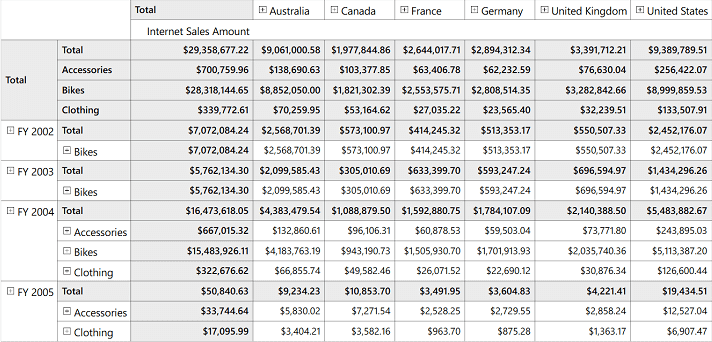

# Grid Layouts

The position of Summary Elements in OlapGrid can be customized with the help of Grid layouts. It can be either positioned at the top or bottom of each parent dimension member. 

The following were the four different kinds of layouts supported by OlapGrid:

* Normal
* Excel like Layout
* Excel like Layout with Member properties
* Normal Top Summary and
* No Summaries

## Normal Layout

Normal Layout is the default layout of OlapGrid in which the summary cells are positioned at the bottom of each parent member and the child member appears adjacent to it.



[C#]

/// Grid Layout will be Normal

this.OlapGrid1.Layout = GridLayout.Normal; 




[VB]

' Grid Layout will be Normal

Me.OlapGrid1.Layout = GridLayout.Normal



## Excel-like Layout

In the Excel-like layout, the summary cells are positioned at the bottom and the child members appear below the parent member with some indent space.


[C#]

/// Excel like Grid Layout

this.OlapGrid1.Layout = GridLayout.ExceLikeLayout; 




[VB]

' Excel like Grid Layout

Me.OlapGrid1.Layout = GridLayout.ExceLikeLayout



## Excel-like Layout with Member properties

This kind of layout is used to display member properties along with dimension members. The properties appear adjacent to each member.


[C#]

/// Excel like GridLayout with Member Properties 

this.OlapGrid1.Layout = GridLayout.ExcelLikeLayoutWithMemberProperties; 

[VB]

' Excel like GridLayout with Member Properties

Me.OlapGrid1.Layout = GridLayout.ExcelLikeLayoutWithMemberProperties



## Normal Top Summary Layout

In Normal Top Summary layout, the summary cells are positioned at the top of each parent member and the child member appears adjacent to it.


[C#]

/// Grid Layout will be Normal with Top positioned summary

this.OlapGrid1.Layout = GridLayout.NormalTopSummary; 




[VB]

' Grid Layout will be Normal with Top positioned summary

Me.OlapGrid1.Layout = GridLayout.NormalTopSummary



## No Summaries Layout

In this kind of layout, the summary cells were made hidden and the child member appears adjacent to the parent member.


[C#]

/// No Summaries Grid Layout

this.OlapGrid1.Layout = GridLayout.NoSummaries; 




[VB]

' Grid Layout will be Normal

Me.OlapGrid1.Layout = GridLayout.NoSummaries



### Sample Location

A sample demo is available at the following location:

..\Syncfusion\EssentialStudio\<Versionnumber>\BI\WPF\OlapGrid.WPF\Samples\Product Showcase\Grid Layout Demo

