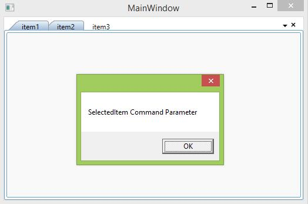

#Pattern and Practices

## Getting Started with MVVM

Essential WPF Controls are suitable for MVVM Pattern. Since the controls are provided with build-in commands. 

This section explains how to perform TabControlExt’s `selectionChanged` event, by create a Viewmodel and define a Model collection that is used to bind with the TabControl’s `ItemSource` property.

XAML



<syncfusion:TabControlExt ItemsSource="{Binding tabcollection}">   <syncfusion:TabControlExt.ItemTemplate>

<DataTemplate>

<TextBlock  Text="{Binding HeaderName}"></TextBlock>

</DataTemplate>

</syncfusion:TabControlExt.ItemTemplate>

</syncfusion:TabControlExt>



C#



public class ViewModel:NotificationObject
{

private ObservableCollection<model> _tabcollection;

public ObservableCollection<model> tabcollection
{
get
	{
	return _tabcollection;
	}

set
	{
	_tabcollection = value;
	}
}

private void Collection()

{

model model = new model()

{
	HeaderName = "item1"
};

model model1 = new model()

{
	HeaderName = "item2"
};

	model model2 = new model()

{
	HeaderName = "item3"
};
	
	tabcollection.Add(model);
	tabcollection.Add(model1);
	tabcollection.Add(model2);

}

public ViewModel()
{
		tabcollection=new ObservableCollection<model>();
		Collection();
	}
}

public class model:NotificationObject
{

public model() {}

private string _headername;

public string HeaderName

	{

	get

		{

		return _headername;

		}

	set

		{

		_headername = value;

		this.RaisePropertyChanged("HeaderName");

		}

	}

}



To handle the `SelectionChanged` event of the TabControlExt in ViewModel, use `TabControlExtSelectionChangedCommand` and define a “SelectionChanged” command using `ICommand`. 

XAML



<syncfusion:TabControlExt ItemsSource="{Binding tabcollection}"  syncfusion:TabControlExtSelectionChangedCommand.Command="{Binding SelectionChanged}">

<syncfusion:TabControlExt.ItemTemplate>

<DataTemplate>

<TextBlock  Text="{Binding HeaderName}"></TextBlock>

</DataTemplate>

</syncfusion:TabControlExt.ItemTemplate>

</syncfusion:TabControlExt>



C#



private ICommand selectionchanged;

public ICommand SelectionChanged
{
get
	{
		return selectionchanged;
	}
}

public ViewModel()
{
	selectionchanged = new DelegateCommand<object>(PropertyChangedHandled);
}

private void PropertyChangedHandled (object obj)
{
	MessageBox.Show("Command Executed”);
}



## MVVM Commands

The following section covers usage of commands in code-behind with the help of view model.

### CommandParameter:

`CommandParameter` can easily pass an object or bind it to a property of another control. The following code example passes a string through command parameter.

XAML



<syncfusion:TabControlExt ItemsSource="{Binding tabcollection}"  syncfusion:TabControlExtSelectionChangedCommand.Command="{Binding SelectionChanged}" syncfusion:TabControlExtSelectionChangedCommand.CommandParameter="SelectedItem Command Parameter">



C#


private void PropertyChangedHandled (object obj)
{
	MessageBox.Show(obj.ToString());
}



#### Pass a property value through Command Parameter:

Any property can bind with the Command Parameter to pass it as command in View Model.

XAML



<syncfusion:TabControlExt ItemsSource="{Binding tabcollection}"  syncfusion:TabControlExtSelectionChangedCommand.Command="{Binding SelectionChanged}"  syncfusion:TabControlExtSelectionChangedCommand.CommandParameter="{Binding Path=SelectedItem.HeaderName,RelativeSource={RelativeSource Self}}">



C#



private void PropertyChangedHandled (object obj)
{
	MessageBox.Show("SelectedItem" +obj.ToString());
}



#### Command Target

The element where the command exists can be determined through EventBinding’s CommandTarget property. Refer to [CommandTarget Property](http://msdn.microsoft.com/en-us/library/system.windows.input.icommandsource.commandtarget%28v=vs.110%29.aspx) for reference.

