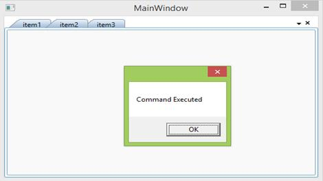
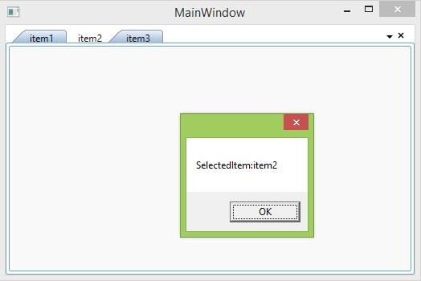

#Pattern and Practices

## Getting Started with MVVM

Essential WPF Controls are suitable for MVVM Pattern. Since the controls are provided with built-in commands. 

This section explains how to perform TabControlExt’s `selectionChanged` event, by create a ViewModel and define a Model collection that is used to bind with the TabControl’s `ItemSource` property.





<syncfusion:TabControlExt ItemsSource="{Binding tabcollection}">

<syncfusion:TabControlExt.ItemTemplate>

<DataTemplate>

<TextBlock  Text="{Binding HeaderName}"></TextBlock>

</DataTemplate>

</syncfusion:TabControlExt.ItemTemplate>

</syncfusion:TabControlExt>









public class ViewModel:NotificationObject
{

private ObservableCollection<model> _tabcollection;

public ObservableCollection<model> tabcollection
{
    get
	{
	return _tabcollection;
	}

    set
	{
	_tabcollection = value;
	}
}

private void Collection()

{
   model model = new model()
   {
	 HeaderName = "item1"
   };

   model model1 = new model()
   {
	 HeaderName = "item2"
   };

   model model2 = new model()
   {
	 HeaderName = "item3"
   };
	
	tabcollection.Add(model);
	tabcollection.Add(model1);
	tabcollection.Add(model2);

}

public ViewModel()
{
		tabcollection=new ObservableCollection<model>();
		Collection();
}

}

public class model:NotificationObject
{

public model() {}

private string _headername;

public string HeaderName
{

	get
	{
		return _headername;
	}

	set
	{
		_headername = value;

		this.RaisePropertyChanged("HeaderName");
	}

}

}





Public Class ViewModel
	Inherits NotificationObject

Private _tabcollection As ObservableCollection(Of model)

Public Property tabcollection() As ObservableCollection(Of model)
	Get
	Return _tabcollection
	End Get

	Set(ByVal value As ObservableCollection(Of model))
	_tabcollection = value
	End Set
End Property

Private Sub Collection()

   Dim model As New model() With {.HeaderName = "item1"}

   Dim model1 As New model() With {.HeaderName = "item2"}

   Dim model2 As New model() With {.HeaderName = "item3"}

	tabcollection.Add(model)
	tabcollection.Add(model1)
	tabcollection.Add(model2)

End Sub

Public Sub New()
		tabcollection = New ObservableCollection(Of model)()
		Collection()
End Sub

End Class

Public Class model
	Inherits NotificationObject

Public Sub New()
End Sub

Private _headername As String

Public Property HeaderName() As String

	Get
		Return _headername
	End Get

	Set(ByVal value As String)
		_headername = value

		Me.RaisePropertyChanged("HeaderName")
	End Set

End Property

End Class 





To handle the `SelectionChanged` event of the TabControlExt in ViewModel, use `TabControlExtSelectionChangedCommand` and define a SelectionChanged command using `ICommand`. 
The `TabControlExtSelectionChangedCommand` command is available in `Syncfusion.Tools.MVVM.WPF` assembly. And it requires `Syncfusion.Shared.MVVM.WPF` as dependency assembly.  





<syncfusion:TabControlExt ItemsSource="{Binding tabcollection}"
                          syncfusion:TabControlExtSelectionChangedCommand.Command="{Binding SelectionChanged}">

<syncfusion:TabControlExt.ItemTemplate>

<DataTemplate>

<TextBlock  Text="{Binding HeaderName}"/>

</DataTemplate>

</syncfusion:TabControlExt.ItemTemplate>

</syncfusion:TabControlExt>









private ICommand selectionchanged;

public ICommand SelectionChanged
{
    get
	{
		return selectionchanged;
	}
}

public ViewModel()
{
	selectionchanged = new DelegateCommand<object>(PropertyChangedHandled);
}

private void PropertyChangedHandled (object obj)
{
	MessageBox.Show("Command Executed");
}




Public Class ViewModel

Private _selectionchanged As ICommand

Public ReadOnly Property SelectionChanged() As ICommand
	Get
		Return _selectionchanged
	End Get
End Property

Public Sub New()
	_selectionchanged = New DelegateCommand(Of Object)(AddressOf PropertyChangedHandled)
End Sub

Private Sub PropertyChangedHandled(ByVal obj As Object)
	MessageBox.Show("Command Executed")
End Sub
End Class 





## MVVM Commands

The following section covers usage of commands in code-behind with the help of ViewModel.

### CommandParameter:

`CommandParameter` can easily pass an object or bind it to a property of another control. The following code example passes a string through CommandParameter.





<syncfusion:TabControlExt ItemsSource="{Binding tabcollection}"
            syncfusion:TabControlExtSelectionChangedCommand.Command="{Binding SelectionChanged}"
			syncfusion:TabControlExtSelectionChangedCommand.CommandParameter="SelectedItem Command Parameter">









private void PropertyChangedHandled (object obj)
{
	MessageBox.Show(obj.ToString());
}





Private Sub PropertyChangedHandled(ByVal obj As Object)
	MessageBox.Show(obj.ToString())
End Sub





#### Pass a property value through Command Parameter:

Any property can bind with the `CommandParameter` to pass it as command in ViewModel.





<syncfusion:TabControlExt ItemsSource="{Binding tabcollection}"
            syncfusion:TabControlExtSelectionChangedCommand.Command="{Binding SelectionChanged}"
			syncfusion:TabControlExtSelectionChangedCommand.CommandParameter="{Binding Path=SelectedItem.HeaderName,
			RelativeSource={RelativeSource Self}}">









private void PropertyChangedHandled (object obj)
{
	MessageBox.Show("SelectedItem" +obj.ToString());
}





Private Sub PropertyChangedHandled(ByVal obj As Object)
	MessageBox.Show("SelectedItem" & obj.ToString())
End Sub 





#### Command Target

The element where the command exists can be determined through EventBinding’s `CommandTarget` property. Refer to [CommandTarget Property](http://msdn.microsoft.com/en-us/library/system.windows.input.icommandsource.commandtarget%28v=vs.110%29.aspx) for reference.

