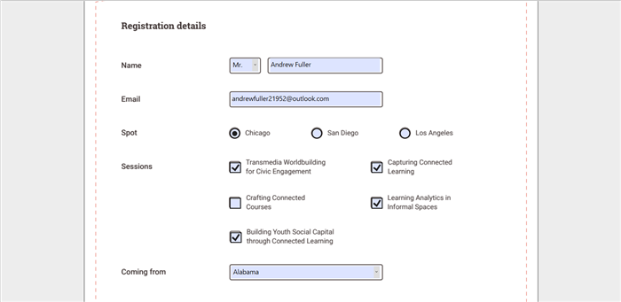

# Form Filling in PDF Files

PDF Viewer provides the ability to Fill, Edit, Flatten, and Save the `AcroForm` fields in PDF files.

## Supported form fields

You can load and fill the following form fields in a PDF document using the PDF Viewer.

1.	Text box.
2.	Password box.
3.	Checkbox.
4.	Radio button.
5.	Combo box.
6.	List box.

## Retrieve the details of text box form field

You can retrieve the details of a text box form field through the [FormFieldClicked](https://help.syncfusion.com/cr/wpf/Syncfusion.PdfViewer.WPF~Syncfusion.Windows.PdfViewer.PdfViewerControl~FormFieldClicked_EV.html) event of [PdfViewerControl](https://help.syncfusion.com/cr/wpf/Syncfusion.PdfViewer.WPF~Syncfusion.Windows.PdfViewer.PdfViewerControl.html) by simply clicking on the field. The [FormField](https://help.syncfusion.com/cr/cref_files/wpf/Syncfusion.PdfViewer.WPF~Syncfusion.Windows.PdfViewer.FormFieldClickedEventArgs~FormField.html) property of the [FormFieldClickedEventArgs](https://help.syncfusion.com/cr/cref_files/wpf/Syncfusion.PdfViewer.WPF~Syncfusion.Windows.PdfViewer.FormFieldClickedEventArgs.html) needs to be typecast to the [TextBox](https://docs.microsoft.com/en-us/dotnet/api/system.windows.controls.textbox?view=netcore-3.1) control as shown in the following code.




using Syncfusion.Windows.PdfViewer;
using System.Windows;
using System.Windows.Controls;

namespace PdfViewer
{
    /// 

    /// Interaction logic for Window1.xaml
    /// 

    public partial class MainWindow : Window
    {
        #region Constructor
        public MainWindow()
        {
            InitializeComponent();
			
			//Load the form filling PDF file
            pdfViewer.Load(@"FormFillingDocument.pdf");
			
			//Wire the `FormFieldClicked` event.
            pdfViewer.FormFieldClicked += PdfViewer_FormFieldClicked;
        }
        #endregion

        private void PdfViewer_FormFieldClicked(object sender, FormFieldClickedEventArgs args)
        {
			//Typecast the `FormField` property to `System.Windows.Controls.TextBox`
            TextBox textBox = args.FormField as TextBox;
			
			//Retrive the `Text` property
            string text = textBox.Text;
			
            //Insert your code here.
        }
    }
}

N> The sample project of PDF form filling using the Syncfusion PDF Viewer is available in the [GitHub](https://github.com/syncfusion/wpf-demos/tree/master/PDF Viewer/Form Filling/Pdf Viewer Form Filling).




## Import and Export Form Data

In WPF, the PDF viewer allows the users to import and export form data to and from the PDF documents.

### Import Form Data

Follow the below steps to import date to PDF document with `AcroForm`.

1.	Click the form data tool button in the left pane, the form data toolbar will appear as a secondary toolbar in the `PdfViewerControl`.
2.	Select **Import** option in form data toolbar to import the PDF form data.

  

The following code shows how to import form data in code behind.




private void button1_Click(object sender, RoutedEventArgs e)
{
    //Import PDF form data
    pdfviewer.ImportFormData("Import.fdf", Syncfusion.Pdf.Parsing.DataFormat.Fdf);
}




Private Sub button1_Click(sender As Object, e As RoutedEventArgs)
    'Import PDF form data
    pdfviewer.ImportFormData("Import.fdf", Syncfusion.Pdf.Parsing.DataFormat.Fdf)
End Sub




### Export Form Data

Follow the below steps to export data from PDF document

1. Select **Export** option in the form data toolbar, to save the completed PDF form data as a file in another file format.
2. In Export Form Data As dialog box, you can select the desired format to save the form data (FDF, XFDF, XML, and JSON).

N> If the PDF document is loaded as a stream, the `PdfViewerControl` will request for the form name when exporting.

The following code shows how to export form data in code behind.




private void button1_Click(object sender, RoutedEventArgs e)
{
    //Export PDF form data
    pdfviewer.ExportFormData("Export.fdf", Syncfusion.Pdf.Parsing.DataFormat.Fdf, "SourceForm.pdf");
}




Private Sub button1_Click(sender As Object, e As RoutedEventArgs)
    'Export PDF form data
    pdfviewer.ExportFormData("Export.fdf", Syncfusion.Pdf.Parsing.DataFormat.Fdf, "SourceForm.pdf")
End Sub


