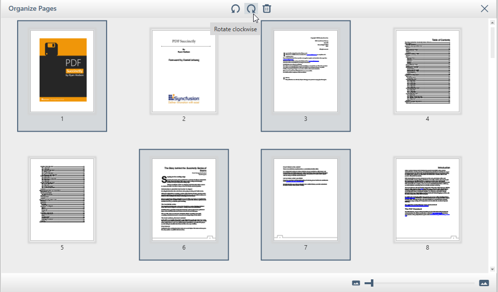
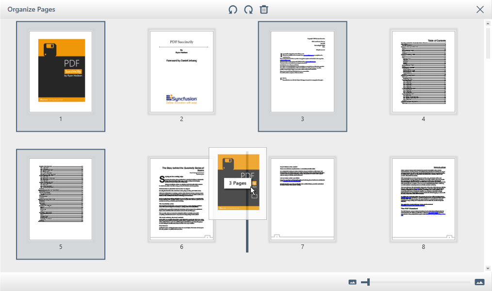

# Organize Pages in WPF Pdf Viewer

Organize pages support allows you to rotate, rearrange, and delete pages from a PDF document using a miniature preview of the PDF pages.

Use the following steps to organize the PDF page(s) in [PdfViewerControl](https://help.syncfusion.com/cr/wpf/Syncfusion.Windows.PdfViewer.PdfViewerControl.html):

1. Click the organize page button in the left pane, this displays the organize pages pane in the [PdfViewerControl](https://help.syncfusion.com/cr/wpf/Syncfusion.Windows.PdfViewer.PdfViewerControl.html).

2. You can rotate or delete a specific page using context menu that appears when hovering the mouse over the pages.

	

3. You can rotate or delete multiple pages using the organize pages toolbar.

	

	N> You can use Ctrl/Shift keys to select multiple pages. Also, you can select all pages using Ctrl+A shortcut key. You cannot delete all the pages from the document. 

4. You can rearrange the page(s) by dragging and dropping them.

	

## Rotating PDF page(s)

You can rotate PDF page(s) in clockwise, anti-clockwise or to a specific angle using the [Rotate](https://help.syncfusion.com/cr/wpf/Syncfusion.Windows.PdfViewer.PageOrganizer.html#Syncfusion_Windows_PdfViewer_PageOrganizer_Rotate_System_Int32___Syncfusion_Pdf_PdfPageRotateAngle_) method. Refer to the following code example to rotate a page from code behind.




private void button1_Click(object sender, RoutedEventArgs e)
{
    //Rotating the pages with index 0 and 1 to 90 degree
    pdfviewer.PageOrganizer.Rotate(new int[]{0,1},Syncfusion.Pdf.PdfPageRotateAngle.RotateAngle90);
}




Private Sub button1_Click(sender As Object, e As RoutedEventArgs) 
   'Rotating the pages with index 0 and 1 to 90 degree
   pdfviewer.PageOrganizer.Rotate(new int[]{0,1}, Syncfusion.Pdf.PdfPageRotateAngle.RotateAngle90)
End Sub




### Rotating PDF page(s) Clockwise

You can rotate PDF page(s) clockwise using the [PageOrganizer.RotateClockwise](https://help.syncfusion.com/cr/wpf/Syncfusion.Windows.PdfViewer.PageOrganizer.html#Syncfusion_Windows_PdfViewer_PageOrganizer_RotateClockwise_System_Int32___) method. 




private void button1_Click(object sender, RoutedEventArgs e)
{
    //Rotating the pages with index 0 and 1 in clockwise
    pdfviewer.PageOrganizer.RotateClockwise(new int[] { 0, 1 });
}




Private Sub button1_Click(sender As Object, e As RoutedEventArgs) 
    'Rotating the pages with index 0 and 1 in clockwise
    pdfviewer.PageOrganizer.RotateClockwise(new int[] { 0, 1 })
End Sub




### Rotating PDF page(s) Counterclockwise

You can rotate PDF page(s) in counterclockwise using the [PageOrganizer.RotateCounterclockwise](https://help.syncfusion.com/cr/wpf/Syncfusion.Windows.PdfViewer.PageOrganizer.html#Syncfusion_Windows_PdfViewer_PageOrganizer_RotateCounterclockwise_System_Int32___) method. 




private void button1_Click(object sender, RoutedEventArgs e)
{
    //Rotating the pages with index 0 and 1 in counterclockwise
    pdfviewer.PageOrganizer.RotateCounterclockwise (new int[] { 0, 1 });
}




Private Sub button1_Click(sender As Object, e As RoutedEventArgs) 
    'Rotating the pages with index 0 and 1 in counterclockwise
    pdfviewer.PageOrganizer.RotateCounterclockwise (new int[] { 0, 1 })
End Sub




### Rotating page(s) using command

You can rotate the specific range of pages using the [RotatePagesCommand](https://help.syncfusion.com/cr/wpf/Syncfusion.Windows.PdfViewer.PageOrganizer.html#Syncfusion_Windows_PdfViewer_PageOrganizer_RotatePagesCommand) of [PdfViewerControl](https://help.syncfusion.com/cr/wpf/Syncfusion.Windows.PdfViewer.PdfViewerControl.html). The following code shows how to rotate pages by executing the command with the index of the pages to be rotated and the angle to which it is rotated as command parameter. In this example the pages at the index 0 and 1, are rotated through 180 degrees.




pdfViewerControl.PageOrganizer.RotatePagesCommand.Execute(new object[] { new int[] { 0, 1 }, PdfPageRotateAngle.RotateAngle180 });




Similarly, you can rotate the specific range of pages 90 degrees clockwise and counterclockwise with respect to the current angle using the [RotatePagesClockwiseCommand](https://help.syncfusion.com/cr/wpf/Syncfusion.Windows.PdfViewer.PageOrganizer.html#Syncfusion_Windows_PdfViewer_PageOrganizer_RotatePagesClockwiseCommand) and [RotatePagesCounterclockwiseCommand](https://help.syncfusion.com/cr/wpf/Syncfusion.Windows.PdfViewer.PageOrganizer.html#Syncfusion_Windows_PdfViewer_PageOrganizer_RotatePagesCounterclockwiseCommand) of [PdfViewerControl](https://help.syncfusion.com/cr/wpf/Syncfusion.Windows.PdfViewer.PdfViewerControl.html). The following codes shows how to rotate pages clockwise and counterclockwise respectively, with the index of the pages to be rotated as command parameter.




pdfViewerControl.PageOrganizer.RotatePagesClockwiseCommand.Execute( new int[] { 0, 1 } );







pdfViewerControl.PageOrganizer.RotatePagesCounterclockwiseCommand.Execute( new int[] { 0, 1 } );




## Acquiring page rotation

You can get the rotation angle of a PDF page in terms of [PdfPageRotateAngle](https://help.syncfusion.com/cr/wpf/Syncfusion.Pdf.PdfPageRotateAngle.html) using [PageOrganizer.GetPageRotation()](https://help.syncfusion.com/cr/wpf/Syncfusion.Windows.PdfViewer.PageOrganizer.html#Syncfusion_Windows_PdfViewer_PageOrganizer_GetPageRotation_System_Int32_) method.




private void button1_Click(object sender, RoutedEventArgs e)
{
    //Gets rotation angle of page with index 0 
    PdfPageRotateAngle rotatedAngle = pdfviewer.PageOrganizer.GetPageRotation(0);
}




Private Sub button1_Click(sender As Object, e As RoutedEventArgs) 
    'Gets rotation angle of page with index 0 
    Dim rotatedAngle As PdfPageRotateAngle = pdfviewer.PageOrganizer.GetPageRotation(0)
End Sub




## Rearranging PDF pages

You can rearrange the existing PDF document pages using the [ReArrange(int[])](https://help.syncfusion.com/cr/wpf/Syncfusion.Windows.PdfViewer.PageOrganizer.html#Syncfusion_Windows_PdfViewer_PageOrganizer_ReArrange_System_Int32___) method.  This method uses zero based start index. 




private void button1_Click(object sender, RoutedEventArgs e)
{
    //Rearrange the page by index
    pdfviewer.PageOrganizer.ReArrange(new int[] { 1, 0 });
}




Private Sub button1_Click(sender As Object, e As RoutedEventArgs) 
    'Rearrange the page by index
    pdfviewer.PageOrganizer.ReArrange(new int[] { 1, 0 })
End Sub




N> If any of the already existing page index is not present in rearranged array, then that page will be removed.

## Removing PDF page(s)

You can remove the PDF page(s) from the PDF document using the RemoveAt method in PageOrganizer.
To remove the page at specific index from PDF document, refer to the following code example. 




private void button1_Click(object sender, RoutedEventArgs e)
{
    //Remove a page at index 0
    pdfviewer.PageOrganizer.RemoveAt(0);
}




Private Sub button1_Click(sender As Object, e As RoutedEventArgs) 
    'Remove a page at index 0
    pdfviewer.PageOrganizer.RemoveAt(0)
End Sub




To remove the set of pages from PDF document, refer to the following code example.




private void button1_Click(object sender, RoutedEventArgs e)
{
    //Removing the pages at index 0 and 1
    pdfviewer.PageOrganizer.RemovePages(new int[] { 0, 1 });
}




Private Sub button1_Click(sender As Object, e As RoutedEventArgs) 
    'Removing the pages at index 0 and 1
    pdfviewer.PageOrganizer.RemovePages(new int[] { 0, 1 })
End Sub




### Remove page(s) using command

You can remove the specific range of pages using the [RemovePagesCommand](https://help.syncfusion.com/cr/wpf/Syncfusion.Windows.PdfViewer.PageOrganizer.html#Syncfusion_Windows_PdfViewer_PageOrganizer_RemovePagesCommand) of [PdfViewerControl](https://help.syncfusion.com/cr/wpf/Syncfusion.Windows.PdfViewer.PdfViewerControl.html). The following code shows how to remove pages by executing the command with the index of the pages as command parameter.




pdfViewerControl.PageOrganizer.RemovePagesCommand.Execute(new int[] { 0, 1 });




## Get the selected page indexes

You can get the selected page indexes of the PDF document in the organizing pages window. The [PageSelected](https://help.syncfusion.com/cr/wpf/Syncfusion.Windows.PdfViewer.PdfViewerControl.html#Syncfusion_Windows_PdfViewer_PdfViewerControl_PageSelected) event indicates that a page(s) is selected and the [SelectedPages](https://help.syncfusion.com/cr/wpf/Syncfusion.Windows.PdfViewer.PageSelectedEventArgs.html#Syncfusion_Windows_PdfViewer_PageSelectedEventArgs_SelectedPages) property of the [PageSelectedEventArgs](https://help.syncfusion.com/cr/wpf/Syncfusion.Windows.PdfViewer.PageSelectedEventArgs.html) provides you the index of the pages that are currently selected. The following code shows how to wire the event in [PdfViewerControl](https://help.syncfusion.com/cr/wpf/Syncfusion.Windows.PdfViewer.PdfViewerControl.html).




// Hook the page selected event.  
pdfViewer.PageSelected += PdfViewer_PageSelected;  
private void PdfViewer_PageSelected(object sender, PageSelectedEventArgs e)  
{  
	// Get the selected pages. 
	if (e.SelectedPages.Length != 0) 
		selectedPages = e.SelectedPages; 
}  




## Disabling page organizer

You can remove the page organizer icon from left pane of the ‘PdfViewerControl’ by setting the ‘PageOrganizerSettings.IsIconVisible’ property to false. 
Refer to the following code example to disable the organize page.




private void button1_Click(object sender, RoutedEventArgs e)
{
    //Removing the page organizer icon from left pane. 
    pdfviewer.PageOrganizerSettings.IsIconVisible = false;
}




Private Sub button1_Click(sender As Object, e As RoutedEventArgs) 
    'Removing the page organizer icon from left pane. 
    pdfviewer.PageOrganizerSettings.IsIconVisible = false
End Sub




N> The sample projects for organizing pages using the Syncfusion PDF Viewer are available in the [GitHub](https://github.com/SyncfusionExamples/WPF-PDFViewer-Examples/tree/master/OrganzingPages-Examples/PageOrganizer).

## Keyboard shortcuts

The following keyboard shortcuts are available at miniature preview mode to organize the PDF pages:

•	Delete key: Deletes the selected page from the PDF document.
•	Ctrl+A: Selects all pages in the PDF document.
•	Shift+Arrow/MouseButton: Selects a set of consecutive pages in the PDF document.
•	Ctrl+MouseButton: Selects the clicked pages in the PDF document.
