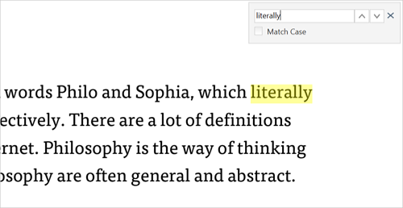

# Search text in PDF files using WPF PDF Viewer

N> From version 19.4.0.48, we have updated our default text extraction engine to PDFium for extracting text information from PDF documents. Based on the text information, we perform text search in PDF documents. Please refer to the [link](https://help.syncfusion.com/wpf/pdf-viewer/text-extraction-engines) for more details.

The WPF PDF Viewer allows you to search and highlight the text in the PDF files. The search box appears when Ctrl+F is pressed and searches the text in the PDF document as displayed in the following screenshot.

N> [PdfDocumentView](https://help.syncfusion.com/cr/wpf/Syncfusion.Windows.PdfViewer.PdfDocumentView.html) is used to view the PDF documents without the toolbar. So, make use of [PdfViewerControl](https://help.syncfusion.com/cr/wpf/Syncfusion.Windows.PdfViewer.PdfViewerControl.html) to search the text using search box.

## Search text in PDF programmatically

The WPF PDF Viewer also supports searching text in the PDF programmatically using the following API. The [FindText](https://help.syncfusion.com/cr/wpf/Syncfusion.Windows.PdfViewer.PdfViewerControl.html#Syncfusion_Windows_PdfViewer_PdfViewerControl_FindText_System_String_System_Collections_Generic_Dictionary_System_Int32_System_Collections_Generic_List_System_Drawing_RectangleF____) method returns true when the text given is found in the document. The dictionary contains the page index and the list of rectangular coordinates of the text found in that page. The following code example explains how text search can be achieved after [creating the control from the code](https://help.syncfusion.com/wpf/pdf-viewer/getting-started#creating-pdfviewercontrol-from-code) and handled in the Loaded event of the [application's MainWindow](https://docs.microsoft.com/en-us/dotnet/api/system.windows.application.mainwindow?view=netframework-4.8).



        private void Window_Loaded(object sender, RoutedEventArgs e)
        {
            bool isMatchFound;

            //Load the PDF.
            pdfViewer.Load("../../Data/Barcode.pdf");

            //Get the occurrences of the target text and location.
            Dictionary<int, List<RectangleF>> textSearch = new Dictionary<int, List<RectangleF>>();

            isMatchFound = pdfViewer.FindText("targetText", out textSearch);
        }




Private Sub Window_Loaded(sender As Object, e As RoutedEventArgs)

	Dim isMatchFound As Boolean

	'Load the PDF.
	pdfViewer.Load("../../Data/Barcode.pdf")

	'Get the occurrences of the target text and location.
	Dim textSearch As New Dictionary(Of Integer, List(Of RectangleF))()

	isMatchFound = pdfViewer.FindText("targetText", textSearch)

End Sub




N> You can refer to our [WPF PDF Viewer](https://www.syncfusion.com/wpf-controls/pdf-viewer) feature tour page for its groundbreaking feature representations. You can also explore our [WPF PDF Viewer example](https://github.com/syncfusion/wpf-demos) to know how to render and configure the pdfviewer.