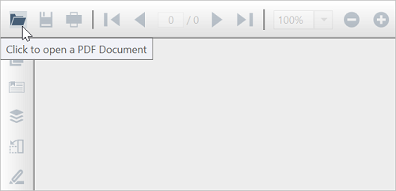
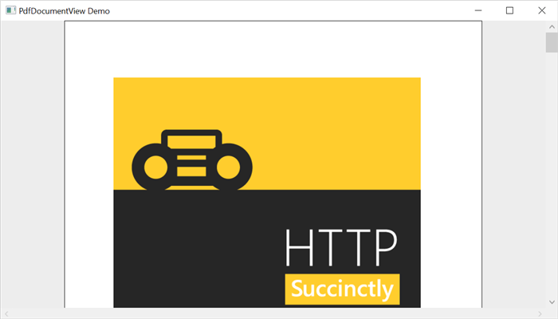

# Viewing PDF Files 

PDF Viewer allows you to easily open and view the PDF files interactively using the <b>Open</b> button in the built-in toolbar as well as from code behind using the available APIs.

## Open PDF file from the local disk using toolbar

You can open a PDF file from the toolbar by browsing it from the local disk. You can open both the normal and password-protected PDF files. The Open button in the toolbar allows you to perform the same using the following steps.

1. Add the [PdfViewerControl](https://help.syncfusion.com/cr/wpf/Syncfusion.PdfViewer.WPF~Syncfusion.Windows.PdfViewer.PdfViewerControl.html) in the MainWindow.xaml and run the project.

   ~~~xaml
	<Window 
		x:Class="PdfViewerDemo.MainWindow"
		xmlns="http://schemas.microsoft.com/winfx/2006/xaml/presentation"
		xmlns:x="http://schemas.microsoft.com/winfx/2006/xaml"
		WindowState="Maximized"
		xmlns:syncfusion="clr-namespace:Syncfusion.Windows.PdfViewer;assembly=Syncfusion.PdfViewer.WPF">
		<Grid>
			<syncfusion:PdfViewerControl x:Name="pdfViewer"></syncfusion:PdfViewerControl>
		</Grid>
	</Window>
   ~~~
   
2. Click the <b>Open</b> button in the toolbar, as shown in the following picture. 
3. In the open file dialog, enter the file name or browse the file from the local disk and select <b>Open</b>.

## View PDF file using the file path

You can view the PDF file from code behind, by passing the file path as a parameter to the [Load](https://help.syncfusion.com/cr/cref_files/wpf/Syncfusion.PdfViewer.WPF~Syncfusion.Windows.PdfViewer.PdfViewerControl~Load(String).html) method of [PdfViewerControl](https://help.syncfusion.com/cr/wpf/Syncfusion.PdfViewer.WPF~Syncfusion.Windows.PdfViewer.PdfViewerControl.html). It accepts both the absolute and relative file paths. Refer to the following code to perform the same.



using System.Windows;

namespace PdfViewerDemo
{
    /// 

    /// Interaction logic for MainWindow.xaml
    /// 

    public partial class MainWindow : Window
    {
        # region Constructor
        public MainWindow()
        {
            InitializeComponent();

            //Load PDF file using the file path.
            pdfViewer.Load(@"HTTP Succinctly.pdf");
        }
        #endregion
    }
}



## View PDF file from stream

You can view the PDF file from code behind, by passing the [Stream](https://docs.microsoft.com/en-us/dotnet/api/system.io.stream?redirectedfrom=MSDN&view=netcore-3.1) as a parameter to the Load method of [PdfViewerControl](https://help.syncfusion.com/cr/wpf/Syncfusion.PdfViewer.WPF~Syncfusion.Windows.PdfViewer.PdfViewerControl.html). Refer to the following code to perform the same.



using System.IO;
using System.Windows;

namespace PdfViewerDemo
{
    /// 

    /// Interaction logic for MainWindow.xaml
    /// 

    public partial class MainWindow : Window
    {
        # region Constructor
        public MainWindow()
        {
            InitializeComponent();

            FileStream stream = new FileStream(@"HTTP Succinctly.pdf", FileMode.Open);

            //Load PDF file using stream.
            pdfViewer.Load(stream);
        }
        #endregion
    }
}



## View the password-protected PDF file

PDF Viewer allows you to view the password-protected PDF files by passing the file name and the correct password as parameters to the [Load](https://help.syncfusion.com/cr/cref_files/wpf/Syncfusion.PdfViewer.WPF~Syncfusion.Windows.PdfViewer.PdfViewerControl~Load(String,String).html) method of [PdfViewerControl](https://help.syncfusion.com/cr/cref_files/wpf/Syncfusion.PdfViewer.WPF~Syncfusion.Windows.PdfViewer.PdfViewerControl~Load(String,String).html). Refer to the following code to perform the same.



using System.Windows;

namespace PdfViewerDemo
{
    /// 

    /// Interaction logic for MainWindow.xaml
    /// 

    public partial class MainWindow : Window
    {
        # region Constructor
        public MainWindow()
        {
            InitializeComponent();

            //Load password protected PDF file using the file path and the password.
            pdfViewer.Load(@"Template.pdf", "password");
        }
        #endregion
    }
}



## View PDF file using the ItemSource property

You can also view a PDF file using the [ItemSource](https://help.syncfusion.com/cr/cref_files/wpf/Syncfusion.PdfViewer.WPF~Syncfusion.Windows.PdfViewer.PdfViewerControl~ItemSource.html) property of [PdfViewerControl](https://help.syncfusion.com/cr/cref_files/wpf/Syncfusion.PdfViewer.WPF~Syncfusion.Windows.PdfViewer.PdfViewerControl~ItemSource.html). The property accepts the string file path as well as [Stream](https://docs.microsoft.com/en-us/dotnet/api/system.io.stream?redirectedfrom=MSDN&view=netcore-3.1).



using System.Windows;

namespace PdfViewerDemo
{
    /// 

    /// Interaction logic for MainWindow.xaml
    /// 

    public partial class MainWindow : Window
    {
        # region Constructor
        public MainWindow()
        {
            InitializeComponent();

            //Load PDF file using the` ItemSource` property.
            pdfViewer.ItemSource = @"HTTP Succinctly.pdf";
        }
        #endregion
    }
}



## View PDF files without using the toolbar

The [PdfDocumentView](https://help.syncfusion.com/cr/cref_files/wpf/Syncfusion.PdfViewer.WPF~Syncfusion.Windows.PdfViewer.PdfDocumentView.html) control allows you to view the PDF files without toolbar using the [Load](https://help.syncfusion.com/cr/cref_files/wpf/Syncfusion.PdfViewer.WPF~Syncfusion.Windows.PdfViewer.PdfDocumentView.html) methods from code behind. Refer to the following steps to perform the same.

1. Add the [PdfDocumentView](https://help.syncfusion.com/cr/cref_files/wpf/Syncfusion.PdfViewer.WPF~Syncfusion.Windows.PdfViewer.PdfDocumentView.html) control in the MainWindow.xaml.

   ~~~xaml
	<Window 
		x:Class="PdfViewerDemo.MainWindow"
		xmlns="http://schemas.microsoft.com/winfx/2006/xaml/presentation"
		xmlns:x="http://schemas.microsoft.com/winfx/2006/xaml"
		WindowState="Maximized"
		xmlns:syncfusion="clr-namespace:Syncfusion.Windows.PdfViewer;assembly=Syncfusion.PdfViewer.WPF">
		<Grid>
			<syncfusion:PdfDocumentView x:Name="pdfViewer"></syncfusion:PdfDocumentView>
		</Grid>
	</Window>
   ~~~
   
2. Load the file using the [Load](https://help.syncfusion.com/cr/cref_files/wpf/Syncfusion.PdfViewer.WPF~Syncfusion.Windows.PdfViewer.PdfDocumentView~Load(String).html) method as mentioned in the following code snippet in MainWindow.xaml.cs.
   
   ~~~csharp
	using System.Windows;
	
	namespace PdfViewerDemo
	{
		/// 

		/// Interaction logic for MainWindow.xaml
		/// 

		public partial class MainWindow : Window
		{
			# region Constructor
			public MainWindow()
			{
				InitializeComponent();

				//Load PDF file using file path.
				pdfViewer.Load(@"HTTP Succinctly.pdf");
			}
			#endregion
		}
	}
   ~~~
   
3. Run the project.

The following picture illustrates how the PDF file being displayed in [PdfDocumentView](https://help.syncfusion.com/cr/cref_files/wpf/Syncfusion.PdfViewer.WPF~Syncfusion.Windows.PdfViewer.PdfDocumentView.html) control. 

## Obtain the PDF file information

You can get the information on the PDF file that is being displayed in the control using the [DocumentInfo](https://help.syncfusion.com/cr/wpf/Syncfusion.PdfViewer.WPF~Syncfusion.Windows.PdfViewer.PdfViewerControl~DocumentInfo.html) property of [PdfViewerControl](https://help.syncfusion.com/cr/wpf/Syncfusion.PdfViewer.WPF~Syncfusion.Windows.PdfViewer.PdfViewerControl.html). This property provides you the information such as file name and the folder name from that the PDF file is opened using the [FileName](https://help.syncfusion.com/cr/cref_files/wpf/Syncfusion.PdfViewer.WPF~Syncfusion.Windows.PdfViewer.DocumentInfo~FileName.html) and [FilePath](https://help.syncfusion.com/cr/cref_files/wpf/Syncfusion.PdfViewer.WPF~Syncfusion.Windows.PdfViewer.DocumentInfo~FileName.html) properties respectively.

Refer to the following code to obtain the document information using the [DocumentInfo](https://help.syncfusion.com/cr/wpf/Syncfusion.PdfViewer.WPF~Syncfusion.Windows.PdfViewer.PdfViewerControl~DocumentInfo.html) property.



using System.IO;
using System.Windows;

namespace PdfViewerDemo
{
    /// 

    /// Interaction logic for Window1.xaml
    /// 

    public partial class MainWindow : Window
    {
        # region Constructor
        public MainWindow()
        {
            InitializeComponent();

            //Load PDF file with the absolute file path.
            pdfViewer.Load(Path.GetFullPath(@"HTTP Succinctly.pdf"));

            //Get the file name
            string fileName = pdfViewer.DocumentInfo.FileName;
            string folder = pdfViewer.DocumentInfo.FilePath;

        }
        #endregion
    }
}



If you open a file using the toolbar, you can obtain the information in the [DocumentLoaded](https://help.syncfusion.com/cr/cref_files/wpf/Syncfusion.PdfViewer.WPF~Syncfusion.Windows.PdfViewer.PdfDocumentView~DocumentLoaded_EV.html) event. Refer to the following code to achieve the same.



using System.Windows;

namespace PdfViewerDemo
{
    /// 

    /// Interaction logic for Window1.xaml
    /// 

    public partial class MainWindow : Window
    {
        # region Constructor
        public MainWindow()
        {
            InitializeComponent();

            //wire the DocumentLoaded event
            pdfViewer.DocumentLoaded += PdfViewer_DocumentLoaded;
        }
        #endregion

        private void PdfViewer_DocumentLoaded(object sender, System.EventArgs args)
        {
            //Get the file name
            string fileName = pdfViewer.DocumentInfo.FileName;
            string folder = pdfViewer.DocumentInfo.FilePath;
        }
    }
}

