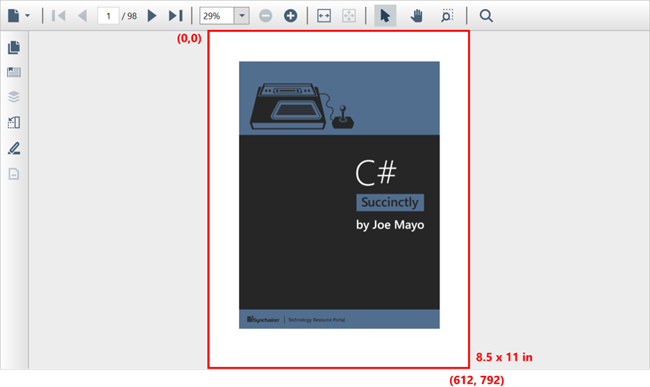

# Working With PDF Coordinates in WPF PDF Viewer

The WPF PDF Viewer allows users to obtain the PDF page coordinates relative to the PDF Viewer's client coordinates and vice versa. It also allows you to obtain the scroll point relative to the PDF page coordinates and bring the given particular region into the view.

## Client coordinates

The WPF PDF Viewer specifies the position of points in the client area(viewport) using client coordinates. The origin for client coordinates is the upper-left corner of the client area(viewport) of the control. The dimensions of the client area(viewport) are also known as **client rectangle**, which is the bounds of the control without the non-client elements such as toolbars and scroll bars. The client rectangle in WPF PDF Viewer is represented by the red rectangle in the following figure.

  	

The client rectangle can be obtained by the `ClientRectangle` property of the PDF Viewer.




//Retrieves the coordinates of the PDF Viewer's client area (viewport)
Rectangle clientRectangle = pdfViewerControl.ClientRectangle;




## PDF page coordinates

PDF page coordinates are represented in terms of device-independent coordinate system called user space, which is independent of the output device on which printing or displaying will occur. The user space coordinate system is initialized to a default state for each page of a PDF document. The length of a unit is 1/72 inch, which is approximately the same as a unit of **point(pt)**. As an example, the following figure shows the dimensions of a letter-sized paper in the PDF page coordinates with WPF PDF Viewer.

  	

## Get and set scroll coordinates

The user can navigate to the specified vertical and horizontal scroll offset coordinates in PDF Viewer using `ScrollToOffset` method and the user can also retrieve the current horizontal and vertical offset position by using `HorizontalOffset` and `VerticalOffset` properties respectively. The following code snippet explains getting and setting the scroll coordinates.




//Retrieves the current horizontal offset of the PdfViewerControl
m_currentHorizontalOffset = pdfViewerControl.HorizontalOffset;
 
//Retrieves the current vertical offset of the PdfViewerControl
m_currentVerticalOffset = pdfViewerControl.VerticalOffset;
 
//Scrolls the content to the specified offset position in the PdfViewerControl
pdfViewerControl.ScrollToOffset(m_currentHorizontalOffset+10, m_currentVerticalOffset+10);




## Convert PDF Viewer's coordinates to PDF page coordinates

The user can convert the client coordinates to the PDF page coordinates using the `ConvertClientPointToPagePoint` method by passing the client rectangle point and page number as input parameters. The user can get the page number of the client area using `GetPageNumberFromClientPoint` method by passing the client rectangle point as the input parameter. The following code sample explains converting clicked client area position to page point.




// Handles the Page Clicked Event
private void PdfViewerControl_PageClicked(object sender, PageClickedEventArgs e)
{
    //Retrieves the clicked client area position
    Point clientPoint = e.Position;
 
    //Retrieves the page number that corresponds to the client point
    int pageNumber = pdfViewerControl.GetPageNumberFromClientPoint(clientPoint)
 
    //Retrieves the page point
    Point pagePoint = pdfViewerControl.ConvertClientPointToPagePoint(clientPoint, pageNumber);
} 




## Convert PDF page coordinates to PDF Viewer's coordinates

The user can also convert the PDF page coordinates to the client coordinates using the `ConvertPagePointToClientPoint` method by passing the page point and page number as input parameters. The following code sample explains converting a shape annotation's position in the page coordinates to client point.




//Handles the shape annotation change event
private void PdfViewer_ShapeAnnotationChanged(object sender, ShapeAnnotationChangedEventArgs e)
{
    //Gets the bounds of the shape annotation
    RectangleF bounds = e.OldBounds;

    //Create the point from the bounds
    Point pagePoint = new Point(bounds.X, bounds.Y);

    //Get the Page Number from the event arguments
    int pageNumber = e.PageNumber;

    //Convert the page point to client point
    Point clientPoint = pdfViewerControl.ConvertPagePointToClientPoint(pagePoint, pageNumber);
}




## Convert PDF page coordinates to scroll coordinates

The user can obtain the scroll coordinates using the `ConvertPagePointToScrollPoint` method by passing the page point and page number as input parameters. The following code example explains converting a shape annotation’s position in the page coordinates to scroll point in the PDF Viewer.




//Handles the shape annotation change event
private void PdfViewer_ShapeAnnotationChanged(object sender, ShapeAnnotationChangedEventArgs e)
{
    //Gets the bounds of the shape annotation
    RectangleF bounds = e.OldBounds;

    //Create the point from the bounds
    Point pagePoint = new Point(bounds.X, bounds.Y);

    //Get the Page Number from the event arguments
    int pageNumber = e.PageNumber;

    //Convert the page point to scroll point
    Point scrollPoint = pdfViewerControl.ConvertPagePointToScrollPoint(pagePoint, pageNumber);
}




## Bring a particular region to the view

The user can bring the given rectangular region to view and zooms in the document to fit the region in the PDF Viewer's client area (viewport) using the `ZoomToRect` method by passing the rectangular region as input parameter. The following code sample explains bringing a particular into the view.




//Create a bounds with respect to client area
Rect bounds = new Rect(400 , 300, 200, 400)

//Pass the converted rectangle in client coordinates to the ZoomToRect method. 
pdfViewerControl.ZoomToRect(bounds);




N> You can refer to our [WPF PDF Viewer](https://www.syncfusion.com/wpf-controls/pdf-viewer) feature tour page for its groundbreaking feature representations. You can also explore our [WPF PDF Viewer example](https://github.com/syncfusion/wpf-demos) to know how to render and configure the pdfviewer.