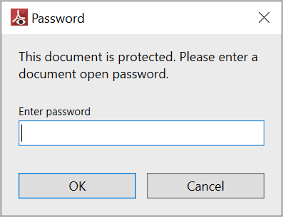

# Viewing Password protected PDF Files in WPF Pdf Viewer

PDF Viewer allows you to view the password-protected PDF files by passing the file name and the correct password as parameters to the [Load](https://help.syncfusion.com/cr/wpf/Syncfusion.Windows.PdfViewer.PdfViewerControl.html#Syncfusion_Windows_PdfViewer_PdfViewerControl_Load_System_String_System_String_) method of [PdfViewerControl](https://help.syncfusion.com/cr/wpf/Syncfusion.Windows.PdfViewer.PdfViewerControl.html#Syncfusion_Windows_PdfViewer_PdfViewerControl_Load_System_String_System_String_). Refer to the following code to perform the same.



using System.Windows;

namespace PdfViewerDemo
{
    /// 

    /// Interaction logic for MainWindow.xaml
    /// 

    public partial class MainWindow : Window
    {
        # region Constructor
        public MainWindow()
        {
            InitializeComponent();

            //Load password protected PDF file using the file path and the password.
            pdfViewer.Load(@"Template.pdf", "password");
        }
        #endregion
    }
}



## View password protected PDF files in run time

When opening a password protected PDF file in run time using the Open button available in the toolbar, the following built-in password dialog window helps to to view the file contents, requesting the correct password from the user. In the password textbox, enter the correct password and click `OK`.

## Hide the built-in password dialog

PDF Viewer helps to hide the built-in password using the `GetDocumentPassword` and gets the password using the `Password` property of the `GetDocumentPasswordEventArgs`. The event `GetDocumentPassword` occurs every time when you try to open a password protected PDF file in run-time. By setting the `Handled` property of `GetDocumentPasswordEventArgs` to true, the built-in password dialog will not appear. Refer to the following code to hide the password dialog and to provide password to open the file by wiring the event.



using Syncfusion.Windows.PdfViewer;
using System.Collections.Generic;
using System.Windows;

namespace PasswordPDFDemo
{    
    public partial class MainWindow : Window
    {
        public MainWindow()
        {
            InitializeComponent();
            pdfViewerControl. GetDocumentPassword += PdfViewer_GetDocumentPassword;
            string filePath = Path.GetFullPath(@"../../Data/syncfusion.pdf");
            pdfViewerControl.Load(filePath);
        }

     private void PdfViewer_GetDocumentPassword(object sender, GetDocumentPasswordEventArgs e)
     {
            System.Security.SecureString secureString = new System.Security.SecureString();
            secureString.AppendChar('p');
            secureString.AppendChar('a');
            secureString.AppendChar('s');
            secureString.AppendChar('s');
            secureString.AppendChar('w');
            secureString.AppendChar('o');
            secureString.AppendChar('r');
            secureString.AppendChar('d');
            e.Password = secureString;
            
            // Enabling handled to hide the password dialog.
            e.Handled = true;            
        }
    }
}


